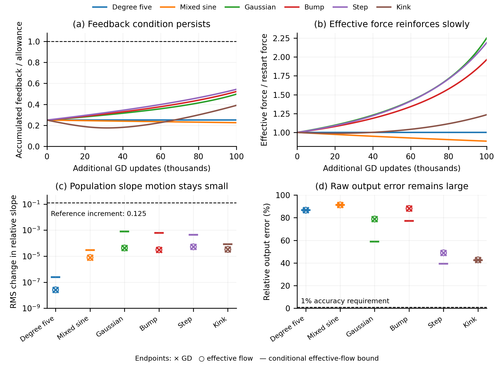

# A compact figure for the conditional population theorem

This post-processing uses the six existing width-705 continuations, seed 30,
restarted at age 20k and followed for 100k additional GD updates at learning
rate 0.002. No training was launched. The purpose is to evaluate the simpler
main-text theorem with a common allowance and show whether it remains useful
after removing the detailed concentration machinery.

The effective-flow calculation uses $B_t=4d_{\rm dir}(0)t$. For each prefix,
the output lower bound and RMS normalized-slope movement upper bound are

$$
\frac{\sqrt{[E_0^2-2t e^{2B_t}\|F_0\|^2]_+}}{\|f\|},
\qquad
\frac{h}{\sqrt W}t e^{B_t}\|F_0\|.
$$

Here $h=2/512$, $W=705$, and the final flow time is 200. The allowance is
retained from the previously evaluated factors $1,2,4,8$, not inferred as a
universal bound from initialization. GD endpoint measurements are plotted
separately from the effective-flow conditional bounds.

<figure>
  
  <figcaption>The sampled feedback condition uses at most 54.4% of its allowance. Force can grow, remain nearly constant, or decline. The largest conditional RMS slope-movement bound is 0.000774, and every conditional output-error floor exceeds 39%. These are sampled conditional evaluations, not certified GD bounds.</figcaption>
</figure>

The population statistic compares the absolute slopes at the initial and
final endpoints: $h\|\,|\gamma(T)|-|\gamma(0)|\,\|_2/\sqrt W$. It is not an
empirical measurement of all movement or of intermediate escapes. The
theorem's ever-acquired-fraction bound uses accumulated parameter travel
and therefore has a different, stronger temporal meaning. For increment
$0.125$, its largest conditional fraction bound is $3.84\times10^{-5}$.

The plotting helper checks the sampled feedback allowance, force envelope,
output floor, and endpoint population-movement inequality on each of the six
effective-flow paths. All checks passed. The underlying trajectories already
have the time-step and sampling checks documented in the feedback study.
The figure was visually inspected after revising label placement.

The helper is
[population_paper_figure.py](../../../../../../experiments/expD34_readout_race/population_paper_figure.py).
Reproduce on Modal using the existing wrapper with the study argument
set to paper and a fresh output directory. The inputs used by this study are
the scalar states and facts plus the 403 KiB endpoint archive in
feedback_flow_100k. Other files mounted by the shared wrapper are not read
by this figure calculation.

The final run is ap-74JjnveYBbjLzWjb6ENvGY, with a 4 GiB hard CPU memory cap
and measured child peak of 141.75 MiB. Cached paper_facts.json and
paper_summary.csv contain exact values; execution.json records source/input
hashes. The PNG and SVG figures are versioned with the source and report.
Trailing SVG whitespace was normalized after export; the helper includes
the same formatting step. This does not change the plotted evidence.
No large parameter archive was loaded on the laptop.
