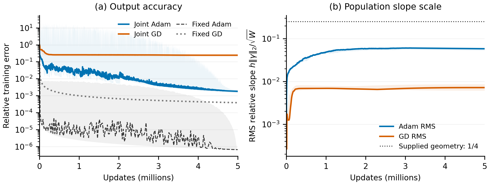
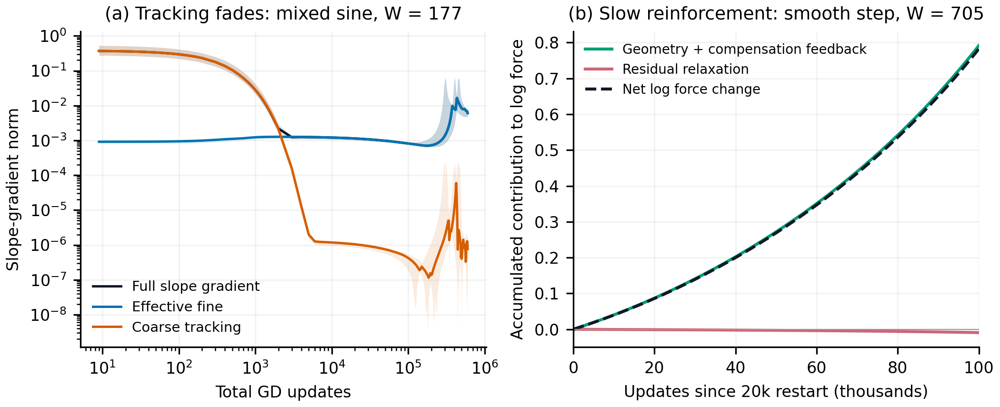

# Figures for the observation-to-mechanism argument

These figures reuse completed experiments. The opening comparison measures
output accuracy and population RMS slope scale from initialization. The
second figure illustrates the tracking transition and slow reinforcement
in separate GD studies. Their widths, targets, and horizons are intentionally
kept distinct. No training or parameter-trajectory analysis was launched.

## Opening observation

<figure>
  
  <figcaption>Width 512, mixed sine, five paired joint-training seeds. Both panels reuse the selected runs from the spectrum note. The slope panel contains RMS levels only; no 99th-percentile curves remain. Fixed Adam and GD train readouts on the supplied uniform relative bandwidth 1/4 geometry. Shading preserves seed variation and saved within-bin extrema.</figcaption>
</figure>

The source is the sibling frozen-gamma-probe checkout's completed
section34 long-horizon study. The plotting helper preserves the original
selection, error display reduction, and seed aggregation. It checks that
the five joint training endpoints agree with the selected summary, that the
frozen and joint budgets are both five million, and that the two studies
share the synthetic-input hash. RMS measures
$h\|\gamma\|_2/\sqrt W$, not change since a later restart. Its median endpoints
are 0.05818 for Adam and 0.007177 for GD. The error axis uses relative
training $L^2$ error, not squared loss, an EMA, or a readout refit.

## Mechanism illustration

<figure>
  
  <figcaption>Left: mixed-sine GD, width 177, five seeds, learning rate 0.002, through 600k updates. Curves are median slope-gradient norms and bands span seeds. Right: smooth-step effective flow at width 705, seed 30, from the ordinary-GD 20k checkpoint through another 100k equivalent updates. Geometry and compensation feedback contribute positively to log force, while residual relaxation contributes negatively.</figcaption>
</figure>

The tracking data have resolved coarse solves at every plotted checkpoint;
the unresolved channel is zero. The right panel integrates the signed terms
of the exact force identity using the saved scalar samples. Their sum
matches the measured change in log force to $3.16\times10^{-6}$ over the
interval. The initial full effective-force norm is 0.001628, its endpoint
is 2.187 times larger, and endpoint relative error is 0.4897. In this example,
weak reinforcement, rather than strong residual relaxation, explains why
initially weak force remains weak over the interval. The left panel's late
increase also makes clear that the explanation is finite-time.

The two panels are not successive phases of one trajectory. Slope-block
norms on the left and full-parameter force evolution on the right are
different diagnostics. The appendix's six-target figure separately checks
the conditional bounds across targets.

## Reproduction and checks

The plotting source is
[population_narrative_figures.py](../../../../../../experiments/expD34_readout_race/population_narrative_figures.py).
Run from this checkout using a fresh output path:

```sh
.venv-modal/bin/modal run experiments/expD34_readout_race/population_narrative_figures.py --output /path/to/new/figures
```

The sibling checkout can be specified with `D34_SPECTRUM_ROOT`. All numerical
post-processing runs on Modal CPU with a 4 GiB hard memory cap. Final run
`ap-jYxiA6iUrBLSxjSOONSHkf` peaked at 312.61 MiB. Small saved summaries and
scalar traces are loaded remotely; the 153 MiB frozen-GD scalar error array
is memory mapped remotely. No large parameter archive is read on the laptop.
Only two PNGs, two editable SVGs, and the numerical record are downloaded,
under an 8 MiB uncompressed cap.

[facts.json](facts.json) retains source hashes, metric values, selections,
and the force-identity check. Both figures were visually inspected; the
reinforcement legend was moved to avoid covering the near-zero relaxation
curve. This checks plotting and reuse of existing evidence, not continuous-time
certification of a theorem premise.
