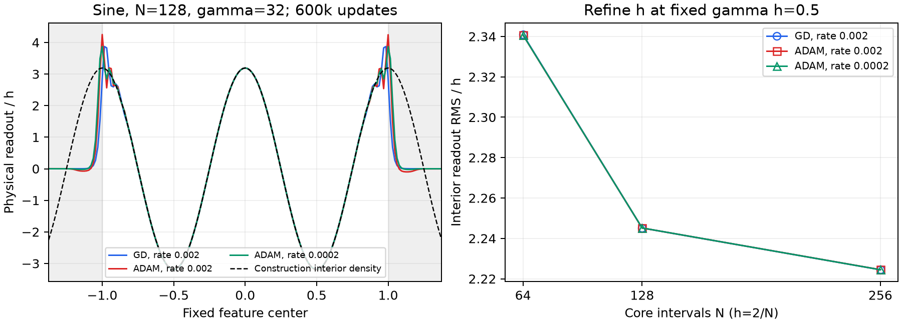

# Do frozen large-gamma fits recover the construction's readout scale?

Both zero-start GD and ordinary Adam learn physical readout weights consistent
with the construction's $O(h)$ scale in the tested frozen sine dictionaries.
Across three widths and three fixed values of $\gamma h$, the interior readout
RMS divided by $h$ is 2.218–2.802 at 600k updates. The largest individual
hidden readout, including the halo, is below $4.56h$ in every case. This is
finite-width evidence for one target and initialization, not an asymptotic
optimizer theorem or evidence that joint training can reach these geometries.

**Notation and measured quantities. Readouts are physical tanh coefficients.**

| Symbol | Meaning |
|---|---|
| $N,h=2/N$ | Core interval count and center spacing. |
| $W=N+2(3N/16)+1$ | Total neuron count, including the fixed-extent halo. |
| $\gamma$, $\lambda=\gamma h$ | Common fixed slope and its grid-relative scale. |
| $c_j,d$ | Individual hidden readout and output bias; the bias is reported separately. |
| Interior RMS/$h$ | RMS of $c_j/h$ for centers with $\lvert\tau_j\rvert\le0.75$. |
| Core, halo | Centers with $\lvert\tau_j\rvert\le1$ and $\lvert\tau_j\rvert>1$, respectively. Both have separate RMS and maximum statistics. |
| Relative MSE | Mean squared error divided by the target mean square on the same grid. |

## 1. A concrete frozen fit and the scaling it tests

**Example.** For $N=128$, $h=1/64$, and common $\gamma=32$, GD and both Adam
rates give an interior readout RMS of approximately $2.245h$ after 600k
updates. Their individual weight profiles nearly coincide in the interior.
No penalty or projection constrains their readout norm.

<figure>
  
  <figcaption>Frozen sine geometry and zero-start physical readout training. Left: individual coefficients at N=128 and gamma=32 after 600k updates; gray regions mark halo centers. The dashed curve is the ordinary interior construction density, continued into the halo only as a reference; it does not include boundary corrections. Right: interior readout RMS divided by h at fixed gamma h=0.5. GD and both Adam rates nearly overlap. Similar coefficient scales do not imply identical fitting errors.</figcaption>
</figure>

**Theory.** For a smooth target, the interior construction coefficients are
samples of a bounded density times $h$. For $y(x)=\sin(2\pi x)$, its ordinary
interior coefficient formula is

$$
\frac{c_j^{\rm ref}}h
=\pi\frac{\sinh(\pi^2/\gamma)}{\pi^2/\gamma}\cos(2\pi\tau_j).
$$

It tends to $y'(\tau_j)/2=\pi\cos(2\pi\tau_j)$ as $\gamma$ increases.
This formula comes from the imaginary-shift density in the existing
[construction implementation](../../../../experiments/expD06_fixed_center_scales/construction_reference.py);
we do not substitute its boundary-corrected network for a trained readout.
Ordinary and corrected halo coefficients have different construction bounds,
and the output bias has its own scale. A total readout norm that includes the
bias is therefore an unsuitable test of individual $O(h)$ hidden coefficients.

**Prediction and observation.** If the learned coefficients follow this
density scale, refining the spacing at fixed $\gamma h$ should leave
$\operatorname{RMS}(c_j)/h$ bounded and comparable across widths. The table
shows that behavior. A persistent growth of this ratio with refinement, or
large exceptional halo weights, would contradict the proposed finite-width
comparison even if the fit improved.

**Interior readout RMS divided by $h$ at 600k updates. Each entry is one deterministic zero-start fit; there is no seed selection.**

| $\gamma h$ | $N$ | GD, $\eta=0.002$ | Adam, $\eta=0.002$ | Adam, $\eta=0.0002$ |
|---|---:|---:|---:|---:|
| 0.25 | 64 | 2.79630 | 2.80002 | 2.80208 |
| 0.25 | 128 | 2.35238 | 2.35274 | 2.35279 |
| 0.25 | 256 | 2.25097 | 2.25097 | 2.25097 |
| 0.5 | 64 | 2.34097 | 2.34071 | 2.34077 |
| 0.5 | 128 | 2.24514 | 2.24515 | 2.24517 |
| 0.5 | 256 | 2.22447 | 2.22450 | 2.22447 |
| 1 | 64 | 2.23373 | 2.23369 | 2.23368 |
| 1 | 128 | 2.21873 | 2.21873 | 2.21873 |
| 1 | 256 | 2.21788 | 2.21789 | 2.21788 |

The finite-$\gamma$ density explains part of the variation in the first
three rows: their physical gammas are 8, 16, and 32. Over all 27 endpoints,
the relative interior coefficient-vector discrepancy from the displayed
reference is at most 2.77%. This comparison concerns interior coefficients;
it is not a full-network MP construction error bound.

## 2. The weight scale is more stable than Adam's instantaneous loss

**Example.** At $N=128$, $\gamma=32$, the three fits have almost the same
interior readout RMS, but their relative evaluation MSEs at 600k are
$9.62\times10^{-7}$ for GD, $3.62\times10^{-4}$ for Adam at 0.002, and
$1.00\times10^{-9}$ for Adam at 0.0002. The larger Adam rate has not
converged to a fixed high-accuracy solution.

**Theory.** With frozen geometry the loss is a convex quadratic in the
readout. GD has an exact finite-time spectral recurrence. Constant-rate
Adam need not settle to the minimizer, and a small coefficient perturbation
in a sensitive collective direction can change the loss substantially while
barely changing the overall coefficient RMS. Consequently a coefficient-scale
observation does not certify optimization convergence or precision fitting.

**Prediction and observation.** If oscillations account for the discrepancy,
consecutive terminal states should show varying loss but a stable weight
scale. Over updates 600001–600256, the $N=128$, $\gamma=32$, Adam-0.002
run has interior RMS/$h$ between 2.24413 and 2.24628, while relative training
MSE ranges from $6.47\times10^{-9}$ to $7.66\times10^{-4}$. Across all
18 Adam cases, the largest relative range in that RMS statistic is 0.358%.
The [terminal windows](terminal_windows.csv) retain every case's extrema.
These windows are additional updates, not selected best checkpoints.

## 3. What this establishes about the proposed acquisition mechanism

**Example.** A frozen high-gamma network fits sine with individual readouts
near the construction density. The joint-GD sine trajectories discussed in
the [technical note](../../../../docs/d34_coarse_balance_stagnation.md) remain
far from the intended geometry and precision. These are different trajectories
and center arrangements; one cannot infer a path between them from the
frozen fits alone.

**Theory.** The raw slope derivative is
$\partial f/\partial a_j=c_jx\operatorname{sech}^2(a_jx+b_j)$, so increasing
$|c_j|$ at fixed geometry increases that Jacobian column's magnitude. But it
also changes the residual that multiplies the column. The preferred readout
changes with geometry, and a smaller final readout does not create a second
objective opposed to the loss. A dynamical explanation must determine whether
readout adaptation or lag reduces the signed outward slope force before the
desired geometry is reached.

The frozen experiment tests only the proposed endpoint scale. Construction
weights of order $h$ establish an available representation, not a requirement
on every accurate network. Initialization and null or weakly observed readout
directions can also affect which coefficients an optimizer retains.

**Prediction.** A useful next intervention would vary the readout response
rate during joint training while measuring the resulting signed outward
force and approximation error. Faster readout fitting could help by removing
harmful lag, or hinder by removing an accessible residual that was driving
geometry. The sign is a testable property of the coupled dynamics. This
experiment does not choose between those explanations.

## Reproduction and numerical scope

The target is unnormalized $\sin(2\pi x)$. Training uses 2048 fixed midpoints
on $[-1,1]$; evaluation uses 8192 independent midpoints as a deterministic
quadrature check. Centers are $\tau_j=-1+2j/N$ for
$j=-3N/16,\ldots,N+3N/16$. The three widths are therefore 89, 177, and 353.
All physical slopes and hidden biases are frozen, with $a_j=\gamma$ and
$b_j=-\gamma\tau_j$. Readouts and output bias start at zero. There is no
regularization, readout fitting solve installed into Adam, early stopping,
target normalization change, or learning-rate selection.

Nine GD fits use the existing finite-time SVD recurrence at rate 0.002.
Eighteen Adam fits use both stated rates, moments 0.9/0.999, epsilon
$10^{-8}$, and no weight decay. A reduced QR factorization represents the
same full empirical gradient without repeatedly evaluating the tanh matrix.
The implementation was committed as `20ca055` before the full run. It completed
locally in approximately 80.4 seconds on CPU, using no GPU allocation.

Three focused tests check Adam against direct PyTorch updates on an asymmetric
target, spectral GD against direct updates, and separation of hidden readouts
from the bias. The asymmetric test avoids an exactly odd target's zero bias
gradient, where rounding can select different symmetry-related Adam
oscillations. Direct and QR gradient evaluations at the saved experiment
states differ by at most $1.08\times10^{-14}$ in any coefficient.
The complete D34 test suite passes: 106 tests, including these three checks.

Six independent direct-feature Adam controls run the $N=128$ cases through
20k updates. Their interior RMS/$h$ agrees with the QR trajectories to
within 0.00524% relative, while instantaneous losses can differ substantially.
Thus the evidence supports the coefficient-scale claim without claiming
roundoff-independent Adam phases or terminal precision. The study has three
widths and one target; it does not prove an asymptotic $O(h)$ law or test
arbitrary initialization and learned-center dictionaries.

```bash
JAX_ENABLE_X64=true JAX_PLATFORMS=cpu OPENBLAS_NUM_THREADS=1 OMP_NUM_THREADS=1 \
  .venv/bin/python -m experiments.expD34_readout_race.frozen_readout_scale \
  --output results/checkpoint_D_optimizers/expD34_readout_race/readout_scale
MPLCONFIGDIR=/tmp/d34_readout_matplotlib \
  .venv/bin/python -m experiments.expD34_readout_race.frozen_readout_scale_plot \
  --root results/checkpoint_D_optimizers/expD34_readout_race/readout_scale
```

The [manifest](manifest.json) records the model, optimizer settings, environment,
and implementation hash. [Measurements](measurements.csv) give all sampled
errors and coefficient statistics; [coefficients](coefficients.npz) retain the
actual vectors and consecutive terminal states. [Verification](verification.csv)
and [direct controls](direct_controls.csv) record the numerical comparisons.
