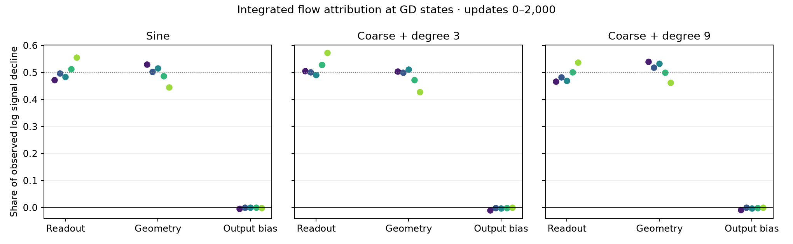
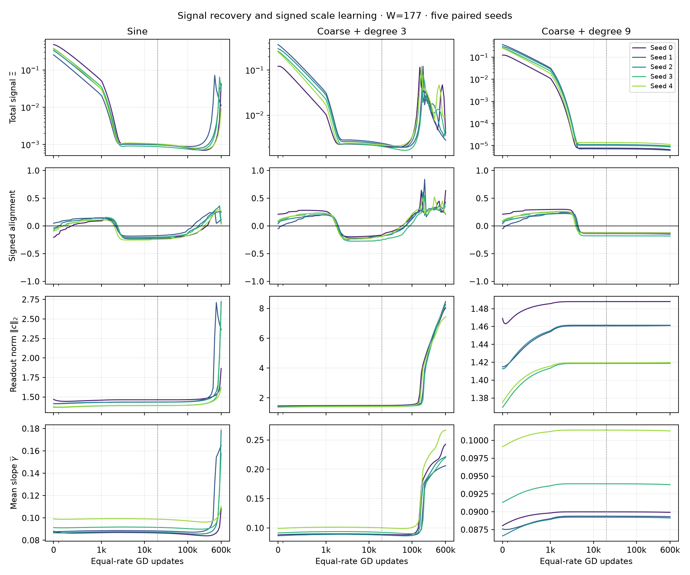
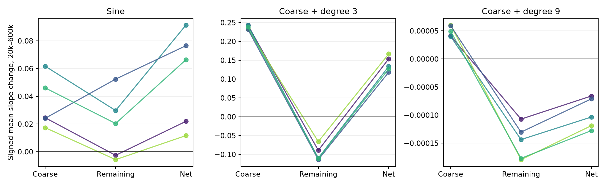
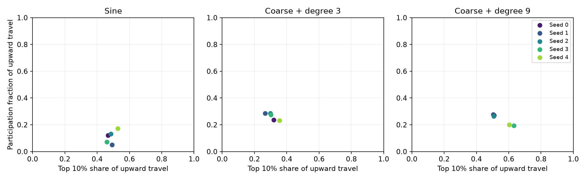

# Signal recovery does not imply population scale acquisition

**D34 equal-rate GD · width 177 · paired seeds 0–4 · 600k updates**

The actual random-readout experiment supports an early depletion mechanism followed by target-dependent recovery. It does **not** support importing the zero-readout theorem's large readout-majority attribution, or explaining every later failure by permanently weak signal. Readout and geometry each account for approximately half of the first 2,000 updates' logarithmic signal decline. Sine and degree 3 subsequently recover signal and increase slopes; degree 9 remains nearly stationary. Nevertheless, the accumulated slope-motion budget excludes substantial acquisition of the tested scales in all 15 trajectories.

The [companion theory](../../../../docs/d34_scale_acquisition_theory.md) states exact signed-motion and block-attribution identities, proves a population-distance bound for actual discrete GD, and separates retrospective exclusions from a predictive theorem. The main empirical revision is that **degree 3 exhibits widespread modest sharpening**, rather than growth confined to a tiny neuron subset. Its motion is insufficient in magnitude for the specified scales. Sine's upward travel is more concentrated. These distinctions matter for a paper explanation.

## Comparison and evidence lineage

We fixed the existing sine, coarse-plus-degree-3, and coarse-plus-degree-9 targets, original seeds 0–4, all four physical learning rates at 0.002, and the existing 600k horizon. All 15 cases use 2,048 training midpoints and 177 independent tanh neurons. Existing 8,192-point evaluation errors describe a different deterministic grid; they were not used for model, checkpoint, or rate selection. This is a retrospective mechanism analysis of previously examined data, with no new held-out hypothesis test.

The original dense raw archive was retired on 2026-09-20. We therefore replayed only these 15 cases using the unchanged D34 vector field and original runtime. Every-update positive and negative slope travel and gradient path length were accumulated online; 543 compact parameter states per case were retained. Initialization and training-data hashes match the original manifests exactly. Loss, mean slope, and slope-gradient norm match 6,300 archived observations across the three retained horizons. The largest absolute discrepancies are respectively $2.45\times10^{-15}$, $8.89\times10^{-16}$, and $8.40\times10^{-16}$. No replay tolerance was adjusted after inspecting a discrepancy.

The replay adds missing per-neuron accounting; archived signed-force sums, reference errors, and the full rate matrix remain the primary sources for their existing quantities. It does not rerun the full campaign or introduce a training intervention.

## Early depletion is shared between readout and geometry

Let $\Xi=\|g_a\|_2/\|r\|_m$. We evaluate the exact flow identity $-d\log\Xi/dt=D_c+D_q+D_d$ at actual GD states, including the output bias. Positive contributions deplete normalized signal; negative contributions replenish it. We use the fixed dense diagnostic interval of updates 0–2,000, not a seed-dependent best interval.

| Target | Readout share of observed log decline, median [range] | Observed log decline, median |
|---|---:|---:|
| Sine | 49.7% [47.2%, 55.5%] | 4.898 |
| Degree 3 | 50.5% [49.1%, 57.2%] | 4.634 |
| Degree 9 | 48.2% [46.7%, 53.7%] | 5.059 |



The integrals use trapezoids every 20 updates. Coarsening to every 40 changes the sum of absolute block-integral differences by at most 0.117% of the observed decline. The integrated flow identity differs from the actual GD log decline by at most 0.151%. These checks support the approximate half-and-half description; the values are not exact finite-step causal shares or interval-certified integrals. The full signed components, including readout residual filtering, coefficient-amplitude change, and normalization, are in [early_attribution.csv](early_attribution.csv). Pointwise derivatives are in [state_diagnostics.csv](state_diagnostics.csv).

This agrees with the centered affine calculation in the companion theory: equal limiting initial readout and slope norms give a one-half asymptotic attribution in that reduction. It differs materially from the zero-readout setting's much larger fraction. Neither result contradicts the zero-readout theorem under its own hypotheses. D34's finite random biases, output bias, target means, and nonlinear dynamics still require their own proof.

## Later recovery must be included in the explanation



Each curve is an original seed, and the dotted line marks update 20k. The horizontal axis is linear near zero and logarithmic thereafter. Curves interpolate retained plotting samples; peaks are not certified continuous maxima. The normalized signal, its signed alignment with outward slope motion, and the readout norm measure different aspects of recovery.

| Target | $\Xi_{600k}/\Xi_{20k}$, median [range] | Readout norm at 600k, median | Mean slope at 600k, median | Evaluation MSE at 600k, median |
|---|---:|---:|---:|---:|
| Sine | 30.19 [8.75, 42.26] | 2.361 | 0.15795 | 0.24786 |
| Degree 3 | 1.893 [1.164, 4.287] | 8.231 | 0.22167 | 0.025466 |
| Degree 9 | 0.8528 [0.8118, 0.8575] | 1.461 | 0.08992 | 0.75005 |

The endpoint ratio understates degree 3's substantial transient signal recovery, visible in the full curve. At 20k, the median instantaneous readout attribution $D_c$ is already negative for all three targets: approximately $-0.0382$, $-0.0476$, and $-0.00956$. Geometry and output-bias contributions can offset it. Persistent weak *total* signal therefore does not mean that the readout continues to deplete it at every later state.

The exact signed mean-slope changes from 20k to 600k separate the full tanh gradient by the current residual's fixed projection onto $\{1,x\}$:

| Target | Coarse contribution, median | Remaining-residual contribution, median | Actual mean change, median [range] |
|---|---:|---:|---:|
| Sine | +0.02452 | +0.02038 | +0.06645 [+0.01167, +0.09147] |
| Degree 3 | +0.23820 | −0.10977 | +0.13380 [+0.11808, +0.16670] |
| Degree 9 | +0.00004946 | −0.00014357 | −0.00010337 [−0.00012755, −0.00006593] |

Medians of separate columns need not add. Each individual trajectory obeys the signed identity including its saved zero-crossing remainder. The [per-seed table](post20k_changes.csv) retains those terms.



For degree 3, regenerated coarse forcing supplies all the net outward motion and more; the remaining-residual force opposes mean sharpening in every seed. For sine the latter contribution has mixed signs across seeds. Degree 9's already weak late signal produces a small net shrinkage in every seed. A theory that removes coarse forcing permanently after its first depletion, or assumes every nonlinear residual force sharpens slopes, misses these observations.

## Recovery can be widespread but too small

For each neuron, $P_j$ and $N_j$ sum its actual positive and negative changes in $|a_j|$ at every update. The table uses the 20k–600k window; all entries are medians across the same five seeds.

| Target | Fraction with net growth | Mean positive travel | Mean negative travel | Top 10% share of positive travel | Participation fraction |
|---|---:|---:|---:|---:|---:|
| Sine | 81.9% | 0.08328 | 0.01671 | 48.6% | 12.2% |
| Degree 3 | 94.4% | 0.15879 | 0.02499 | 30.2% | 27.4% |
| Degree 9 | 49.2% | 0.0001683 | 0.0002959 | 51.0% | 26.4% |



The top group contains 18 of 177 neurons. Participation is $(\sum_jP_j)^2/(177\sum_jP_j^2)$, equal to one for uniform travel and $1/177$ for travel in a single neuron. Degree 3 has net growth in 93.2%–94.9% of neurons; saying that only a few neurons move would be wrong. Its endpoint median slope is 0.2374 and its 90th percentile is 0.2655 (medians of per-seed statistics). Its few largest slopes are separated from that population: maxima range from 1.672 to 2.901. None reaches $\gamma=3.2$.

Sine's maximum slopes range from 0.693 to 5.947, with no more than three neurons at $\gamma\ge1$ and no more than one at $\gamma\ge3.2$ in any seed. Degree 9 has no slope at $\gamma\ge1$. No selected trajectory reaches $\gamma=16$. The broader archived equal-rate comparison, including Runge and degree 5, has no more than one neuron per case at $\lambda\ge0.05$ and none at $\lambda\ge0.1$ or $0.25$ across all 25 target/seed cases at 600k. Here $\lambda=(2/128)\gamma$ is the construction-reference reporting scale, not a proved necessary scale for every accurate network.

## A quantified population exclusion survives nonlinear recovery

The exact distance to acquiring at least a fraction $p$ at magnitude $\Gamma$ is

$$
\mathcal D_{p,\Gamma}(a_s)
=\left[\sum_{j=1}^{\lceil177p\rceil}
\big((\Gamma-|a_s|)_+\big)_{(j)}^2\right]^{1/2},
$$

where the deficits are sorted increasingly. The actual slope path has budget $B=0.002\sum_{n=s}^{N-1}\|g_{an}\|_2$. If $B<\mathcal D$, the population cannot be acquired at any update in that interval. This discrete triangle-inequality result includes all later nonlinear and readout effects through the actual gradient.

| Target | Measured $B$, median [range] | Distance for 50% at $\gamma=1$, median | Distance for 10% at $\gamma=3.2$, median | Generic energy budget, median |
|---|---:|---:|---:|---:|
| Sine | 4.242 [1.027, 6.167] | 8.163 | 12.825 | 10.128 |
| Degree 3 | 5.809 [5.228, 6.872] | 8.171 | 12.848 | 20.558 |
| Degree 9 | 0.009432 [0.006617, 0.012473] | 8.141 | 12.811 | 0.011546 |

Every seed separately satisfies both exclusions over updates 20k–600k. For degree 3, the generic full-gradient energy budget cannot exclude either population, whereas the measured slope budget excludes both. For degree 9, even the generic energy budget is already informative; its exclusion alone does not identify readout depletion as the unique cause. At the smaller target of 10% at $\gamma=1$, the slope budget is inconclusive for all five degree-3 seeds and three sine seeds. We retain these failures in [movement_windows.csv](movement_windows.csv).

The generic comparison uses $\sqrt{\eta(N-s)(L_s-L_N)/\alpha}$, with $\alpha$ the observed minimum descent ratio. All 599,999 archived ratios are present for these trajectories; the replay checks the final missing update. This is floating-point, retrospective evidence. It is neither an independently predicted signal envelope nor an interval certificate. The useful theoretical advance is the precise population criterion and its measurable margin; proving a small budget from initialization remains outstanding.

## Reference validity limits the predictive theory

The degree-7 reference's median relative slope-gradient error is initially small but fails in the recovering cases:

| Target | 20k audit | 100k audit | 600k audit |
|---|---:|---:|---:|
| Sine | 0.0222% | 0.0186% | 109.3% |
| Degree 3 | 0.0370% | 0.0903% | 115.8% |
| Degree 9 | 0.0282% | 0.0277% | 0.0246% |

These are the final analyzed gradient states in each archived audit, rather than a claim that all diagnostics were taken at the terminal post-update state. [reference_accuracy.csv](reference_accuracy.csv) preserves every retained degree, seed, and audit field. A low-order reference cannot certify long-time recovery where its gradient prediction is this inaccurate. Degree 9's continued agreement remains predictive evidence, without a validated trajectory enclosure.

For the paper, retain the zero-readout theorem as a restricted early mechanism, and develop the actual-initialization claim around the signed, target-dependent budget. The experiment already rejects the stronger claim that successful late nonlinear optimization necessarily restores the specified population scales, but it does not prove permanent trapping or a universal approximation barrier. It also rejects a universal explanation based on a tiny number of moving slopes. A prospective D34 theorem must bound the evolving readout and regenerated coarse forcing, or provide a validated nonlinear reference through a stated stopping time.

## Verification and reproduction

The new five focused tests compare gradients and all required Hessian actions with independent PyTorch autodiff, check the directional derivative of $\log\Xi$ and remaining-residual loss, exercise sign crossings and population distances, and compare the compact replay with the original update. Together with the existing D34 checks, **28 tests pass**. Per-neuron positive-minus-negative travel agrees with the endpoint change within $1.65\times10^{-13}$. All 3,045 analyzed states have resolved attribution under the declared numerical floor.

The full repository fast suite reports **676 passed, 9 skipped, 4 deselected, and 17 failed**. The failed test identifiers exactly match the archived untouched-upstream failure list; the full suite is not clean. Its log is retained in [verification/fast_tests.log](verification/fast_tests.log). Existing half-step controls establish early and 100k robustness; this replay does not add a matched-time 600k refinement.

Slurm job 720 completed on one allocated H200 in 89 seconds, including startup and verification. The [allocation record](verification/environment_720_0.json), [accounting](verification/slurm_accounting.psv), [launch script](verification/d34-recovery.sbatch), and [replay checks](verification/replay_verification.json) preserve the run. Replay source commit: `a752d80`. The 42 MiB [compact states](compact_states.npz) replace no historical evidence and avoid rebuilding the retired dense archive. [analysis_manifest.json](analysis_manifest.json) records the source artifact hashes.

From the repository root, regenerate the tables and four figures with:

```bash
MPLCONFIGDIR=/tmp/race-mpl OPENBLAS_NUM_THREADS=1 python -m experiments.expD34_readout_race.recovery \
  --evidence results/checkpoint_D_optimizers/expD34_readout_race \
  --output results/checkpoint_D_optimizers/expD34_readout_race/signal_recovery \
  --replay results/checkpoint_D_optimizers/expD34_readout_race/signal_recovery/compact_states.npz
```

The command authors numerical tables and figures only. This interpretation was written directly from inspected evidence.
