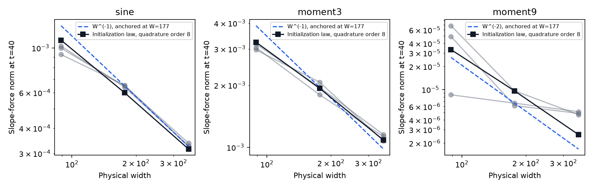
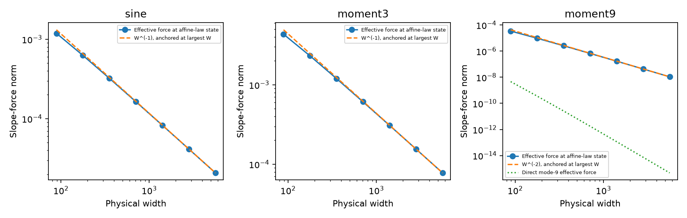
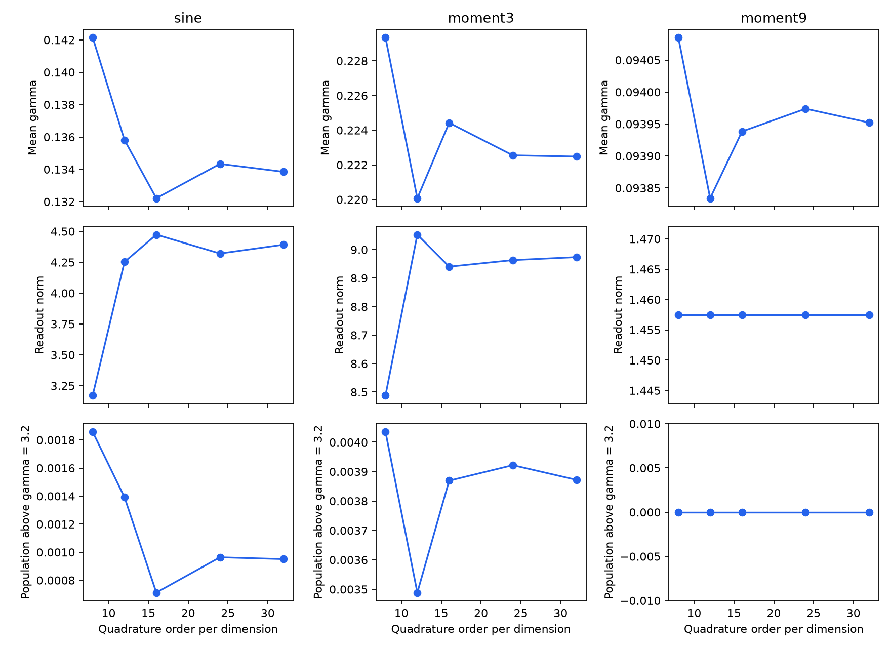
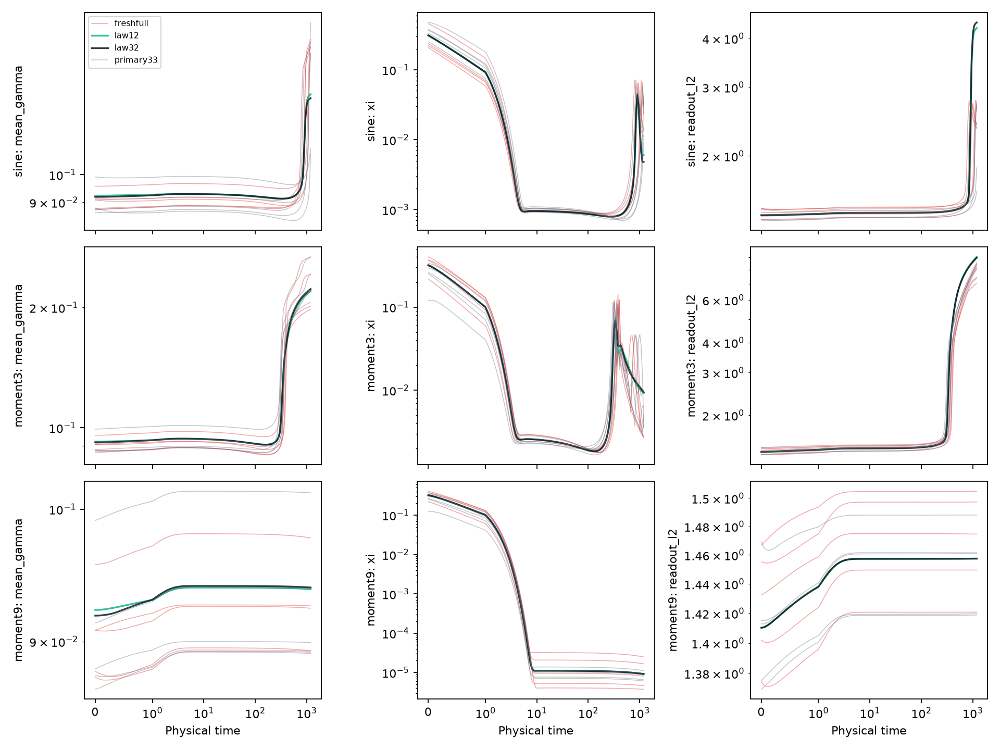

# D34 transport and effective-kernel investigation

The exact-tanh residual-basis model predicts the actual random-readout, equal-rate D34 trajectories, including nonlinear recovery and isolated slope escapes. It does not yet yield an initialization-only gamma-barrier theorem. The useful theoretical object is the slope contribution to the **effective fine-mode kernel after coarse relaxation**; neither the total kernel nor an early suppression theorem alone explains the observed population scales.

The [theory note](../../../../docs/d34_transport_scale_barrier.md) derives the width-dependent transport equation, its metric and time normalization, the nonlinear layer-balance defect, coarse tracking, and three conditional population-barrier criteria. The [implementation and protocol](../../../../experiments/expD34_readout_race/README.md#transport-and-residual-basis-extension) describe the independent forecasts and controls. This report extends the [signal-recovery study](../signal_recovery/README.md), whose verified original-seed states remain the baseline evidence.

## What is being predicted

Here $W$ is physical width, $\gamma=|a|$ is a slope magnitude, $\kappa$ is the readout/geometry learning-rate ratio, and $t=\eta n$ is physical time. The main setting uses $W=177$, $\kappa=1$, $\eta=0.002$, 2,048 training midpoints, and $t=1200$ (600k simultaneous GD updates). The loss is half-MSE. The primary population event is at least 10% of neurons reaching a specified threshold $\Gamma\in\{1,3.2,16\}$; at width 177 this requires 18 neurons. These are scale-acquisition criteria, not a theorem that every target requires these scales for representation.

The main forecast retains exact tanh features and projects the residual onto empirical polynomial modes 0–33. It starts from the same realized random parameters as GD and evolves independently, with no later true states or fitted future coefficients. The retained residual has 34 coordinates, but the model still evolves the neuron parameters. It is not a closed 34-variable ODE. The law-PDE experiment instead starts from the continuous independent uniform initialization law and approximates its characteristic flow with weighted tensor quadrature. Physical width remains 177 even when the quadrature uses thousands of nodes.

The three scientifically distinct possibilities are persistent weak signal; recovered signal without the specified population acquisition; and acquisition. The equations permit all three. Their occurrence depends on target, rates, width, threshold, and horizon; numerical success must not be inferred from matching just a decaying loss.

## Independent trajectory predictions pass the main check

For original seeds 0–4, degree 33 reproduces every measured threshold count. The worst final slope-vector error is $9.59\times10^{-7}$, in one sine case; degree-3 and degree-9 parameter errors are at roundoff scale. Degree 9 already predicts endpoint population counts, but its worst parameter error is 0.144 for sine and 0.0215 for degree 3. Degree 17 reduces those errors to 0.00318 and $3.22\times10^{-6}$. This distinguishes a useful low-order approximation from numerical equivalence to GD.

Fresh seeds 10–14 were forecast before their full-residual validation runs were submitted. The [prediction hashes](verification/fresh_prediction_freeze.json) and [predeclared rules](../../../../experiments/expD34_readout_race/transport_predictions.json) record that ordering. All 15 fresh cases pass. Across them, the maximum relative error in mean gamma is $6.19\times10^{-8}$, the maximum relative error in readout norm is $1.58\times10^{-8}$, the maximum half-MSE error is $6.37\times10^{-9}$, and every threshold count agrees exactly. See [fresh validation](fresh_validation.json) and [paired errors](paired_errors.csv).

The fresh sine forecasts correctly predict exactly one neuron beyond $\gamma=3.2$ in each seed. The original seeds have zero or one such neuron. Neither original nor fresh degree-3/degree-9 cases acquire any neurons beyond 3.2, and none of these equal-rate cases attains 10% population at any of the three thresholds. A theorem asserting that no neuron can escape would therefore describe the wrong phenomenon.

The matched-time half-step check on seeds 0–2 changes endpoint mean gamma by at most $3.13\times10^{-5}$, maximum gamma by 0.00151, and half-MSE by $5.82\times10^{-5}$, without changing the 3.2-threshold counts. At law quadrature order 12, replacing degree 33 by the full residual changes mean gamma by at most $3.55\times10^{-8}$ and half-MSE by $1.29\times10^{-7}$. These errors are much smaller than the law quadrature and finite-seed discrepancies discussed below. They are numerical checks, not rigorous trajectory enclosures.

## The effective kernel explains which signal survives coarse fitting

Partition the modal residual into coarse modes $C=\{0,1\}$ and retained fine modes $H$. With $B=K_{CC}^{-1}K_{CH}$, define the coarse tracking residual $z_C=e_C+Be_H$ and the effective slope map $T_a=J_{a,H}^T-J_{a,C}^TB$. The exact force decomposition is

$$
g_a=J_{a,C}^Tz_C+T_ae_H+g_{a,\perp}.
$$

Coarse fitting tracks the regenerated balance $e_C\approx-Be_H$, rather than zero. At the sampled states after 20k updates, the tracking term is small relative to the full slope force. Thus $T_ae_H$ closely matches the force that remains after the coarse transient. This is a measured separation of scales; a small tracking remainder is not assumed in the simulation.

The Schur kernel has the exact positive block decomposition

$$
S=K_{HH}-K_{HC}K_{CC}^{-1}K_{CH}
=T_a^TT_a+T_b^TT_b+\kappa T_c^TT_c+\kappa T_d^TT_d.
$$

This identifies both effective residual relaxation and how much of that relaxation moves slopes. It also shows precisely what a stronger theorem must control: the target-weighted effective slope kernel, coarse tracking, and omitted-mode force along the evolving feature distribution. The total kernel alone does not supply that control.

Coarse tracking itself has a useful proved estimate. In the metric $\|z_C\|_{K_{CC}}$, the decay rate is bounded below by the smallest coarse eigenvalue minus half the largest eigenvalue of the relative coarse-kernel derivative. The exact expression and forcing appear in equations (12)–(12a) of the theory note. This lower rate is positive at all 75 original-seed diagnostic states (minimum 1.204), and the endpoint forcing/tracking magnitudes are consistent with rapid relaxation toward the regenerated balance. The exact GD counterpart (12b) retains the changed kernel and finite-step defect. Its sampled contraction factors range from 0.97634 to 0.99759, with identity error below $8\times10^{-17}$. Sampled contraction does not establish a bound at every intervening time, but it supplies a concrete quantity for a future enclosure.


The figure uses five selected checkpoints per trajectory; lines connect those observations. The blue effective-force norm closely follows the black full-force norm after the transient. Orange is the coarse-tracking contribution. The lower row shows the slope share of instantaneous dissipation, not the size of the gradient itself. Original-seed endpoint medians are:

| Target | Full slope-force norm | Slope dissipation share | Readout-weight share | Effective outward alignment |
|---|---:|---:|---:|---:|
| Sine | 0.01194 | 87.2% | 12.8% | 0.118 |
| Degree 3 | 0.000592 | 4.16% | 92.9% | 0.345 |
| Degree 9 | $7.50\times10^{-6}$ | 67.4% | 12.3% | −0.135 |

These are medians of separate quantities, so columns of block shares need not add to 100%; hidden and output biases also dissipate loss. The [actual-state kernel table](actual_kernels.csv) retains every seed and includes coarse inverse conditioning, kernel drift, tracking forcing, projection errors, and the blockwise Schur accounting check.

Persistent post-transient suppression does not describe the sine trajectory. Sine has a recovered force, but its outward alignment and population distribution differ from its norm. Degree 3 has substantial earlier recovery and later readout-dominated fitting. Degree 9 has a tiny force even though slopes receive most of the very small remaining dissipation. Its high residual norm is therefore not a usable geometry-learning signal. The earlier study's roughly one-half initial readout attribution remains relevant: actual random-readout D34 does not inherit the zero-readout theorem's majority fraction.

Readout dissipation and depletion of normalized slope signal are different quantities. The earlier block-Hessian attribution measures the latter; the shares here measure allocation of loss descent. The rate interventions below test their joint dynamical consequences, which need not be monotone in the readout rate.

An initial frozen-kernel gradient-flow forecast fails to reproduce later nonlinear behavior. Its median predicted mean gamma is 0.0997 for sine and 0.1467 for degree 3, versus 0.1579 and 0.2217 in the evolving forecast. Its median linearized projected losses remain about 0.212 and 0.371. This reference uses the exponential of the initial kernel, whereas the main forecasts retain GD's time discretization; the matched-time half-step changes are much smaller than these discrepancies. The existing affine reference likewise omits nonlinear recovery. The [frozen-kernel table](frozen_kernel.csv) distinguishes the linearized model's loss from full-tanh evaluation of its predicted parameters.

## What the population budgets do and do not prove

For the interval 20k–600k, the exact every-update slope path budget excludes 10% acquisition at $\Gamma=3.2$ in all original seeds. The table uses the paired degree-33 forecasts, which accumulate both path and energy. The [actual replay check](verification/actual_path_comparison.csv) independently confirms the same exclusion on every full-GD path; forecast and actual path budgets differ by at most $9.30\times10^{-7}$. Representative forecast medians are:

| Target | Distance to acquisition at 20k | Measured slope path | Slope-energy upper bound on path |
|---|---:|---:|---:|
| Sine | 12.825 | 4.242 | 9.035 |
| Degree 3 | 12.848 | 5.809 | 14.108 |
| Degree 9 | 12.811 | 0.009432 | 0.009442 |

The distance is the exact Euclidean distance to the acquired-population set. The last column is the discrete Cauchy–Schwarz bound $\sqrt{(T-s)\eta\sum_n\|g_{a,n}\|^2}$. It does not replace discrete dissipation by loss decrease. For degree 3 even this measured slope-energy bound is too loose to exclude acquisition, whereas the path does exclude it. A generic loss-energy bound is looser still. This is a concrete obstruction to obtaining the desired result from a coarse energy argument alone.

The [budget table](budgets.csv) retains individual cases, windows, thresholds, and population fractions. These inequalities validate finite-time non-acquisition on the computed paths. Turning them into an initialization-only theorem requires an independently justified upper bound on the future path or its effective-force ingredients. Substituting the actual small path into a hypothesis would only restate the observation.

The layer-balance defect and finite-step correction are accumulated at every update. Their endpoint accounting errors are near floating-point precision (below $3\times10^{-12}$ in the original primary runs), as is positive-minus-negative travel accounting. Thus readout growth is not being hidden inside an assumed invariant of the affine model. Its nonlinear source is measured explicitly.

## Distributional and transfer controls

The rate intervention is target dependent. On the same fresh seeds 10–12, endpoint median mean gamma is:

| Target | Readout ratio 0.1 | Equal rate | Readout ratio 10 |
|---|---:|---:|---:|
| Sine | 0.1116 | 0.1631 | 0.1405 |
| Degree 3 | 0.3074 | 0.2419 | 0.1715 |
| Degree 9 | 0.09337 | 0.09241 | 0.09122 |

Slower readout increases degree-3 scale acquisition but reduces it for sine at this horizon. Readout growth can help regenerate geometry signal as well as deplete it. Thus a monotone rule that faster readout always causes smaller gamma is contradicted by the intervention. The degree-33 forecasts reproduce these differences, including threshold counts. No tested rate produces the primary 10% population acquisition at $\Gamma=3.2$; this campaign does not empirically establish all three outcome classes at that threshold.

The early width test uses the full force at $t=40$ and three seeds per width. The formal prediction is $W^{-1}$ for sine/degree 3 and $W^{-2}$ for degree 9, after coarse relaxation with controlled rescaled moments. Finite-seed medians give descriptive fitted exponents 0.81, 0.72, and 1.68 across widths 89, 177, and 353. Normalizing by the proposed power leaves spreads of about 1.30, 1.47, and 2.93 between the largest and smallest medians. This is compatible with a rough scaling regime but does not validate a sharp seed-independent law or a uniform barrier constant.



The reference powers in the figure were specified before the width runs; their amplitudes are anchored at width 177. They are not exponents fitted to each seed. Additional law-PDE width controls give descriptive exponents 0.90, 0.79, and 1.86 over the same widths, closer to the formal powers but still affected by finite-width corrections. Width transfer of the trajectory predictor also succeeds: its maximum endpoint mean-gamma errors are $1.19\times10^{-7}$ at width 89 and $8.3\times10^{-15}$ at width 353, with every threshold count matching full GD.

A separate [operator-scaling check](width_tangent_scaling.csv) isolates the formal calculation. It transports the initialization law under the affine reference to $t=40$, then evaluates the exact-tanh effective kernel at that reference state for widths 89–5633. It does not evolve the nonlinear training trajectory. The final successive-width exponents are 0.9975 for sine, 0.9968 for degree 3, and 1.9945 for degree 9. The affine coarse-fit and balance checks close below $10^{-15}$.



At width 177 in the degree-9 operator check, the direct mode-9 effective force is $3.62\times10^{-10}$, versus a total effective force of $9.72\times10^{-6}$. The remaining force comes from lower-order residuals generated by the model while fitting the coarse target. This validates a specific prediction of the expansion: weak target coupling and correction of the model's own curvature have different width powers. It does not prove that the nonlinear trajectory stays in this regime through 600k updates.

The actual degree-9 checkpoints after 20k show the same distinction: the mode-9 contribution's norm is only $1.63\times10^{-5}$ to $1.07\times10^{-4}$ of the total effective slope force. Most remaining slope motion responds to the model's generated lower-order errors. The formal rescaled-geometry times are $W$ for the low-order forcing and $W^2$ for this self-curvature correction. At the primary horizon, $T/W=6.78$ but $T/W^2=0.0383$. This gives a quantitative regime prediction consistent with strong later changes for sine/degree 3 and persistent weak motion for degree 9, subject to the stated moment-control limitations.

The law PDE reproduces weak signal followed by recovery for sine/degree 3 and persistent weak signal for degree 9. Quadrature refinement is necessary for the small escaping mass. Endpoint results for the degree-33 residual projection are:

| Quadrature order per coordinate | Sine mean gamma | Degree-3 mean gamma | Degree-9 mean gamma | Sine population above 3.2 | Degree-3 population above 3.2 |
|---|---:|---:|---:|---:|---:|
| 8 | 0.142150 | 0.229348 | 0.094085 | 0.1858% | 0.4035% |
| 12 | 0.135809 | 0.220075 | 0.093834 | 0.1392% | 0.3489% |
| 16 | 0.132213 | 0.224423 | 0.093938 | 0.0712% | 0.3869% |
| 24 | 0.134337 | 0.222548 | 0.093974 | 0.0964% | 0.3922% |
| 32 | 0.133844 | 0.222477 | 0.093952 | 0.0951% | 0.3872% |



From order 24 to 32, mean gamma changes by 0.37%, 0.032%, and 0.023% for sine, degree 3, and degree 9; the corresponding sine readout norm changes by 1.66%. These observed differences are not certified quadrature-error bounds. The nonmonotone sequence does not justify Richardson extrapolation. At order 12, halving the time step changes mean gamma by at most $8.09\times10^{-7}$, readout norm by $3.10\times10^{-5}$, and half-MSE by $1.19\times10^{-7}$, with no threshold-population change. The [refinement table](refinement.csv) separates time-step, modal, and quadrature comparisons.

At order 32, replacing the projected residual with the full residual changes mean gamma by at most $1.42\times10^{-8}$, half-MSE by $4.74\times10^{-7}$, and maximum gamma by 0.00820; every threshold-population mass agrees to roundoff. Thus residual truncation does not explain the law-versus-network tail discrepancy at this resolution. The larger maximum-gamma change than mean-gamma change also illustrates why both quantities are retained.



Gray curves are original-seed forecasts, red curves are fresh full-GD trajectories, green is the order-12 law, and black is the order-32 law. The middle column is normalized slope signal $\Xi$, and the right column is the readout norm. The law captures the broad sequence of events but does not predict a specific finite initialization or its rare escapes. Its order-32 masses above 3.2 correspond to only 0.168 sine neurons and 0.685 degree-3 neurons at width 177. Across the ten realized seeds there are seven sine neurons above 3.2 in total and no degree-3 neurons. This discrepancy is separate from quadrature error; ten dependent neuron populations do not establish a precise sampling law for it.

The endpoint gamma-marginal Wasserstein distances between the order-32 law and the ten realized networks range from 0.211–0.389 for sine, 0.191–0.254 for degree 3, and 0.00426–0.00951 for degree 9. These measured distances are in [law_errors.csv](law_errors.csv). They quantify finite-width transfer error after training, rather than certify the radius needed in the theory note's population bound. A very large gamma at a quadrature node carrying less than $1/W$ mass cannot be interpreted as a predicted finite-network maximum.

## Scope of the resulting explanation

The supported explanation is finite-time and target dependent. Coarse relaxation suppresses an initially available source of slope learning; subsequent nonlinear kernel evolution can regenerate it. The effective kernel determines how the remaining fitting effort is divided between slopes and readout, while signed alignment and population transport determine whether that effort acquires the requested scales. Degree 9, degree 3, and sine occupy different parts of this description.

The successful modal forecasts establish that a small residual basis suffices for these tested trajectories. Kernel evolution still depends on the neuron distribution; closure in a few residual or moment variables remains unresolved. The law-PDE approximation and the finite-seed model are separate hypotheses. A rigorous initialization-only barrier would additionally need uniform control of kernel drift/forcing, effective slope motion or moments, and the model/finite-width error over the full interval. The present energy obstruction and tail checks identify where such a proof must improve on a generic suppression argument.

## Verification and provenance

The focused tests verify weighted characteristic gradients against independent PyTorch differentiation; agreement with original simultaneous GD; the discrete layer-balance identity; first-order time convergence; empirical basis and quadrature normalization; analytic kernel derivatives; frozen-kernel evolution; weighted population distance; and the Schur block identity. All 37 focused tests pass. The repository-wide non-slow run has 684 passes, 9 skips, and the same 17 failures as the archived baseline, with no introduced failure IDs. The final added weighted-coupling check is included in the focused run. Logs and the baseline comparison are in [verification](verification/).

Numerical trajectories use committed source `109caf7` in the isolated Runpod checkout `/workspace/junmiaoh/experiments/precision-mlps/transport-109caf7/code`. The serial array wrapper is from `cd4f38d`; the analysis source is `b2407b8`. Each [run bundle](runs/) records source, initialization and data hashes, FP64/GPU allocation evidence, selected full states, scalar curves, cumulative budgets, and completion status. These compact states retain the inputs needed to reproduce the analysis without the retired dense D34 archive.

All 25 Slurm allocations completed successfully: **5,039 allocated GPU-seconds, or 1.400 GPU-hours**, including compilation. The [allocation ledger](verification/slurm_allocations.psv) verifies a maximum of one simultaneous campaign GPU, leaving the other slot available to concurrent work. There were no failed or incomplete cases and no campaign allocation exceeded the eight-GPU-hour aggregate ceiling. Other agents' jobs were untouched. The package contains 201 trajectory configurations: 195 through time 1200 and six short law-width controls through time 40, plus 21 CPU operator checks. These configurations include paired forecasts and controls; they are not 201 independent random seeds.

The [artifact audit](verification/artifact_audit.json) verifies completion, finite arrays, normalized quadrature masses, FP64 parameters, matching initial/data hashes, unchanged frozen prediction hashes, source hashes, and GPU accounting. The 15 fresh forecasts pass the predeclared rules. The full test log's 17 baseline failures are reported separately from these successful experiment checks.

From the repository root, regenerate numerical tables and figures with:

```bash
OPENBLAS_NUM_THREADS=1 MPLCONFIGDIR=/tmp/d34-transport-mpl python -m experiments.expD34_readout_race.transport_analyze \
  --runs results/checkpoint_D_optimizers/expD34_readout_race/transport_barrier/runs/* \
  --archive results/checkpoint_D_optimizers/expD34_readout_race/signal_recovery/compact_states.npz \
  --output /tmp/d34-transport-analysis
OPENBLAS_NUM_THREADS=1 MPLCONFIGDIR=/tmp/d34-transport-mpl python -m experiments.expD34_readout_race.transport_scaling \
  --output /tmp/d34-transport-scaling
```

The scripts export evidence only. This report and the mathematical interpretation are authored separately.
