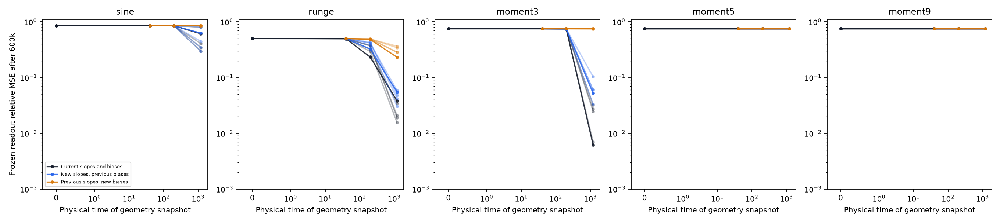
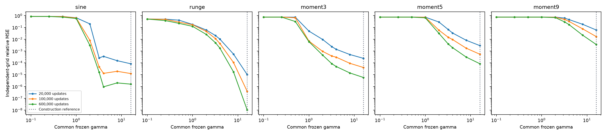
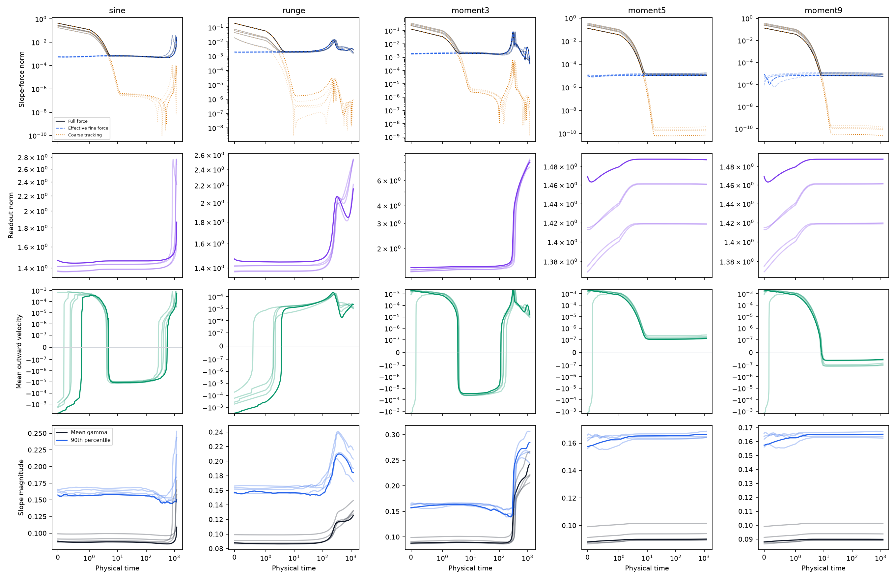
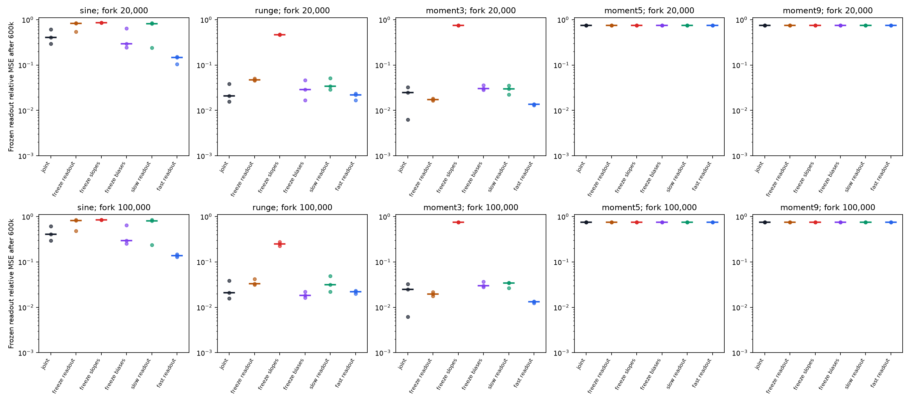

# Which mechanisms produce useful slope growth?

D34 learns substantially more useful geometry on sine, Runge, and the degree-3 target, while degrees 5 and 9 remain weakly accessible. The useful changes can occur far below a population-wide construction-scale threshold. Matched continuations show that slope updates are needed for the large lower-order recoveries within this budget, while readout evolution can support recovery as well as compete with slopes. Neither faster readout nor larger mean slope has a uniformly favorable effect.

The result is a measured mechanism framework, not an initialization-only prediction or a universal trapping theorem. The main experiment retains D34's random readout and ordinary equal-rate GD. Separate frozen-geometry diagnostics determine what the acquired features can accomplish under a common readout-learning budget.

**Glossary. Physical coordinates and half empirical MSE are used throughout.**

| Quantity | Meaning |
|---|---|
| $f=d+\sum_j c_j\tanh(a_jx+b_j)$ | All four parameter blocks train in the ordinary-GD baseline. |
| $\gamma_j=|a_j|$ | Individual slope magnitude; its mean is not a uniform slope cap. |
| $\eta=0.002$, $t=n\eta$ | Baseline physical learning rate and physical time. |
| $\kappa$ | Readout/hidden learning-rate ratio; the baseline has $\kappa=1$. |
| $g_a$ | Full slope gradient; actual slope velocity is $-g_a$ when slopes train at the baseline rate. |
| $T_ae_H$ | Effective fine-residual slope force after allowing the affine residual to balance. |
| $\mathcal U_H(a,b)$ | Independent-grid relative MSE after $H$ raw readout-GD updates on this fixed geometry, starting from zero readout. Lower means easier target access under that diagnostic. |
| Construction reference | Uniform $\gamma=16$, or $\lambda=0.25$, on the width-177 construction-center geometry. It is a reference, not a necessary threshold for every learned representation. |

## First establish whether the movement is useful

For each geometry snapshot, freeze both $a$ and $b$, reset only the diagnostic readout to zero, and let the readout train at step 0.002. Report its entire learning curve through 600k updates. Every geometry gets the same diagnostic initialization, coordinates, target, and budget. No diagnostic coefficients are inserted into a joint-training trajectory.

This separates a geometry improvement from the particular coefficients already attached to that geometry. It is an additional assay, not an equal-total-compute comparison between training recipes. The readout recurrence is linear, so its finite-time curve is evaluated through the measured SVD and checked against explicit GD. Truncated least-squares fits are exported separately as capacity and coefficient-cost diagnostics; they do not replace the finite-time curve.

**Geometry acquired by ordinary equal-rate GD. Entries are medians across seeds 0–4. Both usefulness columns use a fresh 600k-update readout assay; the final geometry comes from joint update 600k.**

| Target | Initial $\mathcal U_{600k}$ | Final $\mathcal U_{600k}$ | Final mean $\gamma$ |
|---|---:|---:|---:|
| Sine | 0.84838 | 0.40659 | 0.15795 |
| Runge | 0.50257 | 0.02084 | 0.13171 |
| Coarse + degree 3 | 0.75053 | 0.02480 | 0.22167 |
| Coarse + degree 5 | 0.75000 | 0.75000 | 0.09013 |
| Coarse + degree 9 | 0.75001 | 0.75001 | 0.08992 |

The degree-3 example is particularly instructive: its mean slope remains about 0.22, but the acquired geometry reduces the fixed-budget readout error by about thirtyfold. Calling it a scale-acquisition failure solely because fewer than 10% of neurons reach $\gamma=3.2$ would miss that improvement. Sine is more seed dependent: its final usefulness ranges from 0.296 to 0.800. The [endpoint table](endpoints.csv) retains every seed and actual trained error.

To distinguish slope and bias changes, evaluate the four geometries $(a_s,b_s)$, $(a_t,b_s)$, $(a_s,b_t)$, and $(a_t,b_t)$ between successive snapshots. These are diagnostic counterfactuals in raw parameter coordinates, not independently trained trajectories. Changing $a$ at fixed $b$ can also move the centers $-b/a$; it is not a center-preserving dilation. The crossed evaluations reveal a strong slope contribution on the recovering targets and an additional interaction with biases. The [four-way measurements](geometry_effects.csv) retain that interaction rather than forcing an additive attribution.

<figure>
  
  <figcaption>Every baseline seed is shown; seed 0 has stronger opacity. Current slopes usually provide most of the improved target access on the recovering targets. The common vertical scale keeps the tiny changes on degrees 5 and 9 in perspective. Each point measures a new zero-readout diagnostic, not the actual trained readout.</figcaption>
</figure>

The common-slope reference establishes that changing scale can matter for the stalled targets. On construction-center geometry, degree 9 has $\mathcal U_{600k}=0.74999$ at $\gamma=1$, 0.29631 at 3.2, and 0.003624 at 16. Degree 5 improves from 0.65421 to 0.003991 and then $8.51\times10^{-5}$. These values do not transfer as necessary slope thresholds to heterogeneous free geometry. The sine curve is not even monotone over every tested scale.

<figure>
  
  <figcaption>Width 177, fixed construction centers, raw readout coordinates, zero diagnostic readout, and the D34 targets and training step. Larger slopes substantially improve access to the high-order targets. This compares geometry at fixed readout-learning budgets; it does not claim that GD acquires these geometries.</figcaption>
</figure>

## What the force measurements explain

The [walkthrough](../../../../docs/d34_barrier_theorem_walkthrough.md) gives the exact force decomposition. Here its purpose is to separate three links: remaining residual must couple to slopes; the resulting force must produce sustained outward movement; that movement must improve target access. A failure at any link can prevent useful acquisition.

The constant/linear transient subsides on every target. Afterwards the effective fine force closely tracks the full force in the equal-rate runs. Degrees 5 and 9 retain large residuals but weak slope coupling. At update 600k, the median effective coupling per unit squared fine residual is about $7.51\times10^{-11}$ for degree 9, versus $1.54\times10^{-5}$ for degree 3. A substantial fraction of a tiny fitting rate can still be allocated to slopes; the allocation share alone does not measure available movement.

The recovering targets exhibit renewed force and changes in outward direction. Degree 3 initially contracts after the coarse transient, later grows, and finally has a much smaller force after substantial fitting. Its small final force is therefore not evidence of a failed acquisition. Sine has sharper, later episodes; resolving them requires denser sampling than the old five-checkpoint diagnostic.

<figure>
  
  <figcaption>All five seeds, actual equal-rate GD. The upper row compares full, effective, and tracking forces. Signed velocity distinguishes growth from contraction; the final row distinguishes mean from upper-quantile movement. Late curves use verified unchanged-GD continuations sampled every 2,000 reference updates. Axes have different vertical ranges across targets.</figcaption>
</figure>

The new force-change measurements distinguish amplification mechanisms without fitting a reduced model. Write $r=f-y$, $u_j=a_jx+b_j$, and $s_j=\operatorname{sech}^2u_j$. Then

$$
\dot g_{a,j}
=\dot c_j\langle rxs_j\rangle
+c_j\langle rx\dot s_j\rangle
+c_j\langle\dot rxs_j\rangle.
$$

The brackets denote averages over the training grid. The three terms are readout-prefactor change, activation-shape change, and residual change. Taking the inner product of each vector with $g_a$ gives signed contributions to $d\|g_a\|^2/(2dt)$. A growing readout norm does not guarantee a positive prefactor contribution. The analogous derivative of $T_ae_H$ separates effective-map drift, fine-residual relaxation, coarse tracking, and omitted modes. Even the fine-relaxation contribution need not reduce the force norm, because residual direction matters.

**Measurements and their intended interpretation. All sampled scalar values are retained in the curated metric tables.**

| Measurement | Question it answers |
|---|---|
| $\|e_H\|$, $\|T_ae_H\|$, $\mu_a^{\rm eff}=\|T_ae_H\|^2/\|e_H\|^2$ | Is error absent, or is substantial error weakly coupled to slopes? |
| Effective parameter-block shares | Where does retained fitting effort go after coarse balancing? |
| Full-force and effective-force signed derivatives | Is residual evolution, changing geometry, or readout evolution strengthening the force? |
| Tracking and omitted forces; interference | Does coarse imbalance reinforce or cancel the effective force, and is the basis adequate? |
| Signed outward force and exact positive/negative travel | Does force produce lasting growth, or contraction and reversal? |
| Participation, upper quantiles, and full slope distribution | Is movement broad or concentrated in a few neurons? |
| $\mathcal U_H$ and crossed geometry evaluations | Does the resulting geometry actually improve target access? |

## What the matched interventions establish

For each of the five targets and seeds 0–2, fork the same equal-rate state at 20k and 100k. Continue unchanged GD, freeze $(c,d)$, freeze $a$, freeze $b$, or change only the readout rate to $\kappa=0.1$ or 10. Every arm ends at the original 600k horizon. This gives 180 continuations, including 30 matched controls. There is no parameter replacement or readout solve at the fork.

**20k-fork examples at update 600k. Medians across the three paired seeds. Actual fitting error is unnormalized MSE; usefulness is independent-grid relative MSE from the common frozen-readout assay.**

| Target / continuation | Actual MSE | Mean $\gamma$ | $\mathcal U_{600k}$ |
|---|---:|---:|---:|
| Sine / unchanged | 0.24786 | 0.16490 | 0.40659 |
| Sine / frozen readout | 0.42234 | 0.09851 | 0.82815 |
| Sine / faster readout | 0.07386 | 0.15130 | 0.14669 |
| Runge / unchanged | 0.003479 | 0.12745 | 0.02084 |
| Runge / frozen readout | 0.02149 | 0.18154 | 0.04681 |
| Degree 3 / unchanged | 0.02547 | 0.22167 | 0.02480 |
| Degree 3 / frozen readout | 0.36276 | 0.34180 | 0.01718 |
| Degree 3 / frozen slopes | 0.75056 | 0.08796 | 0.75055 |
| Degree 3 / faster readout | 0.01154 | 0.16017 | 0.01356 |

Freezing slopes prevents the large later lower-order recoveries in these comparisons; readout and bias training alone do not reproduce them within the remaining budget. Freezing readout has a more complicated effect. It prevents much of sine's growth, yet increases degree-3 mean slope and still produces useful degree-3 geometry. That geometry can support much better learning than its frozen coefficients deliver. Runge instead shows that more mean growth can accompany worse geometry than the joint control.

Faster readout can produce better geometry with a smaller mean slope, as the sine and degree-3 medians illustrate. Its effect is not uniformly favorable across seeds or targets. Bias freezing also has mixed consequences. The [paired contrasts](paired_interventions.csv) and [complete summary](summary.csv) retain both fork times, all arms, and the full ranges; the later fork gives the same broad separation between recovering lower-order targets and stalled degrees 5 and 9.

<figure>
  
  <figcaption>Points are the three paired seeds; bars mark medians, on a common vertical scale. Geometry comes from actual completed continuations. Readout and bias interventions can change useful acquisition, but none unlocks degrees 5 or 9 by the tested endpoint. The <a href="intervention_fit.png">companion actual-fit plot</a> distinguishes useful geometry from the coefficients attached to it.</figcaption>
</figure>

These interventions test maintenance and recovery after 20k or 100k, not the initial depletion event. They do not refute the earlier evidence for early readout competition. Also, freezing readout removes both its residual-fitting channel and its coefficient-amplification channel; it is not an isolated ablation of one term. Changing rates changes the coarse-balance map used to define the effective force, so causal comparisons must retain the full gradient and actual movement as common quantities.

For a slope-frozen arm, the exported raw force and coupling describe a potential gradient, while actual slope speed and the mobility-weighted slope share are zero. The baseline coupling/share factorization assumes unit slope mobility; it must not be applied unchanged to that frozen arm.

## Consequences for the framework

The strongest supported distinction is between **available error**, **usable outward force**, and **useful acquired geometry**. The movement-budget theorem organizes the middle link and can exclude a specified population event. It does not establish that that population event is necessary for target learning.

A useful next theory must explain the feedback that changes coupling and outward direction. The matched high-order targets show substantial error without appreciable useful acquisition; the lower-order targets show that nonlinear geometry and readout evolution can restore access. The interventions identify roles within this finite horizon, but do not isolate a single universal trigger, prove permanent trapping, or yield a calibrated acquisition-time formula. Larger gamma alone is insufficient as the state variable.

One discriminating follow-up would vary a small degree-3 component continuously within an otherwise degree-9 target while holding coarse moments and tail energy fixed. That would test whether a weak lower-order signal can initiate useful geometry growth and subsequently expose the harder component. This follow-up was not run here. A reduced model would be worthwhile only if these measurements reveal a sufficiently stable interaction to justify it.

## Protocol, verification, and reproduction

The baseline uses width 177, the original independent Xavier arrays, FP64, full-batch simultaneous GD, and the original 2,048 midpoint samples. Polynomial target maps are fitted once on that grid and reused on the 8,192-point independent evaluation grid. There is no hyperparameter selection or held-out-driven stopping. The evaluation grid checks deterministic function approximation, not statistical generalization.

The 15 existing compact trajectories are reused; ten missing Runge/degree-5 trajectories are replayed against archived hashes and scalar observations. Interventions use seeds 0–2 fixed before execution. Unchanged-GD continuations for seeds 3–4 resolve the same late-time sampling issue without adding independent scientific replications. Sixty seed-0 half-step continuations cover every target, arm, and fork at matched physical time. The reference clock remains $t=0.002n$; `training_eta` records whether one or two actual updates are taken per tick.

**Numerical checks. These measure numerical agreement, not certified error bounds or hypothesis acceptance thresholds.**

| Check | Observed discrepancy |
|---|---:|
| Unchanged-GD replay, 105 shared states | Maximum parameter difference $9.11\times10^{-15}$ |
| 120 frozen parameter blocks | Bitwise unchanged |
| 60 half-step cases: final mean gamma | Maximum absolute difference $4.24\times10^{-6}$ |
| 60 half-step cases: actual independent-grid MSE | Maximum absolute difference $6.19\times10^{-6}$ |
| 60 half-step cases: frozen usefulness | Maximum absolute difference $9.80\times10^{-6}$ |
| Degree 65 versus 129 at 60 intervention endpoints | Maximum effective-force difference $5.14\times10^{-16}$ |
| Doubled training/evaluation grids in 15 frozen-reference cases | Maximum absolute usefulness difference $6.63\times10^{-6}$; relative change below 0.040% |
| Full-force reconstruction, 67,165 analyzed states | Maximum vector discrepancy $8.69\times10^{-16}$ |
| Exact positive-minus-negative movement identity | Maximum discrepancy $1.54\times10^{-12}$ |

The old sparse sine sampling missed as much as 16% of a post-20k path integral. At 2,000-update spacing, all continuation-window discrepancies are at most 1.64%; the larger remaining discrepancies concern fast-readout degree 3. Every path and positive/negative travel value still comes from an accumulator updated at every GD step. Sampled force curves are not uniform envelopes, and sampled peak times are not exact transition times.

The 47 focused checks pass. The full fast suite reports 695 passed, 9 skipped, 4 deselected, and the same 17 failures documented before this change. The [verification directory](verification/) retains the logs and individual comparisons. All 12 Slurm jobs completed successfully, using 1,150 allocated GPU-seconds (0.3194 GPU-hours), with at most one campaign GPU concurrently and no active jobs left.

The curated [artifact audit](curated/artifact_audit.json) gives hashes and explains retained-state selection. All sampled scalar metrics are compressed losslessly. Full states retain fixed milestones and each case's sampled force maximum at or after 20k; residual coefficients retain degrees 0–9 and modal-force curves retain degrees 2–9 at every analyzed time. This distinguishes the disappearance of residual content from weakening sensitivity to surviving error. The full compact run archives remain in the isolated Runpod campaign directory and the local working evidence.

Experiment source is under [the D34 directory](../../../../experiments/expD34_readout_race/README.md): `mechanism` measures forces or frozen geometry, `mechanism_run` executes paired continuations, `mechanism_summarize` generates tables/plots, `mechanism_verify` performs the numerical comparisons, and `mechanism_curate` packages evidence. Reports are authored directly after inspecting those artifacts. The campaign source is pinned to commit `ef9859a` over the existing Runpod D34 checkout; input hashes and actual device allocations are retained in manifests. The [campaign record](verification/campaign.json) records jobs and allocated GPU time.
