# Learning precision with scaled coordinates, gradient memory, and resets

The experiments distinguish two limits: stable first-order training can remain slow because the residual occupies weak directions, while constant-rate Adam can keep making excursions that obscure a much smaller approximation error. Correct coordinate scales and neighboring readouts help, but neither makes the learned least-squares system uniformly well conditioned. Gradient memory accelerates some persistent residual modes; it does not remove their small singular values.

The strongest repeatable first-order improvement is finishing Adam with a shared-rate schedule. At width 1024, fresh-seed median final MSEs are $9.44\times10^{-11}$ on sine, $1.21\times10^{-10}$ on mixed sine, and $6.85\times10^{-10}$ on degree nine. Gradient memory also helps matched GD continuations; neuron recycling does not consistently help the tuned models. SSBroyden's non-descent metric reset reaches $2.03\times10^{-21}$ on its best sine seed, still far above the construction's error. These are attained results within a finite budget, not demonstrated convergence floors.

A final combination of uniform-bandwidth initialization and the same finishing policy reaches $1.46\times10^{-10}$ median degree-nine MSE at width 512 after one million total updates. Its sine and mixed results do not surpass the width-1024 results above. Longer training, initialization, and width are distinguished in the comparisons below.

This is an adaptive exploration of the fixed-center tanh problem. All readouts, the output bias, and slopes train jointly. A separate promotion releases all hidden affine parameters. Detached least-squares fits and the analytic construction are diagnostic references only: no trained checkpoint receives their coefficients.

**Terminology.** Metrics refer to the stated sampling grid and checkpoint or window.

| Term | Meaning |
| --- | --- |
| MSE | Mean squared function error; training minimizes half this quantity. |
| Relative MSE / L2RE | MSE divided by mean squared target / its square root. |
| $h$, $\gamma$, $\lambda$ | Center spacing $2/N$, physical slope, dimensionless bandwidth $h\gamma$. |
| $\alpha_j$ | Corrected-halo construction allowance for a physical coefficient. |
| Native coordinates / $\eta$ | Parameters actually updated / their one shared scalar learning rate. |
| Gradient memory / EMA | Exponential moving average of gradients, added to the current gradient with strength $\rho$. |
| Neighboring readouts | Cumulative readout coordinates whose features are adjacent tanh differences, plus an anchor. |
| DC | Spatial mean, Fourier index zero. |
| SVD | Singular-value decomposition of the sampled readout map. |
| Late-window error | Mean validation MSE over the last fifth, sampled at identical updates across policies. |

## What was trained

The model is

$$
f(x)=b_0+\sum_{j=1}^{W}w_j\tanh\!\left[\frac{\lambda_j}{h}(x-t_j)\right],
\qquad h=\frac2N,\quad W=N+2\lceil\sqrt N\rceil+1,\quad\lambda_j=h\gamma_j.
$$

The reference construction uses bandwidth $\lambda=0.25$. Its corrected-halo coefficient allowances are denoted $\alpha_j$; ordinary coefficients have scale $O(h)$, with different allowances at the halo and output bias. Let $c=(b_0,w)$.

**Coordinate definitions.** Every row represents the same fixed-center function class.

| Coordinates | Trainable readouts | Trainable slopes |
| --- | --- | --- |
| Physical | $c$ directly | $\gamma$ directly |
| Collective scaling | $c_j=\sqrt{\alpha_j}z_j$ | $\lambda=h\gamma$ |
| Individual scaling | $c_j=\alpha_jz_j$ | $\lambda=h\gamma$ |
| Neighboring readouts | $q_j=A_jz_j$, $A_j=\sum_{k\leq j}\alpha_k$; $w_j=q_j-q_{j-1}$, $q_0=0$ | $\lambda=h\gamma$ |

Neighboring readouts retain the last anchor: $f=b_0+\sum_{j<W}q_j(\phi_j-\phi_{j+1})+q_W\phi_W$, with $\phi_j=\tanh(\gamma_j(x-t_j))$ and $b_0=\alpha_0z_0$. The model optimizes the native $z$ coordinates, not an independently trained physical $w$ vector.

**Each run uses one shared native scalar learning rate.** For a readout map $c=Tz$, GD has physical mobility $\eta TT^T$, and the physical slope update is $-\eta h^{-2}\nabla_\gamma L$. For individual scaling, the readout diagonal is $\eta\alpha_j^2$; for collective scaling it is $\eta\alpha_j$. Adam instead maps its normalized native direction through $T$ and $1/h$. These are step scales, not fixed multipliers of the raw physical gradient. The scalar $\eta$ is tuned separately for each experimental configuration.

`reference_xavier` initializes ordinary physical readouts as $\sqrt{\alpha_j}$ times a width-dependent Xavier draw, so they already have size $O(h)$. `individual_gaussian` uses $\alpha_j$ times a unit Gaussian. The same random draws and signs are used across the coordinate comparisons. `physical_xavier` applies Xavier draws to $\gamma$; `lambda_xavier` applies those draws to $\lambda$, giving larger initial physical slopes. Slopes start with folded signs, as in the earlier initializer, and may subsequently cross zero. Initialization changes the starting function; changing readout coordinates alone does not.

Bandwidth Xavier still scales as $O(W^{-1/2})$ in each $\lambda_j$. It is therefore larger than physical Xavier here, but is not a width-independent bandwidth initialization. A final controlled assay sets every initial $\lambda_j=0.25$ while retaining exactly the same random physical readouts and keeping every slope trainable. This is labeled `reference_lambda`; it tests starting in the construction's regime, separately from learning to reach it.

Training minimizes half-MSE in FP64; tables and plots report MSE. Slope derivatives use $4e^{-2|u|}/(1+e^{-2|u|})^2$ for $\operatorname{sech}^2u$, avoiding cancellation in $1-\tanh^2u$. Training uses $16N+1$ endpoint grid points. Adaptive choices use a separate 32,768-point midpoint validation grid and the mean relative error over the final fifth of a specified update horizon. All policies are scored at the same update indices, every 5k for the long runs; extra scheduler-boundary evaluations do not receive extra selection weight. Recipes are compared using both selection seeds, 0 and 1. Final recipe confirmation uses new seeds 2–4. Final-grid errors use 65,536 reserved midpoint samples, after the relevant recipes have been fixed. L2 relative error is the square root of relative MSE, not MSE itself. These are deterministic function-approximation quadratures, not independently sampled datasets or a claim about unknown data distributions.

The primary targets are $\sqrt2\sin(2\pi x)$, the normalized mixture $[\sin(2\pi x)+0.1\sin(20\pi x)]/\sqrt{0.505}$, and a degree-nine polynomial mixture. The polynomial uses the existing degree-0, degree-1, and degree-9 basis functions with coefficients $0.3,0.4,\sqrt{0.75}$; its empirical basis map is fixed at the original 2,048-point grid. Transfer targets use degrees three and five, and $1/(1+25x^2)$. All evaluations are deterministic; minibatch sampling changes only the explicitly labeled sampling experiments.

## Constant rates, finishing, and attained precision

Each width receives rate and initialization selection before longer training. The recipes below are frozen after paired 100k comparisons. Adam uses $(\beta_1,\beta_2)=(0.9,0.999)$ and the listed epsilon **outside** the square root, with no added squared-gradient epsilon. All use reference-scaled Xavier readouts. “Bandwidth Xavier” means Xavier on $\lambda$; “physical Xavier” means Xavier on $\gamma$.

**Frozen constant-rate recipes.** The same $\eta$ updates every native readout and slope; memory is applied before the optimizer unless labeled post-Adam.

| Width | Optimizer / target | Readouts | Slope initialization | $\eta$ | Memory $(\alpha,\rho)$ | Adam epsilon |
| --- | --- | --- | --- | ---: | --- | ---: |
| 512 | Adam / sine | Neighboring | Bandwidth Xavier | $9\times10^{-6}$ | $(0.98,0.5)$ | $10^{-15}$ |
| 512 | Adam / mixed | Individual | Physical Xavier | $0.009$ | Post-Adam $(0.995,2)$ | $10^{-15}$ |
| 512 | Adam / degree nine | Neighboring | Bandwidth Xavier | $0.0009$ | None | $10^{-8}$ |
| 512 | GD / sine | Neighboring | Bandwidth Xavier | $0.003$ | None | — |
| 512 | GD / mixed | Neighboring | Bandwidth Xavier | $0.0009$ | $(0.98,8)$ | — |
| 512 | GD / degree nine | Neighboring | Bandwidth Xavier | $0.0009$ | $(0.98,2)$ | — |
| 1024 | Adam / sine | Neighboring | Bandwidth Xavier | $2.7\times10^{-6}$ | None | $10^{-15}$ |
| 1024 | Adam / mixed | Individual | Physical Xavier | $0.00081$ | Post-Adam $(0.995,2)$ | $10^{-15}$ |
| 1024 | Adam / degree nine | Individual | Bandwidth Xavier | $0.0027$ | $(0.98,2)$ | $10^{-8}$ |
| 1024 | GD / sine | Neighboring | Bandwidth Xavier | $0.0027$ | None | — |
| 1024 | GD / mixed | Neighboring | Bandwidth Xavier | $0.0027$ | None | — |
| 1024 | GD / degree nine | Neighboring | Bandwidth Xavier | $0.0027$ | $(0.98,2)$ | — |

The absolute rates are empirical selections. The coordinate-dependent physical scaling is prescribed; the numbers in the rate column are not a theoretical prediction. Width comparisons also change the selected recipe, so they measure attained performance after this search rather than isolating width alone.

**Constant-rate training from initialization, 500k updates, fresh seeds 2–4.** Each entry is a median across three seeds. Training MSE averages every update in the last 100k; final-grid MSE evaluates the last state. These are different statistics, especially for oscillatory Adam.

| Optimizer / target | $N=512$ training MSE | $N=512$ final-grid MSE | $N=1024$ training MSE | $N=1024$ final-grid MSE |
| --- | ---: | ---: | ---: | ---: |
| GD / sine | $2.19\times10^{-7}$ | $1.97\times10^{-7}$ | $3.33\times10^{-7}$ | $3.07\times10^{-7}$ |
| GD / mixed | $1.87\times10^{-6}$ | $1.63\times10^{-6}$ | $2.03\times10^{-6}$ | $1.84\times10^{-6}$ |
| GD / degree nine | $2.46\times10^{-5}$ | $2.20\times10^{-5}$ | $7.77\times10^{-6}$ | $6.75\times10^{-6}$ |
| Adam / sine | $1.90\times10^{-8}$ | $4.37\times10^{-10}$ | $5.46\times10^{-9}$ | $1.10\times10^{-10}$ |
| Adam / mixed | $2.19\times10^{-5}$ | $1.22\times10^{-7}$ | $8.49\times10^{-8}$ | $2.14\times10^{-10}$ |
| Adam / degree nine | $1.98\times10^{-6}$ | $4.46\times10^{-8}$ | $1.23\times10^{-6}$ | $1.68\times10^{-6}$ |

Widening improves some targets substantially but does not consistently improve GD. The three width-1024 Adam degree-nine final errors range from $3.00\times10^{-7}$ to $6.59\times10^{-6}$, illustrating why a single endpoint is insufficient. The complete seed values, gradient norms, and physical step sizes are retained in the [width-512 training windows](constant512_training_windows.json), [width-1024 training windows](constant1024_training_windows.json), and corresponding [512](constant512_final_precision.json) and [1024](constant1024_final_precision.json) precision audits.

The finishing comparison preserves the same 100k parameters, Adam moments, bias-correction ages, and filter state. It then runs 500k additional updates. Predetermined decay multiplies the shared rate by 0.9 every 3,000 updates, with a $10^{-16}$ lower bound. Gradient agreement draws eight stratified batches of 1,024 points at the same parameter state every 3,000 updates. The EMA of their pairwise cosine has coefficient 0.9 and starts at one. Below threshold 0.9, the rate increases by $1/0.9$; otherwise it decreases by 0.9, bounded by $10^{-16}$ and the screened starting rate. This is the direction specified by the paper's rule. The training updates in these final comparisons remain full batch. Both policies change the one shared scalar rate, not the readout-to-geometry ratio.

The two selection seeds choose predetermined decay for sine and mixed, and agreement for degree nine. [All selection-policy measurements](final512_finishes_validation.json) include the unfavorable alternatives. Confirmation on new seeds supports this improvement in sustained accuracy:

**Width-512 Adam finishing, fresh seeds 2–4.** Every run has 100k initial plus 500k additional updates. Training columns are medians across seeds of the mean of **all 100,000 losses** in the last fifth. Final-grid errors evaluate the last state, not a selected best checkpoint. Brackets give the three-seed minimum and maximum.

| Target / selected policy | Constant-rate training MSE | Finishing training MSE | Finishing final-grid MSE |
| --- | ---: | ---: | ---: |
| Sine / decay | $1.84\times10^{-8}$ | $1.88\times10^{-10}$ | $1.85\times10^{-10}$ [$8.56\times10^{-11}$, $3.20\times10^{-10}$] |
| Mixed / decay | $2.20\times10^{-5}$ | $1.31\times10^{-8}$ | $1.50\times10^{-8}$ [$2.35\times10^{-9}$, $1.77\times10^{-8}$] |
| Degree nine / agreement | $1.97\times10^{-6}$ | $2.10\times10^{-9}$ | $4.65\times10^{-10}$ [$4.27\times10^{-10}$, $7.70\times10^{-10}$] |

<figure>
  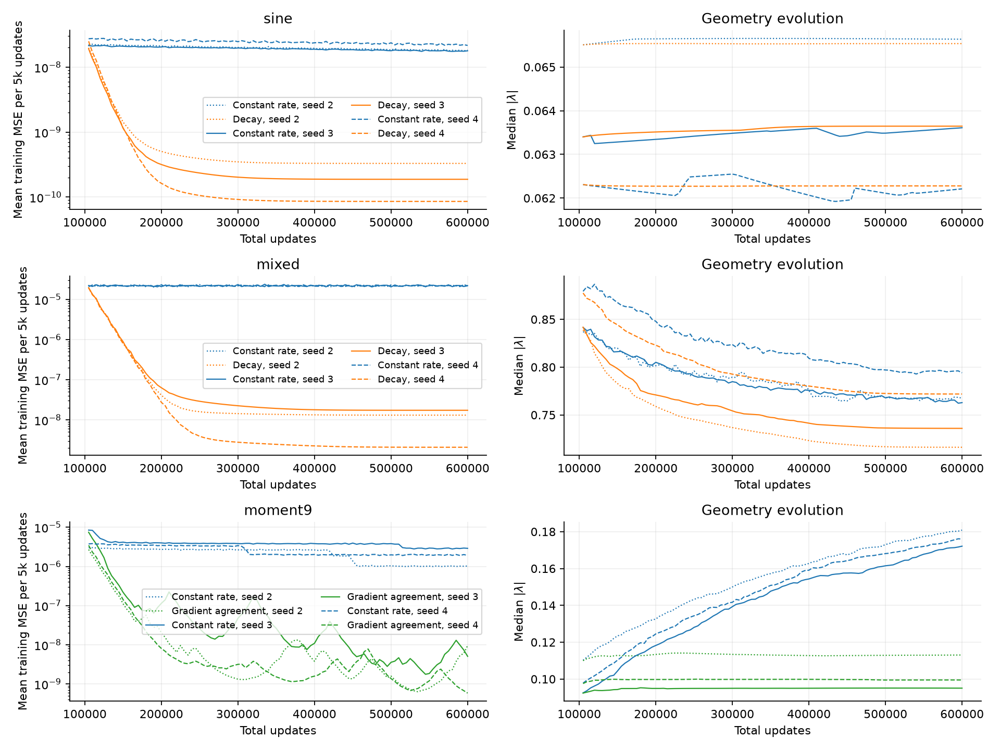
  <figcaption>Width 512, fresh seeds 2–4. Left: mean training MSE over each consecutive 5k-update block, including every loss. Right: median absolute bandwidth at saved states. Scheduling improves the loss while often reducing subsequent bandwidth movement. The horizontal axis includes the initial 100k parent updates.</figcaption>
</figure>

Constant-rate Adam can have a quiet final checkpoint despite persistent excursions. For example, the median final-grid sine error is $3.98\times10^{-10}$, while its complete late-window mean training error is $1.84\times10^{-8}$. Sparse validation checkpoints can also miss bursts. We therefore retain complete-trace averages, common-cadence validation scores, and final-grid errors separately. [Confirmation measurements](schedule512_confirmation_validation.json), [final precision audit](schedule512_final_precision.json).

Agreement scheduling is useful on degree nine, but not a universal improvement over predetermined decay. Decaying GD on the mixed target is worse than keeping its stable rate constant: $6.66\times10^{-6}$ versus $1.12\times10^{-6}$ two-seed late-window validation MSE. The full-batch and stratified-sampling screens remain in the ledger; the final policy choices do not depend on a claim that minibatch noise itself improves the approximation.

**The same finishing policies transfer to width 1024.** The policies are chosen at width 512, with no new policy search. These are again fresh seeds 2–4 and matched 100k parent plus 500k additional updates, using the width-specific rates above. The table uses the same complete-window and final-state statistics as the width-512 table.

| Target / transferred policy | Constant-rate training MSE | Finishing training MSE | Finishing final-grid MSE |
| --- | ---: | ---: | ---: |
| Sine / decay | $5.41\times10^{-9}$ | $9.50\times10^{-11}$ | $9.44\times10^{-11}$ [$8.61\times10^{-11}$, $1.57\times10^{-10}$] |
| Mixed / decay | $8.46\times10^{-8}$ | $1.21\times10^{-10}$ | $1.21\times10^{-10}$ [$3.90\times10^{-11}$, $1.52\times10^{-10}$] |
| Degree nine / agreement | $1.18\times10^{-6}$ | $9.21\times10^{-10}$ | $6.85\times10^{-10}$ [$1.97\times10^{-10}$, $2.00\times10^{-9}$] |

<figure>
  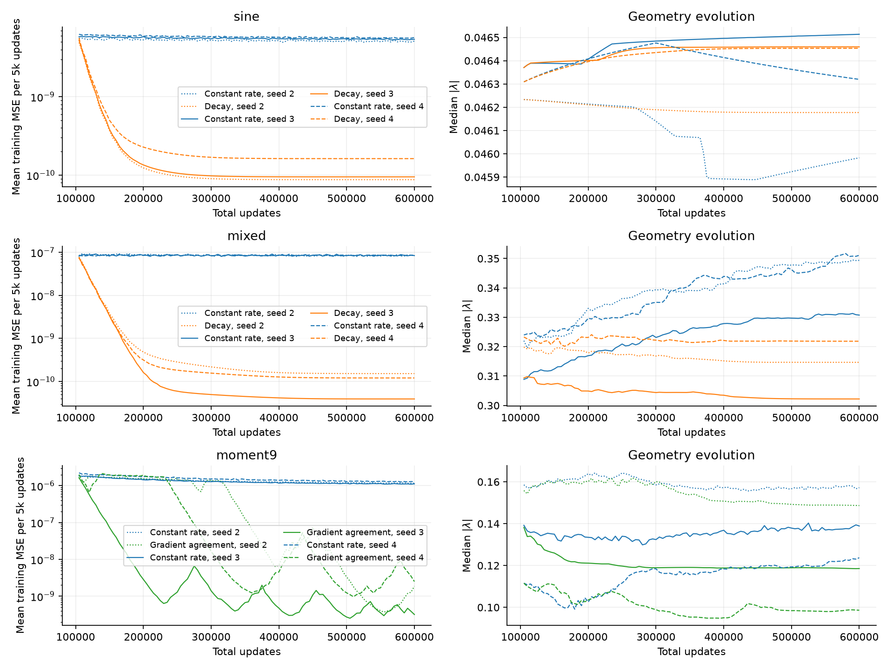
  <figcaption>Width 1024, fresh seeds 2–4, the same target-specific policies selected at width 512. Each loss point averages all 5k updates. Degree-nine agreement runs retain visible excursions; they have improved sustained accuracy, not a demonstrated precision floor.</figcaption>
</figure>

At this width, the mixed-target constant-rate median final-grid error is already $1.33\times10^{-10}$, close to the decayed endpoint. The benefit is that decay makes this accuracy persist instead of recurring only at quiet phases. [Complete training windows](schedule1024_training_windows.json), [final precision audit](schedule1024_final_precision.json).

Switching the same 500k Adam states to plain GD gives a separate test. At width 512, another 100k updates with shared GD rate $0.0003$ gives two-seed late-window MSE $1.16\times10^{-10}$ on sine; rate $0.003$ gives $1.38\times10^{-8}$ on mixed and $2.99\times10^{-9}$ on degree nine. All slopes and readouts remain trainable. The sine error changes little after the initial damping, even though its final geometry permits a detached readout fit near $2.85\times10^{-28}$ with coefficient norm 1.46 at SVD cutoff $10^{-14}$. This directly distinguishes suppressing Adam's excursions from resolving the residual weak directions. It is an Adam-to-GD result, not GD learning that representation from initialization. [Matched handoff measurements](first_order_finish512_validation.json).

## Initialization is a separate intervention

Initialization matters separately from the optimizer. In the no-filter neighboring-readout comparisons at $N=128$, the best tested constant rate for each initialization gives the following two-seed mean late-window relative MSE at 100k:

**Initialization comparison.** Two-seed late-window relative MSE at 100k, with the best tested constant rate selected separately for each initialization.

| Optimizer / target | Xavier on physical $\gamma$ | Xavier on $\lambda=h\gamma$ |
| --- | ---: | ---: |
| GD / sine | $7.59\times10^{-3}$ | $4.28\times10^{-6}$ |
| GD / mixed | $2.09\times10^{-2}$ | $5.51\times10^{-3}$ |
| GD / degree nine | $7.46\times10^{-1}$ | $3.81\times10^{-4}$ |
| Adam / sine | $5.35\times10^{-4}$ | $4.93\times10^{-8}$ |
| Adam / mixed | $3.55\times10^{-5}$ | $3.04\times10^{-4}$ |
| Adam / degree nine | $6.53\times10^{-5}$ | $1.32\times10^{-6}$ |

These are rate-tuned initialization comparisons, not a claim that only one variable changes at a fixed rate. They use the same reference-scaled readout initialization and no gradient filter. Larger initial bandwidth helps most of these cases but hurts the mixed Adam comparison. In particular, the good GD results with bandwidth-Xavier initialization do **not** show that GD learned the same geometry from tiny physical-Xavier slopes. [Full initialization comparisons](initialization_comparisons.json).

The width-512 fresh-seed trajectories make this distinction concrete. Bandwidth-Xavier starts with median $|\lambda|$ between 0.066 and 0.071. After 500k constant-rate GD updates, sine remains near its initial median, mixed reaches 0.077–0.081, and degree nine remains near 0.067–0.070. Adam degree nine moves farther, reaching 0.161–0.173. Its mixed-target recipe starts from physical Xavier, with median bandwidth about $2.6\times10^{-4}$, and reaches 0.768–0.797. That substantial movement is not equivalent to a well-conditioned final readout problem. [Parameter displacement and full-window gradient measurements](constant512_training_windows.json).

The uniform initial-bandwidth control makes the distinction sharper. At the same shared rate, setting all initial $\lambda_j=0.25$ improves the two-seed 100k GD mixed score from $1.04\times10^{-5}$ to $5.76\times10^{-6}$, but worsens sine from $1.27\times10^{-6}$ to $1.07\times10^{-5}$ and degree nine from $1.97\times10^{-5}$ to $7.46\times10^{-4}$. These are late-window relative MSEs. Retuning the shared rate closes the degree-nine gap: rate 0.009 gives $1.94\times10^{-5}$, with larger rates failing numerically. Adam's same-rate sine comparison improves modestly, whereas its mixed comparison worsens substantially. Starting at the construction bandwidth is therefore insufficient by itself, and the old scalar rate need not remain appropriate. [Matched-rate and tuned-rate comparisons](reference_lambda512_comparisons.json), [all 54 screening cases, including failures](reference_lambda512_screen.json).

Even this uniform initial geometry is not whitened by neighboring readouts. On the exact width-512 training grid, the median native readout singular value relative to the largest is $1.22\times10^{-5}$, retaining halos and the anchor. A detached sine fit already reaches $5.86\times10^{-28}$ validation MSE at cutoff $10^{-14}$ with coefficient norm 0.486. Thus a geometry can start with excellent approximation capacity and still have a difficult first-order readout system. This is an initialization diagnostic, not a trained checkpoint or a claim that every weak singular direction matters equally to the target. [Initial spectrum and fit](reference_lambda_diagnostics/uniform_initial_sine.json).

**Uniform initial bandwidth, 500k confirmation, fresh seeds 2–4.** Rates are chosen on seeds 0–1. Readout initialization, coordinates, and memory settings match the earlier width-512 recipes. All slopes remain trainable. Training columns are medians of complete late-window means; final-grid entries are medians of last-state errors.

| Optimizer / target | Retuned shared $\eta$ | Earlier initialization: training MSE | Initial $\lambda=0.25$: training MSE | Initial $\lambda=0.25$: final-grid MSE |
| --- | ---: | ---: | ---: | ---: |
| GD / sine | $0.009$ | $2.19\times10^{-7}$ | $3.20\times10^{-7}$ | $2.72\times10^{-7}$ |
| GD / mixed | $0.0027$ | $1.87\times10^{-6}$ | $2.40\times10^{-7}$ | $2.01\times10^{-7}$ |
| GD / degree nine | $0.009$ | $2.46\times10^{-5}$ | $1.90\times10^{-6}$ | $1.52\times10^{-6}$ |
| Adam / sine | $9\times10^{-6}$ | $1.90\times10^{-8}$ | $5.02\times10^{-10}$ | $3.20\times10^{-10}$ |
| Adam / mixed | $0.0027$ | $2.19\times10^{-5}$ | $1.91\times10^{-6}$ | $1.65\times10^{-8}$ |
| Adam / degree nine | $0.00027$ | $1.98\times10^{-6}$ | $8.11\times10^{-8}$ | $5.89\times10^{-8}$ |

The longer comparison changes the 100k assessment: after rate tuning, uniform initialization improves sustained Adam accuracy on all three targets and GD on mixed and degree nine. It does not make GD sine uniformly better. These compare two tuned recipes, not initialization alone at equal rates. The earlier same-rate measurements remain above. [Every confirmation seed and complete training window](reference_lambda512_training_windows.json), [final precision audit](reference_lambda512_final_precision.json).

<figure>
  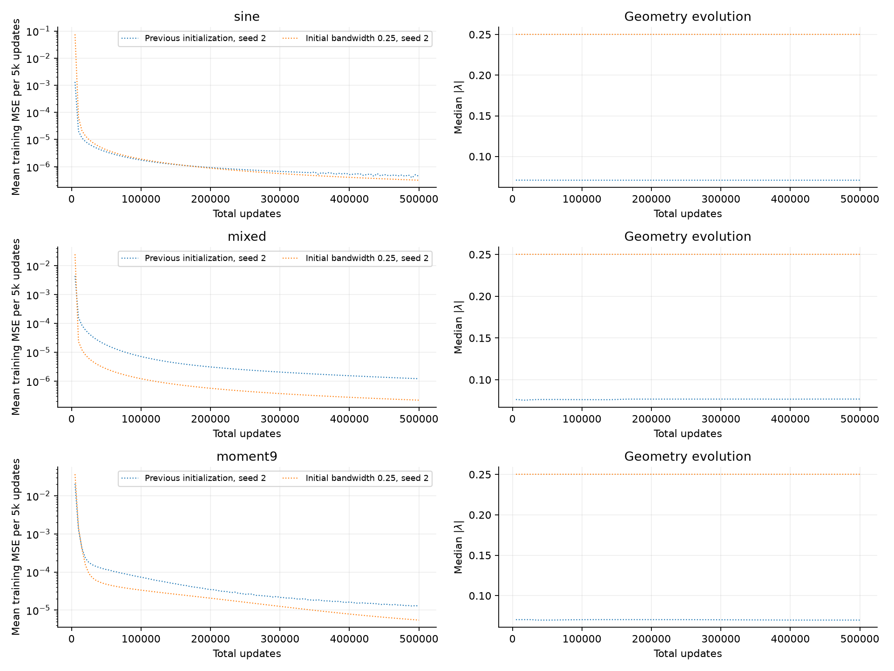
  <figcaption>Width 512, GD, confirmation seed 2. Each loss point averages all 5k updates. Rates are retuned for each initialization. The uniform-bandwidth run retains nearly its initial median bandwidth while continuing to improve slowly; the table includes all three new seeds.</figcaption>
</figure>

The GD bandwidth medians remain between 0.25010 and 0.25020 at 500k. Nevertheless, the seed-2 sine and mixed final geometries still permit detached fits of $4.04\times10^{-26}$ and $6.25\times10^{-25}$ validation MSE at cutoff $10^{-14}$, with coefficient norms 0.485 and 0.705. The respective trained errors are $2.98\times10^{-7}$ and $2.05\times10^{-7}$. This is a particularly direct example of unresolved readout conditioning even while the geometry remains close to the construction regime. [Final spectra and gradient decompositions](reference_lambda_diagnostics/). Adam moves more: final median bandwidth is 0.232–0.247 on sine, 0.391–0.401 on mixed, and 0.232–0.237 on degree nine. [Adam trajectories](figures/reference_lambda512_adam.png).

These GD runs are still improving, and they are less spectrally depleted than the later Adam-to-GD example: only 1.6% and 4.3% of their residual energy lies below relative singular value $10^{-4}$. That relative threshold is not a universal learning-time criterion. Using the absolute singular values and the chosen rates, the frozen-readout small-curvature estimate $[\eta(1+\rho)\sigma^2]^{-1}$ exceeds 500k updates for 85.8% and 87.3% of their remaining residual energy, respectively. This estimates amplitude e-folding time and includes the GD memory gain; it freezes geometry and is not a joint-training convergence theorem. [Rate-dependent spectral measurements](reference_lambda_rate_spectrum.json).

The improved constant-rate Adam results motivate one final combination. The same seeds 2–4 now fork their 500k uniform-initialization checkpoints into 500k more constant-rate updates or the already-selected target-specific finishing policy, preserving all optimizer and filter state. This reaches **one million total updates**. There is no additional policy search, and these are continuations of the preceding confirmation seeds rather than new independent replications.

| Target / transferred policy | Constant-rate training MSE | Finishing training MSE | Finishing final-grid MSE |
| --- | ---: | ---: | ---: |
| Sine / decay | $2.99\times10^{-10}$ | $2.22\times10^{-10}$ | $2.20\times10^{-10}$ [$1.38\times10^{-10}$, $2.42\times10^{-10}$] |
| Mixed / decay | $1.90\times10^{-6}$ | $6.93\times10^{-9}$ | $6.93\times10^{-9}$ [$5.25\times10^{-9}$, $2.39\times10^{-8}$] |
| Degree nine / agreement | $6.24\times10^{-8}$ | $1.94\times10^{-10}$ | $1.46\times10^{-10}$ [$1.22\times10^{-10}$, $1.50\times10^{-10}$] |

These again use median complete late-window training means and median final-state errors, with final-state ranges in brackets. Sine gains little: its constant-rate median final-grid error is $1.60\times10^{-10}$, already lower than the decayed median, although its window mean is higher. Mixed and degree nine improve in sustained accuracy; agreement still produces visible degree-nine excursions. The combination helps particular cases without providing a general precision cure. [Complete measurements](reference_finishes_training_windows.json), [final precision audit](reference_finishes_final_precision.json), [resolved mixed-target quadrature](reference_finishes_spatial_audit.json).

<figure>
  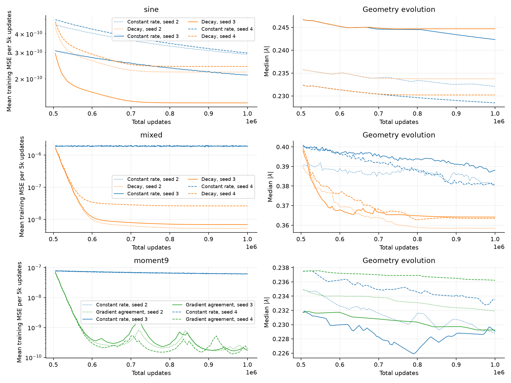
  <figcaption>Width 512, seeds 2–4, after the preceding uniform-bandwidth initialization experiment. The target-specific policies transfer unchanged. Complete 5k-update loss means show a small sine improvement, suppressed mixed-target excursions, and lower but still oscillatory degree-nine error.</figcaption>
</figure>

<figure>
  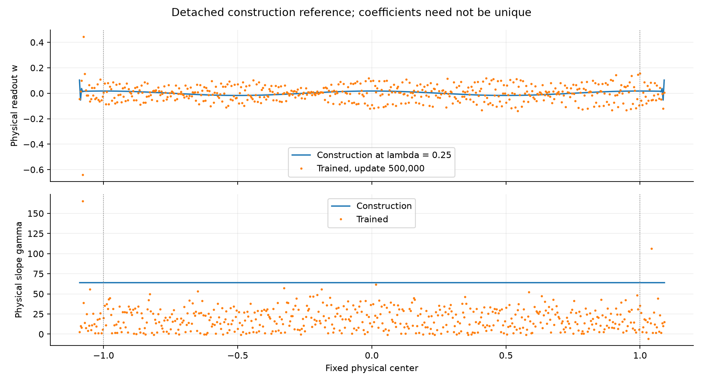
  <figcaption>Width 512, sine, confirmation seed 2, Adam with the frozen decay policy: physical weights and slopes after 100k parent plus 500k additional updates. The plot's update count is the additional count. The detached reference uses uniform bandwidth 0.25 at the same centers, including halos. Learned coefficients are irregular and most slopes are smaller; neither coefficient equality nor a unique representation is expected.</figcaption>
</figure>

## What gradient memory changes

The active filter is

$$
\bar g_t=\alpha\bar g_{t-1}+(1-\alpha)g_t,
\qquad \widetilde g_t=g_t+\rho\bar g_t,
$$

initialized from the first gradient and applied before GD or Adam. This follows the active function in the [precision-ls code](https://github.com/HazyResearch/precision-ls/tree/ae2a876ab8adcacf099528d5d3a02430920baeb9), associated with [Liu et al.](https://arxiv.org/abs/2503.12295). Post-Adam filtering is a separately labeled control. Neither operation averages the model parameters.

A useful isolated comparison starts from the same 100k no-filter GD checkpoint and introduces memory for another 100k updates, preserving the native scalar rate. With neighboring readouts and $\alpha=0.98$, the mean validation MSE over the last 20k additional updates is:

**Warm GD memory comparison.** Two-seed mean validation MSE after 100k additional updates from the same no-filter parent states.

| Target, $N=128$ | No filter | $\rho=2$ | $\rho=8$ | $\rho=32$ |
| --- | ---: | ---: | ---: | ---: |
| Mixed sine | $3.06\times10^{-3}$ | $1.10\times10^{-3}$ | $5.08\times10^{-4}$ | $1.57\times10^{-4}$ |
| Degree-nine target | $8.95\times10^{-5}$ | $4.32\times10^{-5}$ | $2.13\times10^{-5}$ | $1.23\times10^{-5}$ |

These are means across seeds 0 and 1; both seeds improve. The filter is introduced after the initial geometry transient, so the benefit is not solely a change to initialization. This remains an optimization improvement at a finite horizon, not evidence that the weak-mode barrier disappears. [Exact measurements](warm_memory_mse.json) identify the runs.

The cold-start controls also distinguish memory from simply multiplying the rate. At $N=128$, neighboring readouts with physical-Xavier slopes give the following two-seed mean late-window relative MSE at 100k:

| GD control | Shared $\eta$ | Mixed | Degree nine |
| --- | ---: | ---: | ---: |
| No memory | $0.0003$ | $0.0224$ | $0.750$ |
| No memory, three times the rate | $0.0009$ | $0.0209$ | $0.746$ |
| Memory, $\alpha=0.98$, $\rho=2$ | $0.0003$ | $0.00971$ | $0.0927$ |
| Same memory, rate divided by three | $0.0001$ | $0.0136$ | $0.700$ |

The unnormalized filter therefore does more here than a threefold constant-rate change, but gain compensation removes much of its degree-nine advantage. These nonlinear joint-training trajectories do not isolate a single spectral mode. They also use the poorer physical-Xavier initialization; the earlier bandwidth-Xavier comparison is substantially better. [Gain controls and both seeds](ema_gain_controls.json).

<figure>
  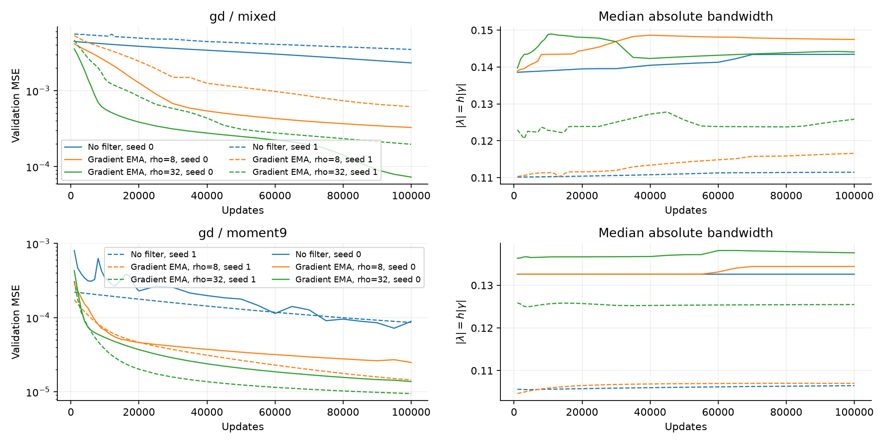
  <figcaption>Width 128, mixed and degree-nine targets, selection seeds 0 and 1. Memory is introduced at the same 100k no-filter parent checkpoints, without changing the shared rate. The horizontal axis counts additional updates; the right panels show median absolute bandwidth, not a conditioning certificate.</figcaption>
</figure>

For a fixed quadratic mode of curvature $k=\sigma^2$, plain GD contracts by $1-\eta k$. The filtered recurrence has slow eigenvalue $1-\eta(1+\rho)k+O((\eta k)^2)$ and stability interval

$$
0<\eta k<\frac{2(1+\alpha)}{1+\alpha+\rho(1-\alpha)}.
$$

Thus it can amplify a persistent weak-mode gradient without amplifying rapidly alternating gradients by the same factor. It still leaves sufficiently small $\sigma$ slow. The [derivation and its limits](../../../experiments/expD35_optimization_exploration/mechanism.md) distinguish this temporal filtering from the spatial Fourier decomposition below. Adam's changing normalization does not obey this fixed quadratic recurrence.

## Residuals, gradients, and motion

The cleanest late-stage comparison uses the same width-512 sine Adam state at 500k. Continuing Adam for 100k leaves a final-window sampled MSE of $2.10\times10^{-8}$, about 99.4% of which is temporal fluctuation. Switching to plain GD at shared rate $0.0003$ gives $9.59\times10^{-11}$, with fluctuation fraction only $5.3\times10^{-11}$. In that GD state, **99.86% of residual energy lies below relative singular value $10^{-4}$**, while **99.79% of readout-update energy lies above $10^{-2}$**. The geometry still permits the much more accurate, modest-norm detached fit described above.

<figure>
  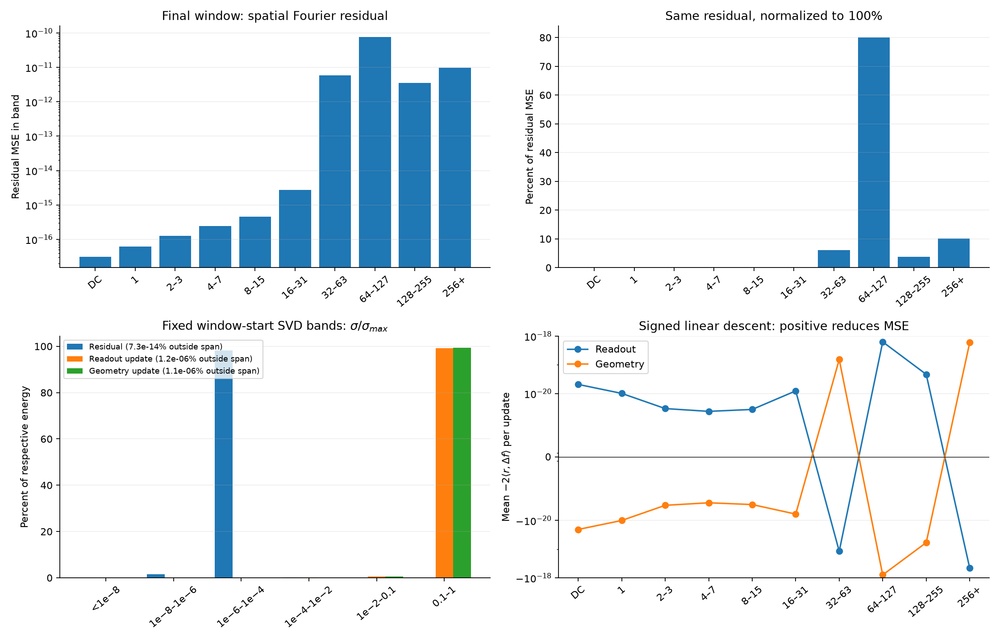
  <figcaption>Width 512, sine, seed 0: final 2,048 updates after switching the 500k Adam state to plain GD for 100k updates. The 8,192-point Fourier decomposition puts about 80% of residual MSE in indices 64–127. SVD bands use the fixed window-start readout map. The signed terms nearly cancel between blocks; they are not net loss changes.</figcaption>
</figure>

The mean physical per-update RMS changes are $7.4\times10^{-13}$ in readouts and $4.7\times10^{-12}$ in slopes. The readout and geometry function increments have cosine $-0.99866$. The corresponding all-update training trace contains every one of the final 20k losses, with mean $9.83\times10^{-11}$; the continued-Adam control has mean $1.89\times10^{-8}$. Thus sparse validation samples are not solely responsible for the distinction. The model is moving extremely slowly in a persistent residual, rather than losing accuracy mainly to geometry noise. [Window measurements](finishing_mechanism_summary.json), [complete-trace summaries](finishing_training_windows.json).

In a stable $N=128$ mixed-target GD run with neighboring readouts and gradient memory, **93.6% of residual energy lies below relative readout singular value $10^{-4}$**, while **98.8% of readout-update energy lies above $10^{-2}$**. These numbers use an 8,192-point diagnostic grid; the earlier 2,048-point calculation gives 93.5% and 98.8%. [The grid comparison](diagnostic_grid_check.json) records the difference.

<figure>
  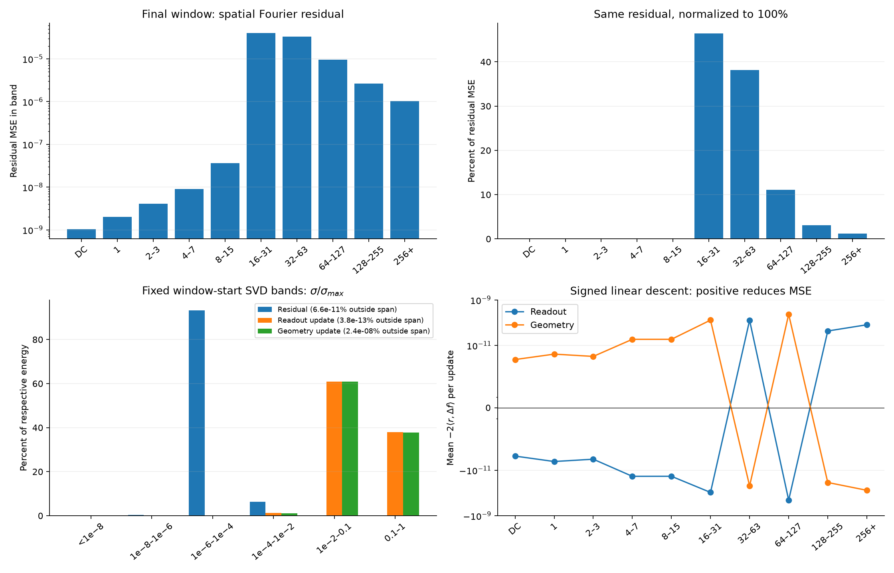
  <figcaption>Width 128, mixed target, seed 0, neighboring readouts with gradient memory: final window at 500k, using 8,192 midpoint samples. Residual energy and update energy concentrate in different singular-value bands; the signed terms describe the linear contribution to MSE change, with positive meaning descent.</figcaption>
</figure>

Readout and geometry increments in this run have function-space cosine about $-0.99974$. The residual's temporal fluctuation accounts for only about $5.4\times10^{-7}$ of its energy over the final window: its remaining error is persistent, rather than dominated by oscillation. The opposing block motions indicate redundancy in the joint parameterization. They do not establish that geometry training is harmful. Plain GD's two blocks separately descend the training loss to first order, even when their function increments have opposing components perpendicular to the residual.

Constant-rate Adam can behave differently. In the corresponding long sine diagnostic, about 87% of sampled residual energy is temporal fluctuation. Readout and geometry increments largely move together, and almost all readout-update energy occupies the stronger singular directions. This motivates a finishing schedule separately from attempts to accelerate the persistent weak modes in GD.

The measurement uses every saved parameter state in the final 2,048-update window. Fourier and singular-basis diagnostics sample 128 adjacent pairs, with balanced offsets across 16-update blocks to avoid repeatedly sampling one phase of an oscillation. The SVD basis is fixed at the window's first state. Actual function increments change readouts first and then geometry; their cross term and energy outside the fixed span are retained. The training-gradient alignment uses gradients captured on the GPU when available, or explicitly recomputed on the training grid. Alignment with the different midpoint-grid gradient is reported separately.

The gradient decomposition must use the intended quadrature. At the late sine GD state, the physical slope-gradient norm is $5.64\times10^{-12}$ on the exact endpoint training grid, versus $3.60\times10^{-9}$ on the 8,192-point midpoint diagnostic grid, although their losses differ by only about 2.6%. On the training grid, constant-plus-linear residual MSE has fallen to $9.23\times10^{-22}$, compared with total MSE $9.83\times10^{-11}$. Recomputing the same training-grid gradient through the trainer agrees to about four parts per million in relative norm. We therefore use captured training gradients for update-direction claims and label the separate midpoint decompositions. Near-stationary gradients are more quadrature-sensitive than loss values. [Training-grid audit](training_gradient_quadrature_audit.json).

There is a second qualification to the Fourier interpretation. Decompose the residual as $r=\sum_b r_b$ and evaluate each contribution $g_{\gamma,b}=J_\gamma^Tr_b/m$ using the same sampled Jacobian. These vectors sum to the total gradient, but their norms do not add. In the late sine GD state, bands 64–127 and 256+ contribute slope-gradient norms $2.46\times10^{-8}$ and $2.04\times10^{-8}$, while the total is only $5.64\times10^{-12}$. Large contributions cancel across bands. The gradient reconstruction discrepancy is $4.2\times10^{-23}$ in norm.

<figure>
  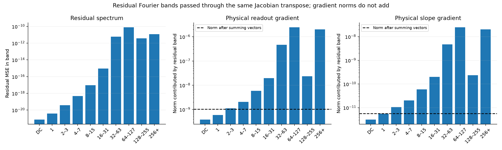
  <figcaption>Width 512, late sine Adam-to-GD state, seed 0. DFT bands refer to the 8,193 endpoint training samples. Each residual band passes through the same readout or slope Jacobian transpose. Dashed lines show the norm after summing all gradient vectors. Fourier bands are not singular directions of this finite, nonuniform learned model.</figcaption>
</figure>

Thus the data do not justify saying that every high-frequency residual band is individually invisible to gamma. The stronger empirical statement is that the **combined residual** lies in weak readout directions and induces a tiny net slope gradient. Exponential Fourier attenuation in the ideal common-slope construction remains relevant theory, but finite-interval effects, unequal slopes, and cancellation must enter an explanation of these learned trajectories. [Band-resolved vectors](fourier_gradient_diagnostics/gd_N512_s0_neighbor_sine_f73698e3a7bd.npz) and the [degree-nine comparison](fourier_gradient_diagnostics/gd_N512_s0_neighbor_moment9_e4a927e8431b.json) preserve the distinction.

DC means the spatial mean, DFT index zero. On the midpoint grids over $[-1,1]$, index $k$ denotes $k$ periods across the interval; the explicitly labeled training-grid panel instead takes the DFT of the endpoint sample vector. Fourier energies include the conjugate-frequency multiplicities and sum to MSE by Parseval's identity. Percentage plots divide each band by that same total. They are not different error metrics.

These DFTs describe the periodic extension of a finite interval. An endpoint mismatch can populate high-frequency bins, especially for polynomial targets. High-bin energy alone therefore does not establish a localization barrier; the singular-direction and gradient measurements are needed alongside it.

<figure>
  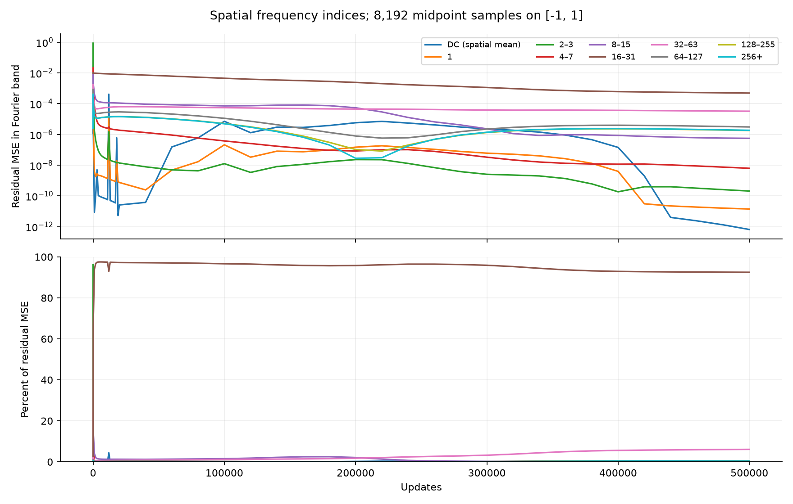
  <figcaption>Width 128, mixed target, seed 0, neighboring GD without gradient memory. Every band is shown both as absolute MSE and as its percentage of total residual MSE on the 8,192-point midpoint grid.</figcaption>
</figure>

This no-filter GD control makes the frequency imbalance visible throughout training. The persistent mixed-target component is primarily in indices 16–31, which includes its 20-cycle component. The code also retains and plots indices 64–127 and 128–255; no omitted band is used to justify the discussion.

<figure>
  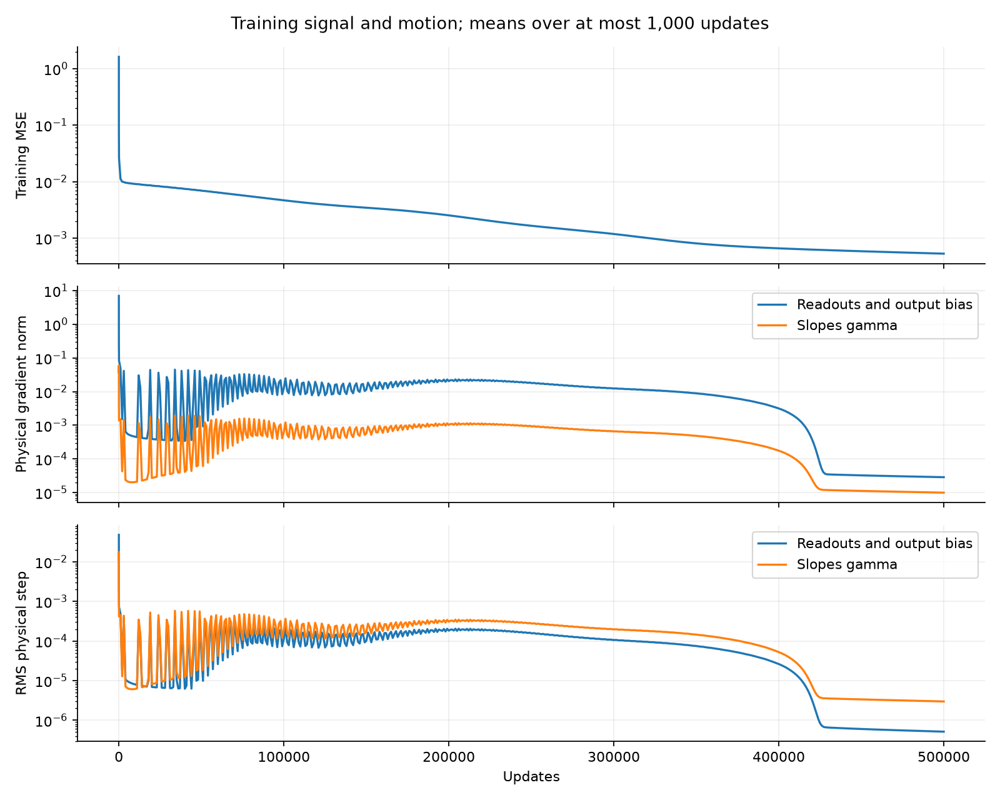
  <figcaption>The same no-filter GD control, with means over at most 1,000 consecutive updates. Gradients and steps are expressed in physical readout and slope coordinates; their different units should not be interpreted as an intrinsic block-importance ratio.</figcaption>
</figure>

The model continues to move. Small net improvement therefore need not mean every parameter has stopped receiving a gradient. Conversely, a nonzero gradient norm is not evidence that the gradient points toward the residual directions that remain difficult.

Detached readout solves demonstrate representational headroom, but need careful interpretation. On the refined mixed-target GD geometry above, an SVD fit at relative cutoff $10^{-14}$ reaches about $1.39\times10^{-16}$ validation MSE with physical coefficient norm about $9.9\times10^5$; at cutoff $10^{-12}$ it reaches $4.86\times10^{-14}$ with norm $3.3\times10^4$. This is not a well-conditioned fit merely because a factorization can compute it. In the sine geometry, much smaller coefficient norms suffice. The saved diagnostics disclose cutoffs, ranks, coefficients, and validation errors.

The scalar rate is also constrained by strong directions. In an individual-coordinate $N=128$ sine checkpoint, the largest squared readout singular value is about 591, giving the frozen-readout GD ceiling $\eta<0.00338$. Its strongest function mode is almost entirely DC, and about 93% of the parameter loading is on the scaled output bias. The theoretical coefficient allowance for that bias is 23.48, much larger than an ordinary allowance of 0.05146. The parameter scales therefore do not whiten even the strong end of the spectrum. This local calculation is not a joint-training stability theorem. The [stiffness measurements](readout_stiffness.json) and the explicit large-rate failures explain why simply increasing the shared GD rate is insufficient.

Neighboring differences are localized only under additional slope assumptions. If adjacent nonzero slopes have opposite signs, then $\phi_j-\phi_{j+1}$ tends to $\operatorname{sign}(\gamma_j)-\operatorname{sign}(\gamma_{j+1})$ at positive infinity, rather than zero. The best neighboring SSB sine state has opposite signs in half of its adjacent pairs. A detached positive-slope canonicalization preserves the function by flipping the corresponding readout signs, but changes the neighboring optimization metric. In the width-512 mixed GD state, this reduces the largest squared readout singular value from 736 to 218 and the residual fraction below relative singular value $10^{-4}$ from 61% to 19%. In the SSB sine state, the strongest curvature also falls, but over 99.9% of residual energy remains below that threshold. Removing halo-only directions does not eliminate the weak-mode problem either. This diagnoses a limitation of applying the uniform-positive-slope theory to learned slopes; it is not a positive-slope training result. [Basis comparisons](neighbor_basis_diagnostic.json).

The precision audit also checks spatial resolution. One mixed Adam state has a maximum physical slope near 41,831. Its 65,536-point MSE is $1.8674\times10^{-8}$; transition-resolved Gauss quadrature gives $1.8650\times10^{-8}$, agreeing across orders 16, 32, and 64. The difference is small for that reported error, but some coarse-grid detached fits are more sensitive. We retain the fitting and validation grid sizes instead of treating a low fit-grid residual as a continuous-function certificate. [Spatial audit](spatial_precision_audit.json).

## What the resets establish

Neuron replacement adapts the low-utility idea in [Dohare et al.](https://pmc.ncbi.nlm.nih.gov/articles/PMC11338828/) to this stationary, shallow tanh problem. It is not a replication of loss of plasticity under continual task changes. The utility is an EMA of $|w_j|\operatorname{mean}|\phi_j|$; mature, low-utility neurons receive a new slope and zero readout. Matched controls replay the same reset times while clearing optimizer state alone, or replace random eligible neurons.

The original screen contains a real but limited positive result: replacement helps the poorly initialized individual-coordinate Adam sine runs. It does not produce a uniformly strong result across targets, and that setup is already outperformed by better initialization and rate choices. In several mixed-target comparisons, state-only resets match or beat replacement. Random replacement can be much worse. The [recorded comparisons](recycling_comparisons.json) retain these negative results rather than selecting only favorable resets.

Repeating replacement after the tuned width-512 initialization and rate choices removes the apparent general benefit. On sine, both tested replacement rates ($10^{-6}$ and $10^{-5}$ per eligible neuron per update) worsen both seeds over the next 20k updates. On mixed, one seed improves slightly at the lower replacement rate, while the other worsens by roughly three orders of magnitude. State-only and random-neuron controls do not establish a consistent advantage either. These results argue against presenting recycling as a precision remedy for this stationary problem. [Replacement outcomes](recycle512_validation.json), [matched controls](recycle512_matched_validation.json).

The affine promotion releases independent hidden offsets in addition to all slopes and readouts. Its paired checkpoint continuations show no uniform benefit: sine Adam is essentially unchanged, neighboring GD has modest improvements on sine and mixed targets, and some Adam degree-nine runs become unstable. Cold random centers help one degree-nine comparison but hurt sine. This small assay does not support replacing the primary fixed-center experiment with a broad affine sweep. [The two-seed comparisons](affine_comparisons.json) retain the initialization and parent-checkpoint identities.

The frozen width-512 degree-nine recipes also transfer without retuning to degree-three, degree-five, and Runge targets for 100k updates on seeds 2–4. Median late-window MSE is $6.14\times10^{-7},3.27\times10^{-6},2.07\times10^{-8}$ for Adam and $6.17\times10^{-6},1.39\times10^{-5},3.06\times10^{-6}$ for GD. Runge's Adam seed range is wide, $2.00\times10^{-9}$ to $1.09\times10^{-5}$. Its complex poles at $\pm0.2i$ also lie inside the reference construction's assumed strip of width 0.25, so this is a transfer stress test rather than a verification of that analytic bound. [All transfer seeds](target_transfer512_validation.json).

## SSBroyden and the remaining precision gap

These SSBroyden runs start directly from reference-scaled Xavier readouts and physical-Xavier slopes, with identity inverse metric in the selected native coordinates. They are not Adam handoffs. SSBroyden chooses its step through line search; it does not use the constant GD/Adam scalar rates in the earlier table. Periodic full, geometry-block, and blended resets deliberately restore some coordinate dependence. A separate reset fires when the stored or matrix-derived search direction is non-descent or nonfinite. That intervention extends progress much more consistently than frequent unconditional resets. The no-reset and late-reset arms use one compiled graph and agree exactly before the first reset.

The reported width-512 runs use curvature guard $10^{-30}$ and line-search threshold $10^{-15}$, with the [pinned SSBroyden source](https://github.com/IvanBioli/ssbroyden_optimistix/tree/4c87785c68f0fec6b09000f474daef76fb181eea) and the repository's accepted-step integration correction. The screen also checks larger curvature guards and smaller search thresholds. Neuron replacement is confined to the first-order experiments; the SSB intervention resets the inverse metric and search history while preserving the parameters.

The successful reset does not maintain the original GD metric throughout training. The width-512 individual sine runs reset three times in 20k accepted updates, and their late directions remain almost orthogonal to native steepest descent. The [motion and reset ledger](ssb_motion_summary.json) records block gradient norms, physical travel, reset counts, and this alignment. The improvement is evidence for repairing bad search directions, not evidence that persistently restoring the theoretical LR ratio is responsible.

At $N=512$, the last accepted states of the two sine seeds with the non-descent reset give:

**SSBroyden sine results.** Last accepted states on the reserved 65,536-point grid; search failure is retained explicitly.

| Readout coordinates | Seed 0 final-grid MSE | Seed 1 final-grid MSE | Accepted updates |
| --- | ---: | ---: | --- |
| Individual | $1.17\times10^{-20}$ | $9.68\times10^{-21}$ | 20k, 20k |
| Neighboring | $6.51\times10^{-21}$ | $2.03\times10^{-21}$ | 17,348 then search failure; 20k |

Neighboring readouts do not win across targets. On the mixed target, individual coordinates reach $4.49\times10^{-18}$ and $7.69\times10^{-18}$, whereas neighboring coordinates reach $2.44\times10^{-14}$ and $9.31\times10^{-15}$ at 20k. The no-reset controls terminate in explicit search failures earlier. The longer $N=128$ extensions also eventually encounter search failures; they do not establish convergence to a numerical floor.

The [final precision audit](ssb_final_precision.json) reevaluates all width-512 transfer cases, including failed controls. Eighty-digit calculations on a fixed 257-point subset confirm the error scale. In the best sine case, FP64 forward-evaluation error is about $2.4\times10^{-31}$ MSE, far below its $2.0\times10^{-21}$ model error. Its L2 relative error is about $4.5\times10^{-11}$. **This is not machine precision.**

The detached $\lambda=0.25$ sine construction reaches about $6.8\times10^{-32}$ FP64 MSE on the same final grid. Its rounded physical coefficients give about $4.9\times10^{-35}$ MSE in the high-precision subset evaluation. [Construction audit](construction_N512_precision.json).

<figure>
  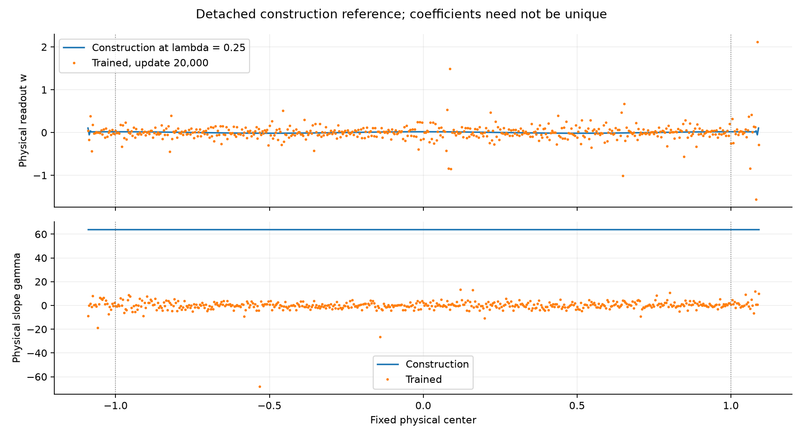
  <figcaption>Width 512, sine, seed 1, neighboring SSBroyden with non-descent resets after 20k accepted updates. The reference construction has uniform bandwidth 0.25. The learned model attains high accuracy through a different, irregular representation; the construction is never inserted into training.</figcaption>
</figure>

The trained network uses a different representation: most slopes remain much smaller than the construction's uniform slope, with a few large positive or negative slopes and larger, irregular readouts. Slopes are unconstrained after initialization, so negative values are valid. This high-accuracy result shows why a median $|\lambda|$ cannot identify the only useful geometry. It also does not show that this representation is easy for GD or Adam to reach.

The remaining bottleneck differs even between these two SSB targets. On the best sine geometry, a detached readout fit at relative cutoff $10^{-14}$ reaches $5.81\times10^{-27}$ validation MSE with coefficient norm 5.99, leaving substantial readout headroom. On the individual-coordinate mixed geometry, the same cutoff only improves $4.49\times10^{-18}$ to $3.14\times10^{-18}$ and requires coefficient norm 243; a $10^{-12}$ cutoff gives $4.40\times10^{-18}$ with norm 0.506. Further mixed-target improvement therefore needs geometry changes or much more delicate directions, while the sine checkpoint still has an unresolved fixed-geometry readout problem. These are numerical cutoff-dependent diagnostics, not exact approximation lower bounds.

The numerical guard experiments separate an outside-square-root Adam epsilon from squared/curvature guards in SSBroyden. Smaller guards are not uniformly better. Audits of failed SSB searches find both indefinite stored inverse metrics and sensitivity of tiny directional derivatives to arithmetic order. A cancellation-aware neighboring forward evaluation changes trajectories but does not consistently cure the failures. Its final evaluation error can also be larger than direct physical-weight summation. Guard tuning and metric resets help particular failure modes; neither supplies a general precision guarantee.

## Implication for the race hypothesis

The exact slope gradient contains both readout magnitude and residual projection:

$$
\partial_{\gamma_j}L
=w_j\left\langle r,(x-t_j)\operatorname{sech}^2(\gamma_j(x-t_j))\right\rangle.
$$

Readout training can remove the residual components that provide appreciable slope signal, leaving components with very small projections onto both parameter blocks. The prescribed length-scale factors correct the units of the updates; they do not undo that spectral depletion. The evidence supports studying this coupled mechanism, while distinguishing it from Adam's finite-step excursions and from a genuinely inadequate representation.

This exploration diagnoses late-stage difficulty; it does not by itself identify readout speed as the cause of every plateau. The separate [ordinary-GD rate-ratio study](../expD34_readout_race/REPORT.md) supplies the matched intervention for that causal question. Its escape cases also matter: readout growth can amplify remaining hidden-layer signal. Neither that study nor the present trajectories justify assuming that all slope gradients become exactly zero or that every observed plateau is permanent.

For a fixed quadratic problem, GD's iteration count is proportional to the relevant normal-matrix condition number. The exponential dependence comes from exponentially attenuated singular directions, not from an exponential dependence on the condition number itself. Neighboring tanh features remove a broad antiderivative component but retain exponential high-frequency attenuation. Gradient memory can change the rate constant for slow modes. A proof of a lasting geometry barrier still needs trajectory bounds and target-residual projections; these experiments do not supply a global convergence or impossibility theorem.

The initialization and coordinate maps impose no norm constraint during training. Physical readouts can grow beyond their initial $O(h)$ scale, so a proof cannot silently treat that initial scaling as a bound valid along the entire trajectory.

The most useful conditioning statistic is therefore target dependent: how much remaining residual lies in weak directions, how strongly each parameter block sees it, and what actual function changes the optimizer makes. Neither a global condition number, a detached least-squares error, nor a median bandwidth is sufficient by itself.

“Learning the right geometry” consequently has two meanings that should stay separate. A geometry may admit an accurate readout solution while offering first-order updates almost no useful access to it. Scaling coordinates helps set physical step sizes, but the MSE objective does not explicitly reward a well-conditioned representation. The late sine example satisfies the first requirement and fails the second within this budget.

The campaign does not establish a nonzero asymptotic floor for GD or Adam. Constant-rate runs can remain slow or oscillatory; an exponentially decayed run can settle because its remaining total step length is small. Reported final errors are attained errors within the stated training and compute budgets.

## Evidence and verification

The campaign finished in **30,831 allocated H200 GPU-seconds, or 8.56 of the authorized 10 GPU-hours**, across 52 Slurm allocations, with at most two campaign GPUs active concurrently. The ledger contains 2,360 case records, including 372 warm continuations: 1,911 finish finite with at least 20k updates, and 449 retain an explicit numerical or search failure. These counts include rate screens and related branches, not 2,360 independent long-training replications. [Execution summary](execution_summary.json), [raw Slurm accounting](gpu_accounting.txt).

The [experiment entry point](../../../experiments/expD35_optimization_exploration/README.md) documents initialization, optimizer state, checkpoint forks, and Slurm execution. Committed manifests record the adaptive decisions before their associated confirmations. The [case ledger](case_ledger.csv) includes failures and parent-checkpoint hashes; [common-horizon scores](horizon_scores.csv) permit comparisons at equal update counts. A case record can be a warm continuation, so the number of records is not the number of independent cold starts. Finite screening cases receive at least 20k updates; explicit numerical and line-search failures are retained rather than called converged. Rate selection generally uses 100k, and primary confirmations use 500k from initialization or 100k plus 500k for finishing.

Selected final parameter arrays and immutable configurations are included under `models/`, indexed with SHA-256 hashes in the [SSB](ssb_models.json), [width-512 first-order](first_order512_models.json), [width-1024 first-order](first_order1024_models.json), [uniform initialization](reference_lambda512_models.json), and [combined finishing](reference_finishes_models.json) inventories. They can be reevaluated without the full optimizer histories. The raw trajectories remain in the local `evidence/` directory, excluded from Git; live checkpoints also remain in the cluster's `runs/optimization_exploration` directory. Quota recovery removed only redundant remote copies after verifying local hashes. The [preservation audit](archive_preservation_audit.json) rechecks all 9,011 offloaded archives, totaling 21.12 GB, against their committed inventories. Compilation, failed launches, and storage interruptions count toward GPU usage.

The [verification record](verification.json) reports 35 passing first-order tests and five passing SSB tests. Checks cover physical-coordinate pairing, analytic gradients, the active filter recurrence, state-preserving forks, archive identities, reference-bandwidth initialization, and spectral decompositions. After preserving the newer experiments on `main`, the publication branch's full repository suite reports **692 passed, 9 skipped, and 17 failed**. The failure set exactly matches the campaign suite and its previously reproduced untouched-baseline failures; this is not a clean full-suite result. No unrelated experiment was changed to conceal those failures. Training code is unchanged by that integration, and standalone Adam and SSB model reevaluations reproduce the recorded errors.

Per-allocation [source and environment records](provenance/) retain commits, source hashes, device masks, and Slurm commands. The GPU environments report JAX 0.10.2 and NumPy 2.4.6 with FP64 enabled. The pinned SSB source revision is given above. Analysis artifacts identify their training or midpoint quadrature and saved state rather than relying on a plot title to establish provenance.

The [source audit](source_commit_audit.json) compares recorded repository-source hashes with their declared commits and checks the pinned SSB dependency hash. The [curated artifact audit](artifact_audit.json) records model-hash, complete-window, link, and file-integrity checks for the published evidence.

Every final training-window summary used in the tables has complete trace coverage. Both widths' finishing plots reproduce the all-update means, rather than interpolating sparse validation samples. Frozen-recipe confirmations receive reserved-grid and 80-digit subset audits; mechanism examples use their explicitly stated diagnostic grids. Steep mixed-target transitions also receive resolved Gauss quadrature checks. The [width-1024 spatial checks](spatial1024_precision_audit.json) differ from the 65,536 midpoint estimates by less than $7\times10^{-5}$ relatively in the audited cases. Report links, model hashes, numerical arrays, and the displayed figures are checked separately from tests of the training implementation.
