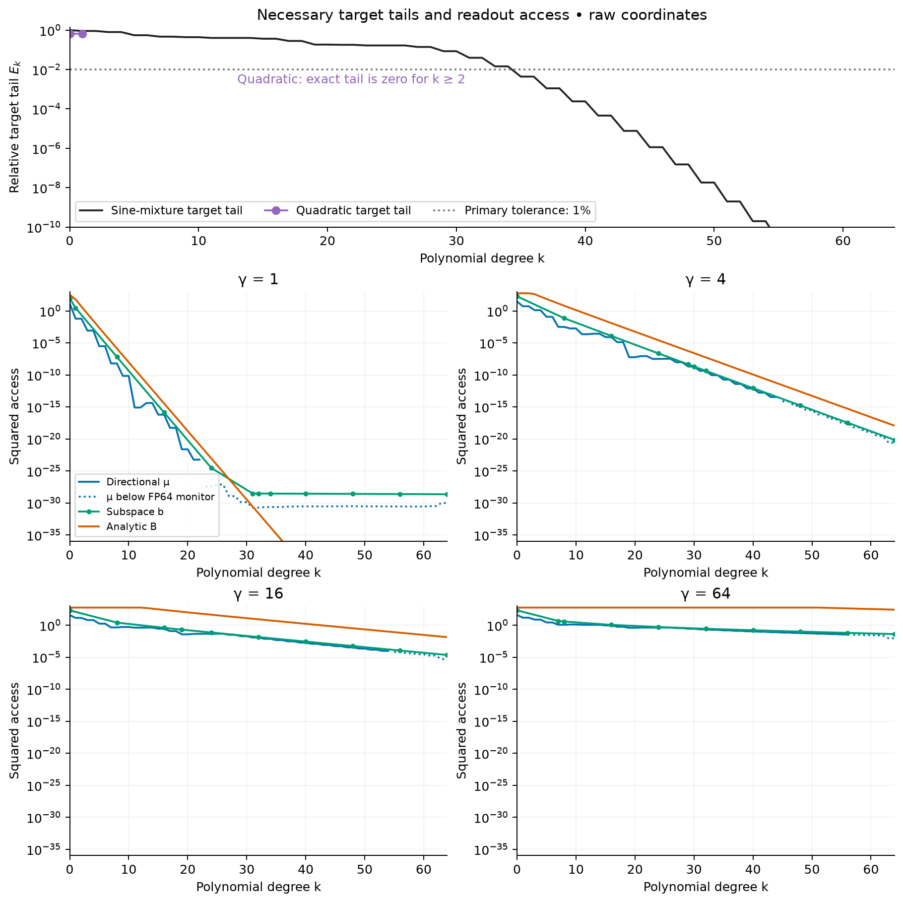
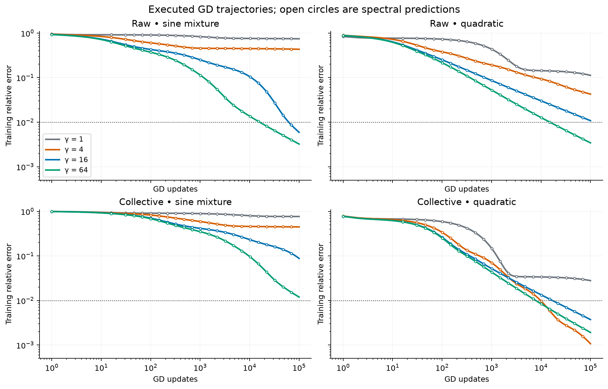
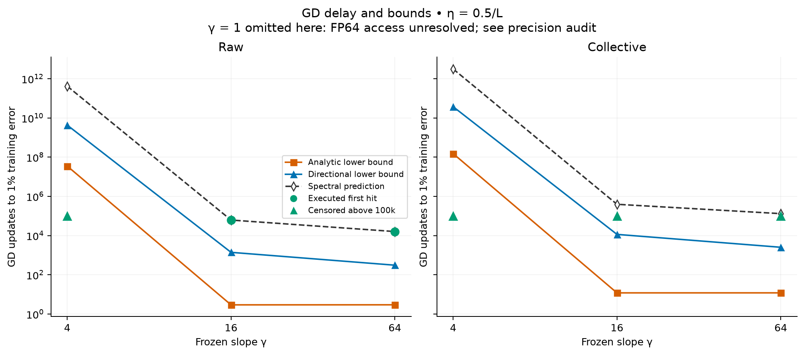
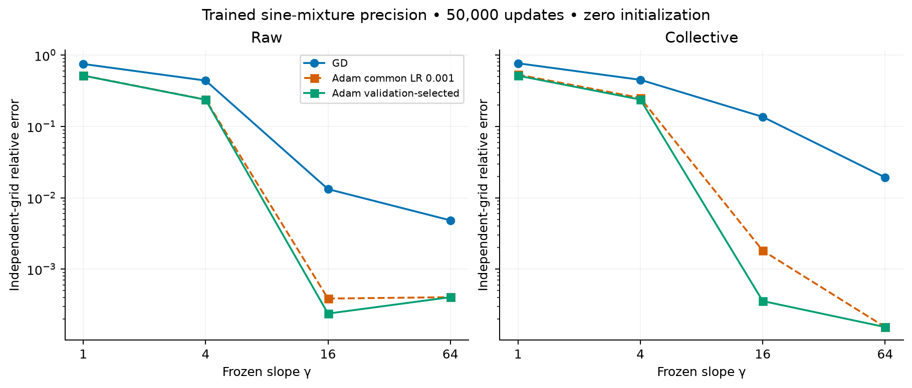

# First frozen-gamma probe: optimization delay and theorem slack

Changing the frozen slope changes readout learning time substantially, even
where the dictionary already has enough capacity. For the sine mixture in raw
coordinates, gamma 4 admits a directly evaluated refit error of $7.83\times
10^{-9}$, but GD still has about 43% error after 100,000 updates. Gamma 16 and
64 reach 1% training error in 61,792 and 16,013 updates. Evaluating the
slope-envelope theorem at gamma 4 gives a lower bound of about **35 million
updates**; using measured target-direction access strengthens it to **4.29
billion**. These are informative delay estimates, with substantial slack:
the directional bounds are about 44–52 times below the two observed hitting
times. They are not close convergence forecasts.

All 16 GD cases and 16 Adam trials completed on H200s using **0.0575 allocated
GPU-hours**, within the two-hour limit. Adam also exhibits a large gamma effect,
but the GD theorem does not bound Adam. This deterministic, single-width probe
does not establish a width-scaling law. The gamma-1 access estimate is unreliable
in FP64, and all numerical theorem evaluations remain estimates without interval
certification.

**Glossary. Quantities use the coordinates and sample normalization actually trained.**

| Term or symbol | Meaning |
|---|---|
| $N,H,W$ | 512 core cells, 23 halo centers per side, 559 hidden features; output bias is additional. |
| $\gamma$, $\lambda$ | Common frozen tanh slope and relative bandwidth $\lambda=\gamma h$, with $h=2/N$. |
| $R$, $J$ | Physical readout map $c=R\theta$ and normalized training matrix $J=AR$. |
| Raw / collective | $R=I$ / $R=\operatorname{diag}(\sqrt{\alpha})$, including the bias allowance. |
| $L$, $\eta$ | Largest curvature $\|J\|_2^2$ and GD learning rate $0.5/L$. |
| Relative error | Residual Euclidean norm divided by target norm on the stated grid; dimensionless. |
| $Q_k$, $E_k$, $q_k$ | Complement of degree-at-most-$k$ sampled polynomials, relative target tail, and its unit direction. |
| $\mu_k$, $b_k$, $s_k$, $B_k$ | Directional access, subspace access, squared Frobenius tail norm, and analytic access envelope. |
| $N_\epsilon$ | First GD update count with training relative error at most $\epsilon$. |
| Censored | Threshold not reached in the executed 100,000-update GD budget. |
| Spectral prediction | Exact-arithmetic evolution of a numerically retained SVD model; an unexecuted horizon remains a forecast. |
| Refitting | Offline truncated-SVD coefficient calculation used only to check capacity. |

## Question and controlled experiment

The hypothesis is that small frozen slopes can make a necessary target
correction weakly accessible to gradient updates, even when its sampled
approximation is attainable. A capacity failure would leave that interpretation
unresolved. A weak lower bound would limit the theorem's quantitative usefulness;
a target-dependent reversal is compatible with a target-tail theorem.

The model on $[-1,1]$ is

$$
\widehat f(x)=d+\sum_{j=1}^{559} w_j\tanh\bigl(\gamma(x-x_j)\bigr),
\qquad c=(d,w)=R\theta.
$$

Centers are $x_j=-1+h j$ for integer slots $j=-23,\ldots,535$, with
$h=1/256$. The collective allowances use the existing
[D06 corrected-halo geometry](../../../experiments/expD06_fixed_center_scales/core.py)
at reference bandwidth $\lambda_{\rm ref}=0.25$, held fixed as gamma changes.
Bias scaling participates in both training and $L$. The two maps are invertible
and have the same function space for a fixed gamma in exact arithmetic.

The four slopes are $\gamma\in\{1,4,16,64\}$, corresponding to
$\lambda\in\{1/256,1/64,1/16,1/4\}$. Both targets start from exactly zero
readout, so the initial correction is the target itself:

$$
f_{\rm sine}(x)=\sin(2\pi x)+\tfrac12\sin(6\pi x)+\tfrac14\sin(10\pi x),
\qquad f_{\rm quad}(x)=\sqrt{5}\,x^2.
$$

This sine mixture differs from D06's target named `mixed`. Each cell is one
deterministic full-batch run, with no random initialization, seed selection,
repeated-run aggregation, or statistical confidence interval.

**Table 1. Fixed data roles and optimizer budgets; evaluation values never select a recipe.**

| Role | Grid or protocol | Use |
|---|---|---|
| Training and theorem measurements | 8,193 equally spaced endpoints, including $-1,1$ | Half empirical MSE, projections, spectra, and hitting times. |
| Adam validation | 4,096 points $-1+2(i+0.37)/4096$ | Select the learning rate by median relative error at 40k, 42.5k, 45k, 47.5k, and 50k updates. |
| Independent evaluation | 32,768 midpoint samples | Evaluate the final fixed-budget model; no training or selection. This is an interpolation check on a known function. |
| GD | Both targets, both maps, all four gammas; $\eta=0.5/L$ | Execute 20k then 100k updates; retain the 50k checkpoint for equal-budget optimizer comparison. |
| Adam | Sine mixture, both maps, all gammas; initial rates 0.001 and 0.01 | 50k updates per trial; $\beta_1=0.9$, $\beta_2=0.999$, additive epsilon $10^{-12}$. |
| Adam schedule | Constant through 20k, then cosine decay to 0.001 times the initial rate at 50k | Same schedule for both candidate rates; select the recipe, then evaluate its 50k endpoint. |
| Offline diagnostics | Degrees $k=0,\ldots,128$; relative SVD cutoffs $10^{-10},10^{-12},10^{-14}$ | Capacity, access, bounds, and spectral predictions; no factorization enters optimizer updates. |

The primary threshold is $\epsilon=0.01$. Artifacts also retain $10^{-4}$,
$10^{-6}$, and $10^{-8}$. These thresholds and the run matrix were fixed before
execution. There was no precommitted acceptable tightness ratio. The report's
slack comparisons describe the evidence rather than a pass/fail gate.

## What the theorem predicts numerically

Normalize each training row and target by $m^{-1/2}$, giving
$\ell(\theta)=\tfrac12\|J\theta-y\|_2^2$. For the orthogonal polynomial
complement, define

$$
E_k=\frac{\|Q_k y\|}{\|y\|},\qquad
q_k=\frac{Q_k y}{\|Q_k y\|},\qquad
\mu_k=\|J^\top q_k\|^2,\qquad
b_k=\|Q_k J\|_2^2,\qquad s_k=\|Q_kJ\|_F^2.
$$

When the target tail is zero there is no witness. For our diagonal maps,
the featurewise analytic envelope gives

$$
\mu_k\le b_k\le s_k\le B_k,
\qquad B_k=e_k(\gamma)^2\sum_{j=1}^{W}R_{jj}^2,
$$

where the sum excludes bias, and

$$
\beta_\gamma=\operatorname{arsinh}\!\frac{\pi}{2\gamma},\qquad
e_k(\gamma)=\min\!\left\{\tanh\gamma,
\frac{4e^{-k\beta_\gamma}}{e^{\beta_\gamma}-1}
\left[\frac{1}{\sqrt{\gamma^2+\pi^2/4}}+\frac{1}{\pi(k+1)}\right]\right\}.
$$

This uses the sharper diagonal-map sum; the general-map cap
$W\|R\|_2^2e_k^2$ is also saved. The C2 discrete-GD theorem at the chosen
rate becomes

$$
N_\epsilon \ge
\left\lceil
\frac{\log(1/\epsilon)}{(1-\epsilon)^2\log 2}
\max_{0\le k\le128}\frac{(E_k-\epsilon)_+^2}{B_k/L}
\right\rceil.
$$

Replacing $B_k$ by $\mu_k$ gives the stronger directional version. The code
also evaluates the subspace version at sampled degrees. No constant is fitted
to a trajectory. For the quadratic, $E_k=0$ exactly for $k\ge2$; measured
roundoff tails at those degrees are excluded from all time bounds.

In the following figures and tables, “lower bound” identifies this formula.
Its numerical evaluation is not a rigorous enclosure, and it does not guarantee
that an FP64 optimizer can execute an astronomical exact-arithmetic horizon.

<figure>
  
  <figcaption>Figure 1. Necessary target tails and access on the 8,193-point training grid, with 559 frozen hidden features. The display shows degrees 0–64; saved arrays extend to 128. Small slopes sharply reduce access to the sine mixture's necessary polynomial tail. Dotted directional curves are below a heuristic FP64 resolution monitor, which is not an error enclosure. The gamma-1 subspace plateau and apparent envelope crossing at deep degrees are roundoff contamination, not a violation of the nominal theorem. Subspace access is evaluated every eighth degree and at additional primary-bound witnesses; connecting lines guide the eye.</figcaption>
</figure>

## Capacity is sufficient at gamma 4, but GD is delayed

The raw gamma-4 refit has directly recomputed training error $7.8296\times
10^{-9}$ and independent-grid error $7.7663\times10^{-9}$. Every tested SVD
cutoff gives a retained-subspace residual below $4.12\times10^{-6}$.
Thus its failure to reach 1% in 100k updates is consistent with an optimization
barrier, with capacity verified far below the target tolerance. Coefficient
norms nevertheless grow strongly at smaller gamma: the refit requires much more
readout movement. This probe does not hold coefficient-budget capacity fixed.

**Table 2. Sine-mixture capacity diagnostics, detached from training. The range spans the three SVD cutoffs; the directly evaluated refit and native coefficient norm use cutoff $10^{-14}$. Numerical residuals near $10^{-14}$ should not be ranked as exact capacity differences.**

| Map | Gamma | Retained-subspace training residual range | Direct training refit | Native coefficient norm |
|---|---:|---:|---:|---:|
| Raw | 1 | 0.197–0.375 | 0.197 | $1.36\times10^{11}$ |
| Raw | 4 | $7.83\times10^{-9}$–$4.11\times10^{-6}$ | $7.83\times10^{-9}$ | $2.13\times10^4$ |
| Raw | 16 | $4.67\times10^{-14}$–$2.09\times10^{-10}$ | $4.69\times10^{-14}$ | 1.29 |
| Raw | 64 | $1.58\times10^{-14}$–$2.94\times10^{-11}$ | $2.90\times10^{-14}$ | 0.494 |
| Collective | 1 | 0.199–0.376 | 0.199 | $2.62\times10^{11}$ |
| Collective | 4 | $7.19\times10^{-9}$–$5.36\times10^{-6}$ | $7.20\times10^{-9}$ | $2.23\times10^5$ |
| Collective | 16 | $3.01\times10^{-14}$–$6.93\times10^{-11}$ | $3.16\times10^{-14}$ | 11.8 |
| Collective | 64 | $8.12\times10^{-15}$–$9.17\times10^{-11}$ | $1.01\times10^{-14}$ | 5.31 |

No tested gamma-1 retained model reaches 1%. This is not a proof of exact
nonrepresentability. Map-dependent cutoff behavior also does not imply that
the two invertible coordinate maps have different exact function spaces.

<figure>
  
  <figcaption>Figure 2. Full-batch FP64 GD from zero, using a separate rate 0.5/L for each frozen dictionary. Lines show executed training relative error through 100,000 updates; open circles show retained-model spectral predictions. The dotted horizontal line is 1%. Gamma 16 and 64 cross it for the sine mixture in raw coordinates. The quadratic control responds differently: collective gamma 4 eventually outperforms 16 and 64. The maximum checkpoint discrepancy between GD and its spectral prediction across all 16 cases is 5.11 × 10⁻¹⁵ in relative-error units.</figcaption>
</figure>

For the quadratic in collective coordinates, independent-grid errors after
100k updates are 0.001069, 0.003719, and 0.001898 at gamma 4, 16, and 64.
This reversal is evidence that target content matters. The quadratic control
rules out spurious high-degree tail certificates; it does not predict that gamma
has no optimization effect.

## Useful delay estimates, substantial tightness gaps

**Table 3. Sine-mixture 1% training hitting times under GD at $\eta=0.5/L$. Bounds are rounded upward to integer updates. A “greater than” entry is only the executed budget limit. Forecasts above 100k were not executed. All six spectral forecasts are unchanged across the three tested SVD cutoffs.**

| Map | Gamma | Analytic lower bound | Directional lower bound | Executed first hit | Spectral forecast |
|---|---:|---:|---:|---:|---:|
| Raw | 4 | 34,960,178 | 4,285,392,774 | >100,000 | 415,713,973,019 |
| Raw | 16 | 3 | 1,395 | 61,792 | 61,792 |
| Raw | 64 | 3 | 309 | 16,013 | 16,013 |
| Collective | 4 | 150,497,136 | 37,195,425,772 | >100,000 | 3,121,700,108,424 |
| Collective | 16 | 12 | 11,483 | >100,000 | 393,112 |
| Collective | 64 | 12 | 2,528 | >100,000 | 131,223 |

The raw gamma-4 analytic estimate alone exceeds the measured gamma-16 and
gamma-64 hitting times by orders of magnitude. The target-tail theorem therefore
produces a quantitative separation of these nominal GD regimes, even though
its bounds are conservative. At larger gamma the analytic bound becomes only
a few updates, while the directional bound remains more informative.

<figure>
  
  <figcaption>Figure 3. Evaluated C2 lower bounds, spectral forecasts, and executed GD first hits for 1% sine-mixture training error at fixed width. Green triangles indicate that the run remained above tolerance at 100k; their height is not the true hitting time. Orange and blue curves show unrounded analytic and directional formula values. Dashed forecasts beyond the executed budget remain extrapolations. Gamma 1 is omitted from this quantitative comparison because its FP64 access is unresolved and capacity at 1% is not demonstrated.</figcaption>
</figure>

There are two distinct sources of slack. First, the analytic envelope exceeds
the measured access. At the directional maximizing degree, factor it as
$B_k/\mu_k=(B_k/s_k)(s_k/b_k)(b_k/\mu_k)$.

**Table 4. Access slack for the sine-mixture primary witness in raw coordinates. Each row uses the degree maximizing the directional bound, not necessarily the analytic bound.**

| Gamma | Degree | $B_k/s_k$ | $s_k/b_k$ | $b_k/\mu_k$ | $B_k/\mu_k$ |
|---:|---:|---:|---:|---:|---:|
| 4 | 29 | 79.6 | 1.52 | 2.19 | 265 |
| 16 | 19 | 187 | 3.29 | 5.49 | 3,376 |
| 64 | 7 | 22.4 | 5.50 | 3.96 | 488 |

The featurewise envelope is the largest factor in these three access gaps.
Second, converting even measured directional access to a hitting-time bound
loses information about the distribution of target energy over modes. The
observed raw gamma-16 and gamma-64 first hits exceed the unrounded directional
bounds by 44.3 and 51.9 times. Across both maps and gamma 4, 16, and 64, the
spectral-to-directional ratio is 34–97; four of those comparisons use
unexecuted forecasts. The spectral-to-analytic ratio is approximately
$5.4\times10^3$–$3.3\times10^4$.

These data support a useful obstruction rather than a tight predictor of
convergence for this dictionary. They do not test worst-case sharpness of the
theorem's degree exponent or width factor. Optimizing the analytic and
directional bounds can choose different degrees, so the single-degree ratios
in Table 4 should not be equated with the ratio of the optimized time bounds.

## Trained precision and Adam

<figure>
  
  <figcaption>Figure 4. Equal-budget comparison after 50,000 readout updates from zero on the sine mixture, evaluated on 32,768 midpoint samples. Adam is shown both at common initial learning rate 0.001 and after validation-only selection from 0.001 and 0.01. The gamma effect persists under both Adam views. Raw Adam at gamma 16 is slightly more accurate than at 64, so the observation is not a monotonicity law. Least-squares refits are excluded; they appear only as supporting capacity diagnostics.</figcaption>
</figure>

**Table 5. Independent-grid sine-mixture error for the completed optimizer budgets. GD and Adam columns have different update counts; Figure 4 provides the equal-50k comparison. Adam selection uses validation only and reports the 50k endpoint.**

| Map | Gamma | GD at 100k | Selected Adam at 50k | Selected initial rate |
|---|---:|---:|---:|---:|
| Raw | 1 | 0.7443 | 0.5167 | 0.01 |
| Raw | 4 | 0.4334 | 0.2373 | 0.01 |
| Raw | 16 | 0.005907 | 0.0002385 | 0.01 |
| Raw | 64 | 0.003181 | 0.0004049 | 0.001 |
| Collective | 1 | 0.7677 | 0.5154 | 0.01 |
| Collective | 4 | 0.4486 | 0.2384 | 0.01 |
| Collective | 16 | 0.08784 | 0.0003571 | 0.01 |
| Collective | 64 | 0.01183 | 0.0001544 | 0.001 |

Raw GD improves by 73 times from gamma 4 to 16 and 136 times from 4 to 64 at
100k updates. Selected raw Adam improves by about 995 times from gamma 4 to
16 at 50k, approximately three additional decimal digits. Six of the eight
selected Adam recipes use the upper tested rate; the two-rate search does not
establish an optimized Adam frontier. No GD bound is transferred to Adam.

## Numerical trust and remaining limits

The feature matrices are computed once on CPU, saved in FP64, and used unchanged
for both diagnostics and H200 training. The final audit confirms matrix hashes,
dimensions, complete finite traces and optimizer states, and all declared
frontiers. Six executed 1% crossings across the two targets match the predicted
integer update exactly. No GD case reaches the three stricter thresholds.

Unpivoted Householder QR retains all complementary sample rows. An independent
discrete-polynomial recurrence has orthogonality error $3.86\times10^{-14}$
and coefficient-magnitude disagreement $1.21\times10^{-15}$ with QR. Independent
`gesvd` and `gesdd` calculations at raw gamma 4 and 16 agree on checked GD
errors within $4.45\times10^{-16}$. These checks validate the resolved
calculations; they do not enclose arbitrarily small projected gradients.

Selected raw-coordinate witnesses were therefore rebuilt on the full exact
endpoint grid using nominal real tanh features at 80 and 120 decimal digits.
This calculation reconstructs the features instead of promoting FP64 values.

**Table 6. High-precision access audit for the sine-mixture primary witnesses. The 80- and 120-digit calculations agree at all 65 stored significant digits. This is a precision comparison, not an interval certificate.**

| Gamma | Degree | FP64 $\mu_k$ | Reconstructed $\mu_k$ | Interpretation |
|---:|---:|---:|---:|---|
| 4 | 29 | $2.03681265243215\times10^{-9}$ | $2.03681265243011\times10^{-9}$ | Relative difference about $10^{-12}$; the large directional delay survives. |
| 1 | 31 | $1.81425074288929\times10^{-31}$ | $6.37030974124247\times10^{-34}$ | FP64 overestimates access by about 285 times; its bound is unreliable. |

The gamma-1 reconstructed witness evaluates to a nominal log-base-10 step bound
of about 33.01 using FP64 $L$, versus 30.55 from FP64 access. This is a diagnostic
of arithmetic sensitivity, not an executed horizon, a proof of the optimal
degree, or a prediction that FP64 training can resolve that regime. Raw gamma-4
access is checked directly at high precision; the collective witness was not
independently reconstructed at high precision.

The experiment holds width, centers, initialization, coordinate map, and
relative GD stability factor fixed while varying gamma. It leaves open changes
with width, additional targets, neighboring coordinates, nonzero initialization,
learned slopes, and other optimizers. Finite-budget plateaus do not establish
an asymptotic error floor. The saved cutoff ladder and coefficient norms are
essential when interpreting the much smaller tolerances.

## Implication for the next probe and paper figure

The initial scope was sufficient to find the desired optimization signal and
identify where the numerical argument is reliable. A useful next small study
would resolve the transition with gamma 8 and 12 at the same width and protocol,
then test one additional nonpolynomial target. Those are proposals; they were
not run with the remaining budget. Improving the target-sensitive dynamics
bound is a separate mathematical opportunity suggested by the 44–52-fold
observed slack.

This probe supplies trained-precision and GD-certificate evidence for panels
(b) and (c) of the proposed paper figure. Panel (a), prescribed versus learned
slope scaling across widths, still requires the separate existing training
evidence and its trainer provenance. These fixed-width frozen-feature runs do
not supply it. The access and numerical checks belong in supporting material.

## Reproducibility and resource record

Source entry points and Slurm launchers live in
[the experiment directory](../../../experiments/expD36_frozen_gamma_probe/README.md).
The mathematical specification was the supplied `docs/bounded_gamma_study.md`
handoff in the original checkout; the operative normalization and C2 formula
are reproduced above. The experiment branch starts from repository revision
`622097b`.

**Table 7. Actual Slurm allocations, including failed startup. GPU consumption counts each allocated GPU once and does not double-count job steps.**

| Job | Purpose | Source revision | Result | Allocated GPUs | Elapsed seconds |
|---:|---|---|---|---:|---:|
| 676 | CPU screen startup | `33c5204` | Failed before scientific cases: unavailable `threadpoolctl` | 0 | 4 |
| 677 | CPU screen | `b1cc225` | Complete; launcher environment supplies thread limits | 0 | 105 |
| 678 | Raw GD and Adam | `66eb341` | Complete | 1 | 125 |
| 679 | Collective GD and Adam | `66eb341` | Complete | 1 | 82 |
| 680 | CPU verification and precision | `88c27f7` | Nine tests passed; precision audit complete | 0 | 84 |

Total GPU allocation was 207 seconds, or 3.45 GPU-minutes, with at most two GPUs
concurrently. Remote CPU-only allocation walltime was 193 seconds; these jobs
used eight CPU cores each. Both totals include failed startup. The CPU total
is allocation walltime, not core-seconds, and excludes local testing and artifact
analysis. All jobs ended; no follow-up training was submitted.

Remote numerical packages were NumPy 2.4.6, SciPy 1.17.1, JAX 0.10.2, Optax
0.2.8, and mpmath 1.3.0. Training enabled JAX FP64 and verified one allocated
H200 per Slurm worker. Local artifact analysis used NumPy 2.5.1. The nine focused
tests also passed locally; they cover projection and complement identities,
target definitions, access inequalities, single-mode certificates and mixed-mode
slack, gradients and maps, actual GD versus spectral evolution, and the
high-precision recurrence.

Claim-level evidence is retained in [the summary](summary.json),
[capacity records](capacity.json), [bound records](certificates.json),
[direct refit checks](validation/refit_residuals.json),
[precision audit](validation/precision.json), and
[completion and resource audit](validation/artifact_audit.json).
[The manifest](manifest.json) records the frozen configuration, hashes, and
screen environment. The validation directory also retains Slurm accounting
and job logs. Compact diagnostic arrays, case/evaluation records, and PNG/SVG
figures are versioned with this report.

Bulk matrices, full traces, and readout checkpoints are preserved locally
alongside this report and remotely at
`/workspace/junmiaoh/experiments/precision-mlps/runs/frozen_gamma_probe_v1`.
They are excluded from Git. Immutable remote source snapshots are under
`/workspace/junmiaoh/experiments/precision-mlps/gamma-probe-code/`.
Analysis code revision `e57559c` regenerates the summary and figures from the
downloaded full artifacts without launching training:

```bash
JAX_PLATFORMS=cpu JAX_ENABLE_X64=true OPENBLAS_NUM_THREADS=2 \
python -m experiments.expD36_frozen_gamma_probe.analyze \
  --root results/checkpoint_D_optimizers/expD36_frozen_gamma_probe
```

```bash
JAX_PLATFORMS=cpu JAX_ENABLE_X64=true OPENBLAS_NUM_THREADS=2 \
python -m pytest -q \
  tests/test_expD36_frozen_gamma_probe.py \
  tests/test_expD36_frozen_training.py \
  tests/test_expD36_precision.py
```
