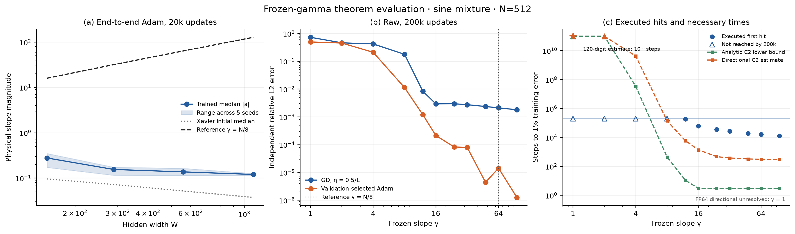
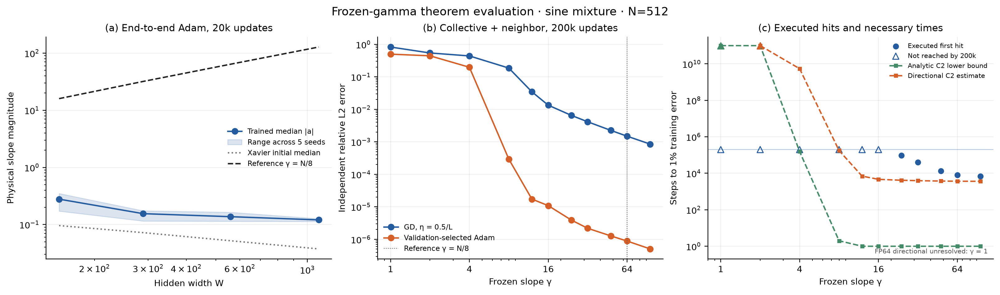
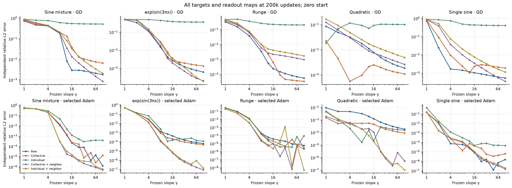
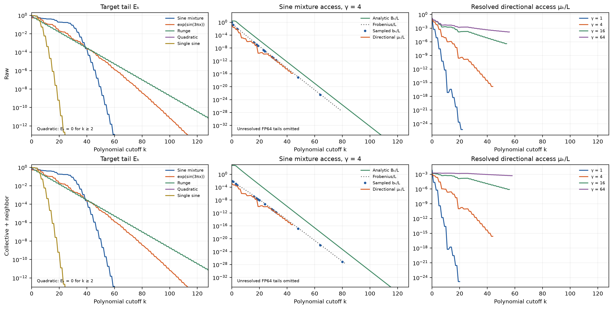
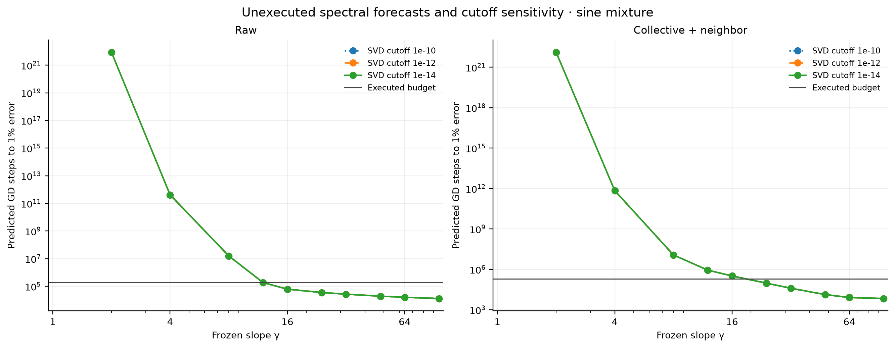
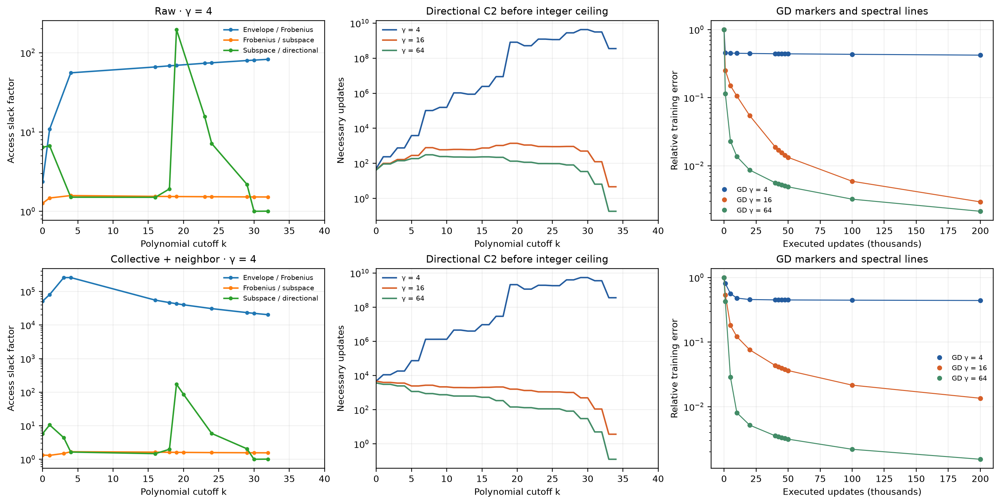
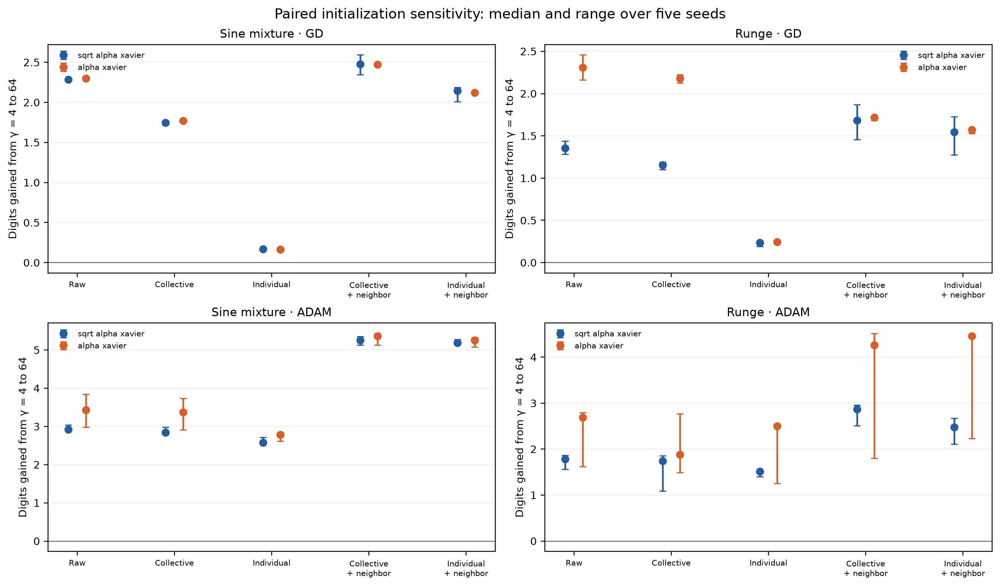
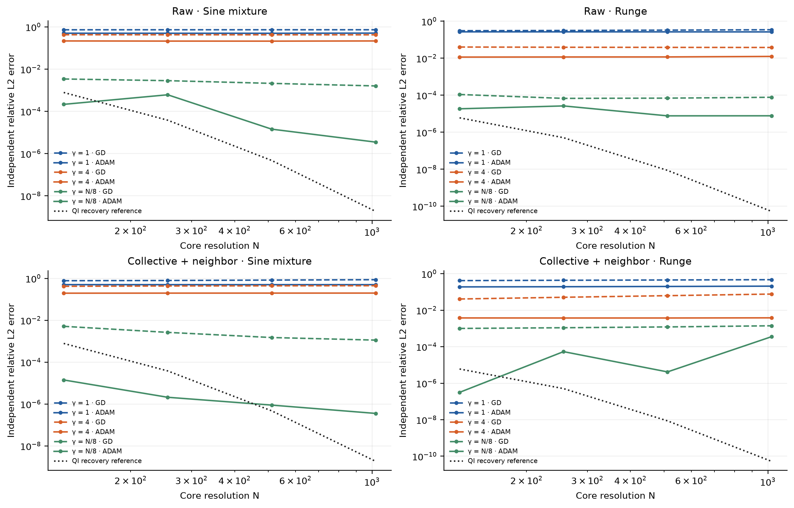
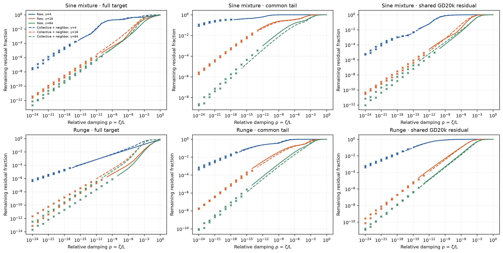

# Frozen-gamma readout dynamics: full theorem evaluation

This study tests whether bounded hidden slopes restrict access to the target corrections that a readout must learn. The completed primary raw-coordinate comparison already separates capacity from finite-budget optimization: at $\gamma=4$, a detached refit reaches approximately $8\times10^{-9}$ relative error, but 200,000 ordinary GD updates leave error $0.421$. Increasing the frozen slope to 64 reduces GD error to $0.00211$ and validation-selected Adam error to $1.43\times10^{-5}$. These are controlled comparisons within one fixed readout map. Coordinate choice and target both matter; the theorem does not predict monotone Adam performance or a universal necessary slope proportional to width.

The theorem produces large, parameter-free necessary times in the low-gamma regime. Its empirical tightness depends strongly on coordinates: at gamma 64 the directional bound is 52 times below the observed raw-coordinate hitting time, but only 2.2 times below the collective neighboring result. The analytic slope-only envelope is much weaker at large gamma. The [first-probe report](../REPORT.md) remains a separate record.

**Notation and normalization. Errors are relative empirical $L_2$ errors unless otherwise stated.**

| Symbol or term | Meaning |
|---|---|
| $N$, $H$, $W$ | Core resolution, halo radius $H=\lceil\sqrt N\rceil$, and hidden width $W=N+2H+1$. |
| $\gamma$, $\lambda$ | Common frozen physical slope and reporting scale $\lambda=2\gamma/N$. |
| $A$, $R$, $J=AR$ | Physical dictionary, readout-coordinate map, and trainable design; feature and target vectors include $1/\sqrt m$. |
| $P_k$, $Q_k$ | Empirical projection onto degree-at-most-$k$ polynomials and its full sample-space complement. |
| $E_k$, $\delta_k$ | Tail norms relative to the target and to the actual initial residual, respectively. They coincide at zero start. |
| $\mu_k$, $b_k$, $B_k$ | Directional access, polynomial-tail subspace access, and analytic access envelope. |
| $L$, $\chi$ | $L=\|J\|_2^2$ and GD step fraction $\chi=\eta L$; the primary value is $0.5$. |
| C2, C3 | Explicit discrete-GD necessary-time bound and the more spectrum-dependent effective-generator estimate. |
| QI reference | The existing quasi-interpolant construction at fixed $\lambda=0.25$; its measured recovery accuracy supplies a separate width-dependent tolerance. |
| Censored / unresolved | A tolerance was not reached within executed updates / a numerical quantity is not resolved by the stated arithmetic check. |

## Main comparisons

<figure>
  
  <figcaption>Primary sine-mixture comparison. Panel (a) is a separate all-parameter Adam baseline, with median hidden-slope magnitude and the range across five seeds. Panel (b) uses frozen geometry and zero readout, with independent evaluation after 200k updates; the vertical line marks the construction slope, and no least-squares curve enters this panel. Panel (c) compares executed first hits at 1% training error with numerical evaluations of C2, including its integer ceiling. Hollow triangles mark non-hits at the 200k budget. Bound markers at the upper plotting limit continue above the axis. The star at gamma 1 is the independent high-precision nominal-feature estimate; its FP64 counterpart is unresolved.</figcaption>
</figure>

<figure>
  
  <figcaption>The same predeclared comparison in collective neighboring coordinates. Panel (a) repeats the common independent baseline. Panels (b) and (c) change only the readout-coordinate map relative to the primary figure, retaining the same targets, geometry, gamma grid, initialization, and optimizer budgets. This companion was specified before examining the full results.</figcaption>
</figure>

The main figures use the sine mixture $\sin(2\pi x)+\tfrac12\sin(6\pi x)+\tfrac14\sin(10\pi x)$. The complete deterministic intervention also includes $\exp(\sin(3\pi x))$, $(1+25x^2)^{-1}$, $\sqrt5x^2$, and $\sqrt2\sin(2\pi x)$. The quadratic is a structural control: $E_k=0$ for $k\ge2$, although its optimizer dynamics can still depend on gamma and coordinates. Its measured roundoff tails are retained in the artifacts but cannot generate a time certificate.

**Table 1. Sine-mixture independent errors after 200k updates, with zero readout and identical grids. Changing gamma from 4 to 64 adds 2.30 GD digits and 4.17 selected-Adam digits in raw coordinates; collective neighboring gives 2.47 and 5.35 digits.**

| Readout map | Gamma | GD error | Selected Adam error |
|---|---:|---:|---:|
| Raw | 4 | $4.21305\times10^{-1}$ | $2.10859\times10^{-1}$ |
| Raw | 16 | $2.94278\times10^{-3}$ | $2.13231\times10^{-4}$ |
| Raw | 64 | $2.10905\times10^{-3}$ | $1.43188\times10^{-5}$ |
| Collective neighboring | 4 | $4.41384\times10^{-1}$ | $1.97772\times10^{-1}$ |
| Collective neighboring | 16 | $1.34385\times10^{-2}$ | $1.09003\times10^{-5}$ |
| Collective neighboring | 64 | $1.49358\times10^{-3}$ | $8.85452\times10^{-7}$ |

The raw gamma-4 detached refit has independent error $7.77\times10^{-9}$ at relative SVD cutoff $10^{-14}$, and $4.10\times10^{-6}$ even at cutoff $10^{-10}$. Thus the 1% target is attainable in these retained numerical models, whereas both trained methods remain far above it. The gap supports an optimization claim without requiring an exact-rank assertion. At gamma 64 the corresponding cutoff-$10^{-14}$ refit error is $2.32\times10^{-14}$. These refits are diagnostic and have no role in training or selection.

Adam is not monotone in gamma: raw sine-mixture error is $4.42\times10^{-6}$ at gamma 48, worsens to $1.43\times10^{-5}$ at 64, then improves to $1.26\times10^{-6}$ at 96. Target dependence is also material. Collective-coordinate quadratic GD is more accurate at gamma 4 ($5.57\times10^{-4}$) than at 16 ($2.51\times10^{-3}$) or 64 ($1.25\times10^{-3}$). The theorem bounds GD from below; it does not establish an Adam ordering or say that every target benefits from larger gamma.

<figure>
  
  <figcaption>All primary targets and maps at the fixed endpoint. Top: ordinary GD with $\eta=0.5/L$. Bottom: Adam selected using only the declared validation window. Zero-start cases are deterministic conditional on arithmetic, so no seed confidence intervals are attached to these curves. Differences across targets and maps are evidence against a universal optimizer ordering.</figcaption>
</figure>

## What the theorem predicts quantitatively

For a unit tail of the actual initial residual, directional access is $\mu_k^{(0)}=\|J^\top q_k^{(0)}\|^2$. At a target-relative tolerance $\epsilon_{\rm target}$, the theorem uses

$$
\epsilon_{\rm res}=\epsilon_{\rm target}\frac{\|y\|}{\|r_0\|},
\qquad
\delta_k=\frac{\|Q_kr_0\|}{\|r_0\|}.
$$

If initialization already meets the target tolerance, its hitting time is zero. Otherwise, C2 gives

$$
N_\epsilon\ge
\left\lceil
\frac{L}{-\log(1-\chi)}
\frac{\log(1/\epsilon_{\rm res})}{(1-\epsilon_{\rm res})^2}
\sup_k\frac{[\delta_k-\epsilon_{\rm res}]_+^2}{\mu_k^{(0)}}
\right\rceil.
$$

Replacing the denominator by $b_k$ or a valid $B_k$ gives the corresponding weaker statement. The explicit pole envelope, generic map-norm envelope, columnwise envelope, their minimum, and abbreviated exponential form are saved separately. The estimates use measured $L$ without fitted time-scale constants. C3 substitutes the denominator $q^\top[-\log(I-\eta JJ^\top)]q$ and is labeled as a retained-SVD estimate, rather than as the uniform slope theorem.

Specifically, with $\beta=\operatorname{asinh}(\pi/(2\gamma))$, the feature-tail envelope used here is

$$
U_k=\min\left\{\tanh\gamma,\;
\frac{4e^{-k\beta}}{e^\beta-1}
\left[\frac{1}{\sqrt{\gamma^2+\pi^2/4}}+\frac{1}{\pi(k+1)}\right]\right\},
\qquad
B_k=U_k^2\min\left\{W\|R\|_2^2,\;
\sum_\ell\left(\sum_{j=1}^{W}|R_{j\ell}|\right)^2\right\}.
$$

The inner sum excludes the constant bias row, whose polynomial tail vanishes. This exhibits the exponential cutoff dependence and the explicit coordinate-map cost that enter the numerical predictions.

### How the analytic and directional C2 values are computed

These are two evaluations of the same necessary-time inequality. **Analytic C2** replaces the actual access by a proved upper envelope $B_k$ computed from the slope and readout map. **Directional C2**, called the measured or estimated C2 in some discussion, uses the actual target-tail direction and numerically evaluates $\mu_k$. The word *estimate* describes floating-point evaluation, not a fitted convergence law or a different optimizer. Both plotted curves use measured target tails and curvature $L$; even the analytic curve is not a function of gamma alone. Neither curve is an interval-certified numerical lower bound.

The computations start from half empirical MSE, with $A$, $J$, and $y$ divided by $\sqrt m$. Set

$$
r_0=J\theta_0-y,\qquad
q_k=\frac{Q_kr_0}{\|Q_kr_0\|},\qquad
\delta_k=\frac{\|Q_kr_0\|}{\|r_0\|},\qquad
\mu_k=\|J^\top q_k\|^2.
$$

At zero readout and zero output bias, $r_0=-y$, $\delta_k=E_k$, and $\epsilon_{\rm res}=\epsilon_{\rm target}$. The sign of $q_k$ does not affect its access. A Householder QR of the sampled polynomial matrix supplies $Q_k$; the implementation retains the entire sample-space complement, rather than only the remaining columns of a truncated polynomial basis. A zero tail contributes no witness.

For either denominator $D_k\in\{\mu_k,B_k\}$, calculate

$$
F_\epsilon=\frac{L}{-\log(1-\chi)}
\frac{\log(1/\epsilon_{\rm res})}{(1-\epsilon_{\rm res})^2},
\qquad
T_k(D)=F_\epsilon\frac{[\delta_k-\epsilon_{\rm res}]_+^2}{D_k},
\qquad
\underline N(D)=\left\lceil\max_k T_k(D)\right\rceil.
$$

The cutoff is maximized separately for each curve. Computation uses logarithms to preserve very large values; the integer ceiling is applied after maximization. The access inequalities explain their ordering:

$$
\mu_k\le b_k=\|Q_kJ\|_2^2
\le s_k=\|Q_kJ\|_F^2\le B_k,
\qquad
\underline N(B)\le\underline N(\mu).
$$

For raw coordinates $R=I$, $B_k=WU_k^2$. For a diagonal map it is sufficient to use $U_k^2\sum_{j=1}^W s_j^2$. For the anchored neighboring map, the original columnwise envelope is $U_k^2(4\sum_{j=1}^{W-1}s_j^2+s_W^2)$, because it bounds a difference of two feature tails by the sum of their norms. This last triangle inequality loses cancellation between neighboring features. Each calculation also takes the minimum with the generic map-norm envelope displayed above.

**Table 2a. Worked C2 substitutions for the zero-start sine mixture at 1% training error. Entries before the last column are rounded; the saved full-precision values determine the ceiling. Different cutoffs can have equal tails because this target is odd.**

| Map, gamma | Denominator | Maximizing $k$ | $\delta_k$ | $F_\epsilon[\delta_k-0.01]^2$ | $D_k$ | Necessary updates |
|---|---|---:|---:|---:|---:|---:|
| Raw, 4 | Analytic $B_k$ | 30 | 0.0854927 | 8.72854 | $2.49671\times10^{-7}$ | 34,960,178 |
| Raw, 4 | Directional $\mu_k$ | 29 | 0.0854927 | 8.72854 | $2.03681\times10^{-9}$ | 4,285,392,774 |
| Raw, 64 | Analytic $B_k$ | 0 | 1 | 1,646.68 | 559 | 3 |
| Raw, 64 | Directional $\mu_k$ | 8 | 0.468442 | 353.108 | 1.14475 | 309 |
| Collective neighboring, 64 | Analytic $B_k$ | 0 | 1 | 136.635 | 10,906.3 | 1 |
| Collective neighboring, 64 | Directional $\mu_k$ | 0 | 1 | 136.635 | 0.0371162 | 3,682 |

For example, raw gamma 4 has $L=225.934055$, $\chi=0.5$, and $F_{0.01}=1531.55124$. Dividing the common numerator $8.72854222$ by the two access values gives $34,960,177.513$ and $4,285,392,773.719$ before taking ceilings. This difference comes entirely from the denominator and the separately selected cutoff, not a learning-rate adjustment.

### Where the necessary-time argument loses information

The time inequality first bounds the correction required in one direction by $[\delta_k-\epsilon]_+\|r_0\|$, then uses Cauchy–Schwarz to convert this to required parameter displacement. A sharp universal displacement inequality turns that requirement into time. Finally, discrete GD is related to the effective generator $K_\eta=-\log(I-\eta JJ^\top)$ using

$$
\eta JJ^\top\preceq K_\eta
\preceq\frac{-\log(1-\chi)}{\chi}\eta JJ^\top.
$$

Keeping the exact effective-generator denominator gives C3. For the same witness and before integer rounding, its improvement over directional C2 is at most $-\log(1-\chi)/\chi=1.38629$ when $\chi=0.5$. Therefore C3 alone cannot remove the observed factors of 31–52. The larger loss is the compression of a residual spread over many spectral modes into one tail/access ratio. Replacing $\mu_k$ by $B_k$ introduces a further, separate loss.

The theorem applies in both raw and neighboring coordinates by using the actual $J=AR$. Neighboring changes the curvature and which modes the initial residual excites; raw coordinates do not add stochastic noise. The time-conversion theorem holds for any fixed linear design and any sampled initial residual. The gamma envelope additionally assumes frozen tanh features with bounded slopes. A useful nonzero polynomial tail is a condition on the target or initial residual, not a universal property of every function class. None of these lower bounds establishes a positive asymptotic error floor: a finite non-hit means that the executed budget was insufficient.

The structural envelope and the general-residual time conversion answer different tightness questions. Exponential degree dependence and a sharp universal prefactor do not imply a close prediction for a particular multi-mode target. The relevant empirical slack compares actual first hits with necessary times, while capacity diagnostics establish whether a retained numerical model can attain the requested tolerance at all.

**Table 2. Necessary versus executed updates to 1% training error on the sine mixture. All values use the actual map and $\eta=0.5/L$; no constants are fit to trajectories. A dash means the ratio cannot be measured within the executed budget.**

| Map | Gamma | Analytic C2 | Directional C2 | Directional maximizing $k$ | First hit | Hit / directional bound |
|---|---:|---:|---:|---:|---:|---:|
| Raw | 4 | 34,960,178 | 4,285,392,774 | 29 | $>200,000$ | — |
| Raw | 16 | 3 | 1,395 | 19 | 61,792 | 44.3 |
| Raw | 64 | 3 | 309 | 8 | 16,013 | 51.8 |
| Collective neighboring | 4 | 156,090 | 5,453,767,597 | 29 | $>200,000$ | — |
| Collective neighboring | 16 | 1 | 4,669 | 0 | $>200,000$ | — |
| Collective neighboring | 64 | 1 | 3,682 | 0 | 8,105 | 2.20 |

At raw gamma 4, even the slope-only estimate exceeds the executed budget by a factor of 175. The high-precision directional calculation agrees with its FP64 value to about $10^{-12}$ relatively. This is a concrete quantitative obstruction, not simply the observation that a small lower bound lies below a long trajectory. At raw gamma 12 the observed hit is 186,057 and the directional bound is 5,993, a factor of 31.0. The raw gamma-16 and gamma-64 hitting times exactly reproduce the first probe.

The favorable neighboring-coordinate ratio at gamma 64 has an important qualification: its maximizing cutoff is $k=0$, so this close bound uses a broad initial-residual direction, not a high-degree obstruction. Conversely, the analytic envelope is essentially uninformative there. The experiment supports substantial low-gamma delays and occasional close directional bounds, but not uniform tightness of the slope-only theorem.

At gamma 4 and the common cutoff $k=29$, write $s_k=\|Q_kJ\|_F^2$. The factors $B_k/s_k$, $s_k/b_k$, and $b_k/\mu_k$ are respectively $79.6$, $1.52$, and $2.19$ in raw coordinates, versus $23,480$, $1.56$, and $2.05$ in collective neighboring coordinates. Most of the neighboring analytic-access slack comes from the envelope, rather than the Frobenius-to-operator relaxation. These are same-cutoff ratios; the separately optimized time bounds need not have the same maximizer.

<figure>
  
  <figcaption>Left: measured target tails, with the quadratic's exact termination enforced for certificates. Middle: the analytic envelope, Frobenius tail, sampled subspace access, and directional access at gamma 4, normalized by $L$. Right: directional access across selected gammas. FP64 measurements below the stated resolution monitors are omitted from the access curves; the monitors are heuristic numerical checks, not rigorous error enclosures.</figcaption>
</figure>

<figure>
  
  <figcaption>Unexecuted spectral forecasts for the sine mixture. The three relative singular-value cutoffs are $10^{-10}$, $10^{-12}$, and $10^{-14}$. Missing forecasts indicate a retained-model floor or the prediction cap, not proof of exact mathematical nonrepresentability. These horizons are deliberately separated from executed training.</figcaption>
</figure>

<figure>
  
  <figcaption>Sine-mixture tightness audit. Left: the three access-slack factors at gamma 4, using resolved sampled cutoffs. Middle: directional C2 as a function of cutoff before its integer ceiling. Right: actual GD checkpoint errors and retained-SVD predictions at the same executed steps; connected lines interpolate saved predictions and are not extra training measurements.</figcaption>
</figure>

## Protocol and evidence roles

The primary sweep fixes $N=512$, $W=559$, and endpoint training grids of $m=16N+1$ points. Validation uses 4,096 points with offset 0.37 of a grid cell; independent evaluation uses 32,768 midpoints. All optimizer computation and detached FP64 diagnostics use double precision. Centers, reference allowances, targets, and grids are fixed across the eleven slopes $[1,2,4,8,12,16,24,32,48,64,96]$.

Five predeclared maps are evaluated: raw, collective, individual, collective neighboring, and individual neighboring. The diagonal maps use $\sqrt{\alpha_j}$ and $\alpha_j$, respectively. Neighboring maps use cumulative hidden allowances, scale before differencing, and retain the final anchor; bias is a separate coordinate. The reference allowances use the existing corrected-halo geometry at $\lambda=0.25$ throughout the gamma intervention. They are not recomputed from each tested gamma. Exact implementations and roundtrip checks are in the [experiment source](../../../../experiments/expD36_frozen_gamma_probe/full_core.py).

Every primary GD run uses $\eta=0.5/L$ and 200k ordinary updates. Every Adam pilot uses one of five initial native learning rates, $[10^{-5},10^{-4},10^{-3},10^{-2},10^{-1}]$, crossed with additive epsilons $10^{-8}$ and $10^{-12}$. The rate is constant through 20k updates, follows a cosine decay to $10^{-3}$ of its initial value at 50k, and then stays at that terminal rate. Selection minimizes the median validation error at 40k, 42.5k, 45k, 47.5k, and 50k. Both the selected recipe and the common $10^{-3}$/$10^{-12}$ recipe continue to 200k with moments and counters intact. Boundary selections and every unsuccessful trial remain recorded; no rescue search is added.

QR, SVD, least-squares refits, ridge paths, and damped steps are detached diagnostics. None supplies an optimizer update, initializer, preconditioner, or stopping criterion. Training continues to the declared horizon despite small gradients or apparent plateaus. Traces store every update, and checkpoint states include optimizer moments, counters, first-hit records, and failure flags.

The main degree screen is $k=0,\ldots,256$, with a predeclared extension to 512 if a resolved maximizing witness reaches the boundary. Householder transforms preserve all complementary sample rows. An independent discrete-polynomial recurrence checks projection normalization. Subspace norms are sampled every 16 degrees and at the primary maximizing witness degrees. The exact singular-value evolution is checked against every saved GD evaluation, including nonzero starts and alternative step fractions. A second SVD driver supplies an independent factorization check.

## Initialization, width, and coordinate controls

The initialization matrix uses the sine mixture and Runge target, gammas 4, 16, and 64, all five maps, and five paired Gaussian seeds. The two physical readout families are

$$
c_{0,j}=\sqrt{\alpha_j}\sqrt{\frac{2}{W+1}}\xi_j
\quad\hbox{or}\quad
c_{0,j}=\alpha_j\sqrt{\frac{2}{W+1}}\xi_j,
\qquad \xi_j\sim N(0,1),
$$

with zero output bias. The same physical coefficients are encoded into each map and reused across gamma within a seed. GD and Adam both run 200k updates; Adam uses the corresponding zero-start selected recipe without seed-specific tuning. Initial functions vary with gamma even when physical coefficients match, so certificates are recomputed from the actual initial residual and both tolerance normalizations are saved.

<figure>
  
  <figcaption>Gamma-64 versus gamma-4 gains after 200k updates. Markers are medians and error bars are the complete ranges over five paired seeds, separately for each physical initialization family. These ranges measure initialization variation, rather than uncertainty in deterministic zero-start cases.</figcaption>
</figure>

The width matrix uses $N=128,256,512,1024$, sine mixture and Runge, raw and collective neighboring maps, and gammas $1,4,N/8$. The primary $N=512$ cases are reused. The separate end-to-end baseline in panel (a) trains all affine hidden parameters and readouts for 20k ordinary Adam updates at learning rate $10^{-3}$ and epsilon $10^{-8}$. Hidden slopes and readout weights start independently uniform on $[-\sqrt{6/(W+1)},\sqrt{6/(W+1)}]$; hidden and output biases start at zero. It uses five seeds at each width and is a new JAX baseline, not a reconstruction of missing D05 raw trajectories.

Across all 100 paired gamma-4/gamma-64 comparisons per optimizer, the higher gamma improves independent error. The gains range from 0.163 to 2.592 digits for GD and 1.087 to 5.433 for Adam. This establishes robustness over the declared starts, without claiming a population confidence interval from five seeds.

The end-to-end baseline's seed-median of median absolute slope decreases from 0.278 at width 153 to 0.121 at width 1089. At width 559 its five independent errors lie between 0.458927 and 0.459133, while maximum hidden slopes lie between 2.80 and 2.89. The median alone is not the slope cap in the theorem. Panel (a) supplies a separate observation about this training recipe; it cannot prove that every successful moving-geometry network needs the construction slope.

<figure>
  
  <figcaption>Width controls at the same 200k update budget. Dashed and solid colored lines distinguish GD and selected Adam. The separate dotted QI curve is measured construction recovery at the same halo and $\lambda=0.25$; it is neither a trained result nor an asserted optimal approximation floor. Fixed tolerances and the measured construction-dependent tolerances are evaluated separately in the data.</figcaption>
</figure>

The QI comparison calls the existing constructor with $K_c=160$ at 40 and 80 decimal digits, then compares ordinary and extended evaluation and checks a separate 129-point grid at 80 digits. The constructor samples derivatives and returns coefficients in FP64, so high-precision linear algebra alone does not eliminate its recovery floor. The width-dependent tolerance is the measured independent QI error; the precision discrepancies remain attached to each value.

**Table 3. Measured QI recovery errors, using 80-digit construction and extended evaluation. These define the separate width-dependent tolerance schedule.**

| Core resolution $N$ | Sine mixture | Runge |
|---:|---:|---:|
| 128 | $7.79065\times10^{-4}$ | $5.99278\times10^{-6}$ |
| 256 | $3.79850\times10^{-5}$ | $5.05241\times10^{-7}$ |
| 512 | $4.71119\times10^{-7}$ | $8.63063\times10^{-9}$ |
| 1024 | $1.82681\times10^{-9}$ | $5.23988\times10^{-11}$ |

The returned 40- and 80-digit constructions agree at all eight tested width/target pairs. Extended arithmetic has 63 mantissa bits on the Runpod host, and its discrepancy from the 80-digit evaluation on the check grid is at most $4.67\times10^{-19}$ in relative residual norm. This checks evaluation of the returned FP64 construction, not exact mathematical construction error.

For raw sine-mixture Adam, fixed gamma 4 leaves error near 0.21 at every tested width. With gamma $N/8$, its errors are $2.14\times10^{-4}$, $6.08\times10^{-4}$, $1.43\times10^{-5}$, and $3.48\times10^{-6}$. Collective neighboring Adam reaches $3.55\times10^{-7}$ at $N=1024$ with the scaled gamma, but still does not track the much smaller QI reference. None of the 48 GD width/map/gamma/target cases reaches its measured construction-dependent tolerance within 200k updates. Only 24 of those directional-access witnesses pass the FP64 resolution monitor; the other half remain unresolved. Width alone does not remove the tested fixed-gamma optimization barrier. The data also do not establish that gamma proportional to width is necessary: the target family, precision schedule, map, and training budget remain part of that question.

Additional controls use raw-coordinate GD with $\chi=0.25$ and $0.9$, uniform $\sqrt h$ hidden scaling with unscaled bias, an unscaled-bias collective map, and ordinary rather than corrected-halo hidden allowances. Coordinate controls use the common Adam recipe. Unit discrete polynomial targets at degrees 16, 32, 64, and 128 test degree accessibility independently of full-target tail amplitude. Their coefficients are continued from the training polynomial onto the independent evaluation grid.

The low-gamma barrier survives the rate changes: at gamma 4, sine-mixture GD error is 0.433 for $\chi=0.25$ and 0.404 for $\chi=0.9$, compared with 0.421 at the primary rate. All three coordinate controls also preserve the strong gamma-4/gamma-64 contrast. Raw degree-32 polynomial error changes from 1.000 at gamma 4 to 0.361 at 64; degree-128 error changes from 1.000 to 0.834. Thus greater access does not imply rapid recovery of every high-degree probe within 200k steps.

The [coordinate-control figure](figures/coordinate_controls.png) and [polynomial and learning-rate controls](figures/polynomial_and_rate_controls.png) retain those comparisons without changing the main-panel recipe.

For the unit-polynomial probes, the separate mean-access bound C6 gives 1% necessary times of $9.30\times10^6$, $2.71\times10^{12}$, and $1.69\times10^{23}$ for raw gamma 4 at degrees 16, 32, and 64. The degree-128 value is numerically unresolved. At gamma 64 the four values are 2,652, 12,969, 106,297, and 3,462,687. None of these polynomial probes reaches 1% within the executed horizon, so they test large absolute obstructions and access trends without measuring a close hit-to-bound ratio.

## Damping and coefficient budgets

Native and physical $\ell_1$, $\ell_2$, and $\ell_\infty$ norms are recorded at checkpoints and for the numerical refits. Dual-gradient norm requirements and selected ridge paths measure the cost of attaining lower errors; no arbitrary coefficient cap is imposed during training.

The one-step damping audit covers raw and collective neighboring maps, gammas 4, 16, and 64, and sine mixture and Runge. Every relative penalty $\rho=\zeta/L$ from $10^0$ to $10^{-24}$ starts independently from the same normalized probe. The three probes are the full target, a common polynomial tail selected from the raw gamma-4 primary witness, and the shared residual of raw gamma-16 GD at 20k. The analytic polynomial-tail lower curve is applied only to the tail probe. Identity damping in different coordinate maps is not the same physical regularizer.

<figure>
  
  <figcaption>Remaining residual fractions under independent fixed-damping steps. Solid and dashed lines distinguish the two maps. Crosses indicate that direct residual evaluation disagrees with stable SVD filtering beyond the stated numerical check, so those points are unresolved. No damped solution enters GD or Adam.</figcaption>
</figure>

The [damping lower-bound comparison](figures/damping_lower_bounds.png) separates measured recovery, directional Jensen bounds, and analytic tail bounds. The [coefficient-budget figure](figures/coefficient_budgets.png) reports coordinate-dependent ridge paths with the same numerical validity flags.

The audit evaluates 900 independent damped probes; 529 pass the direct-versus-filtered residual check and 371 are marked unresolved. For the common sine-mixture tail in raw coordinates at relative damping $10^{-8}$, the remaining fractions are 0.999138, 0.276838, and 0.041204 at gammas 4, 16, and 64. At gamma 4 the directional Jensen lower bound is 0.999099 and the analytic lower bound is 0.807426. This is a close one-step directional prediction for this damping choice; it is not a claim that a damped optimizer trajectory has been run.

The 300 full-target ridge points contain 162 resolved and 138 unresolved measurements. For the raw sine mixture at 1% tolerance, the measured native/physical $\ell_2$ coefficient requirements are approximately 1,355, 0.740, and 0.347 at gammas 4, 16, and 64. The cutoff-$10^{-14}$ near-floor refits use norms 21,304, 1.293, and 0.494, respectively. These are different error targets, so their ratio is not a tightness statistic. They show that low-gamma capacity can require much larger coefficients; no norm constraint was imposed on the trained models.

## Numerical interpretation and reproduction

The selected nominal-feature precision ladder reconstructs exact endpoint grids, discrete polynomials, target functions, and the reference map independently at 80 and 120 digits. It covers each primary target at raw gammas 1 and 4, plus sine mixture and Runge at gamma 4 in collective neighboring coordinates. Agreement across precisions is evidence about the nominal real model. It does not create an interval certificate, and the stored FP64 features and curvature remain separate approximations.

All twelve witness pairs agree to at least 64.8 decimal digits in the saved access values. The difficult raw gamma-1 sine-mixture witness has nominal $\mu_{31}=6.37031\times10^{-34}$; the FP64 value is about 285 times larger. The nominal calculation gives a directional necessary-time estimate of $1.0174\times10^{33}$ steps using FP64 curvature. This is a conditional lower bound for the nominal model, not an executed horizon or evidence of numerical attainability: the most permissive retained FP64 refit at gamma 1 still has independent error 0.197, above the 1% tolerance. At gamma 4 the nominal and FP64 directional-access values instead agree to about twelve relative digits, and retained refits establish attainability of 1%.

The raw gamma-4 retained spectral forecast is $4.15714\times10^{11}$ steps at each of the three cutoffs. It exceeds the directional C2 estimate by a factor of about 97, but remains an unexecuted model forecast. C3 tightens the raw gamma-4 estimate to $5.94\times10^9$ and the gamma-16/64 estimates to 1,934/427; it does not remove the broad-spectrum slack.

All 7,872 saved GD cell/checkpoint comparisons agree with their retained-SVD evolution within maximum absolute relative-error difference $7.25\times10^{-14}$. Independent SVD drivers agree on tested predictions within $6.67\times10^{-16}$. The final audit reconstructs first and sustained hits from every saved update, including the Adam pilot histories, and matches the kernel's first-hit records. It finds no analytic, resolved directional, or resolved C3 lower bound exceeding an executed hit across the 301 reached case/tolerance combinations. This consistency check does not establish interval-certified numerical bounds.

There are no nonfinite optimizer failures. Model selection remains limited by the declared grid: among 311 selected recipes, 134 use the upper learning-rate boundary and nine use the lower boundary. The selection window is at 40k–50k, not at the final 200k endpoint. Consequently, selected Adam means the predeclared validation choice, not the best possible 200k Adam recipe. All pilots and the common-recipe continuations are retained in [summary.json](summary.json).

## Coverage and resource accounting

**Table 4. Completed experiment coverage. Continuations preserve the pilot trajectory and are not counted as independent restarts.**

| Evidence | Completed scope |
|---|---|
| Dictionary screen | 82 dictionaries; all five targets; degree 0–256; all six tolerances and three singular-value cutoffs; no resolved boundary maximizer triggered extension to 512 |
| Primary zero-start intervention | 275 geometry/map/target cells; GD plus ten Adam pilots and selected/common continuations |
| Additional width cells | 36 cells outside the reused primary width; the same GD/Adam protocol |
| Paired initialization | 300 starts, each with GD and selected-recipe Adam: 600 trajectories |
| Learning-rate controls | 12 GD trajectories |
| Coordinate controls | 18 trajectories, GD and common-recipe Adam |
| Polynomial probes | 24 GD trajectories; C6 at six tolerances, with 132 of 144 access checks resolved |
| End-to-end baseline | 20 trajectories: four widths and five seeds |
| Precision/reference audits | Twelve 80/120-digit witness pairs; eight QI width/target pairs at 40/80 digits; 48 construction-tolerance GD comparisons |
| Damping/ridge | 900 independent one-step probes and 300 associated full-target ridge points |

In total, 4,095 prescribed optimizer trajectories completed. The summary contains 4,697 frozen-training views, including 622 selected/common continuation views, plus the 20 separate end-to-end baselines. All 17 focused implementation tests pass. The tests cover actual gradients, coordinate roundtrips, Adam/Optax agreement and resumption, scalar-rescaling units, projection identities, discrete certificates, the high-precision reconstruction, and the trace audit. No scientific effect size or tightness threshold was used as a software pass condition.

The full campaign, including the first probe and preflight, used **4,510 allocated GPU-seconds (1.253 GPU-hours)** and **1,250 CPU-only allocation seconds (20 minutes 50 seconds)**. Peak simultaneous use was two GPUs. The GPU cap was 7,200 seconds and the CPU cap 3,600 seconds. CPU accounting includes the 27-second failed diagnostic attempt; its failure was a NumPy-boolean JSON serialization error, corrected before the successful 244-second retry. Two superseded diagnostic jobs were canceled while pending and used zero allocation time. Local artifact analysis and plotting use the laptop CPU and are not Slurm allocations.

The completed experiment supports a paper claim that bounded gamma can impose a quantitatively large readout-optimization obstruction despite sufficient numerical capacity. It supports a separate empirical claim that gamma, coordinate map, target, and initialization jointly affect finite-budget trained precision. A universal tightness claim, an Adam theorem, a necessity theorem for gamma proportional to width, and exact low-gamma attainability beyond resolved numerical models remain unsupported.

## Reproducibility and storage

The immutable configuration is [full_config.yaml](../../../../experiments/expD36_frozen_gamma_probe/full_config.yaml). The [source README](../../../../experiments/expD36_frozen_gamma_probe/README.md) identifies the worker and audit entry points. The [resource forecast](validation/resource_forecast.json) records the H200 benchmark measurements, allowances, and 20% reserve before the full launch.

Full raw arrays, every-update traces, checkpoints, and source snapshots are archived under `/workspace/junmiaoh/experiments/precision-mlps/runs/frozen_gamma_full_v1` on Runpod. RAM scratch was used during execution because the original volume quota was exhausted. At the user's request, the old readout-race raw directory was retired after validating its curated evidence; [its updated report](../../expD34_readout_race/REPORT.md) records exactly what was retained. The ratios campaign was left intact, and no volume expansion was used.

The persistent archive's 18,250 numerical output files match the RAM source by checksum, totaling 30,380,128,613 bytes before source snapshots and report additions. Only filesystem permission metadata differs. [Final audit data](validation/final_audit.json), [Slurm accounting](validation/full_slurm_accounting.txt), and the [compact artifact manifest](provenance/compact_manifest.json) record completion, costs, and evidence hashes. Regeneration from the compact inputs succeeds without dense matrices or optimizer checkpoints and reproduces the numerical summary exactly.

Figures are generated only from saved numerical artifacts by [full_analyze.py](../../../../experiments/expD36_frozen_gamma_probe/full_analyze.py). The scientific argument and tables in this report are authored directly in Markdown.

Screen and GPU workers used source revision `ffb0837`; the precision/QI job used `3894488`; the completed residual and trace audit used `048aaa7`; figure analysis used `073015e`. The scheduler jobs were 683 (screen), 684–685 (GPU workers), 686 (precision/reference), and 690 (successful final audit). Jobs 681–682 were preflight and 689 was the failed serialization attempt. Configuration, package versions, dictionary hashes, selection records, validation checks, and source revisions remain in the saved artifacts. The H200 jobs used JAX 0.10.2 and FP64 computation.

From the worktree root, regenerate the summary and all PNG/PDF/SVG figures with:

```bash
JAX_PLATFORMS=cpu JAX_ENABLE_X64=true OPENBLAS_NUM_THREADS=2 \
python -m experiments.expD36_frozen_gamma_probe.full_analyze \
  --root results/checkpoint_D_optimizers/expD36_frozen_gamma_probe/full_sweep
```

The tracked compact inputs suffice for this command. Dense matrices, every-update traces, and full checkpoints are retained in the persistent Runpod archive; they are required for rerunning the numerical and per-update audits. The main figures also have [raw-coordinate PDF](figures/banner_raw.pdf), [raw-coordinate SVG](figures/banner_raw.svg), [neighboring-coordinate PDF](figures/banner_collective_neighbor.pdf), and [neighboring-coordinate SVG](figures/banner_collective_neighbor.svg) exports.
