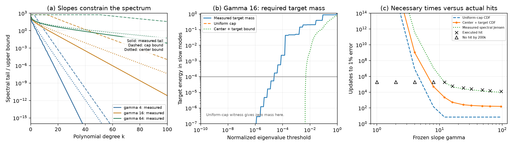
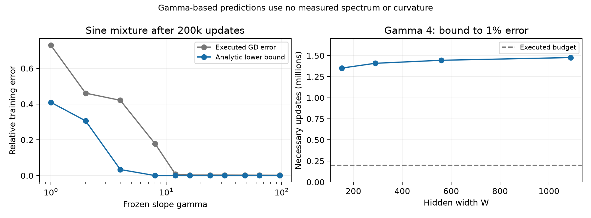
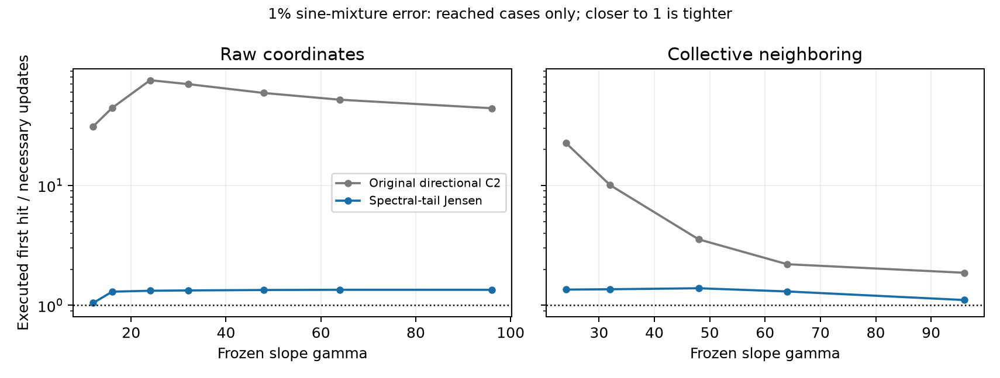

# Frozen-gamma readout dynamics: full theorem evaluation

This study tests a specific mechanism: bounded hidden slopes suppress the high-degree polynomial content of each feature, and a readout trained by GD can acquire that content only slowly. The primary raw-coordinate comparison separates capacity from finite-budget optimization: at $\gamma=4$, a detached refit reaches approximately $8\times10^{-9}$ relative error, but 200,000 ordinary GD updates leave error $0.421$. Increasing the frozen slope to 64 reduces GD error to $0.00211$ and validation-selected Adam error to $1.43\times10^{-5}$. Coordinate choice and target both matter; the theorem does not predict monotone Adam performance or a universal necessary slope proportional to width.

The structural theorem now makes the slope-to-spectrum implication explicit, including heterogeneous slopes: if only $q(G)$ neurons exceed slope $G$, the spectral tail after $k+1+q(G)$ directions is bounded by the polynomial approximation budget of the remaining features. A separate target condition forces energy into slow modes; the GD rate follows from ordinary spectral dynamics. [The proof and distribution corollaries](../../../../docs/slope_distribution_spectrum.md) cover maximum, mean, and quantile constraints without equating them. Mean or median slope alone cannot guarantee slow learning of every target.

The mechanism can be quantified without measuring the dictionary spectrum or even its largest curvature. A post-hoc geometric corollary below requires at least **1,444,090 updates** to reach 1% error at raw gamma 4, under the declared normalized-step rule. The same corollary gives bounds above a million updates across all four tested widths. This is a conservative explanation of an obstruction, not a close prediction of every learning time. The [first-probe report](../REPORT.md) remains a separate record.

The earlier CPU analysis identifies a remaining limitation: center-aware pole calculations nearly recover the measured directional access, but converting that access to slow-mode target energy still loses substantial accuracy. Combining multiple analytically bounded spectral thresholds gives median hit/bound slack **83.3** on 37 reached raw-map cases at 1%; replacing the analytic access by measured access gives the same median. On this same subset, measured spectral-tail Jensen gives **1.33**, and a finer measured spectral histogram gives **1.056**. The close spectral results do not establish a tight explicit gamma law. No additional campaign optimizer trajectories were run for those analyses.

A separate refinement accounts for adjacent-feature cancellation and raises the neighboring analytic gamma-4 bound from 156,090 to 17,841,791 updates. Across the broader 143 reached primary case/tolerance pairs, spectral-tail Jensen reduces median slack from 24.1 to 1.33. The different case sets are kept separate below.

The subsequent [capped-kernel campaign](refinements/capped_kernel/REPORT.md)
adds ordinary-GD experiments, periodic and finite-kernel verification, and an
interval-checked theorem for **every independently heterogeneous dictionary
under a maximum slope cap**. At the primary width, cap 8 forces at least
70,371 updates to reach 1% error; the common-slope dictionary actually reaches
it at update 15,798,313. Faster heterogeneous witnesses and the new
[three-panel evaluation](refinements/capped_kernel/capped_kernel_three_panel.png)
test the remaining gap. The declared factor-two sharpness objective remains
unproved. That follow-up has its own resource ledger and preserves this
original sweep and its polynomial-bound comparisons.

**Notation and normalization. Errors are relative empirical $L_2$ errors unless otherwise stated.**

| Symbol or term | Meaning |
|---|---|
| $N$, $H$, $W$ | Core resolution, halo radius $H=\lceil\sqrt N\rceil$, and hidden width $W=N+2H+1$. |
| $\gamma$, $\lambda$ | Common frozen physical slope and reporting scale $\lambda=2\gamma/N$. |
| $A$, $R$, $J=AR$ | Physical dictionary, readout-coordinate map, and trainable design; feature and target vectors include $1/\sqrt m$. |
| $P_k$, $Q_k$ | Empirical projection onto degree-at-most-$k$ polynomials and its full sample-space complement. |
| $E_k$, $\delta_k$ | Tail norms relative to the target and to the actual initial residual, respectively. They coincide at zero start. |
| $\mu_k$, $b_k$, $B_k$ | Directional access, polynomial-tail subspace access, and analytic access envelope. |
| $L$, $\chi$ | $L=\|J\|_2^2$ and GD step fraction $\chi=\eta L$; the primary value is $0.5$. |
| $L_*$ | Geometric lower bound on $L$ for the raw map; evaluated without the dictionary spectrum. |
| C2, C3 | Explicit discrete-GD necessary-time bound and the more spectrum-dependent effective-generator estimate. |
| $p_a$, $\bar\nu_a$ | Initial-residual energy fraction in modes with curvature at most $a$, and their energy-weighted mean curvature. |
| $q(G)$, $B_{k,G}$ | Number of hidden slopes with $\lvert\gamma_j\rvert>G$, and the squared polynomial-tail budget of the remaining columns. |
| $F(s)$ | Initial-residual energy fraction in eigenspaces with normalized curvature $\nu_i/L\le s$. |
| $D_k^{\rm shift}$ | Analytic degree-$k$ tail envelope for the center derivative of a tanh feature; used to preserve neighboring cancellation. |
| QI reference | The existing quasi-interpolant construction at fixed $\lambda=0.25$; its measured recovery accuracy supplies a separate width-dependent tolerance. |
| Censored / unresolved | A tolerance was not reached within executed updates / a numerical quantity is not resolved by the stated arithmetic check. |

## Main comparisons

<figure>
  
  <figcaption>Primary sine-mixture comparison. Panel (a) is a separate all-parameter Adam baseline, with median hidden-slope magnitude and the range across five seeds. Panel (b) uses frozen geometry and zero readout, with independent evaluation after 200k updates; the vertical line marks the construction slope, and no least-squares curve enters this panel. Panel (c) compares executed first hits at 1% training error with numerical evaluations of C2, including its integer ceiling. Hollow triangles mark non-hits at the 200k budget. Bound markers at the upper plotting limit continue above the axis. The star at gamma 1 is the independent high-precision nominal-feature estimate; its FP64 counterpart is unresolved.</figcaption>
</figure>

<figure>
  
  <figcaption>The same predeclared comparison in collective neighboring coordinates. Panel (a) repeats the common independent baseline. Panels (b) and (c) change only the readout-coordinate map relative to the primary figure, retaining the same targets, geometry, gamma grid, initialization, and optimizer budgets. This companion was specified before examining the full results.</figcaption>
</figure>

The main figures use the sine mixture $\sin(2\pi x)+\tfrac12\sin(6\pi x)+\tfrac14\sin(10\pi x)$. The complete deterministic intervention also includes $\exp(\sin(3\pi x))$, $(1+25x^2)^{-1}$, $\sqrt5x^2$, and $\sqrt2\sin(2\pi x)$. The quadratic is a structural control: $E_k=0$ for $k\ge2$, although its optimizer dynamics can still depend on gamma and coordinates. Its measured roundoff tails are retained in the artifacts but cannot generate a time certificate.

**Table 1. Sine-mixture independent errors after 200k updates, with zero readout and identical grids. Changing gamma from 4 to 64 adds 2.30 GD digits and 4.17 selected-Adam digits in raw coordinates; collective neighboring gives 2.47 and 5.35 digits.**

| Readout map | Gamma | GD error | Selected Adam error |
|---|---:|---:|---:|
| Raw | 4 | $4.21305\times10^{-1}$ | $2.10859\times10^{-1}$ |
| Raw | 16 | $2.94278\times10^{-3}$ | $2.13231\times10^{-4}$ |
| Raw | 64 | $2.10905\times10^{-3}$ | $1.43188\times10^{-5}$ |
| Collective neighboring | 4 | $4.41384\times10^{-1}$ | $1.97772\times10^{-1}$ |
| Collective neighboring | 16 | $1.34385\times10^{-2}$ | $1.09003\times10^{-5}$ |
| Collective neighboring | 64 | $1.49358\times10^{-3}$ | $8.85452\times10^{-7}$ |

The raw gamma-4 detached refit has independent error $7.77\times10^{-9}$ at relative SVD cutoff $10^{-14}$, and $4.10\times10^{-6}$ even at cutoff $10^{-10}$. Thus the 1% target is attainable in these retained numerical models, whereas both trained methods remain far above it. The gap supports an optimization claim without requiring an exact-rank assertion. At gamma 64 the corresponding cutoff-$10^{-14}$ refit error is $2.32\times10^{-14}$. These refits are diagnostic and have no role in training or selection.

Adam is not monotone in gamma: raw sine-mixture error is $4.42\times10^{-6}$ at gamma 48, worsens to $1.43\times10^{-5}$ at 64, then improves to $1.26\times10^{-6}$ at 96. Target dependence is also material. Collective-coordinate quadratic GD is more accurate at gamma 4 ($5.57\times10^{-4}$) than at 16 ($2.51\times10^{-3}$) or 64 ($1.25\times10^{-3}$). The theorem bounds GD from below; it does not establish an Adam ordering or say that every target benefits from larger gamma.

<figure>
  
  <figcaption>All primary targets and maps at the fixed endpoint. Top: ordinary GD with $\eta=0.5/L$. Bottom: Adam selected using only the declared validation window. Zero-start cases are deterministic conditional on arithmetic, so no seed confidence intervals are attached to these curves. Differences across targets and maps are evidence against a universal optimizer ordering.</figcaption>
</figure>

## What the theorem predicts quantitatively

For a unit tail of the actual initial residual, directional access is $\mu_k^{(0)}=\|J^\top q_k^{(0)}\|^2$. At a target-relative tolerance $\epsilon_{\rm target}$, the theorem uses

$$
\epsilon_{\rm res}=\epsilon_{\rm target}\frac{\|y\|}{\|r_0\|},
\qquad
\delta_k=\frac{\|Q_kr_0\|}{\|r_0\|}.
$$

If initialization already meets the target tolerance, its hitting time is zero. Otherwise, C2 gives

$$
N_\epsilon\ge
\left\lceil
\frac{L}{-\log(1-\chi)}
\frac{\log(1/\epsilon_{\rm res})}{(1-\epsilon_{\rm res})^2}
\sup_k\frac{[\delta_k-\epsilon_{\rm res}]_+^2}{\mu_k^{(0)}}
\right\rceil.
$$

Replacing the denominator by $b_k$ or a valid $B_k$ gives the corresponding weaker statement. The explicit pole envelope, generic map-norm envelope, columnwise envelope, their minimum, and abbreviated exponential form are saved separately. The estimates use measured $L$ without fitted time-scale constants. C3 substitutes the denominator $q^\top[-\log(I-\eta JJ^\top)]q$ and is labeled as a retained-SVD estimate, rather than as the uniform slope theorem.

Specifically, with $\beta=\operatorname{asinh}(\pi/(2\gamma))$, the feature-tail envelope used here is

$$
U_k=\min\left\{\tanh\gamma,\;
\frac{4e^{-k\beta}}{e^\beta-1}
\left[\frac{1}{\sqrt{\gamma^2+\pi^2/4}}+\frac{1}{\pi(k+1)}\right]\right\},
\qquad
B_k=U_k^2\min\left\{W\|R\|_2^2,\;
\sum_\ell\left(\sum_{j=1}^{W}|R_{j\ell}|\right)^2\right\}.
$$

The inner sum excludes the constant bias row, whose polynomial tail vanishes. This exhibits the exponential cutoff dependence and the explicit coordinate-map cost that enter the numerical predictions.

### How the analytic and directional C2 values are computed

These are two evaluations of the same necessary-time inequality. **Analytic C2** replaces the actual access by a proved upper envelope $B_k$ computed from the slope and readout map. **Directional C2**, called the measured or estimated C2 in some discussion, uses the actual target-tail direction and numerically evaluates $\mu_k$. The word *estimate* describes floating-point evaluation, not a fitted convergence law or a different optimizer. Both plotted curves use measured target tails and curvature $L$; even the analytic curve is not a function of gamma alone. Neither curve is an interval-certified numerical lower bound.

The computations start from half empirical MSE, with $A$, $J$, and $y$ divided by $\sqrt m$. Set

$$
r_0=J\theta_0-y,\qquad
q_k=\frac{Q_kr_0}{\|Q_kr_0\|},\qquad
\delta_k=\frac{\|Q_kr_0\|}{\|r_0\|},\qquad
\mu_k=\|J^\top q_k\|^2.
$$

At zero readout and zero output bias, $r_0=-y$, $\delta_k=E_k$, and $\epsilon_{\rm res}=\epsilon_{\rm target}$. The sign of $q_k$ does not affect its access. A Householder QR of the sampled polynomial matrix supplies $Q_k$; the implementation retains the entire sample-space complement, rather than only the remaining columns of a truncated polynomial basis. A zero tail contributes no witness.

For either denominator $D_k\in\{\mu_k,B_k\}$, calculate

$$
F_\epsilon=\frac{L}{-\log(1-\chi)}
\frac{\log(1/\epsilon_{\rm res})}{(1-\epsilon_{\rm res})^2},
\qquad
T_k(D)=F_\epsilon\frac{[\delta_k-\epsilon_{\rm res}]_+^2}{D_k},
\qquad
\underline N(D)=\left\lceil\max_k T_k(D)\right\rceil.
$$

The cutoff is maximized separately for each curve. Computation uses logarithms to preserve very large values; the integer ceiling is applied after maximization. The access inequalities explain their ordering:

$$
\mu_k\le b_k=\|Q_kJ\|_2^2
\le s_k=\|Q_kJ\|_F^2\le B_k,
\qquad
\underline N(B)\le\underline N(\mu).
$$

For raw coordinates $R=I$, $B_k=WU_k^2$. For a diagonal map it is sufficient to use $U_k^2\sum_{j=1}^W s_j^2$. For the anchored neighboring map, the original columnwise envelope is $U_k^2(4\sum_{j=1}^{W-1}s_j^2+s_W^2)$, because it bounds a difference of two feature tails by the sum of their norms. This last triangle inequality loses cancellation between neighboring features. Each calculation also takes the minimum with the generic map-norm envelope displayed above.

**Table 2a. Worked C2 substitutions for the zero-start sine mixture at 1% training error. Entries before the last column are rounded; the saved full-precision values determine the ceiling. Different cutoffs can have equal tails because this target is odd.**

| Map, gamma | Denominator | Maximizing $k$ | $\delta_k$ | $F_\epsilon[\delta_k-0.01]^2$ | $D_k$ | Necessary updates |
|---|---|---:|---:|---:|---:|---:|
| Raw, 4 | Analytic $B_k$ | 30 | 0.0854927 | 8.72854 | $2.49671\times10^{-7}$ | 34,960,178 |
| Raw, 4 | Directional $\mu_k$ | 29 | 0.0854927 | 8.72854 | $2.03681\times10^{-9}$ | 4,285,392,774 |
| Raw, 64 | Analytic $B_k$ | 0 | 1 | 1,646.68 | 559 | 3 |
| Raw, 64 | Directional $\mu_k$ | 8 | 0.468442 | 353.108 | 1.14475 | 309 |
| Collective neighboring, 64 | Analytic $B_k$ | 0 | 1 | 136.635 | 10,906.3 | 1 |
| Collective neighboring, 64 | Directional $\mu_k$ | 0 | 1 | 136.635 | 0.0371162 | 3,682 |

For example, raw gamma 4 has $L=225.934055$, $\chi=0.5$, and $F_{0.01}=1531.55124$. Dividing the common numerator $8.72854222$ by the two access values gives $34,960,177.513$ and $4,285,392,773.719$ before taking ceilings. This difference comes entirely from the denominator and the separately selected cutoff, not a learning-rate adjustment.

### Where the necessary-time argument loses information

The time inequality first bounds the correction required in one direction by $[\delta_k-\epsilon]_+\|r_0\|$, then uses Cauchy–Schwarz to convert this to required parameter displacement. A sharp universal displacement inequality turns that requirement into time. Finally, discrete GD is related to the effective generator $K_\eta=-\log(I-\eta JJ^\top)$ using

$$
\eta JJ^\top\preceq K_\eta
\preceq\frac{-\log(1-\chi)}{\chi}\eta JJ^\top.
$$

Keeping the exact effective-generator denominator gives C3. For the same witness and before integer rounding, its improvement over directional C2 is at most $-\log(1-\chi)/\chi=1.38629$ when $\chi=0.5$. Therefore C3 alone cannot remove the observed factors of 31–52. The larger loss is the compression of a residual spread over many spectral modes into one tail/access ratio. Replacing $\mu_k$ by $B_k$ introduces a further, separate loss.

The theorem applies in both raw and neighboring coordinates by using the actual $J=AR$. Neighboring changes the curvature and which modes the initial residual excites; raw coordinates do not add stochastic noise. The time-conversion theorem holds for any fixed linear design and any sampled initial residual. The gamma envelope additionally assumes frozen tanh features with bounded slopes. A useful nonzero polynomial tail is a condition on the target or initial residual, not a universal property of every function class. None of these lower bounds establishes a positive asymptotic error floor: a finite non-hit means that the executed budget was insufficient.

The structural envelope and the general-residual time conversion answer different tightness questions. Exponential degree dependence and a sharp universal prefactor do not imply a close prediction for a particular multi-mode target. The relevant empirical slack compares actual first hits with necessary times, while capacity diagnostics establish whether a retained numerical model can attain the requested tolerance at all.

**Table 2. Necessary versus executed updates to 1% training error on the sine mixture. All values use the actual map and $\eta=0.5/L$; no constants are fit to trajectories. A dash means the ratio cannot be measured within the executed budget.**

| Map | Gamma | Analytic C2 | Directional C2 | Directional maximizing $k$ | First hit | Hit / directional bound |
|---|---:|---:|---:|---:|---:|---:|
| Raw | 4 | 34,960,178 | 4,285,392,774 | 29 | $>200,000$ | — |
| Raw | 16 | 3 | 1,395 | 19 | 61,792 | 44.3 |
| Raw | 64 | 3 | 309 | 8 | 16,013 | 51.8 |
| Collective neighboring | 4 | 156,090 | 5,453,767,597 | 29 | $>200,000$ | — |
| Collective neighboring | 16 | 1 | 4,669 | 0 | $>200,000$ | — |
| Collective neighboring | 64 | 1 | 3,682 | 0 | 8,105 | 2.20 |

At raw gamma 4, even the slope-only estimate exceeds the executed budget by a factor of 175. The high-precision directional calculation agrees with its FP64 value to about $10^{-12}$ relatively. This is a concrete quantitative obstruction, not simply the observation that a small lower bound lies below a long trajectory. At raw gamma 12 the observed hit is 186,057 and the directional bound is 5,993, a factor of 31.0. The raw gamma-16 and gamma-64 hitting times exactly reproduce the first probe.

The favorable neighboring-coordinate ratio at gamma 64 has an important qualification: its maximizing cutoff is $k=0$, so this close bound uses a broad initial-residual direction, not a high-degree obstruction. Conversely, the analytic envelope is essentially uninformative there. The experiment supports substantial low-gamma delays and occasional close directional bounds, but not uniform tightness of the slope-only theorem.

At gamma 4 and the common cutoff $k=29$, write $s_k=\|Q_kJ\|_F^2$. The factors $B_k/s_k$, $s_k/b_k$, and $b_k/\mu_k$ are respectively $79.6$, $1.52$, and $2.19$ in raw coordinates, versus $23,480$, $1.56$, and $2.05$ in collective neighboring coordinates. Most of the neighboring analytic-access slack comes from the envelope, rather than the Frobenius-to-operator relaxation. These are same-cutoff ratios; the separately optimized time bounds need not have the same maximizer.

<figure>
  
  <figcaption>Left: measured target tails, with the quadratic's exact termination enforced for certificates. Middle: the analytic envelope, Frobenius tail, sampled subspace access, and directional access at gamma 4, normalized by $L$. Right: directional access across selected gammas. FP64 measurements below the stated resolution monitors are omitted from the access curves; the monitors are heuristic numerical checks, not rigorous error enclosures.</figcaption>
</figure>

<figure>
  
  <figcaption>Unexecuted spectral forecasts for the sine mixture. The three relative singular-value cutoffs are $10^{-10}$, $10^{-12}$, and $10^{-14}$. Missing forecasts indicate a retained-model floor or the prediction cap, not proof of exact mathematical nonrepresentability. These horizons are deliberately separated from executed training.</figcaption>
</figure>

<figure>
  
  <figcaption>Sine-mixture tightness audit. Left: the three access-slack factors at gamma 4, using resolved sampled cutoffs. Middle: directional C2 as a function of cutoff before its integer ceiling. Right: actual GD checkpoint errors and retained-SVD predictions at the same executed steps; connected lines interpolate saved predictions and are not extra training measurements.</figcaption>
</figure>

## Slope distributions, spectrum, and the remaining time-bound slack

This post-hoc extension addresses the structural part of the explanation: which spectral restrictions follow from slope constraints before observing a GD trajectory? The analysis uses the existing finite-interval center geometry, endpoint sampling, raw readout coordinates, zero start, and $\eta=0.5/L$. Its primary comparison contains 55 target/gamma combinations: 37 reached 1% training relative residual within 200k steps and 18 were censored. Eight additional heterogeneous dictionaries are CPU diagnostics without executed training. There is no new validation selection or generalization claim.

### Distribution theorem and the target condition

For $g_j=|\gamma_j|$, let $q(G)=\#\{j:g_j>G\}$ and let $e_k(g)$ be the existing uniform feature-tail envelope. With eigenvalues of $JJ^\top$ in decreasing order, the new formulation is

$$
\boxed{\sum_{i>k+1+q(G)}\nu_i
\le B_{k,G}:=\sum_{j:g_j\le G}e_k(g_j)^2
\le[W-q(G)]e_k(G)^2.}
$$

Approximate the capped columns by degree-$k$ polynomials and retain the exceptional columns exactly. This gives a rank-at-most-$k+1+q(G)$ approximation. Its squared Frobenius error bounds the remaining spectral energy. In particular, $\nu_{k+1+q(G)+s}\le B_{k,G}/s$ for positive integer $s$. This is the slope-to-spectrum theorem; the optimization recurrence is its downstream use.

A maximum cap gives $q(G)=0$ and the explicit factor $e^{-2k\operatorname{asinh}(\pi/(2G))}$. A mean absolute slope cap $\mu$ implies $q(G)\le W\mu/G$. An empirical upper-tail constraint supplies its own bound on $q(G)$. The mean-only analysis optimizes over 201 thresholds and degrees 0 through 128, retaining the safe budget $We_k(G)^2$ when the exact exception count is unknown. It is much weaker than knowing the actual slope vector: for the mean-four dictionaries, the resulting mode-40 eigenvalue upper bound is 4.026, while even the common-four dictionary has a measured mode-40 eigenvalue about $4.09\times10^{-17}$. A median cap permits up to half the neurons to remain exceptional. These different assumptions are not interchangeable.

For target-specific learning times, enlarge the polynomial space by the exceptional features, and let $\delta_{k,G}$ be the initial residual's relative distance from that space. The [angle argument](../../../../docs/slope_distribution_spectrum.md) bounds the target energy below any spectral threshold using $\delta_{k,G}$ and $B_{k,G}$. This condition becomes uninformative when the exceptional features already supply the target, which is necessary for a valid theorem. The statement accounts for $L$ under normalized-step GD; an additional geometric lower bound on $L$ gives a separate weaker evaluation requiring no measured curvature.

### Center-aware calculations and a bound using several spectral thresholds

The new calculation evaluates signed Chebyshev coefficients from 128 conjugate pole pairs through degree 512, using each actual center and slope. It includes explicit bounds for both omitted poles and omitted degrees. Polynomial projection precedes Frobenius or directional aggregation, retaining cancellations discarded by the uniform envelope. These predictions use geometry and targets, not measured kernel eigenvectors or GD histories. Values conditioned on the actual prescribed step remain distinct from values using only the elementary geometric curvature lower bound.

For spectral thresholds $s_j$, let $p_j\le F(s_j)$ be the nondecreasing lower envelope supplied by the target witnesses. Put $p_0=0$. Then

$$
\frac{\|r_t\|^2}{\|r_0\|^2}\ge
\sum_j(p_j-p_{j-1})(1-\chi s_j)^{2t}
+(1-p_M)(1-\chi)^{2t}.
$$

Each guaranteed increment of target energy is placed at its fastest allowed rate, and the remainder at rate one. This combines thresholds without counting target energy twice. The calculation uses 641 logarithmic thresholds from $10^{-32}$ through one. It improves on each constituent single-threshold error witness, but need not improve on C2 or measured spectral-tail Jensen. A bound of seven updates here is merely the universal $\chi=0.5$ contraction limit at 1% error; it does not establish a gamma effect.

<figure>
  
  <figcaption>Raw readout, primary geometry, zero initialization, and 1% relative residual. (a) Measured retained spectral tails after rank k+1 (solid), uniform-cap bounds (dashed), and center-aware bounds (dotted), for gammas 4, 16, and 64. Unresolved measured tails are omitted. (b) Gamma-16 sine-mixture target mass versus normalized spectral threshold. The horizontal line is the squared tolerance, 10⁻⁴; the uniform-cap witness gives zero mass throughout this view. (c) Necessary times conditioned on the prescribed step, with executed hits and budget-censored cases. Curves extending above the axis are predictions, not executed horizons. In particular, the nominal low-gamma predictions are not validated by unresolved FP64 eigenmodes.</figcaption>
</figure>

**Table 2d. Sine-mixture necessary updates at 1% error. Center-aware columns use the actual prescribed step, signed pole calculations, and analytic truncation remainders. The spectral column uses measured eigenpairs.**

| Gamma | Center-aware CDF bound | Center-aware C2 bound | Measured spectral Jensen | Executed first hit |
|---:|---:|---:|---:|---:|
| 4 | 1,104,905,471 | 4,285,388,970 | 399,435,514,539 | $>200,000$ |
| 8 | 52,198 | 141,766 | 12,107,139 | $>200,000$ |
| 12 | 2,206 | 5,993 | 177,804 | 186,057 |
| 16 | 529 | 1,395 | 47,549 | 61,792 |
| 64 | 168 | 309 | 11,885 | 16,013 |

On the common set of 37 reached cases, median hit/bound ratios are 751.9 for the uniform-cap CDF bound, 362.0 for the center-aware Frobenius version, 83.3 for its target-direction version, and 44.3 for center-aware C2. The center-aware and measured-access CDF bounds produce identical integer necessary times in 32 of 37 reached cases and the same median slack. The measured spectral-tail Jensen median is 1.331; applying the histogram conversion to measured spectral mass gives 1.056, with range 1.016–1.089. The latter uses more of the actual spectrum and is a diagnostic approaching exact spectral evolution, not a new slope-based prediction. Existing C2 bounds remain available; their maximum with another valid bound remains valid.

The missing accuracy is now localized. At gamma 4 and degree 30, the uniform squared-access envelope is $2.497\times10^{-7}$. The center-aware Frobenius envelope is $3.098902\times10^{-9}$ versus measured $3.098900\times10^{-9}$, and the center-aware target-direction value is $2.036814\times10^{-9}$ versus measured $2.036813\times10^{-9}$. Nevertheless, the actual spectral tail after rank 31 is only $6.946\times10^{-13}$: even accurate polynomial projection is not an optimal spectral subspace. At gamma 16, the measured target mass exceeds $10^{-4}$ by normalized threshold $2.512\times10^{-5}$ on the selected threshold grid, whereas the center-aware target witness only guarantees that much mass by $5.012\times10^{-3}$. Improving the tanh coefficient calculation alone cannot close this gap. A sharper structural theorem needs better control of the target's spectral subspace, beyond its polynomial-tail Rayleigh quotients.

### Heterogeneous slopes and limitations of summary statistics

The CPU dictionaries use $N=128$, $W=153$, and 2,049 training-grid points. They include common slope 4; slopes evenly spaced from 1 to 7; and one, four, or eight slope-64 exceptions. In the exception cases, the bulk slope is $(4W-64q)/(W-q)$ so the mean remains four. Four and eight exceptions are assigned both across the grid including halo centers and in a cluster near the origin. The one-exception case places it at the origin. These are deterministic interventions, not random draws from a slope distribution.

For four exceptions, the bulk slope is 2.38926. The spread and clustered assignments have the same mean, median, maximum, and histogram, but their degree-30 residual distances from polynomials plus exceptions differ. For the Runge target these distances are 0.00151263 and 0.00142428, respectively; the distribution/target CDF bounds are 23,662 and 12,883 updates. Neither hitting time was executed, and ordering two lower bounds does not order the actual times. This comparison demonstrates why a histogram-based spectral theorem still needs target and geometry information for a specific learning-time claim. Exceptional spans whose numerical rank was unresolved were excluded as witnesses, not treated as exactly deficient.

The final control contains one centered slope-64 feature and 152 inactive features. Its mean slope is 0.4183 and its median is zero, while its kernel is identical to the model containing just the active feature and bias. For a target equal to that active feature, the exact one-mode dynamics reaches 1% at seven updates; the distribution theorem correctly gives no extra target obstruction. For the sine-mixture and Runge targets, the exact remaining span obstruction instead proves unattainability at 1%. These exact zero modes follow from the explicit zero columns and target projection, not from an SVD cutoff. This control rules out a universal target-independent delay based only on a small mean or median.

### Verification, tightness, and arithmetic limits

The CPU analysis completes 3,724 resolved saved spectral-tail comparisons, 2,075 center-aware Frobenius comparisons, 2,285 directional comparisons, and 132,330 target-mass comparisons. All 37 executed first hits and 660 executed checkpoint errors respect the evaluated bounds. Heterogeneous checks add 107 spectral-tail, 252 mean-only eigenvalue, and 13,568 target-mass comparisons. These counts are deterministic correctness audits, not statistical replications or interval-certified proofs.

All 28 focused ExpD36 tests pass, including independent sampled-feature projection, signed-pole parity and remainder checks, direct GD versus the combined spectral-mass bound, and the inactive-neuron control. The complete CPU analysis takes about six seconds locally and launches no GPU job. Its [JSON evidence](refinements/slope_spectrum.json), [curve arrays](refinements/slope_spectrum_curves.npz), and [PDF figure](refinements/slope_spectrum.pdf) accompany the PNG above. Seven source/configuration hashes and 43 input-artifact hashes identify the calculation; commands are in the [experiment README](../../../../experiments/expD36_frozen_gamma_probe/README.md).

Increasing degree/pole count from 512/128 to 1024/256 changes the sine-mixture CDF bound at gamma 4 by one step out of approximately $1.1\times10^9$, leaves the gamma-16 and gamma-64 integer bounds unchanged, and changes gamma 96 from 159 to 161. Truncation error does not account for the observed orders-of-magnitude slack. Low-gamma predictions below the FP64 resolution monitor remain conditional nominal-feature calculations, not confirmations against the retained spectrum. The analysis preserves these flags and the analytic remainder separately from the heuristic roundoff monitor.

The earlier geometric C2 calculation is now also joined explicitly to saved first hits across all 73 width/target/gamma cases. Among 43 reached cases its lower bound is one update, with median slack 5,263 and range 530–186,057. Thirty cases are censored; 16 have a lower bound already above the 200k budget. The strong low-gamma obstruction and lack of tightness on reached cases are both retained in the scientific conclusion.

The [derivation](../../../../docs/slope_distribution_spectrum.md) therefore establishes a distribution-to-spectrum theorem and a valid route to target-specific rate bounds. The numerical evidence does not establish a tight explicit gamma law. It identifies the remaining task as controlling target-relevant spectral subspaces sharply for this geometry, rather than further refining a feature envelope that already reproduces measured directional access.

## A mechanism expressed through gamma, target complexity, and budget

The spectral-tail prediction identifies which target-relevant modes are slow after the dictionary has been specified. By itself, it does not identify why those modes are slow. The bounded-slope envelope supplies that additional explanation: every feature has very little polynomial content beyond a gamma-dependent degree, and gradient training cannot amplify that content arbitrarily quickly. The following corollaries make this statement explicit without using measured eigenvalues. They are consequences and extensions of the existing access argument, not claims of a new general spectral-bias phenomenon.

### Finite-time polynomial content of the learned correction

**Proposition.** Fix the hidden features and map, assume $r_0\ne0$, use $0<\eta L\le1$, and let $\Delta f_n=J(\theta_n-\theta_0)$. For every integer $n\ge0$,

$$
\frac{\|Q_k\Delta f_n\|}{\|r_0\|}
\le\sqrt{n\eta B_k(\gamma)},
\qquad
\frac{\|r_n\|}{\|r_0\|}
\ge\left[\delta_k-\sqrt{n\eta B_k(\gamma)}\right]_+.
$$

At zero start, $\Delta f_n$ is the learned function and $\delta_k=E_k$. The lower bound is a **finite-budget error obstruction**, not a positive asymptotic error floor. It can become zero at larger budgets.

**Proof.** In an orthonormal eigenbasis of $JJ^\top$, write the initial residual coefficients as $a_i$ and the curvatures as $\nu_i$. Summing GD's parameter updates gives

$$
\|\theta_n-\theta_0\|^2
=\sum_{\nu_i>0}a_i^2
\frac{[1-(1-\eta\nu_i)^n]^2}{\nu_i}
\le n\eta\|r_0\|^2.
$$

For $0\le x\le1$, $0\le1-(1-x)^n\le\min\{1,nx\}$ and $\min\{1,nx\}^2\le nx$, proving the inequality term by term. Multiplying parameter displacement by $\|Q_kJ\|\le\sqrt{B_k}$ proves the first assertion. The reverse triangle inequality applied to $Q_kr_n=Q_kr_0+Q_k\Delta f_n$ proves the second. The spectral expansion is used in the proof; no spectral quantities appear in the final bound's inputs.

The pole envelope makes the gamma dependence explicit. With $\beta_\gamma=\operatorname{asinh}(\pi/(2\gamma))$, put

$$
C_\gamma=\frac4{e^{\beta_\gamma}-1}
\left[\frac1{\sqrt{\gamma^2+\pi^2/4}}+\frac1\pi\right],
\qquad
S_R=\min\left\{W\|R\|^2,\sum_\ell\left(\sum_{j=1}^W|R_{j\ell}|\right)^2\right\}.
$$

The previously proved envelope satisfies $B_k\le S_RC_\gamma^2e^{-2\beta_\gamma k}$. Consequently

$$
\frac{\|Q_k\Delta f_n\|}{\|r_0\|}
\le C_\gamma\sqrt{n\eta S_R}\,e^{-\beta_\gamma k}.
$$

For $n\ge1$, choosing a degree at least
$[\log(C_\gamma\sqrt{n\eta S_R}/\tau)]_+/\beta_\gamma$
makes the learned correction's polynomial approximation error at most $\tau\|r_0\|$, within the available sample-space degrees. This degree bound grows only logarithmically with training budget for a fixed dictionary and learning rate. Its explicit slope dependence is through $1/\beta_\gamma$, which behaves like $2\gamma/\pi$ at large gamma. This controls how much fine polynomial structure can have been learned; it does not guarantee that every lower-degree component has already been learned.

The physical distinction from capacity is now visible. A coefficient solve may amplify tiny feature tails using large, cancelling readout coefficients. Starting from zero, ordinary GD has the parameter-displacement limitation proved above. Feature smoothness therefore limits finite-time access even when an accurate representation exists.

### Removing measured curvature, and why width need not remove the delay

The study uses $\eta=\chi/L$ with $\chi=0.5$. Replacing $L$ by a lower bound $L_*$ gives the conservative upper step size $\eta\le\chi/L_*$. Thus neither the finite-time bound nor the following weaker evaluation of C2 needs a measured curvature:

$$
N_\epsilon\ge
\left\lceil
\frac{L_*}{-\log(1-\chi)}
\frac{\log(1/\epsilon)}{(1-\epsilon)^2}
\max_k\frac{[E_k-\epsilon]_+^2}{B_k(\gamma)}
\right\rceil.
$$

The normalized-step rule is still an assumption about the optimizer. This corollary eliminates curvature measurements from the prediction, rather than changing how the original runs chose their step size.

For the **raw map with common positive slope**, a simple geometric lower bound suffices. Assume the sample grid is symmetric about zero, count $M_{\rm in}$ centers in $[-1/2,1/2]$, and let $\sigma_{\rm out}$ be the fraction of observations with $|x_i|\ge3/4$. Then

$$
L\ge L_*:=\max\{1,\ M_{\rm in}\sigma_{\rm out}^2\tanh^2(\gamma/4)\}.
$$

**Proof.** The normalized output-bias column implies $L\ge1$. For the second bound use $v_i=\operatorname{sign}(x_i)/\sqrt m$, whose norm is at most one. Pairing $x$ and $-x$ shows that each central hidden column has inner product at least $\sigma_{\rm out}\tanh(\gamma/4)$ with $v$: all pairs contribute nonnegatively, and the outer pairs have both tanh arguments at least $\gamma/4$ after pairing. Sum the squares over the $M_{\rm in}$ columns and use $\|J^\top v\|^2\le L\|v\|^2\le L$.

For raw coordinates $B_k=WU_k^2$. If $M_{\rm in}/W\ge\vartheta>0$ and $\sigma_{\rm out}$ stays bounded below as width increases, then

$$
\frac{B_k}{L}
\le\frac{U_k^2}{\vartheta\sigma_{\rm out}^2\tanh^2(\gamma/4)}.
$$

The explicit factor of width cancels. Thus increasing width alone does not eliminate this fixed-gamma obstruction under the normalized-step rule when the relevant target tail persists. This is a statement about a persistent lower bound, not a claim that actual learning times are identical across widths. It assumes the stated raw/common-slope geometry and does not automatically apply to arbitrary readout maps or moving hidden features.

For a unit degree-$d$ discrete orthogonal polynomial, with $d\ge1$ and zero start, $E_{d-1}=1$. One especially interpretable consequence is

$$
N_\epsilon\ge
\frac{\vartheta\sigma_{\rm out}^2\tanh^2(\gamma/4)}{C_\gamma^2}
\frac{\log(1/\epsilon)}{-\log(1-\chi)}
e^{2\beta_\gamma(d-1)}.
$$

This displays the exponential dependence on required target degree relative to slope, with all prefactors stated. It applies as a necessary time, including when the tolerance is unattainable. It is not a matching upper bound. For a general target, the measured target-only tail $E_k$ replaces the pure-polynomial value one. Target complexity, rather than width by itself, is what makes the slope obstruction relevant.

### The bridge from polynomial access to target-relevant slow modes

The access theorem also forces a spectral consequence without measuring the spectrum. The min-max principle gives $\nu_{k+2}(JJ^\top)\le B_k$ for eigenvalues in descending order, because $\operatorname{rank}(P_kJ)\le k+1$ and $\|J-P_kJ\|^2\le B_k$. Thus at most $k+1$ sample-space directions have curvature greater than $B_k$. Counting slow directions alone is insufficient when the target does not need them.

For a nonzero target-relevant tail, take $q=Q_kr_0/\|Q_kr_0\|$ and let $p_a$ be the initial-residual energy fraction in modes with curvature at most $a>0$. Since $q^\top JJ^\top q\le B_k$, its squared projection onto the faster modes is at most $B_k/a$. Define $s=\sqrt{\min\{B_k/a,1\}}$. Then

$$
\sqrt{p_a}\ge
G_k(a):=\left[\delta_k\sqrt{1-s^2}
-\sqrt{1-\delta_k^2}\,s\right]_+
\ge[\delta_k-\sqrt{B_k/a}]_+.
$$

**Proof.** Let $\alpha$ be the norm of the fast projection of $q$, so $\alpha\le s$. Decomposing $q$ and $r_0/\|r_0\|$ into slow and fast parts gives
$\delta_k\le\sqrt{1-\alpha^2}\sqrt{p_a}+\alpha\sqrt{1-p_a}$.
The resulting two-dimensional angle inequality is
$\arcsin\sqrt{p_a}\ge[\arcsin\delta_k-\arcsin s]_+$,
which gives $G_k(a)$. The simpler bound follows directly from
$\delta_k\le\sqrt{p_a}+s$; it is weaker than the angle bound.

For $0<a\le L$, this implies the trajectory bound

$$
\frac{\|r_n\|}{\|r_0\|}\ge G_k(a)(1-\eta a)^n,
$$

because every mode in this slow subspace decays no faster than $(1-\eta a)^n$. This supplies an explicit logical chain from small gamma to weak polynomial-tail access, to necessary target energy in slow modes, to delayed GD. It is a conservative bridge, not a replacement for the sharper measured spectral moments. No uniform improvement over C2 is claimed for this bridge. Establishing the mechanism and improving numerical tightness are distinct achievements; the bridge establishes the former.

### Quantitative check without spectral inputs

At $N=512$, the raw geometry has $W=559$, $M_{\rm in}=257$, and $\sigma_{\rm out}=2050/8193$. At gamma 4, $L_*=9.332589$, compared with measured $L=225.934055$, which is not used in this prediction. The sine-mixture cutoff $k=30$ has $E_{30}=0.0854927$ and $B_{30}=2.49671\times10^{-7}$. The finite-time proposition gives relative training error at least **0.0337698 after 200k updates**, while the C2 corollary requires at least **1,444,090 updates to 1%**. These are weaker than the original evaluations using measured $L$, but still exclude success within the executed budget using gamma, geometry counts, and the target alone. The independent refit result establishes that 1% accuracy is available in the retained numerical dictionary at this gamma.

**Table 2c. Raw gamma-4 sine-mixture obstruction across widths. Bounds use the elementary $L_*$, target-only polynomial tails, and the analytic feature envelope. The last column is executed training error at 200k updates.**

| Hidden width $W$ | Necessary updates to 1% | Error lower bound at 200k | Observed error at 200k |
|---:|---:|---:|---:|
| 153 | 1,351,670 | 0.0321160 | 0.424317 |
| 289 | 1,408,227 | 0.0331464 | 0.422404 |
| 559 | 1,444,090 | 0.0337698 | 0.421431 |
| 1,089 | 1,476,352 | 0.0343212 | 0.420736 |

<figure>
  
  <figcaption>Post-hoc mechanism check for zero-start raw GD with the sine mixture. Left: the analytic finite-time error bound and the executed error at 200k updates. A zero lower bound is uninformative, rather than a prediction of successful training. Right: the bound to 1% remains above a million updates across widths at gamma 4; the dashed line is the executed budget. Predictions are computed before the analysis reads saved optimizer evaluations.</figcaption>
</figure>

The analysis computes 73 raw-map target/width/gamma cases and checks 876 saved checkpoint errors; all 306 positive error lower bounds are respected. All 23 focused implementation tests pass. The calculation regenerates target tails from the declared target functions and grids; it does not load dictionary spectra, directional access, measured curvature, or optimizer data while computing predictions. Polynomial tails below $10^{-12}$ are excluded from finite-error claims as a roundoff precaution. The mathematical inequalities are exact under their assumptions; these numerical evaluations are not interval-certified enclosures. Existing low-gamma capacity qualifications still apply.

The limitations are informative. At gamma 8 the analytic error lower bound at 200k is already zero, while observed training error is 0.178245. The new corollary therefore explains a provable source of low-gamma delay, not the full residual or its eventual hitting time. Its width result concerns the declared normalized-step GD and common-slope raw geometry. It does not prove an Adam law, monotone improvement with gamma, or a universal requirement that gamma grow in proportion to width.

The phenomenon belongs to the broader literature on frequency-dependent learning and activation regularity; see [Rahaman et al., 2019](https://proceedings.mlr.press/v97/rahaman19a.html) and [Xu et al., Frequency Principle](https://arxiv.org/abs/1901.06523). Here polynomial approximation on the finite interval supplies an explicit slope- and coordinate-dependent access estimate. The contribution being evaluated is the quantitative finite-budget obstruction under the stated protocol, rather than the general observation that neural networks can learn fine-scale structure slowly.

## Post-hoc bound refinements

This analysis was proposed after inspecting the original sweep. It evaluates all 55 primary dictionaries, five targets, and six tolerances: 1,650 combinations, without changing training, targets, or the original figures. The two refinements address different inequalities. The first improves the analytic access envelope under the common-slope neighboring geometry. The second replaces the one-direction time conversion with a spectral energy argument and applies to any fixed linear least-squares problem.

### Refinement 1: preserve neighboring cancellation analytically

Write $\phi_c(x)=\tanh(\gamma(x-c))$, with the same $\gamma>0$ for adjacent centers. The original envelope treats $\phi_c-\phi_{c'}$ as two independent features. Instead, integrate its center derivative between $c$ and $c'$. If $D_k^{\rm shift}$ bounds the uniform error of a degree-$k$ polynomial approximation to $\partial_c\phi_c$, uniformly in the real center, then

$$
\|Q_k(\phi_c-\phi_{c'})\|_{\rm empirical}
\le V_k(c,c')
:=\min\{2U_k,\ |c-c'|D_k^{\rm shift}\}.
$$

The norm includes the sample-mean normalization. The inequality follows by integrating degree-$k$ approximants to the derivative; their integral is still a degree-$k$ polynomial. The real-axis derivative is bounded by $\gamma$, so $D_k^{\rm shift}\le\gamma$ is always available as a separate approximation bound.

Here is an explicit pole-series construction of a valid $D_k^{\rm shift}$. Define

$$
v_\ell=\frac{\pi(\ell+1/2)}{\gamma},\qquad
\rho_\ell=v_\ell+\sqrt{1+v_\ell^2},\qquad
d_\ell=
\begin{cases}
\sqrt{2v_\ell},&v_\ell\le1,\\
\sqrt{1+v_\ell^2},&v_\ell\ge1.
\end{cases}
$$

For a pole $z=c+iv_\ell$, let $s=\sqrt{z^2-1}$ and choose $w=z+s$ with $|w|>1$. The resolvent Chebyshev expansion gives the degree-$n\ge1$ coefficient of the feature as $-(4/\gamma)\sum_\ell\operatorname{Re}(w^{-n}/s)$. Its derivative satisfies

$$
\frac{d}{dc}\frac{w^{-n}}s
=-w^{-n}\left(\frac{n}{s^2}+\frac{z}{s^3}\right).
$$

Uniformly in real $c$, $|w|\ge\rho_\ell$, $|s|\ge d_\ell$, and $|z|^2\le |s|^2+1$. The bound on $|s|$ follows by minimizing
$|s|^4=(c^2+v_\ell^2-1)^2+4v_\ell^2$ over $c^2\ge0$.
Taking absolute values and summing degrees $n>k$ therefore yields

$$
\mathcal D_k=
\frac4\gamma\sum_{\ell=0}^{\infty}
\frac{\rho_\ell^{-k}}{\rho_\ell-1}
\left[
\frac{k+1+(\rho_\ell-1)^{-1}}{d_\ell^2}
+\frac{\sqrt{d_\ell^2+1}}{d_\ell^3}
\right].
$$

This absolutely convergent tail bounds a uniform polynomial approximation error for the center derivative. The calculation retains poles $0\le\ell<M$ and adds the following upper bound on the omitted positive terms, with $v_M\ge1$:

$$
R_{k,M}^{\rm shift}=
\frac{32\gamma^{k+2}(k+2+\sqrt2)}{\pi^{k+3}}
\left[(2M+1)^{-k-3}
+\frac{(2M+1)^{-k-2}}{2(k+2)}\right].
$$

Indeed, for $\ell\ge M$, use $d_\ell\ge v_\ell$, $\rho_\ell\ge2v_\ell$, and $\rho_\ell-1\ge v_\ell$. Each summand is at most $32\gamma^{k+2}(k+2+\sqrt2)\pi^{-k-3}(2\ell+1)^{-k-3}$; its decreasing-series tail is bounded by its first term plus its integral. We use $M=128$ and set $D_k^{\rm shift}$ to the minimum of $\gamma$ and this finite sum plus remainder. Truncating the positive series without its remainder would not give an upper bound.

For an anchored neighboring map, the resulting envelope is

$$
B_k^{\rm adjacent}
=\sum_{j=1}^{W-1}s_j^2V_k(c_j,c_{j+1})^2+s_W^2U_k^2,
\qquad
\widetilde B_k=\min\{B_k,B_k^{\rm adjacent},L\}.
$$

The final anchor remains explicit. The cap $b_k\le L$ holds because an orthogonal projection cannot increase operator norm. For other maps this refinement uses only $\widetilde B_k=\min\{B_k,L\}$. Substituting $\widetilde B_k$ in C2 is valid and can never weaken the original analytic result. This is a geometry-aware strengthening of the tanh access theorem; it does not require measured target-direction access or the GD trajectory.

For the collective neighboring sine mixture at gamma 4, the optimized analytic C2 bound rises from **156,090 to 17,841,791** updates, a factor of **114.3**, with maximizing $k=30$. At gamma 8 it rises from 2 to 69. The gamma-64 result only rises from 1 to 7, whereas directional C2 is 3,682: accounting for cancellation improves a real source of slack but does not make the analytic envelope close at large gamma. Raw gamma 4 remains 34,960,178, and raw gamma 64 rises from 3 to 7 solely because of the $L$ cap.

### Refinement 2: a spectral-tail Jensen necessary-time theorem

Let $K=JJ^\top$ have eigenvalues $\nu_i\ge0$ and orthonormal eigenvectors $u_i$, and set $a_i=\langle u_i,r_0\rangle$. For each cutoff $a$, define

$$
S_a=\{i:\nu_i\le a\},\qquad
p_a=\frac{\sum_{i\in S_a}a_i^2}{\|r_0\|^2},\qquad
\bar\nu_a=\frac{\sum_{i\in S_a}a_i^2\nu_i}{\sum_{i\in S_a}a_i^2}.
$$

**Proposition.** For $0<\eta L<1$ and $0<\epsilon<1$, whenever $p_a>\epsilon^2$ and $\bar\nu_a>0$,

$$
N_\epsilon\ge
\left\lceil\frac{\log(\sqrt{p_a}/\epsilon)}
{-\log(1-\eta\bar\nu_a)}\right\rceil.
$$

Take the maximum over cutoffs; a set with $p_a>\epsilon^2$ and $\bar\nu_a=0$ makes the tolerance unattainable. Any subset of exact eigenpairs is also a valid witness, so omitted eigenpairs can be discarded without assigning them to a nullspace.

**Proof.** The exact GD recurrence gives

$$
\frac{\|r_n\|^2}{\|r_0\|^2}
\ge\sum_{i\in S_a}\frac{a_i^2}{\|r_0\|^2}(1-\eta\nu_i)^{2n}
\ge p_a(1-\eta\bar\nu_a)^{2n}.
$$

For every integer $n\ge1$, the function $\nu\mapsto(1-\eta\nu)^{2n}$ is convex on $[0,L]$. The second inequality is Jensen's inequality with weights $a_i^2/(p_a\|r_0\|^2)$; see [Boyd and Vandenberghe, convex-functions slides, 3.14](https://web.stanford.edu/~boyd/cvxbook/bv_cvxslides.pdf) for the general inequality. Rearranging the condition that the final expression be at most $\epsilon^2$ proves the proposition. At $n=0$ its lower bound also holds directly. This proof uses neither a parameter-displacement inequality nor the C2 effective-generator relaxation.

The computation sorts retained curvatures $\nu_i=\sigma_i^2$ from smallest to largest, cumulatively sums the target energy and its curvature-weighted moment, evaluates the displayed expression at every prefix, and takes the largest value. The normalized loadings are computed from the initial residual; the current evaluation uses $r_0=-y$. No executed hitting time selects a prefix or fits a constant. The original C2 and this bound are not generally ordered, so their maximum is a valid combined certificate; the spectral bound happens to be stronger in every reached case here.

For raw gamma 64, the maximizing prefix has $p_a=0.000334541752$, $\bar\nu_a=0.0251838124$, and $L=247.8502934$. With $\eta=0.5/L$ and $\epsilon=0.01$, substitution gives **11,885 necessary updates**, versus **309** from directional C2 and **16,013 executed updates**. The small amount of energy just above the requested error tolerance is slow enough to control the hitting time; a full-residual average or a single polynomial-tail ratio can hide that contribution.

**Table 2b. Post-hoc sine-mixture necessary updates at 1% training error. Spectral-tail values use the retained cutoff-$10^{-14}$ spectrum. Censored rows remain unexecuted predictions beyond 200k updates, with no observed tightness ratio.**

| Map | Gamma | Original directional C2 | Spectral-tail Jensen | Executed first hit | Hit / new bound |
|---|---:|---:|---:|---:|---:|
| Raw | 4 | 4,285,392,774 | 399,435,514,539 | $>200,000$ | — |
| Raw | 12 | 5,993 | 177,804 | 186,057 | 1.046 |
| Raw | 16 | 1,395 | 47,549 | 61,792 | 1.300 |
| Raw | 64 | 309 | 11,885 | 16,013 | 1.347 |
| Collective neighboring | 4 | 5,453,767,597 | 584,969,611,416 | $>200,000$ | — |
| Collective neighboring | 16 | 4,669 | 242,617 | $>200,000$ | — |
| Collective neighboring | 64 | 3,682 | 6,211 | 8,105 | 1.305 |

<figure>
  
  <figcaption>Post-hoc comparison at 1% training error. Every plotted hit was executed within 200k updates. A ratio of one would mean equality after integer rounding; the stronger spectral-tail bound gives ratios between 1.046 and 1.388 for these two maps. Missing low-gamma cases are budget-censored, not omitted successful runs. The original three-panel figures retain their pre-refinement C2 curves.</figcaption>
</figure>

Across all **143 reached primary case/tolerance pairs**, the new bound improves every directional C2 value. The median hit/bound ratio decreases from **24.118 to 1.331**, and the new ratios range from **1.042 to 1.458**. These are deterministic descriptive statistics over reached cases, not confidence intervals or evidence that the same ratios hold for the 1,507 censored combinations. Tightness was not a software acceptance threshold.

The complete analysis checks **985 resolved subspace-access measurements**, **12,949 resolved directional-access measurements**, and **3,614 finite spectral-forecast comparisons** without a lower-bound violation. No refined bound exceeds any of the 143 executed hits. The spectral bound changes by at most $9.66\times10^{-12}$ relatively across the three retained singular-value cutoffs in reached cases. This checks truncation sensitivity, not eigenpair error or real-arithmetic rigor. Spectral energy outside the retained modes is deliberately omitted; an SVD truncation residual is never declared an exact zero mode. The low-gamma resolution limitations elsewhere in this report still apply. All **20 focused implementation tests** pass, including the three added refinement tests for independent polynomial projection, direct GD, a single eigenmode, exact null modes, and omitted spectral energy.

### Recommended theorem changes and remaining limits

Keep the original uniform bounded-slope theorem as the explanation of an optimization obstruction, with its exact assumptions and exponential degree dependence. Its sharp universal time prefactor cannot simply be increased: a one-eigenvalue residual at the largest curvature saturates the discrete formula. Uniform worst-case sharpness is compatible with considerable slack on a particular dictionary and target.

Add the neighboring derivative envelope as a corollary for common-slope translated features, and always take the minimum access bound with $L$. This improves the theorem itself using extra geometric structure already present in the experiment. It preserves the original result for arbitrary heterogeneous slopes, where the new common-slope argument does not apply.

Add the spectral-tail proposition as a separate target-dependent dynamics theorem and report its evaluation alongside C2. It gives a close numerical lower bound here while keeping the extra information explicit. It is a lower bound from a spectral moment, not a new optimizer and not an exact spectral hitting-time calculation. A full retained spectral evolution still gives a tighter model-specific forecast.

For a closer prediction expressed through gamma, an additional theorem would need to control target energy in a slow spectral subspace, for example $p_a\ge p_*>\epsilon^2$ and $\bar\nu_a\le\Lambda(\gamma)$ with $\eta\Lambda(\gamma)<1$. The proposition would then imply

$$
N_\epsilon\ge
\left\lceil\frac{\log(\sqrt{p_*}/\epsilon)}
{-\log(1-\eta\Lambda(\gamma))}\right\rceil.
$$

The mechanism corollary above now supplies conservative spectral-mass control directly from the polynomial-tail envelope. What remains open is control sharp enough to reproduce the measured spectral-time predictions for a specified geometry and target family. Width and a slope cap alone allow repeated features, nearly constant shifted features, and different target alignments, so they cannot identify one tight convergence time across that whole class. The analytic gamma argument explains an obstruction; the measured spectral theorem quantifies the fuller target-dependent conditioning. Their scientific roles should remain separate.

## Protocol and evidence roles

The primary sweep fixes $N=512$, $W=559$, and endpoint training grids of $m=16N+1$ points. Validation uses 4,096 points with offset 0.37 of a grid cell; independent evaluation uses 32,768 midpoints. All optimizer computation and detached FP64 diagnostics use double precision. Centers, reference allowances, targets, and grids are fixed across the eleven slopes $[1,2,4,8,12,16,24,32,48,64,96]$.

Five predeclared maps are evaluated: raw, collective, individual, collective neighboring, and individual neighboring. The diagonal maps use $\sqrt{\alpha_j}$ and $\alpha_j$, respectively. Neighboring maps use cumulative hidden allowances, scale before differencing, and retain the final anchor; bias is a separate coordinate. The reference allowances use the existing corrected-halo geometry at $\lambda=0.25$ throughout the gamma intervention. They are not recomputed from each tested gamma. Exact implementations and roundtrip checks are in the [experiment source](../../../../experiments/expD36_frozen_gamma_probe/full_core.py).

Every primary GD run uses $\eta=0.5/L$ and 200k ordinary updates. Every Adam pilot uses one of five initial native learning rates, $[10^{-5},10^{-4},10^{-3},10^{-2},10^{-1}]$, crossed with additive epsilons $10^{-8}$ and $10^{-12}$. The rate is constant through 20k updates, follows a cosine decay to $10^{-3}$ of its initial value at 50k, and then stays at that terminal rate. Selection minimizes the median validation error at 40k, 42.5k, 45k, 47.5k, and 50k. Both the selected recipe and the common $10^{-3}$/$10^{-12}$ recipe continue to 200k with moments and counters intact. Boundary selections and every unsuccessful trial remain recorded; no rescue search is added.

QR, SVD, least-squares refits, ridge paths, and damped steps are detached diagnostics. None supplies an optimizer update, initializer, preconditioner, or stopping criterion. Training continues to the declared horizon despite small gradients or apparent plateaus. Traces store every update, and checkpoint states include optimizer moments, counters, first-hit records, and failure flags.

The main degree screen is $k=0,\ldots,256$, with a predeclared extension to 512 if a resolved maximizing witness reaches the boundary. Householder transforms preserve all complementary sample rows. An independent discrete-polynomial recurrence checks projection normalization. Subspace norms are sampled every 16 degrees and at the primary maximizing witness degrees. The exact singular-value evolution is checked against every saved GD evaluation, including nonzero starts and alternative step fractions. A second SVD driver supplies an independent factorization check.

## Initialization, width, and coordinate controls

The initialization matrix uses the sine mixture and Runge target, gammas 4, 16, and 64, all five maps, and five paired Gaussian seeds. The two physical readout families are

$$
c_{0,j}=\sqrt{\alpha_j}\sqrt{\frac{2}{W+1}}\xi_j
\quad\hbox{or}\quad
c_{0,j}=\alpha_j\sqrt{\frac{2}{W+1}}\xi_j,
\qquad \xi_j\sim N(0,1),
$$

with zero output bias. The same physical coefficients are encoded into each map and reused across gamma within a seed. GD and Adam both run 200k updates; Adam uses the corresponding zero-start selected recipe without seed-specific tuning. Initial functions vary with gamma even when physical coefficients match, so certificates are recomputed from the actual initial residual and both tolerance normalizations are saved.

<figure>
  
  <figcaption>Gamma-64 versus gamma-4 gains after 200k updates. Markers are medians and error bars are the complete ranges over five paired seeds, separately for each physical initialization family. These ranges measure initialization variation, rather than uncertainty in deterministic zero-start cases.</figcaption>
</figure>

The width matrix uses $N=128,256,512,1024$, sine mixture and Runge, raw and collective neighboring maps, and gammas $1,4,N/8$. The primary $N=512$ cases are reused. The separate end-to-end baseline in panel (a) trains all affine hidden parameters and readouts for 20k ordinary Adam updates at learning rate $10^{-3}$ and epsilon $10^{-8}$. Hidden slopes and readout weights start independently uniform on $[-\sqrt{6/(W+1)},\sqrt{6/(W+1)}]$; hidden and output biases start at zero. It uses five seeds at each width and is a new JAX baseline, not a reconstruction of missing D05 raw trajectories.

Across all 100 paired gamma-4/gamma-64 comparisons per optimizer, the higher gamma improves independent error. The gains range from 0.163 to 2.592 digits for GD and 1.087 to 5.433 for Adam. This establishes robustness over the declared starts, without claiming a population confidence interval from five seeds.

The end-to-end baseline's seed-median of median absolute slope decreases from 0.278 at width 153 to 0.121 at width 1089. At width 559 its five independent errors lie between 0.458927 and 0.459133, while maximum hidden slopes lie between 2.80 and 2.89. The median alone is not the slope cap in the theorem. Panel (a) supplies a separate observation about this training recipe; it cannot prove that every successful moving-geometry network needs the construction slope.

<figure>
  
  <figcaption>Width controls at the same 200k update budget. Dashed and solid colored lines distinguish GD and selected Adam. The separate dotted QI curve is measured construction recovery at the same halo and $\lambda=0.25$; it is neither a trained result nor an asserted optimal approximation floor. Fixed tolerances and the measured construction-dependent tolerances are evaluated separately in the data.</figcaption>
</figure>

The QI comparison calls the existing constructor with $K_c=160$ at 40 and 80 decimal digits, then compares ordinary and extended evaluation and checks a separate 129-point grid at 80 digits. The constructor samples derivatives and returns coefficients in FP64, so high-precision linear algebra alone does not eliminate its recovery floor. The width-dependent tolerance is the measured independent QI error; the precision discrepancies remain attached to each value.

**Table 3. Measured QI recovery errors, using 80-digit construction and extended evaluation. These define the separate width-dependent tolerance schedule.**

| Core resolution $N$ | Sine mixture | Runge |
|---:|---:|---:|
| 128 | $7.79065\times10^{-4}$ | $5.99278\times10^{-6}$ |
| 256 | $3.79850\times10^{-5}$ | $5.05241\times10^{-7}$ |
| 512 | $4.71119\times10^{-7}$ | $8.63063\times10^{-9}$ |
| 1024 | $1.82681\times10^{-9}$ | $5.23988\times10^{-11}$ |

The returned 40- and 80-digit constructions agree at all eight tested width/target pairs. Extended arithmetic has 63 mantissa bits on the Runpod host, and its discrepancy from the 80-digit evaluation on the check grid is at most $4.67\times10^{-19}$ in relative residual norm. This checks evaluation of the returned FP64 construction, not exact mathematical construction error.

For raw sine-mixture Adam, fixed gamma 4 leaves error near 0.21 at every tested width. With gamma $N/8$, its errors are $2.14\times10^{-4}$, $6.08\times10^{-4}$, $1.43\times10^{-5}$, and $3.48\times10^{-6}$. Collective neighboring Adam reaches $3.55\times10^{-7}$ at $N=1024$ with the scaled gamma, but still does not track the much smaller QI reference. None of the 48 GD width/map/gamma/target cases reaches its measured construction-dependent tolerance within 200k updates. Only 24 of those directional-access witnesses pass the FP64 resolution monitor; the other half remain unresolved. Width alone does not remove the tested fixed-gamma optimization barrier. The data also do not establish that gamma proportional to width is necessary: the target family, precision schedule, map, and training budget remain part of that question.

Additional controls use raw-coordinate GD with $\chi=0.25$ and $0.9$, uniform $\sqrt h$ hidden scaling with unscaled bias, an unscaled-bias collective map, and ordinary rather than corrected-halo hidden allowances. Coordinate controls use the common Adam recipe. Unit discrete polynomial targets at degrees 16, 32, 64, and 128 test degree accessibility independently of full-target tail amplitude. Their coefficients are continued from the training polynomial onto the independent evaluation grid.

The low-gamma barrier survives the rate changes: at gamma 4, sine-mixture GD error is 0.433 for $\chi=0.25$ and 0.404 for $\chi=0.9$, compared with 0.421 at the primary rate. All three coordinate controls also preserve the strong gamma-4/gamma-64 contrast. Raw degree-32 polynomial error changes from 1.000 at gamma 4 to 0.361 at 64; degree-128 error changes from 1.000 to 0.834. Thus greater access does not imply rapid recovery of every high-degree probe within 200k steps.

The [coordinate-control figure](figures/coordinate_controls.png) and [polynomial and learning-rate controls](figures/polynomial_and_rate_controls.png) retain those comparisons without changing the main-panel recipe.

For the unit-polynomial probes, the separate mean-access bound C6 gives 1% necessary times of $9.30\times10^6$, $2.71\times10^{12}$, and $1.69\times10^{23}$ for raw gamma 4 at degrees 16, 32, and 64. The degree-128 value is numerically unresolved. At gamma 64 the four values are 2,652, 12,969, 106,297, and 3,462,687. None of these polynomial probes reaches 1% within the executed horizon, so they test large absolute obstructions and access trends without measuring a close hit-to-bound ratio.

## Damping and coefficient budgets

Native and physical $\ell_1$, $\ell_2$, and $\ell_\infty$ norms are recorded at checkpoints and for the numerical refits. Dual-gradient norm requirements and selected ridge paths measure the cost of attaining lower errors; no arbitrary coefficient cap is imposed during training.

The one-step damping audit covers raw and collective neighboring maps, gammas 4, 16, and 64, and sine mixture and Runge. Every relative penalty $\rho=\zeta/L$ from $10^0$ to $10^{-24}$ starts independently from the same normalized probe. The three probes are the full target, a common polynomial tail selected from the raw gamma-4 primary witness, and the shared residual of raw gamma-16 GD at 20k. The analytic polynomial-tail lower curve is applied only to the tail probe. Identity damping in different coordinate maps is not the same physical regularizer.

<figure>
  
  <figcaption>Remaining residual fractions under independent fixed-damping steps. Solid and dashed lines distinguish the two maps. Crosses indicate that direct residual evaluation disagrees with stable SVD filtering beyond the stated numerical check, so those points are unresolved. No damped solution enters GD or Adam.</figcaption>
</figure>

The [damping lower-bound comparison](figures/damping_lower_bounds.png) separates measured recovery, directional Jensen bounds, and analytic tail bounds. The [coefficient-budget figure](figures/coefficient_budgets.png) reports coordinate-dependent ridge paths with the same numerical validity flags.

The audit evaluates 900 independent damped probes; 529 pass the direct-versus-filtered residual check and 371 are marked unresolved. For the common sine-mixture tail in raw coordinates at relative damping $10^{-8}$, the remaining fractions are 0.999138, 0.276838, and 0.041204 at gammas 4, 16, and 64. At gamma 4 the directional Jensen lower bound is 0.999099 and the analytic lower bound is 0.807426. This is a close one-step directional prediction for this damping choice; it is not a claim that a damped optimizer trajectory has been run.

The 300 full-target ridge points contain 162 resolved and 138 unresolved measurements. For the raw sine mixture at 1% tolerance, the measured native/physical $\ell_2$ coefficient requirements are approximately 1,355, 0.740, and 0.347 at gammas 4, 16, and 64. The cutoff-$10^{-14}$ near-floor refits use norms 21,304, 1.293, and 0.494, respectively. These are different error targets, so their ratio is not a tightness statistic. They show that low-gamma capacity can require much larger coefficients; no norm constraint was imposed on the trained models.

## Numerical interpretation and reproduction

The selected nominal-feature precision ladder reconstructs exact endpoint grids, discrete polynomials, target functions, and the reference map independently at 80 and 120 digits. It covers each primary target at raw gammas 1 and 4, plus sine mixture and Runge at gamma 4 in collective neighboring coordinates. Agreement across precisions is evidence about the nominal real model. It does not create an interval certificate, and the stored FP64 features and curvature remain separate approximations.

All twelve witness pairs agree to at least 64.8 decimal digits in the saved access values. The difficult raw gamma-1 sine-mixture witness has nominal $\mu_{31}=6.37031\times10^{-34}$; the FP64 value is about 285 times larger. The nominal calculation gives a directional necessary-time estimate of $1.0174\times10^{33}$ steps using FP64 curvature. This is a conditional lower bound for the nominal model, not an executed horizon or evidence of numerical attainability: the most permissive retained FP64 refit at gamma 1 still has independent error 0.197, above the 1% tolerance. At gamma 4 the nominal and FP64 directional-access values instead agree to about twelve relative digits, and retained refits establish attainability of 1%.

The raw gamma-4 retained spectral forecast is $4.15714\times10^{11}$ steps at each of the three cutoffs. It exceeds the directional C2 estimate by a factor of about 97, but remains an unexecuted model forecast. C3 tightens the raw gamma-4 estimate to $5.94\times10^9$ and the gamma-16/64 estimates to 1,934/427; it does not remove the broad-spectrum slack.

All 7,872 saved GD cell/checkpoint comparisons agree with their retained-SVD evolution within maximum absolute relative-error difference $7.25\times10^{-14}$. Independent SVD drivers agree on tested predictions within $6.67\times10^{-16}$. The final audit reconstructs first and sustained hits from every saved update, including the Adam pilot histories, and matches the kernel's first-hit records. It finds no analytic, resolved directional, or resolved C3 lower bound exceeding an executed hit across the 301 reached case/tolerance combinations. This consistency check does not establish interval-certified numerical bounds.

There are no nonfinite optimizer failures. Model selection remains limited by the declared grid: among 311 selected recipes, 134 use the upper learning-rate boundary and nine use the lower boundary. The selection window is at 40k–50k, not at the final 200k endpoint. Consequently, selected Adam means the predeclared validation choice, not the best possible 200k Adam recipe. All pilots and the common-recipe continuations are retained in [summary.json](summary.json).

## Coverage and resource accounting

**Table 4. Completed experiment coverage. Continuations preserve the pilot trajectory and are not counted as independent restarts.**

| Evidence | Completed scope |
|---|---|
| Dictionary screen | 82 dictionaries; all five targets; degree 0–256; all six tolerances and three singular-value cutoffs; no resolved boundary maximizer triggered extension to 512 |
| Primary zero-start intervention | 275 geometry/map/target cells; GD plus ten Adam pilots and selected/common continuations |
| Additional width cells | 36 cells outside the reused primary width; the same GD/Adam protocol |
| Paired initialization | 300 starts, each with GD and selected-recipe Adam: 600 trajectories |
| Learning-rate controls | 12 GD trajectories |
| Coordinate controls | 18 trajectories, GD and common-recipe Adam |
| Polynomial probes | 24 GD trajectories; C6 at six tolerances, with 132 of 144 access checks resolved |
| End-to-end baseline | 20 trajectories: four widths and five seeds |
| Precision/reference audits | Twelve 80/120-digit witness pairs; eight QI width/target pairs at 40/80 digits; 48 construction-tolerance GD comparisons |
| Damping/ridge | 900 independent one-step probes and 300 associated full-target ridge points |

In total, 4,095 prescribed optimizer trajectories completed. The summary contains 4,697 frozen-training views, including 622 selected/common continuation views, plus the 20 separate end-to-end baselines. All 17 focused implementation tests pass. The tests cover actual gradients, coordinate roundtrips, Adam/Optax agreement and resumption, scalar-rescaling units, projection identities, discrete certificates, the high-precision reconstruction, and the trace audit. No scientific effect size or tightness threshold was used as a software pass condition.

The full campaign, including the first probe and preflight, used **4,510 allocated GPU-seconds (1.253 GPU-hours)** and **1,250 CPU-only allocation seconds (20 minutes 50 seconds)**. Peak simultaneous use was two GPUs. The GPU cap was 7,200 seconds and the CPU cap 3,600 seconds. CPU accounting includes the 27-second failed diagnostic attempt; its failure was a NumPy-boolean JSON serialization error, corrected before the successful 244-second retry. Two superseded diagnostic jobs were canceled while pending and used zero allocation time. Local artifact analysis and plotting use the laptop CPU and are not Slurm allocations.

The completed experiment supports a paper claim that bounded gamma can impose a quantitatively large readout-optimization obstruction despite sufficient numerical capacity. It supports a separate empirical claim that gamma, coordinate map, target, and initialization jointly affect finite-budget trained precision. A universal tightness claim, an Adam theorem, a necessity theorem for gamma proportional to width, and exact low-gamma attainability beyond resolved numerical models remain unsupported.

## Reproducibility and storage

The immutable configuration is [full_config.yaml](../../../../experiments/expD36_frozen_gamma_probe/full_config.yaml). The [source README](../../../../experiments/expD36_frozen_gamma_probe/README.md) identifies the worker and audit entry points. The [resource forecast](validation/resource_forecast.json) records the H200 benchmark measurements, allowances, and 20% reserve before the full launch.

Full raw arrays, every-update traces, checkpoints, and source snapshots are archived under `/workspace/junmiaoh/experiments/precision-mlps/runs/frozen_gamma_full_v1` on Runpod. RAM scratch was used during execution because the original volume quota was exhausted. At the user's request, the old readout-race raw directory was retired after validating its curated evidence; [its updated report](../../expD34_readout_race/REPORT.md) records exactly what was retained. The ratios campaign was left intact, and no volume expansion was used.

The persistent archive's 18,250 numerical output files match the RAM source by checksum, totaling 30,380,128,613 bytes before source snapshots and report additions. Only filesystem permission metadata differs. [Final audit data](validation/final_audit.json), [Slurm accounting](validation/full_slurm_accounting.txt), and the [compact artifact manifest](provenance/compact_manifest.json) record completion, costs, and evidence hashes. Regeneration from the compact inputs succeeds without dense matrices or optimizer checkpoints and reproduces the numerical summary exactly.

Figures are generated only from saved numerical artifacts by [full_analyze.py](../../../../experiments/expD36_frozen_gamma_probe/full_analyze.py). The scientific argument and tables in this report are authored directly in Markdown.

Screen and GPU workers used source revision `ffb0837`; the precision/QI job used `3894488`; the completed residual and trace audit used `048aaa7`; figure analysis used `073015e`. The scheduler jobs were 683 (screen), 684–685 (GPU workers), 686 (precision/reference), and 690 (successful final audit). Jobs 681–682 were preflight and 689 was the failed serialization attempt. Configuration, package versions, dictionary hashes, selection records, validation checks, and source revisions remain in the saved artifacts. The H200 jobs used JAX 0.10.2 and FP64 computation.

From the worktree root, regenerate the summary and all PNG/PDF/SVG figures with:

```bash
JAX_PLATFORMS=cpu JAX_ENABLE_X64=true OPENBLAS_NUM_THREADS=2 \
python -m experiments.expD36_frozen_gamma_probe.full_analyze \
  --root results/checkpoint_D_optimizers/expD36_frozen_gamma_probe/full_sweep
```

The tracked compact inputs suffice for this command. Dense matrices, every-update traces, and full checkpoints are retained in the persistent Runpod archive; they are required for rerunning the numerical and per-update audits. The main figures also have [raw-coordinate PDF](figures/banner_raw.pdf), [raw-coordinate SVG](figures/banner_raw.svg), [neighboring-coordinate PDF](figures/banner_collective_neighbor.pdf), and [neighboring-coordinate SVG](figures/banner_collective_neighbor.svg) exports.

The post-hoc refinement is implemented in [tighten.py](../../../../experiments/expD36_frozen_gamma_probe/tighten.py). Its [compact evidence](refinements/c2_tightening.json) records all 1,650 combinations, the numerical checks, the analysis source hash, and SHA-256 hashes of the 280 input artifacts. It has separate [PNG](refinements/c2_tightening.png) and [PDF](refinements/c2_tightening.pdf) exports. Regenerate it with the same Python environment:

```bash
OPENBLAS_NUM_THREADS=2 OMP_NUM_THREADS=2 \
python -m experiments.expD36_frozen_gamma_probe.tighten \
  --root results/checkpoint_D_optimizers/expD36_frozen_gamma_probe/full_sweep
```

This runs only local CPU analysis of the compact archive. It neither extends the two-GPU-hour campaign nor changes the original archive checksum manifest or the original three-panel plots.

The mechanism calculation is [mechanism.py](../../../../experiments/expD36_frozen_gamma_probe/mechanism.py), with [predictions and checkpoint checks](refinements/gamma_mechanism.json), [PNG](refinements/gamma_mechanism.png), and [PDF](refinements/gamma_mechanism.pdf). Its `predict` function reads no experiment output. Its separate audit reads the eight recorded case/evaluation files only after all predictions have been formed; hashes identify those validation inputs. Regenerate this additional analysis with:

```bash
OPENBLAS_NUM_THREADS=2 OMP_NUM_THREADS=2 \
python -m experiments.expD36_frozen_gamma_probe.mechanism \
  --root results/checkpoint_D_optimizers/expD36_frozen_gamma_probe/full_sweep
```
