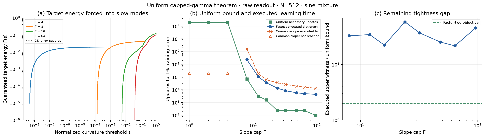
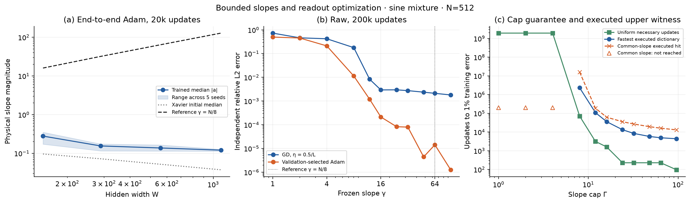
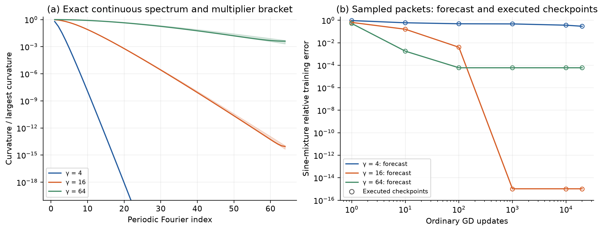
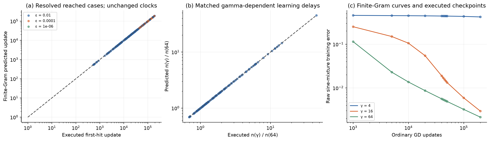

# Uniform capped-gamma learning delays: theorem verification and refinement

The question is whether a maximum hidden-slope cap forces a specified target to
learn slowly for **every** admissible frozen dictionary, rather than merely
predicting the dynamics of a dictionary after its spectrum has been computed.
The new certificate supplies that uniform statement for fixed samples, centers,
raw readout coordinates, and zero-start gradient descent. Its interaction with
the target is explicit: at the primary width, cap 4 forces at least
**1,927,430,480 updates** to reach 1% training error, despite a certified
capacity witness below $8\times10^{-9}$. The campaign also verifies the supplied note's periodic
and finite-kernel formulas, but those exact-model predictions have a different
evidence role from a sharp uniform cap theorem.

The declared sharpness objective is a factor-two bracket between a certified
necessary learning time and an executed admissible upper witness. A close
spectral forecast does not satisfy that objective by itself. In particular,
the common-slope dictionary is not the fastest dictionary under the same cap:
heterogeneous slopes can substantially shorten learning time.
The computed bracket remains wider than two on the primary D36 problem.
This does not identify the true optimum: an unsuccessful search for a faster
dictionary is not a proof that none exists. The campaign establishes useful
uniform obstructions, but does not establish a sharp characterization of the
fastest admissible learning time there.

**Table 1. Terms and normalization used throughout this report.**

| Term or symbol | Meaning |
|:--|:--|
| $N,W,m$ | Core resolution, hidden width $W=N+2\lceil\sqrt N\rceil+1$, and training sample count $m=16N+1$ |
| $\Gamma$ | Maximum absolute physical slope; every neuron independently satisfies $|\gamma_j|\le\Gamma$ |
| $J,y$ | Raw tanh design, including bias, and target values; both divided by $\sqrt m$ |
| $K,L$ | Output kernel $JJ^T$ and largest curvature $\|J\|_2^2$ |
| $\chi$ | Normalized step $\eta L$; the theorem uses $\chi\le0.5$ |
| $E(n),n_\epsilon$ | Relative training residual and its first crossing of tolerance $\epsilon$ |
| $v,\delta$ | Unit witness and its absolute overlap with the normalized target |
| $X,\beta$ | Positive semidefinite certificate and its trace, bounding $v^TKv/L$ uniformly |
| $B(\Gamma)$ | Necessary updates proved for every dictionary under the cap |
| $U(\Gamma)$ | First hit of an admissible dictionary executed by ordinary FP64 GD |
| $U/B$ | Observed upper-witness/lower-bound ratio; the objective is at most two |
| Interval repair | Conservative addition to $\beta$ needed to validate the full continuous slope interval |
| Forecast / censored | A model-predicted crossing / a tolerance not reached during executed updates |

## Scientific contract

The primary problem has $N=512$, $W=559$, $m=8193$, fixed halo centers, and

$$
y_i=m^{-1/2}\left[\sin(2\pi x_i)+\tfrac12\sin(6\pi x_i)
+\tfrac14\sin(10\pi x_i)\right].
$$

All readouts start at zero and minimize $\tfrac12\|J\theta-y\|^2$. The primary
tolerance is $1\%$ training error. Secondary tolerances are $10^{-4},10^{-6},
10^{-8},10^{-10},10^{-12}$. The cap grid is
$1,2,4,8,12,16,24,32,48,64,96$. Additional targets are
$\exp(\sin(3\pi x))$, $(1+25x^2)^{-1}$, $\sqrt5x^2$, and
$\sqrt2\sin(2\pi x)$. Width controls use $N=128,256,1024$.

The max-cap family includes independently heterogeneous slopes and zeros.
Signed slopes are covered because negating a feature preserves its kernel
contribution. A median slope in the end-to-end Adam panel is not a maximum cap.
Neither mean-cap nor median-cap theorems follow by replacing $\Gamma$ with that
statistic. The uniform result also does not apply unchanged to neighboring
readout coordinates or to Adam.

The new training step is $0.5/[\widehat L(1+10^{-12})]$, where $\widehat L$ is
the FP64 Gram estimate. Independent rectangular checks retain this actual step.
The theorem is an exact-arithmetic statement; executed FP64 hits are numerical
upper witnesses checked against independent spectral evolution, not interval
proofs of the entire floating-point trajectory.

## From the cap to target-dependent learning delay

Write $b=\mathbf1/\sqrt m$ and
$a_j(g)=\tanh(g(x-c_j))/\sqrt m$. For a unit witness $v$, find $X\succeq0$
such that

$$
(v^Tb)^2-b^TXb+
\sum_j\sup_{0\le g\le\Gamma}
\left[(v^Ta_j(g))^2-a_j(g)^TXa_j(g)\right]\le0.
$$

This implies $v^TKv\le\operatorname{tr}(XK)\le L\operatorname{tr}X$ for
**every** slope vector under the cap. Set $\beta=\operatorname{tr}X$ and
$\delta=|v^Ty|/\|y\|$. The certificate depends on the cap, geometry, and target;
it does not require the spectrum or training trajectory of the subsequently
chosen dictionary. Auxiliary convex optimization searches for the certificate,
but ordinary readout GD is not an input to its proof.

If $F(s)$ is target energy in eigenmodes of $K/L$ no larger than $s$, then

$$
F(s)\ge\left[\delta\sqrt{1-\beta/s}
-\sqrt{1-\delta^2}\sqrt{\beta/s}\right]_+^2,
\qquad \beta<s<1.
$$

The lower bound is useful only when the target overlaps a direction that the
whole capped family accesses weakly. An easy low-frequency target need not
satisfy the same obstruction as the sine mixture. Combining multiple witnesses
uses the maximum of their guaranteed spectral masses, never their sum.

The [proof note](../../../../../../docs/capped_gamma_kernel_certificate.md)
also derives a stronger resolvent conversion. For $H=K/L$, $t>0$, and $z\ge0$,

$$
E(n)^2\ge
\min_{0\le s\le1}\left[(1-\chi s)^{2n}-\frac{z}{t+s}\right]
+\frac{z\delta^2}{\beta+t}.
$$

The scalar minimum is enclosed independently with interval arithmetic. The
same verified witness at $N=128$, $\Gamma=16$ improves from 204 necessary
updates under the CDF conversion to 773 under the resolvent conversion, a
factor of 3.79. This is a proof improvement using identical upstream information.
For that witness, an abstract rank-one operator compatible with its
$(\beta,\delta)$ pair already limits how much more the scalar conversion can
prove. Such an operator is not automatically an admissible tanh dictionary.

Other iterations improve the upstream search or its numerical verification:
scaled convex variables address small target correlations; joint and
fixed-budget searches propose new witness directions; interval Taylor
enclosures preserve cancellations that coarse second-order bounds can lose.
Every proposed factor is independently checked over the continuous slope
interval. Failed conic solves and large repairs remain in the evidence.

The theorem has a simple analytic small-cap limit. For the mean-zero target
direction, the Lipschitz property of tanh supplies
$\beta=W\Gamma^2\operatorname{Var}(x)$ and hence an
$\Omega(\Gamma^{-2})$ obstruction when the target overlap is nonzero and the
cap is sufficiently small. This elementary estimate is not informative on the
larger D36 cap grid; the optimized certificates supply its useful bounds.

An exactly solvable two-sample control tests sharpness of the theorem itself.
With samples $\{-1,1\}$, four centers at zero, and the odd target, the fastest
normalized target curvature under the cap is
$\min\{4\tanh^2\Gamma,1\}$. In the regime $4\tanh^2\Gamma<1$, the
certificate and direct-target Jensen bound attain the exact optimal integer
learning time. The ordinary-GD controls at caps 0.05, 0.1, and 0.2 check this
identity. Sharpness in that control is not evidence of sharpness on D36.

## Uniform bounds against executed learning times

<figure>
  
  <figcaption>Primary problem: raw readout, $N=512$, zero initialization, sine-mixture target, and 1% training tolerance. Panel (a) combines compatible certified target-energy bounds by maximum and cap nesting, retaining their step-function guarantees. Panel (b) compares the strongest computed uniform CDF/resolvent obstruction with actual first hits. Open triangles mark an executed horizon without a hit. Panel (c) compares the best executed admissible witness to the uniform lower bound; the dashed line is the factor-two objective. In panels (b–c), markers identify tested caps and connecting lines guide the eye.</figcaption>
</figure>

**Primary necessary times and numerical upper witnesses.** Larger-cap proofs
apply to smaller caps, while a smaller-cap dictionary remains admissible under
a larger cap. Both columns use these nesting relations. A dash denotes no
executed 1% hit, not infinite learning time.

| Maximum slope cap | Uniform necessary updates $B$ | Fastest executed hit $U$ | $U/B$ | Common-slope executed hit |
|--:|--:|--:|--:|--:|
| 1 | 1,927,430,480 | — | — | — |
| 2 | 1,927,430,480 | — | — | — |
| 4 | 1,927,430,480 | — | — | — |
| 8 | 70,371 | 2,309,257 | 32.82 | 15,798,313 |
| 12 | 3,139 | 108,529 | 34.57 | 186,057 |
| 16 | 1,596 | 35,764 | 22.41 | 61,792 |
| 24 | 228 | 13,311 | 58.38 | 35,491 |
| 32 | 228 | 8,448 | 37.05 | 26,846 |
| 48 | 228 | 5,787 | 25.38 | 19,335 |
| 64 | 228 | 4,935 | 21.64 | 16,013 |
| 96 | 96 | 4,370 | 45.52 | 13,026 |

The cap-1 and cap-2 guarantees inherit the cap-4 certificate. Likewise, the
cap-24, cap-32, and cap-48 entries inherit the stronger cap-64 certificate.
These plateaus describe available guarantees, not a measured plateau in the
underlying learning rates. The common-slope runs at caps 1, 2, and 4 are
censored at 200,000 updates. The table contains no extrapolated upper witnesses.

The theorem therefore gives a quantitative cap-dependent obstruction across
an entire family of dictionaries. For scale, the cap-4 necessary count exceeds
the executed cap-8 hit by about 835 times, and the cap-8 necessary count exceeds
the executed cap-64 hit by about 14.3 times. These comparisons pair an
exact-arithmetic lower theorem with independently checked FP64 upper witnesses;
they are not interval proofs of all optimizer arithmetic. Within a fixed cap,
the observed brackets remain 21.6–58.4 on the reached primary cases, far above
the factor-two objective.

<figure>
  
  <figcaption>The paper-level three-panel view retains the earlier end-to-end learned-slope and frozen-readout precision data, then replaces the final panel with the new cap theorem evaluation. The learned median slope in panel (a) is descriptive, not the maximum cap used in panel (c). Panel (b) uses independent-grid precision after 200,000 updates; panel (c) uses first hits of 1% training error. These different quantities are labeled explicitly.</figcaption>
</figure>

## What improved, and where the remaining uncertainty lies

The target interaction is visible in the secondary-width certificates. At
$N=128$, the same cap and geometry give very different necessary times for
different targets. The following counts include the cap-nesting envelope and
the strongest completed CDF or resolvent conversion. They compare guarantees,
not observed learning times or target difficulty rankings.

| Target | Necessary updates, cap 4 | Necessary updates, cap 16 | Necessary updates, cap 64 |
|:--|--:|--:|--:|
| Sine mixture | 5,649,797,450 | 1,717 | 241 |
| $\exp(\sin(3\pi x))$ | 551,664 | 50 | 39 |
| $(1+25x^2)^{-1}$ | 2,229 | 15 | 15 |
| $\sqrt5x^2$ | 72 | 43 | 43 |
| $\sqrt2\sin(2\pi x)$ | 485 | 57 | 52 |

The theorem accepts any nonzero sampled target vector; it is not restricted
to this five-function set. A useful obstruction nevertheless requires target
energy in directions that the capped family accesses weakly. The table does
not support a claim that every target suffers the same delay, or that every
decrease in an individual neuron's slope strictly slows training. The
$N=256$ and $N=1024$ cases are optimizer and finite-spectrum controls; this
campaign does not supply optimized uniform certificates at those widths.
A constant target gives a simple counterexample to a target-independent delay:
set every hidden slope to zero and use the bias coordinate. At normalized step
0.5, its relative residual is $2^{-n}$ and reaches 1% in seven updates under
every cap. The target condition is therefore essential.

At the primary width and cap 8, the strongest verified witness has
$\beta=5.5963363445413724\times10^{-6}$ and $\delta=0.20877366920155552$.
The CDF conversion proves 19,424 necessary updates; the resolvent conversion
raises this to **70,371**. The corresponding abstract-operator information
limit is 71,732 updates. Thus the improved conversion already reaches 98.1%
of what that single pair of scalar inputs could possibly prove. A much sharper
D36 theorem must preserve more of the capped dictionary geometry, find a
stronger witness, or exploit relations among several directions. Refining the
same scalar conversion cannot close a many-fold gap.

A numerical pilot combined multiple resolvent inequalities using nonnegative
weights and a scalar linear-programming relaxation on 4,096 logarithmic
spectral nodes. It covered six width/cap pairs and all available primary-target
witnesses, including proofs inherited from larger caps. Its estimated change
was below 1% in every case. These grid calculations are diagnostics, not new
certified bounds. They provide no evidence that this particular combination
of the existing scalar constraints resolves the remaining uncertainty.

The enclosure refinement is separately consequential. At $N=128$, cap 4,
fourth-order interval Taylor bounds certify
$\beta=4.093295461577065\times10^{-11}$ with repair
$1.7160927122967757\times10^{-13}$. The resulting resolvent obstruction is
**5,649,797,450 updates**. A sixth-order trial limited to 32 subdivisions was
faster but substantially looser; increasing Taylor order alone is not a
guarantee of a better certificate. These changes improve verification of an
existing certificate condition rather than modifying the GD dynamics.
The Taylor expansions are local numerical enclosures in the scalar slope
variable; the theorem itself retains exact tanh features and their kernel.

The exact two-sample controls are sharp: the certified necessary counts and
executed first hits are respectively 921, 230, and 57 at caps 0.05, 0.1, and
0.2. This demonstrates that the theorem can attain the exact learning time in
a realizable capped family. The primary D36 comparison remains a separate,
unresolved sharpness test.

Dictionary search also changes the appropriate comparison. At cap 8, the
common-slope dictionary first reaches 1% at update **15,798,313**. Projected
search first produced an executed witness at 3,886,583; diverse starts reduced
this to 2,552,667; target-aware dual proposals followed by bounded line search
reduced it to **2,309,257**. All of these counts are ordinary, zero-start GD
first hits. The last dictionary is about 6.84 times faster than common slopes
and still about 32.82 times above the uniform bound.

The dual mixture used to propose slopes is not itself a realizable finite
dictionary. Only its rounded or sampled slope vectors enter these comparisons.
Fixed-direction dual proposals did not yield faster full-target forecasts at
the small caps; target-overlap dual proposals improved caps 8 and 12. Cap-64
overlap-dual candidates had unresolved first-hit forecasts and did not supply
upper witnesses. Neither an unresolved forecast nor a failed search is a
capacity theorem or proof of global optimality.

Four-budget overlap controls at $N=128$ found the strongest cap-16 and cap-64
certificates at the smallest budget. The primary-width confirmation therefore
retained that budget, reusing its completed cap-16 interval proof. This raises
the cap-16 necessary count from 752 to 1,596. The separate primary cap-4 check
retained its strongest completed witness; the other saved proposals had much
smaller scalar-information ceilings. Dedicated cap-1 and cap-2 checking was
stopped after the cap-4 certificate completed. Their reported guarantees use
the valid cap-nesting implication, not completed cap-specific optimization.

The final witness-bank experiment used singular directions from a faster
cap-8 dictionary to propose certificates. Its strongest completed resolvent
bound was 52,575 updates, below the existing 70,371. Thus changing the proposal
dictionary did not improve the retained theorem. This negative result is
preserved alongside the successful refinements.

The last broad searches attempted 255 starts across caps 8, 12, 16, and 24,
then 253 across caps 32, 48, 64, and 96. They combined retained fast starts with
target-phase, sparse, and bimodal initial slopes and allowed up to 1,200 bounded
line-search iterations per start. Caps 8, 12, 48, and 96 did not improve their
best forecast. The improvements at caps 16, 24, 32, and 64 were independently
executed and checked: 35,764, 13,311, 8,448, and 4,935 updates. The largest
reduction relative to the preceding best witness was about 4.9%, at cap 24.
These searches strengthen the upper-witness comparison without establishing
global optimality. The completed refinements leave the factor-two objective
unmet; the single-pair information limit identifies a concrete limitation of
further sharpening only that conversion.

## Verification of the spectral-kernel note

<figure>
  
  <figcaption>Periodic controls separate the explicit smoothing law from the finite-window model. The spectral panel uses $N=128$ and continuous periodic eigenvalues; shaded bands are the analytic multiplier bracket. The decay panel uses sampled packets at density 16 and half-cell offset, with the fixed sine mixture. Open markers are ordinary coefficient-GD checkpoints. The gamma-64 residual floor is a target-packet capacity effect, not a violation of the recurrence.</figcaption>
</figure>

The 24 periodic controls cover two widths, three slopes, two sample densities,
and two offsets. Each executes 20,000 ordinary coefficient-GD updates on three
individual sine targets and their mixture. The largest absolute discrepancy
between predicted and executed relative-error checkpoints is
$1.216\times10^{-14}$. An initial spatial construction of tiny-mode target
weights suffered cancellation; the final calculation constructs normalized
packets in Fourier coordinates. The earlier diagnostic is retained separately.
Independent spatial columns are still used for the optimizer updates.

<figure>
  
  <figcaption>The finite realization retains the actual sample grid, target, readout map, and saved step. Across the existing archive, all 157 reached and numerically resolved case/tolerance pairs have the same integer first hit as the finite-Gram prediction: 147 at 1% and 10 at $10^{-4}$. No stricter tolerance was reached in this joined set. Unreached forecasts are excluded from the scatter and retained in the data.</figcaption>
</figure>

The finite audit evaluates 82 dictionaries across all five readout maps and the
available width controls. It joins 1,866 executed case/tolerance comparisons.
The maximum relative Gram discrepancy against direct rectangular construction
is $2.308\times10^{-12}$. Exact first-hit agreement on reached cases validates
the finite realization and its gamma-dependent rate ratios. It does not make
the uniform cap bound tight.

Long extrapolations need additional care. At raw gamma 4, the FP64 Gram and
saved rectangular forecasts differ by about 2.4% at a horizon of roughly
$4\times10^{11}$ updates. Neither is an executed hit. Gamma 1 and 2 involve
unresolved small-spectrum target energy in the retained FP64 model. A numerical
rank cutoff is not a proof of mathematical unattainability.

Six finite-structure ablations retain raw or collective-neighbor coordinates
at gamma 4, 16, and 64. The anchored neighboring decomposition reconstructs
the native design to relative discrepancy below $8.2\times10^{-16}$.
Replacing the finite neighboring block by its whole-line block changes the
raw Gram by approximately 19–27%, versus 0.044–0.313% in collective-neighbor
coordinates. This comparison concerns curvature matrices. Without an output
realization on the same observations, those changed blocks receive no borrowed
target weights or hitting-time claim.

Removing the anchor before returning to raw coordinates violates the saved
contraction clock in all three tested cases. Removing halo columns while
recomputing target loadings increases the raw gamma-16 forecast from 61,792
to 174,421 updates. Thus finite geometry and the readout metric can materially
affect learning. The periodic attenuation formula explains smoothing in its
reference model; it is not silently substituted for the full raw finite kernel.

## Capacity, optimization, and numerical scope

The earlier [full-sweep report](../../REPORT.md) retains the independent-grid
GD/Adam intervention and detached-refit capacity controls. A new interval check
strengthens the capacity conclusion: the saved raw common-gamma readout has
certified relative training error at most $7.830\times10^{-9}$ at gamma 4,
$1.091\times10^{-11}$ at gamma 8, and $4.677\times10^{-14}$ at gamma 16.
These enclosures evaluate real tanh at the saved binary geometry and readout,
and the full target-array hash matches the new campaign. Thus 1% error is
provably attainable in a concrete dictionary at each of those caps. At common
gamma 4, 200,000 ordinary GD updates still leave relative error near 0.421.
The universal lower bound therefore describes an optimization obstruction
even though the capped family contains a model with adequate capacity. The
theorem also covers other, unattainable dictionaries; a necessary learning
delay alone does not resolve their capacity.

**Capacity witnesses at the primary width.** These are saved detached refits,
not GD iterates. Their norms describe these particular witnesses and are not
claimed as minimum required readout norms.

| Common slope | Certified relative error upper bound | Readout norm upper bound |
|--:|--:|--:|
| 4 | $7.830\times10^{-9}$ | 21,303.584 |
| 8 | $1.091\times10^{-11}$ | 88.752 |
| 16 | $4.677\times10^{-14}$ | 1.293 |

The interval proof concerns real tanh evaluated at the saved binary sample
coordinates and centers, with the saved binary target values. The floating-point
training matrix, nominal analytic target, and exact-real dictionary are distinct
objects. Hashes, independent rectangular forecasts, and explicit remainder
calculations record those distinctions. The main learning-time metric is
training error; independent-grid precision is reported separately.

## Reproducibility and validation

The campaign source is under
[`experiments/expD36_frozen_gamma_probe`](../../../../../../experiments/expD36_frozen_gamma_probe/README.md).
The persistent new archive is
`/workspace/junmiaoh/experiments/precision-mlps/runs/frozen_gamma_cap_v1`.
The completed `frozen_gamma_full_v1` archive is read-only evidence. New outputs
store parameters, scalar curve checkpoints, first-hit counters, final readout
states, certificate factors, interval diagnostics, and source commits; they do
not store dense per-update parameter histories.

The broad development design has 280 dictionaries, with five targets per
dictionary. Projected-Adam and bounded line-search searches use powered linear
recurrences only to select slopes; those evaluations are not counted as
executed readout updates. Selected slopes are frozen before ordinary GD.
Reserved seeds 100–104 are excluded from adaptive slope and witness search.
Confirmation can run concurrently with proof calculations because those
calculations do not read its outcomes.

Both 280-entry manifests reached their 200,000-update horizons. The confirmation
manifest reuses 33 case IDs and introduces 247 new IDs. Eighteen new IDs repeat
deterministic width-control dictionaries; matrix hashes identify **229 new
dictionaries**, comprising 220 at $N=512$ and three at each secondary width.
Only these new dictionaries count as held-out cases. Consequently the
confirmation is not described as 280 independent new random draws. The all-tolerance audit
applies each certificate to compatible smaller-cap cases and checks each
actual dictionary once. Censored trajectories are retained and are not treated
as observed threshold crossings.

The final snapshot has 1,471 case records, of which 682 have executed GD and
independent rectangular references. Across 20,460 case/target/tolerance
comparisons, all 2,012 reached thresholds agree on the exact integer first hit:
2,005 at 1% and seven at $10^{-4}$. No reached threshold lacks a resolved
reference prediction. The largest absolute relative-error checkpoint
discrepancy is $2.063\times10^{-14}$, and the largest independently computed
$\eta L$ is 0.49999999999950384. All 4,308 applicable certificate comparisons
have zero observed violations, including 1,410 comparisons on dictionaries
absent from development. These counts describe comparisons, not independent
statistical trials; trajectories without a hit cannot validate a distant
predicted crossing.

The [scheduler ledger](evidence/slurm_accounting.tsv) records 52 campaign jobs,
including setup and CPU-only work. GPU allocations total **18,880 seconds,
or 5.244 GPU-hours**, within the additional ten-hour authorization. This counts
compilation and allocated idle time and excludes the earlier full sweep.
The two final broad searches used 613 and 1,782 GPU-seconds. The remaining
authorized time was not consumed after the completed refinements and broader
searches yielded the results above. The new persistent archive occupies about
1.6 GiB; no dense parameter histories or additional volume were needed.

The ledger retains failed and canceled attempts. Two early single-GPU
follow-ups selected only a worker shard; the default was corrected and the
missing cases were completed in jobs 790 and 792. Final manifest coverage and
per-case horizons, rather than a scheduler success flag alone, establish
completion. Superseded CPU checks were stopped after stronger completed
certificates were available. No unfinished candidate is used as a certificate.
Job 798 recorded its source as `local`; its deployed source was the preserved
`cap-code-e7cced9` snapshot. Job 807 reused the unchanged cap-16 proof from job
784, produced by `cap-code-74cba14`. These provenance qualifications are
explicit in the [run audit](evidence/run_audit.json).

The complete final non-slow test run had 748 passes, 9 skips, 4 deselections,
and 17 failures. The failing test identifiers
exactly match the pre-existing baseline. They involve unrelated construction,
operator-learning, data-availability, and plotting tests. Focused tests cover
the new Fourier normalization, coherent aliases, exact null controls,
finite-Gram identities, actual-step forecasts, noncommuting transfer bounds,
heterogeneous cap certificates, interval repairs, integer crossings, and
selection gradients.

The curated proof audit checks all 70 stored factors against their witness and
target hashes, verifies conservative trace and target-overlap values, and
independently replays all 35 selected scalar resolvent certificates. The full
continuous-slope interval checks remain the archived CPU-job outputs; the
replay is not represented as rerunning those long checks. Re-evaluating sine
and exponential targets on a different platform can change their last bits,
so the compact bundle includes the exact archived target arrays. These match
every completed certificate and the new campaign's training target hashes.

The [compact input bundle](evidence/compact_inputs.tar.gz) contains the JSON
campaign snapshot, completed witness factors, exact binary certificate
inputs, and parameters for 50 reported upper-witness or primary common-slope
dictionaries. The [input manifest](evidence/input_manifest.json) records their hashes.
Extracting that bundle into a fresh directory reproduces all three numerical
summary files, all four PNG figures, and the run audit exactly. All 4,246
bundled input hashes and the bundle hash were checked before publication.
The completed older full-sweep inputs remain at the parent report location.
To regenerate the four figure families and their summaries from this checkout:

```bash
mkdir -p /tmp/capped-kernel-inputs
tar -xzf results/checkpoint_D_optimizers/expD36_frozen_gamma_probe/full_sweep/refinements/capped_kernel/evidence/compact_inputs.tar.gz \
  -C /tmp/capped-kernel-inputs
OPENBLAS_NUM_THREADS=1 VECLIB_MAXIMUM_THREADS=1 \
python -m experiments.expD36_frozen_gamma_probe.cap_analyze \
  --root /tmp/capped-kernel-inputs \
  --archive results/checkpoint_D_optimizers/expD36_frozen_gamma_probe/full_sweep \
  --output /tmp/capped-kernel-figures
```

PNG, PDF, and SVG exports accompany each figure. The numerical code produces
data and figures only; this report and its tables are authored directly in
Markdown.
