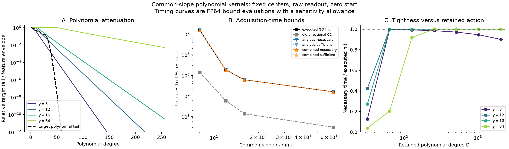

# Common-slope polynomial kernels: acquisition-time bounds

Retaining the polynomial kernel's action substantially sharpens acquisition-time
bounds in the fixed common-slope study. For the sine-mixture target, the new
necessary times are 99.586%, 99.998%, 99.998%, and 100% of the executed 1% hits
at gamma 8, 12, 16, and 64. The corresponding improvements over directional
C2 are about 111, 31, 44, and 52 times. Both a purely analytic remainder and
a tighter measured-action remainder are evaluated separately.

The result supports a sharp, target-dependent account of these prescribed
finite dictionaries. It still requires calculating their retained polynomial
operators. It does not establish a uniform guarantee for every common slope
below a cap. The numerical curves are FP64 evaluations of proved inequalities;
the separate interval audit checks the selected primary-target endpoints.

**Notation and numerical status.** All errors below are relative training
residual norms, not squared losses. All times count readout GD updates.

| Term | Meaning |
|---|---|
| Common gamma | Every hidden feature has the same fixed slope. |
| $J_\gamma$ | Raw readout design, including bias, normalized by $1/\sqrt m$. |
| $K_\gamma$ | Output kernel $J_\gamma J_\gamma^T$. |
| $D$ | Degree of each feature's Chebyshev interpolant. |
| $\widetilde K_{\gamma,D}$ | Kernel formed from those polynomial features. |
| Analytic bracket | Transfer using the uniform gamma-dependent feature remainder. |
| Combined bracket | Minimum of analytic and target-dependent operator-action remainders. |
| Necessary / sufficient | Lower / upper endpoint of an acquisition-time interval. |
| Interval audit | Independent Arb proof of selected endpoint statements on nominal real tanh. |

## 1. The controlled comparison

The sample grid, centers, target arrays, raw readout metric, zero initialization,
and each run's actual saved GD step are held fixed. The geometry is $N=512$,
559 hidden features plus bias, and 8,193 endpoint samples on $[-1,1]$.
The primary target is

$$
c(x)=\sin(2\pi x)+\tfrac12\sin(6\pi x)+\tfrac14\sin(10\pi x).
$$

Gamma takes values 8, 12, 16, and 64. Polynomial degrees are
32, 64, 128, 256, 512, 1024, and 2048. The same calculation also covers the
four archived control targets. This produces 28 approximating operators and
140 operator-target comparisons. No rate is fitted to a training trajectory.
All degrees, including unsuccessful ones, remain in [the data](summary.json).

The archived step is approximately $0.5/\|J_\gamma\|_2^2$ with the campaign's
small safety margin. This clock changes with gamma in exactly the same way as
the executed study; it is not replaced by a step selected for the polynomial
approximant. Matrix and target hashes match the original runs. The independent
rectangular-SVD references reproduce all archived 1% forecasts.

## 2. What information is retained

The [derivation](../../../../../../docs/common_slope_polynomial_kernel.md)
proves the following construction. Interpolate each feature at
Chebyshev-Lobatto nodes, retain its signed coefficients, and form the full
kernel of the interpolating features. The bias remains exact. The existing
uniform tanh approximation envelope gives

$$
\|J_\gamma-\widetilde J_{\gamma,D}\|_2
\le\delta_J=\sqrt{559}(1+2D)e_D(\gamma).
$$

With $\Delta=(2\|\widetilde J\|_2+\delta_J)\delta_J$, the original and
approximate GD residuals obey

$$
|E_n-\widetilde E_n|\le n\eta\Delta.
$$

This proof uses a noncommuting telescoping identity, so the two kernels need
not have the same eigenvectors. All retained couplings and the full target
are included. The target component outside the approximant's range remains
in its predicted error floor.

For the sharper action version, write
$y=y_\perp+\sum_\ell a_\ell u_\ell$ in the retained kernel's eigenbasis and
put $R=K-\widetilde K$. Then

$$
|E_n-\widetilde E_n|\le
\frac{\eta}{\|y\|}\left[
n\|Ry_\perp\|+
\sum_\ell |a_\ell|\|Ru_\ell\|
\sum_{j=0}^{n-1}(1-\eta\widetilde\lambda_\ell)^j\right].
$$

The geometric sum is evaluated directly. This calculation needs the frozen
dictionary and target, but no GD trajectory or original-kernel eigendecomposition.
It uses more information than the uniform analytic remainder: it measures
whether the discarded operator actually acts on the target-relevant retained
modes. Diagonalizing the approximating kernel remains part of both versions.

## 3. Primary acquisition-time results

**Table 1. Necessary–sufficient updates to 1% residual for the sine mixture.**
Each bracket takes the strongest endpoints across the declared degree sweep.
The original directional C2 values are FP64 estimates from the prior study.

| Gamma | Old directional C2 | Analytic bracket | Combined bracket | Executed first hit | Combined degree |
|---:|---:|---:|---:|---:|---:|
| 8 | 141,766 | 15,561,690–16,048,061 | 15,732,978–15,864,610 | 15,798,313 | 64 |
| 12 | 5,993 | 186,043–186,072 | 186,054–186,061 | 186,057 | 128 |
| 16 | 1,395 | 61,789–61,796 | 61,791–61,793 | 61,792 | 128 |
| 64 | 309 | 16,011–16,015 | 16,013–16,013 | 16,013 | 256 |

The analytic brackets use degrees 256, 512, 512, and 2048 respectively. The
old analytic C2 necessary times were only 449, 11, 3, and 3 updates. Thus
retaining the matrix helps substantially even when the remainder uses only
the analytic gamma envelope. Measuring discarded action permits sharp bounds
at appreciably lower degree.

The combined gamma-8 bracket extends 0.414% below and 0.420% above its executed
hit. The observed gamma-8/gamma-64 acquisition-time ratio is 986.59. The
combined intervals bound this ratio between 982.51 and 990.73 for these fixed
problems. This quantifies the optimization delay under the recorded clock.
The earlier capacity certificates establish that these targets are reachable
to much smaller residuals; the acquisition times concern optimization.

<figure>
  
  <figcaption>Common-slope sine-mixture probe at N=512 in raw readout coordinates. A: the analytic feature approximation envelope and target polynomial tail; these are not kernel eigenvalues. B: the new timing brackets closely follow executed hits while directional C2 remains much lower. C: retaining more polynomial action initially tightens the bound; at high degree the deliberately conservative arithmetic allowance can weaken it, especially at gamma 8. Curves are FP64 evaluations; selected primary endpoints are independently interval certified. A vector PDF is available beside the PNG.</figcaption>
</figure>

The selected action models have exact polynomial rank at most 65, 129, 129,
and 257, compared with 560 readout coordinates. The exploratory implementation
still factors their full rectangular synthesis matrices; it does not claim
a computational compression by those rank ratios. The analytic gamma-64
calculation uses degree 2048 and provides little dimensional simplification.

## 4. Control targets and failures to obtain an upper bound

**Table 2. Best combined FP64 intervals for the other archived targets.**
The common degree sweep and calculation are unchanged. These control intervals
have not received the primary target's independent interval audit. Nineteen
of the twenty total target/gamma pairs have an executed 1% hit. The remaining
pair is explicitly censored.

| Gamma | Target | Necessary–sufficient | Executed first hit |
|---:|---|---:|---:|
| 8 | $\exp(\sin(3\pi x))$ | 426,198–426,282 | 426,240 |
| 8 | $1/(1+25x^2)$ | 26,104–26,104 | 26,104 |
| 8 | $\sqrt5 x^2$ | 879,211–879,775 | 879,493 |
| 8 | $\sqrt2\sin(2\pi x)$ | 7,466–7,466 | 7,466 |
| 12 | $\exp(\sin(3\pi x))$ | 34,752–34,753 | 34,753 |
| 12 | $1/(1+25x^2)$ | 3,566–3,566 | 3,566 |
| 12 | $\sqrt5 x^2$ | 269,242–269,343 | Censored at 200,000 |
| 12 | $\sqrt2\sin(2\pi x)$ | 5,263–5,264 | 5,263 |
| 16 | $\exp(\sin(3\pi x))$ | 11,961–11,961 | 11,961 |
| 16 | $1/(1+25x^2)$ | 1,606–1,606 | 1,606 |
| 16 | $\sqrt5 x^2$ | 119,623–119,641 | 119,632 |
| 16 | $\sqrt2\sin(2\pi x)$ | 4,289–4,289 | 4,289 |
| 64 | $\exp(\sin(3\pi x))$ | 2,394–2,394 | 2,394 |
| 64 | $1/(1+25x^2)$ | 578–578 | 578 |
| 64 | $\sqrt5 x^2$ | 15,119–15,119 | 15,119 |
| 64 | $\sqrt2\sin(2\pi x)$ | 2,233–2,233 | 2,233 |

The censored quadratic case has a measured-spectrum forecast of 269,292,
inside the interval; that value is not an executed hit. The quadratic also
illustrates that polynomial-tail energy is a sufficient difficulty condition
in the old argument, not a necessary condition for slow raw-coordinate
learning. Even a degree-two target can depend on poorly conditioned
combinations of these features.

Seventeen of the 140 degree/target combinations fail to yield a combined
sufficient-time witness. They are retained as unsuccessful approximations,
not interpreted as capacity failures. Taking valid endpoint bounds across
degrees gives finite intervals for all twenty fixed problems.

## 5. Precision, verification, and interpretation limits

The archived target arrays are reused exactly. Across all degrees and targets,
14,175 sampled comparisons against independent rectangular-SVD residual curves
show no combined-envelope violations at an absolute comparison tolerance of
$10^{-12}$. The lower and upper statements are also checked against all
nineteen executed first hits. Small independent tests cover interpolation,
noncommuting kernels, cross-couplings, zero-rate modes, unreachable target
components, nonmonotone upper envelopes, and an Arb Gram/power calculation
against direct output-space evolution.

The FP64 sensitivity allowance is

$$
64\,\epsilon_{\rm mach}(D+1)\|\widetilde J\|_F
+\|\widetilde J-U\Sigma V^T\|_F
+\sigma_{\max}\|U^TU-I\|_F.
$$

It is explicitly an allowance, not a proved interval enclosure. It is added
to synthesis uncertainty before transfer to the kernel. Inflating it tenfold
changes the selected primary combined brackets to 15,184,514–16,509,123;
186,019–186,096; 61,783–61,801; and 16,011–16,015. The improvement over C2
survives this sensitivity check. Increasing degree indefinitely eventually
amplifies the allowance more than it reduces the analytic truncation error.

The independent audit uses 192-bit Arb arithmetic, the exact common-slope
finite Gram identity, and integer powers of an augmented readout update
matrix. It checks an excluded iterate immediately before each necessary
endpoint and the sufficient endpoint itself. It encloses nominal real tanh
on the archived binary grid, centers, target, and step, rather than promoting
rounded FP64 features and calling that a real-tanh certificate. The scope of
certification is the selected endpoint statements, not every plotted curve.

All eight selected primary brackets (analytic and combined at four gammas)
passed this audit. Their sixteen endpoint evaluations enclose residual squared
strictly above $10^{-4}$ at the excluded iterates and below it at the
sufficient iterates. The interval Gershgorin upper bounds on $\eta L$ range
from 0.6131 to 0.6229, establishing contraction. In particular, the combined
gamma-64 audit proves $E_{16012}^2>10^{-4}$ and
$E_{16013}^2<10^{-4}$, so its nominal-real first hit is exactly 16,013.

The gain comes from retaining matrix action and target alignment. This study
does not isolate equality of the slopes as the sole source of improvement;
the transfer argument also extends to heterogeneous polynomial approximants.
The common-slope restriction supplies a clean one-parameter family and the
gamma-dependent approximation envelope. A theorem using only a cap and a
single target-tail norm has discarded substantially more information and
should not inherit these sharpness claims.

The remaining theoretical step is a useful bound uniform over an entire
shared-slope interval, with appropriately specified target and geometry
information. A finite sweep does not establish that result or monotonicity
for every target.

## 6. Evidence and reproduction

The [summary](summary.json) preserves all degree rows, selected inputs,
arithmetic diagnostics, old bounds, executed hits, and exact-reference
forecasts. The [interval audit](interval_audit.json) preserves the separate
endpoint checks. The [three-panel PDF](three_panel.pdf) is the vector figure.
The [compact input archive](probe_inputs.tar.gz), about 1.9 MiB, contains every
input needed by both runners, with checksums in the validation record.
The local refinement also contains coefficient and mode arrays for every
degree, occupying about 56 MiB in total. No dense training histories were
created, and no old experiment evidence was removed.

From the feature worktree, using the existing Python environment with
NumPy, SciPy, Matplotlib, and python-flint:

```bash
OPENBLAS_NUM_THREADS=1 VECLIB_MAXIMUM_THREADS=1 \
python -m experiments.expD36_frozen_gamma_probe.common_slope_analysis
OPENBLAS_NUM_THREADS=1 VECLIB_MAXIMUM_THREADS=1 \
python -m experiments.expD36_frozen_gamma_probe.common_slope_audit
python -m pytest -q tests/test_expD36_common_slope_poly.py
```

The runners default to the existing full-sweep archive and accept explicit
`--root` and `--output` paths. The source revision is stored in the numerical
summary. Predictions use frozen features and the target only; the archive's
training data is used for retrospective validation. This probe consumed zero
new GPU-hours.

For a fresh checkout, extract `probe_inputs.tar.gz` into an empty directory
and pass that directory as `--root` to both commands; give them the same fresh
`--output` directory. This avoids needing the larger historical archive.

The final committed-code comparison took 87.4 seconds on CPU while other
checks ran concurrently; the initial comparison took 62.8 seconds. The full
192-bit endpoint audit took 438.1 seconds. The focused mathematical tests had
22 passes. The complete non-slow repository run had 758 passes, 9 skips,
4 deselections, and 17 failures. All seventeen failing identifiers exactly
match the previous campaign's recorded baseline; there are no new failures.
The [validation record](validation_record.json) preserves that comparison and
the final evidence checks.
