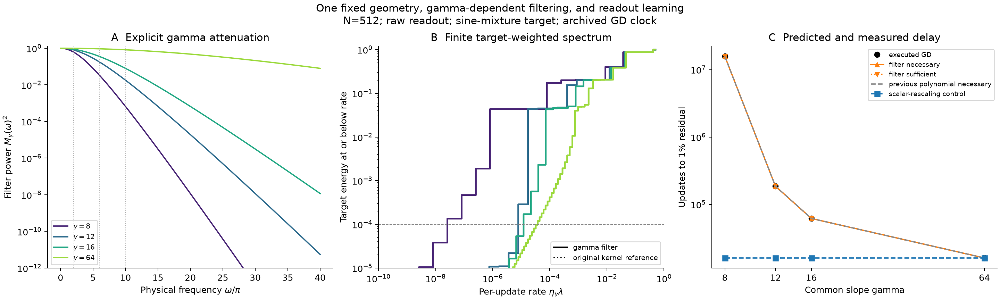

# Gamma filtering explains the measured readout delay

A single explicit gamma filter applied to fixed sampling and center matrices
recovers the observed common-slope readout learning times. The primary target
takes 15,798,313 updates at gamma 8 and 16,013 at gamma 64. The filter-based
combined intervals predict their ratio to lie between 985.70 and 987.49;
the executed ratio is 986.59. Rescaling only the overall kernel magnitude
predicts 16,013 updates at every gamma. Thus the quantitative explanation
requires the frequency-dependent deformation of the kernel.

This is a retrospective comparison with the archived finite training problems.
There are no new GD runs, fitted rates, or held-out generalization claims.
The numerical intervals include an exposed floating-point sensitivity allowance;
independent interval arithmetic checks the selected primary endpoint claims.

The [paper-facing note](../../../../../../docs/gamma_readout_paper_note.md)
connects these timing results to the archived joint-training slope gap and
width intervention in a new main-paper figure. The filter/spectrum figure
below remains supporting evidence.

**Table 1. Notation and evidence roles.** Errors are relative residual norms;
times count ordinary readout GD updates.

| Symbol or term | Meaning |
|---|---|
| $\gamma$ | Common physical slope; all centers and raw parameter coordinates stay fixed. |
| $M_\gamma(\omega)$ | Explicit multiplier $z/\sinh z$, where $z=\pi|\omega|/(2\gamma)$. |
| $F_Q,C_Q$ | Gamma-independent sampling and center/readout matrices. |
| $D_{\gamma,Q}$ | Diagonal multiplier matrix, including an exact bias entry one. |
| $Q,T$ | Retained odd harmonics and auxiliary half-period; $T=8$. |
| Analytic interval | Timing transfer using the proved feature approximation envelope. |
| Combined interval | Best of analytic and target-dependent discarded-action transfer. |
| Executed hit | Archived first GD update with residual norm at most 1%. |
| Censored | The archived run stopped before reaching the requested tolerance. |
| Scalar control | Gamma-64 kernel rescaled to each gamma's largest curvature. |

## 1. One construction connects the mechanism to the prediction

The [technical note and proofs](../../../../../../docs/gamma_factorized_readout.md)
start with the exact whole-line identity

$$
\tanh(\gamma(x-c))=
\left[\frac\gamma2\operatorname{sech}^2(\gamma\cdot)
*\operatorname{sign}(\cdot-c)\right](x).
$$

Every common-slope feature is the same explicit smoothing of a fixed step
feature. Apply it in both kernel arguments before sampling. Its Fourier
multiplier is $M_\gamma$; a finite sine/cosine expansion gives

$$
\widetilde J_{\gamma,Q}=F_QD_{\gamma,Q}C_Q,\qquad
\widetilde K_{\gamma,Q}
=F_QD_{\gamma,Q}(C_QC_Q^T)D_{\gamma,Q}^TF_Q^T.
$$

Gamma enters only through $D_{\gamma,Q}$. The dense center couplings remain;
the sampled Fourier functions are not assumed orthogonal or eigenvectors.
The finite construction has a proved remainder accounting for both its remote
square-wave transition and its omitted harmonics. It approximates the actual
nonperiodic tanh dictionary, with the original bias, halo, and raw metric.

The retained spectrum and target weights give its exact learning curve.
The existing noncommuting-kernel transfer inequalities then bound the original
curve and its integer crossing. This keeps the explicit gamma mechanism and
the accurate timing calculation in the same mathematical argument. Direct
tanh features are used only to check defects and construct independent
references, never to construct the filter prediction.

## 2. Fixed protocol and primary timing results

The study reuses the archived $N=512$ geometry: 559 hidden features plus bias,
8,193 endpoint samples on $[-1,1]$, zero readout initialization, half empirical
MSE, and each run's saved step, approximately $0.5/\|K_\gamma\|$.
All input and dictionary hashes match the archive. The primary target is
$\sin(2\pi x)+\frac12\sin(6\pi x)+\frac14\sin(10\pi x)$.

The predeclared harmonic sweep is $Q=64,128,256,512,1024,2048$ at gammas
8, 12, 16, and 64. Each $F_Q,C_Q$ is constructed once and reused across
gamma, with unchanged hashes verified afterward. The four control targets
are $\exp(\sin(3\pi x))$, $1/(1+25x^2)$, $\sqrt5x^2$, and
$\sqrt2\sin(2\pi x)$. This gives 24 retained kernels and 120 kernel-target
comparisons. Endpoints are selected from the calculated bounds across $Q$,
without fitting to executed hits. Unsuccessful resolutions remain in the data.

**Table 2. Primary acquisition intervals retain the previous accuracy.**
Every column uses the same target, original model, and saved optimization
clock. The previous intervals come from the polynomial-kernel study.
All eight primary intervals in the two filter columns have independent
nominal-real endpoint certificates.

| Gamma | Previous combined interval | Analytic filter interval | Combined filter interval | Executed hit |
|---:|---:|---:|---:|---:|
| 8 | 15,732,978–15,864,610 | 15,783,830–15,812,843 | 15,784,048–15,812,623 | 15,798,313 |
| 12 | 186,054–186,061 | 186,057–186,058 | 186,057–186,058 | 186,057 |
| 16 | 61,791–61,793 | 61,792–61,792 | 61,792–61,792 | 61,792 |
| 64 | 16,013–16,013 | 16,013–16,013 | 16,013–16,013 | 16,013 |

The analytic route uses $Q=256,512,512,2048$; the combined route uses
$Q=128,256,256,512$. Analytic transfer already gives sharp intervals without
measuring discarded kernel action. The action estimate reaches similar
accuracy with fewer harmonics. The combined gamma-8 interval's total width
is 0.181% of its executed hit, compared with 0.833% previously.

This comparison changes the feature construction and its arithmetic allowance;
the tighter intervals do not establish a stronger abstract transfer theorem.
They establish that explicitly representing gamma's filtering effect need
not lose the observed timing accuracy. Keeping the same $Q=2048$ basis for
all gammas also works: its gamma-8 interval is 15,783,696–15,812,977, and
the other primary intervals equal those in Table 2.

<figure>
  
  <figcaption>One gamma mechanism carried through to the observed readout delay. A: the analytic filter power; dotted vertical lines mark the primary target's physical frequencies, not finite-kernel eigenmodes. B: cumulative target energy versus per-update rate, comparing the retained filter with the independent original-kernel spectrum; matching curves overlap. The horizontal line is the squared residual tolerance, not a hitting-time formula by itself. C: necessary and sufficient filter times overlay executed GD hits, while a largest-curvature-matched scalar control misses the gamma dependence. Bounds and previous predictions are close enough to overlap at this scale; Table 2 gives their exact endpoints. The vector PDF is available beside this PNG.</figcaption>
</figure>

## 3. Why the delay is a change of learning geometry

The maximum curvature changes from approximately 241.73 at gamma 8 to
247.85 at gamma 64. The saved steps keep $\eta_\gamma L_\gamma$ essentially
one half. To test an explanation based only on that overall magnitude,
rescale the $Q=2048$ gamma-64 kernel to each filtered kernel's maximum
curvature, keeping its eigenvectors and relative spectrum fixed.

That scalar control predicts primary hits of 16,013 at all four gammas.
The explicit frequency-dependent filter instead recovers 15.8 million,
186 thousand, 62 thousand, and 16 thousand updates. Its gamma-8/gamma-64
ratio interval is 985.7021–987.4866, enclosing the executed 986.5930.
The target-weighted slow spectrum in panel B shows where the extra training
time comes from. All primary original runs actually attain 1%, so failure
to represent that tolerance cannot explain the timing difference.

This does not make the Fourier multiplier alone a finite-model eigenvalue
formula. Both the fixed center matrix and sample restriction matter. The
contribution is following the known filter through that geometry and into
the target's learning curve, rather than replacing the geometry by a scalar
tail budget. Diagonalizing the resulting finite model is part of the
calculation, not an additional fitted explanation.

## 4. Control targets, unresolved resolutions, and numerical sensitivity

**Table 3. Combined filter intervals for the four control targets.**
All nineteen available hits across Tables 2–3 lie in the selected intervals.
These control intervals have FP64 sensitivity checks, not separate Arb audits.

| Gamma | Target | Necessary–sufficient | Executed hit |
|---:|---|---:|---:|
| 8 | Exponential of sine | 426,231–426,249 | 426,240 |
| 8 | Runge | 26,104–26,104 | 26,104 |
| 8 | Quadratic | 879,431–879,555 | 879,493 |
| 8 | Single sine | 7,466–7,466 | 7,466 |
| 12 | Exponential of sine | 34,752–34,753 | 34,753 |
| 12 | Runge | 3,566–3,566 | 3,566 |
| 12 | Quadratic | 269,286–269,299 | Censored at 200,000 |
| 12 | Single sine | 5,263–5,264 | 5,263 |
| 16 | Exponential of sine | 11,961–11,961 | 11,961 |
| 16 | Runge | 1,606–1,606 | 1,606 |
| 16 | Quadratic | 119,631–119,633 | 119,632 |
| 16 | Single sine | 4,289–4,289 | 4,289 |
| 64 | Exponential of sine | 2,394–2,394 | 2,394 |
| 64 | Runge | 578–578 | 578 |
| 64 | Quadratic | 15,119–15,119 | 15,119 |
| 64 | Single sine | 2,233–2,233 | 2,233 |

The censored case's independent spectral forecast is 269,292. It remains
distinct from an executed result. All twenty selected interval widths are
no greater than their polynomial counterparts. Nine of the 120 individual
resolution/target comparisons lack a combined sufficient-time witness;
these do not imply lack of capacity. All twenty selected cases have finite
intervals.

There are 12,150 residual comparisons with the independent original-kernel
SVD reference and no envelope violations at absolute comparison tolerance
$10^{-12}$. At the shared maximum resolution, the largest sampled residual
discrepancy across all targets and gammas is $1.83\times10^{-14}$.
These are numerical checks, not interval proofs of the whole error curve.

The exact-arithmetic envelope includes the distant transition and Fourier
tail. Floating-point uncertainty is tracked separately by a short-dot-product
and pairwise-summation allowance, an assumed transcendental/phase allowance,
and the SVD reconstruction and orthogonality residuals. The transcendental
allowance is explicitly heuristic. Inflating the total allowance tenfold
gives primary selected intervals 15,657,911–15,943,233;
186,052–186,063; 61,791–61,794; and 16,013–16,013. These still recover
the large optimization delay, but the numerical sensitivity should not be
confused with the exact-arithmetic truncation bound.

The [independent 192-bit Arb audit](interval_audit.json) certifies all eight
primary intervals, covering sixteen endpoint statements and ten distinct
endpoint evaluations. It uses the exact finite common-slope Gram identity
and integer matrix powers, with no GD trajectory or eigendecomposition.
The nominal-real features are evaluated on the exact archived binary grid,
centers, target, and step. The interval Gershgorin upper bounds on $\eta L$
range from 0.6131 to 0.6229 across the four cases, establishing contraction.
The excluded iterates have squared residual above $10^{-4}$;
the sufficient iterates have squared residual at or below it. This also
certifies exact first hits at gamma 16 and 64. It does not certify every
plotted curve or the FP64 allowance formula.

The focused implementation and transfer tests pass: 20 tests cover the
transform normalization, distant-transition remainder, fixed geometry,
independent sine sums, raw-GD dynamics, scalar normalization, and endpoint
selection. The full non-slow suite has 768 passes, 17 failures, 9 skips,
and 4 deselections. The failure identifiers exactly match the previously
recorded baseline; no new failure was introduced. The
[validation record](validation_record.json) records these checks and source
hashes separately from the scientific results.

## 5. Reproduction and limits

The [summary](summary.json) records every harmonic resolution, fixed-geometry
hash, defect diagnostic, interval, control prediction, and comparison.
The runner and figure builder are
[`gamma_filter_analysis.py`](../../../../../../experiments/expD36_frozen_gamma_probe/gamma_filter_analysis.py).
All inputs are already contained in the previous study's
[compact archive](../common_slope_polynomial/probe_inputs.tar.gz), with its
checksums in the [prior validation record](../common_slope_polynomial/validation_record.json).
The previous polynomial summary is tracked beside that archive and supplies
the comparison data. No extra copy of the large historical runs is needed.

From the feature worktree and its existing Python environment:

```bash
OPENBLAS_NUM_THREADS=1 VECLIB_MAXIMUM_THREADS=1 \
python -m experiments.expD36_frozen_gamma_probe.gamma_filter_analysis
OPENBLAS_NUM_THREADS=1 VECLIB_MAXIMUM_THREADS=1 \
python -m experiments.expD36_frozen_gamma_probe.common_slope_audit \
  --output results/checkpoint_D_optimizers/expD36_frozen_gamma_probe/full_sweep/refinements/gamma_factorized_kernel
python -m pytest -q tests/test_expD36_gamma_filter.py tests/test_expD36_common_slope_poly.py
```

The analysis took 13.58 CPU wall-clock seconds and the independent interval
audit took 284.39 seconds in this execution. No new GPU hours or optimizer
trajectories were used. The filter and spectral files
are small numerical evidence artifacts; dense training traces are not saved.

The statements concern the prescribed common-slope geometry, targets, and
readout clock. The exact smoothing identity holds for arbitrary fixed centers,
but these numerical sharpness results do not establish a sharp universal
slope-cap guarantee. The construction uses a finite matrix calculation and
does not claim computational savings over forming the original dictionary.
