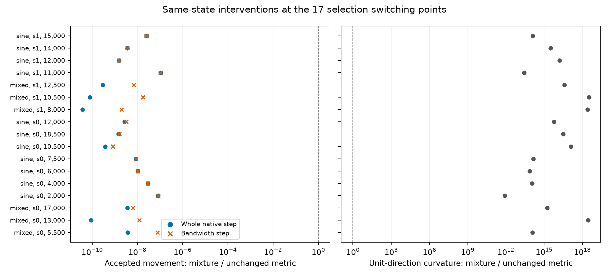
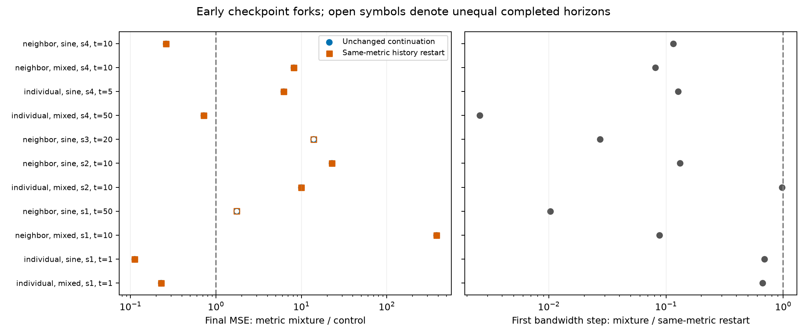
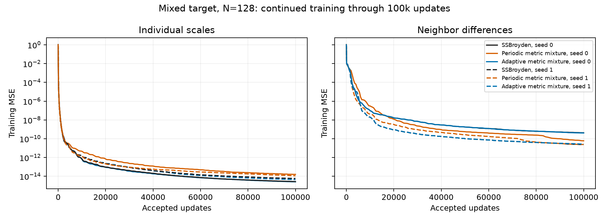
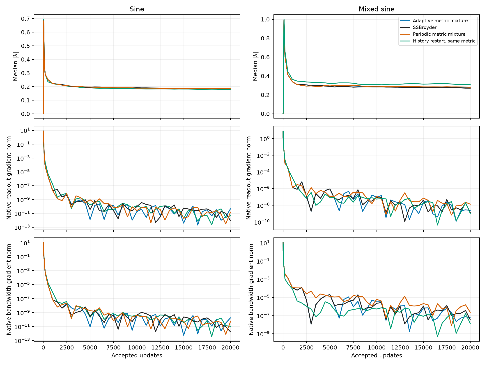
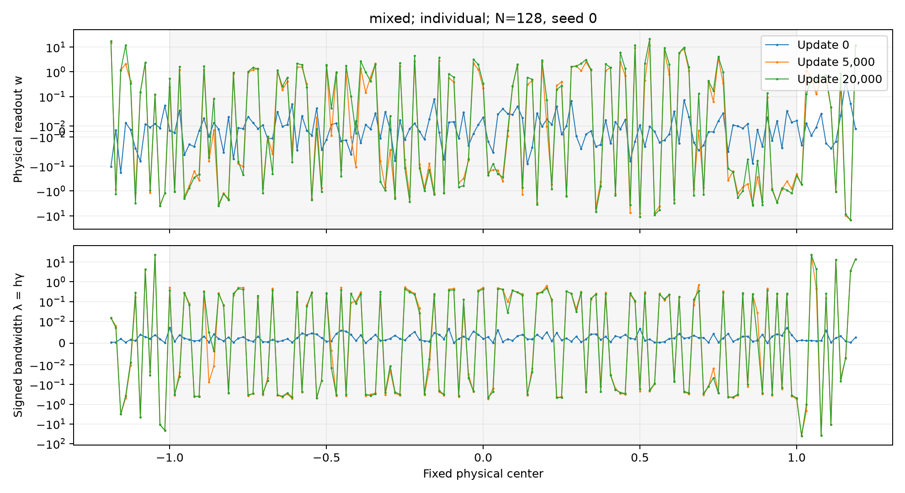
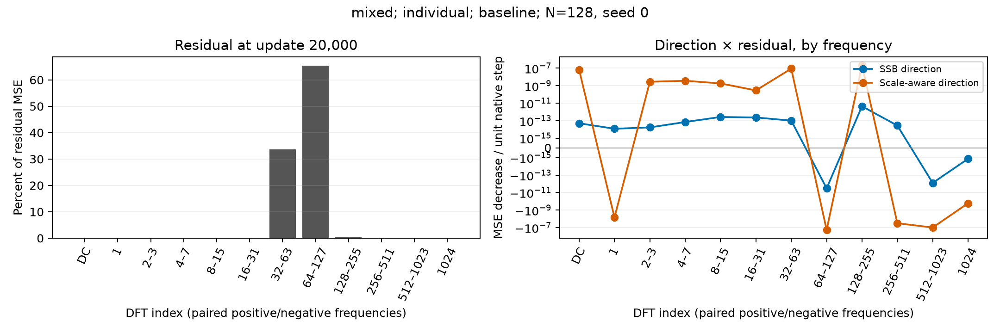
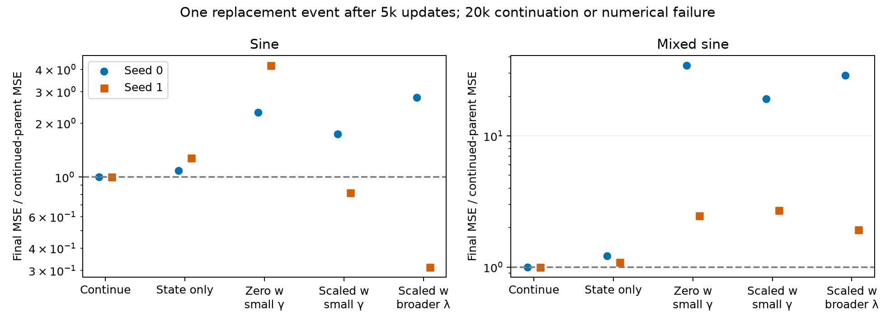

# Metric restoration and geometry learning with SSBroyden

**Data availability (September 27, 2026).** The committed summaries, figures, curated states, and numerical evidence are retained. The untracked full histories and restart checkpoints were deleted during the approved storage cleanup. Checkpoint paths in the historical handoff describe the original campaign; resuming those runs requires recreating the missing states through training.

The clearest result is a restriction on the proposed switching rule: a direction
that improves future readout learnability can still permit almost no actual
geometry movement. At 17 measured late switching states, mixing back the
prescribed parameter metric increased directional loss curvature enormously.
The accepted bandwidth movement was a median $8.68\times10^{-9}$ of the movement
with the retained SSBroyden metric. A local quadratic calculation predicts the
mixture's accepted step length within 0.17% at every one of these states.

The useful distinction is therefore **accessibility improvement per feasible
step**, rather than accessibility improvement per unit parameter displacement.
The stronger hypothesis that an accurate Newton approximation suppresses useful
geometry learning remains unresolved by this experiment.

The campaign is paused at the user's request. All submitted jobs had completed,
and Runpod has no remaining campaign allocations. The evidence below is saved;
the [continuation handoff](HANDOFF.md) gives the next restricted experiment and
checkpoint locations. Total allocated cost was 2.844 H200 GPU-hours.

**Terms used throughout this report.** All gradient and direction norms below
use the prescribed normalized coordinates unless explicitly labeled physical.

| Term | Meaning |
|---|---|
| Physical readout $w_j$ | Coefficient multiplying neuron $j$ in the network output. |
| Physical slope $\gamma_j$; bandwidth $\lambda_j=h\gamma_j$ | Trainable hidden slope and its dimensionless bandwidth. Centers stay fixed. |
| Individual scales | Optimize $a_j=w_j/\alpha_j$ and $\lambda_j$, with the reference envelope $\alpha_j$ including corrected halos. |
| Neighbor differences | Optimize normalized cumulative readouts, producing adjacent differences of tanh features. |
| Inverse metric $H$ | SSBroyden's current inverse-curvature approximation in normalized coordinates. Its proposed direction is $-Hg$. |
| Accessibility $G_\tau$ | Fraction of a held residual removable by readout gradient flow within a specified finite budget. |
| MSE | Mean squared function error. The optimized loss is half the training MSE. |

## What was compared

The fixed-center model is

$$
f(x)=b+\sum_{j=1}^{W}w_j\tanh\!\left(\gamma_j(x-c_j)\right),
\qquad h=2/N,\qquad W=N+2\lceil\sqrt N\rceil+1.
$$

Widths $N=128$ and $512$ have 153 and 559 neurons including halos. Every readout,
output bias, and slope trains. Hidden centers do not train independently of the
slopes. The targets on $[-1,1]$ are

$$
f_{\rm sine}(x)=\sqrt2\sin(2\pi x),\qquad
f_{\rm mixed}(x)=\frac{\sin(2\pi x)+0.1\sin(20\pi x)}{\sqrt{0.505}}.
$$

Individual coordinates use $w_j=\alpha_j a_j$ and $\gamma_j=\lambda_j/h$.
For neighbor differences, write $\bar\alpha_j=\sum_{k\leq j}\alpha_k$,
$q_j=\bar\alpha_j a_j$, $q_0=0$, and

$$
w_j=q_j-q_{j-1},\qquad
\sum_j w_j\phi_j=
\sum_{j<W}q_j(\phi_j-\phi_{j+1})+q_W\phi_W.
$$

The output bias has its own reference scale $\alpha_0$. Both coordinate systems
encode the same initial physical network. Initial readouts use the approved
reference-scaled Xavier distribution,
$w_j\sim\sqrt{\alpha_j}\sqrt{2/(W+1)}\,\mathcal N(0,1)$, while
$\gamma_j=(5/3)\sqrt{2/(W+1)}\,|\mathcal N(0,1)|$.
Ordinary readouts consequently have $O(h)$ size. This distribution differs from
the exact $w_j=\alpha_j\xi_j$ redraw used in the reset assay, particularly at
corrected halos. The reference bandwidth used to define envelopes is 0.25;
the trainable bandwidths start at the much smaller physical-Xavier values.

Training uses full-batch FP64 SSBroyden, the pinned accepted-step integration,
a $10^{-30}$ curvature guard, and a $10^{-15}$ line-search interval/step guard.
Training samples number $16N+1$ including endpoints; independent evaluation uses
32,768 midpoint samples. This campaign does not train Adam or GD. The inherited
manifest field `eta: 0.001` is unused by SSBroyden.

The primary policies are unchanged SSBroyden, adaptive metric mixing, and a 10%
metric mixture every 1,000 updates. All share the same emergency repair of
non-descent directions. At $N=128$, an additional control restarts optimizer
history at the adaptive arm's event times while retaining $H$. This restarts
line-search and descent history; it is distinct from changing the metric.
Selection seeds are 0–1; confirmation seeds are 2–4 with policy settings fixed.
Every trajectory receives 20k accepted updates unless it records an explicit
numerical failure. Mixed-target selection trajectories also continue to 100k.

## The switching criterion and its missing factor

Let $r=(f-y)/\sqrt m$ be the current residual and let $A(\lambda)$ map a change in
normalized readouts to the corresponding normalized function change. Hold $r$
fixed when comparing geometries. Readout gradient flow gives

$$
G_\tau(\lambda;r)=
1-\frac{\|e^{-\tau AA^T}r\|^2}{\|r\|^2}.
$$

The two budgets are $\tau=K/\|A(\lambda_0)\|_2^2$ with
$K=20{,}000$ and $100{,}000$. Their normalization stays fixed along each run.
These are diagnostic readout-flow budgets, not SSBroyden learning rates.
Values are checked by an independent SVD; derivatives use a smooth matrix
function with coincident-eigenvalue limits and are checked by finite differences.

At one parameter state, compare $p_N=-Hg$ with $p_S=-sg$, where
$s=\|Hg\|/\|g\|$. Thus the two proposals have equal normalized parameter norm.
Define exposure $E(d)=\nabla_\lambda G_\tau^T d_\lambda$ for their unit directions.
The controller chooses the smallest mixture that clears three times the measured
numerical uncertainty at the 100k budget without resolved deterioration at 20k:

$$
H_\beta=(1-\beta)H+\beta sI.
$$

Two consecutive qualifying diagnostics and a 100-update cooldown are required.
This preserves first-order loss descent whenever both original directions
descend. It does not bound the curvature of their mixture.

For a unit direction $d$, put $a=-g^Td>0$ and
$c=d^T\nabla^2L\,d$. When $c>0$, the quadratic model gives

$$
L(z+td)\approx L(z)-at+\tfrac12ct^2,
\qquad t_* = a/c,
\qquad \Delta G_\tau\approx t_*E(d).
$$

The SSB line search additionally limits the step to the supplied proposal length.
For the measured mixtures, the curvature-limited length is already much smaller
than that proposal. Increasing the favorable exposure derivative does not
compensate for this collapse in admissible length.

**One same-state example: individual scales, mixed target, $N=128$, seed 1,
update 12,500.** Both arms restart the same optimizer histories and start from
the same parameters. Only their inverse metric differs.

| Quantity | Retained metric | Metric mixture, $\beta=0.22367$ |
|---|---:|---:|
| Unit-direction exposure, 100k budget | $-6.89\times10^{-9}$ | $1.17\times10^{-5}$ |
| Unit-direction true curvature $c$ | $2.93\times10^{-13}$ | $1.10\times10^4$ |
| Quadratic optimal length $a/c$ | $2.49\times10^{-2}$ | $9.83\times10^{-12}$ |
| Accepted parameter-step norm | $3.39\times10^{-2}$ | $9.84\times10^{-12}$ |
| Accepted bandwidth-step norm | $3.87\times10^{-4}$ | $2.72\times10^{-12}$ |
| Held-residual accessibility change | $-2.34\times10^{-10}$ | $1.16\times10^{-16}$ |

Across all 17 selection switching states, the median curvature ratio is
$3.22\times10^{15}$ and the median accepted whole-step ratio is
$3.57\times10^{-9}$. Geometry accounts for a median 0.9899 of the normalized
gradient norm at those states. The gradient already points mostly into
bandwidth coordinates; the difficulty is turning it into useful finite movement.
Reducing the observed mixture strength by factors of ten and one hundred also
leaves very small accepted accessibility changes in the measured probes.

<figure>
  
  <figcaption>Same-state, same-history comparisons at the 17 late selection events. Values left of one in the left panel mean less movement after mixing. The right panel uses true Hessian-vector products. The local quadratic model predicts each mixture's accepted length within 0.17%.</figcaption>
</figure>

The SSB direction has learned a combination of readout and slope changes with
very low function sensitivity. Adding the original metric introduces much
stiffer motion. This interpretation is supported by the Gauss–Newton curvature
$\|Jd\|^2$ agreeing closely with the true curvature for the mixture in the
example. The reduction in step length follows ordinary least-squares curvature.

None of these 17 switching states passes the predeclared 25% scalar curvature
prediction check for the retained metric. That threshold is an operational
classification, and its 10%/50% sensitivity counts are retained in the data.
The observations therefore do not establish the proposed distinction between
accurate Newton allocation and scale-aware acquisition. An imperfect inverse
approximation can nevertheless identify directions much softer than the
restored parameter metric.

## Accuracy and geometry

On the three fresh $N=128$ mixed-target seeds, adaptive mixing in individual
coordinates gives final-MSE ratios of 1.010, 1.141, and 1.230 relative to the
baseline. With neighbor differences, it triggers no interventions and matches
the baseline trajectories. These endpoints provide no convincing accuracy
benefit for this trigger. Small differences should not be interpreted as a
precise causal penalty: a null comparison discussed below is sensitive to
roundoff-sized perturbations.

The wider confirmation likewise gives no consistent improvement from adaptive
mixing. All adaptive and baseline cases below reach 20k accepted updates. One
periodic neighbor-sine run fails at 8,459, so that endpoint is excluded from
equal-budget aggregates.

**Wider confirmation at $N=512$, seeds 2–4, 20k updates. Ranges span the three
baseline seeds; ratios list adaptive MSE divided by baseline MSE in seed order.**

| Coordinates and target | Baseline training MSE range | Baseline median $|\lambda|$ range | Adaptive/baseline MSE, seeds 2, 3, 4 |
|---|---:|---:|---|
| Individual, sine | $2.13\times10^{-20}$–$6.84\times10^{-19}$ | 0.167–0.212 | 0.339, 1.000, 0.760 |
| Individual, mixed | $4.36\times10^{-18}$–$1.05\times10^{-17}$ | 0.264–0.369 | 1.144, 0.939, 0.959 |
| Neighbor, sine | $5.77\times10^{-21}$–$8.46\times10^{-21}$ | 0.00468–0.00917 | 1.000, 3.301, 0.992 |
| Neighbor, mixed | $2.49\times10^{-14}$–$4.28\times10^{-14}$ | 0.0175–0.0204 | 1.133, 1.000, 1.000 |

These results also caution against identifying correct geometry with a single
median bandwidth. Neighboring sine models fit very accurately while most
bandwidths remain well below 0.25. Their full nonuniform geometry, readout sizes,
and target matter. The construction's reference bandwidth is not demonstrated
to be a necessary threshold for these trained models.

### Does intervening much earlier help?

An exploratory follow-up selects the earliest resolved exposure candidate within
the first 100 updates of each $N=128$ baseline. Eleven states qualify, at updates
1–50. From each identical saved state, three branches continue unchanged,
restart history with the same metric, or apply the recorded metric mixture.
Each requests 20k further updates; no settings are chosen from their outcomes.

The unchanged and history-only controls have identical final MSEs in all eleven
triples. Of the nine triples reaching the common horizon in every arm, four
mixtures improve final MSE and five worsen it. The other two contain numerical
failures and are not counted as equal-budget comparisons. Among fresh seeds
2–4, two of six complete triples improve and four worsen. There is no reliable
cross-seed acquisition benefit from this early exposure trigger.

The initial bandwidth step becomes smaller after mixing in all eleven cases,
by factors ranging from about 1.03 to 388. For individual mixed seed 1, switching
at update 1 improves final MSE about 4.4-fold; for seed 2, switching at update 10
worsens it about 9.9-fold. Early intervention changes the trajectory, but these
results do not support a general mechanism of recovering larger geometry steps.

<figure>
  
  <figcaption>Eleven matched checkpoint triples, selected before viewing their continuation outcomes. Left: final-MSE ratios; values below one favor the mixture. The two control symbols overlap because their endpoint MSEs agree. Open symbols mark unequal completed horizons caused by numerical failure. Right: actual first bandwidth-step ratio with the same histories.</figcaption>
</figure>

### Longer training

The 100k mixed-target continuations continue improving. In individual
coordinates, baseline MSE reaches $2.75\times10^{-15}$ and $5.91\times10^{-15}$
for seeds 0 and 1; adaptive mixing reaches $2.60\times10^{-15}$ and
$4.46\times10^{-15}$. Neighbor differences give baseline errors
$4.32\times10^{-10}$ and $2.40\times10^{-11}$, versus adaptive errors
$4.11\times10^{-10}$ and $2.69\times10^{-11}$. Periodic mixing helps one
neighboring seed substantially and performs worse on both individual-coordinate
seeds. This is not a uniform improvement from restoring the metric.
These are finite-budget outcomes, not established convergence floors.

<figure>
  
  <figcaption>Mixed target, $N=128$, seeds 0 and 1. All twelve branches reach 100k accepted updates. Periodic restoration helps one neighboring seed but degrades both individual-coordinate endpoints; adaptive restoration remains close to baseline. Training is still improving at the final frontier.</figcaption>
</figure>

<figure>
  
  <figcaption>Individual coordinates, $N=128$, seed 0. Bandwidths grow from small physical-Xavier initialization. Gradient norms use the prescribed normalized coordinates and the half-MSE loss. A shrinking gradient norm alone does not identify whether the limiting factor is signal, curvature, or cancellation between parameter blocks.</figcaption>
</figure>

Readout size also changes substantially during training. In the $N=128$ mixed
baseline, seed 0, the norm of $w_j/\alpha_j$ grows about 115-fold in individual
coordinates and about 38,500-fold with neighbor differences. These are measured
departures from the initialization envelopes, not a proof that a
target-dependent construction bound has been violated. Since
$\partial f/\partial\lambda_j=(w_j/h)(x-c_j)\operatorname{sech}^2(\gamma_j(x-c_j))$,
readout growth can increase geometry sensitivity strongly. The late step
collapse also occurs on sine, where readout growth is much smaller, so growth
alone is not a complete explanation.

<figure>
  
  <figcaption>Mixed target, $N=128$, seed 0, baseline with individual scales. Each value remains attached to its physical center. The shaded interval is the target domain; exterior centers are halos. Symmetric logarithmic axes preserve signs while exposing large outliers. A median bandwidth does not characterize this entire geometry.</figcaption>
</figure>

## What the spectrum measures

The Fourier diagnostic uses the discrete endpoint training grid. DC is index
zero: the constant, or mean, residual component. Positive and negative frequency
pairs are combined. Parseval normalization makes the sum of band energies equal
the residual MSE; the percentage plot divides each band by that total.
For each unit parameter direction $d$, the signed band contribution is the
Fourier decomposition of $-2\langle r,Jd\rangle$. It is a predicted MSE decrease
per unit displacement, not the decrease after line search.

<figure>
  
  <figcaption>Mixed baseline, individual scales, $N=128$, seed 0, update 20k. Most residual energy lies in indices 32–127. The two directions have different signed frequency contributions. Their magnitudes cannot predict training speed without the allowed step lengths. The discrete spectrum should not be confused with an exact continuous-frequency decomposition.</figcaption>
</figure>

The archived analysis additionally separates readout and geometry function
changes and their Fourier contributions. For successive parameter states it
uses the exact symmetric decomposition

$$
\Delta f_w=\Delta b+\tfrac12(\Phi_0+\Phi_1)\Delta w,
\qquad
\Delta f_\gamma=\tfrac12(\Phi_1-\Phi_0)(w_1+w_0),
\qquad \Delta f=\Delta f_w+\Delta f_\gamma.
$$

The frequency-descent sums reproduce the independently recorded gradient-dot-
direction values to relative error below $2.1\times10^{-9}$ in these panels.

## Neuron replacement is a separate intervention

This assay branches at update 5,000 and replaces six ordinary neurons, the
lowest 5% by a three-snapshot average of residual-normalized readout/bandwidth
gradient magnitude at updates 4,000, 4,500, and 5,000. It is not a test of every
possible neuron-utility rule. All replacement arms also reset the optimizer to
the prescribed identity metric, with a matched optimizer-only reset control.

On the mixed target, all parameter-replacement arms finish worse than continuing
unchanged in both seeds. The reset itself raises MSE from about $10^{-11}$ to
between 0.024 and 0.560. Low gradient signal did not imply negligible functional
contribution. The optimizer-only reset has zero function jump and finishes much
closer to the continuation control.

Zeroing a readout also makes that neuron's instantaneous slope gradient exactly
zero. Redrawing a nonzero readout at $\alpha_j$ scale avoids that particular
obstruction, but still disrupts the fitted function. Broader Xavier bandwidths
are included as an explicitly geometry-injecting comparison; an improvement
there would not demonstrate learned acquisition from small slopes.

<figure>
  
  <figcaption>Five matched branches from each 5k checkpoint, with 20k further accepted updates or explicit numerical failure. The mixed-target branches all reach the common horizon. Some sine branches fail earlier, so their endpoint ratios also reflect unequal completed budgets. Ratios below one indicate lower MSE.</figcaption>
</figure>

## Scale dependence and metric memory

Coordinate covariance and forgetting a prior are different questions. If
$\theta=S z$, transforming an inverse metric as $H_\theta=S H_zS^T$ preserves
the physical direction. Initializing both coordinate systems with identity
instead chooses different physical metrics. Covariance is not a property that
SSBroyden must gradually acquire before this distinction matters.

There is also a restricted exact memory statement. Suppose every observed
secant pair lies in an $H$-invariant subspace $U$. SSBroyden's rank corrections
then act in $U$, while

$$
H_{U^\perp,k+1}=H_{U^\perp,k}/\tau_k.
$$

Relative prior anisotropy in the unobserved complementary block persists;
self-scaling changes only its scalar multiplier. This statement has a numerical
unit check. The nonlinear common-secant replay does not assume this special
invariance. It feeds the same observed pairs to two priors and masks comparisons
after a replay becomes numerically invalid. Its first update is checked against
the pinned solver's actual priming convention.

In the four initialization replays, two different priors receive exactly the
same 512 observed secant pairs and gradients. Their proposed-direction cosines
afterward are 0.242 and 0.664 for individual sine and mixed, and 0.412 and 0.664
for neighboring sine and mixed. Thus these pairs do not erase the prior's
influence on the proposed direction. This is a diagnostic replay, not a pair of
counterfactual training trajectories: changing the metric during real training
would also change the observed pairs. Late replays starting at update 5,000
become numerically invalid for one prior after zero or one pair, so they cannot
establish long-term memory at that state.

## Interpretation and the next restricted test

The proposed trigger tests the sign of future readout accessibility. The
measured late-state mechanism requires a second condition: that the improvement
survives the curvature-limited step. A useful intervention should preserve
learned compensation between readout and geometry changes while restoring
movement in directions with acceptable function sensitivity.

The next mathematical test is therefore to restrict metric restoration to weak
curvature directions and measure $t_*E(d)$, finite accessibility change, and
subsequent loss together. For a projector $P$ onto right-singular directions of
$J$ with singular values at most $\sigma_c$,
$\|JPv\|^2\leq\sigma_c^2\|Pv\|^2$ supplies an explicit sensitivity bound.
Whether such projected directions also improve accessibility must be measured;
small curvature alone is insufficient. Function-preserving neuron replacement
would be a separate test, with compensation of its measured function jump.

## Numerical checks and provenance

The focused checks cover smooth accessibility derivatives including rank
deficiency, physical initialization pairing, actual post-restart direction,
checkpoint continuation, Fourier accounting, covariance, and the invariant-block
memory statement. The full repository suite recorded 698 passes, 11 skips, and
17 failures; the failure set exactly matches the untouched publication baseline.
This is not a clean full-suite result. Details are in [verification.json](verification.json).
All 21 focused numerical tests pass. A failed search's terminal record is
retained separately from accepted updates when computing window statistics.

Two diagnostic limitations are retained explicitly. First, an inherited
non-descent guard initially overwrote externally restarted metrics because their
placeholder gradients were zero. Those initial intervention runs are excluded
from metric comparisons; corrected primary configurations carry
`implementation: primed_guard_v2`, and a test checks the actual next displacement.
Second, the original replay's first-self-scaling convention differed from the
pinned library's priming behavior. Only `memory_pinned_*` replay artifacts are
used for the final memory interpretation.

An independent-process null comparison also began differing by
$3.47\times10^{-18}$ in a parameter at update 2 and later produced different
trajectories. This limits inference from small endpoint differences. The
same-state probes use one compiled kernel for both alternatives; early fork
triples are likewise assigned together. No numerical failure is silently
restarted or presented as convergence.

The [implementation and execution protocol](../../../experiments/expD36_ssb_geometry_switching/README.md)
contains the controller, configuration manifests, and Slurm launchers.
[Curated numerical evidence](analysis/findings.json) records case identifiers,
paired errors, failure statuses, reset effects, and curvature probes.
[Spectral evidence](analysis/spectra.json) contains the explicitly labeled bands
and decomposition checks. [The job ledger](jobs.json) accounts for allocated GPU
time, including invalid pilots and diagnostics, within the ten-H200-GPU-hour cap.
The total is 10,240 GPU-seconds across 36 one-GPU Slurm allocations. The
[artifact inventory](artifact_inventory.json) audits requested scientific
frontiers, checkpoint consistency, complete accepted-step traces, and parent
hashes for all 201 case configurations. Of these, 184 reach their requested
frontiers and 17 record line-search failure; twelve reach 100k updates. The case
count includes obsolete pilots and checkpoint forks, not 201 independent
confirmations. Raw evidence remains outside Git; curated figures and numerical results
are committed with this report. See the [handoff](HANDOFF.md) before resuming.
