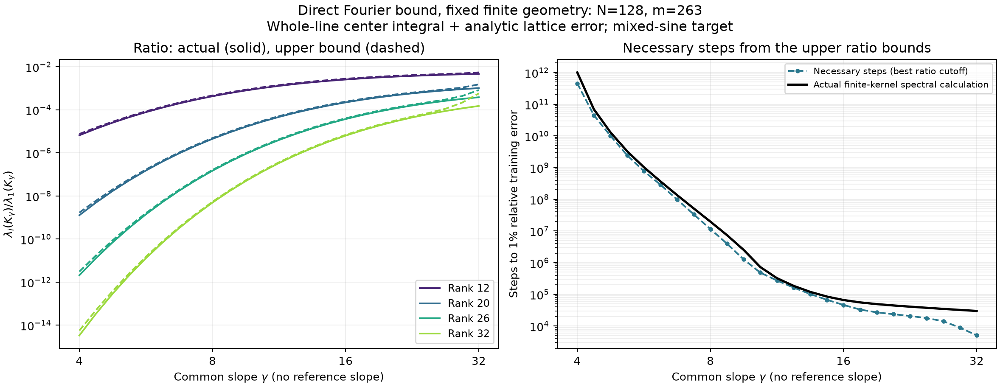

# Direct gamma-dependent upper ratios and necessary training time

Draft for discussion, 23 September 2026. This does not replace the polished note.

The comparison with a reference gamma is unnecessary. At each gamma separately, the finite kernel is bounded above, on zero-mean sample vectors, by a whole-line center integral plus an analytic lattice error. This gives an upper bound on its ordered eigenvalue ratios. Combining that upper bound with the target's positive-spectrum tail energy gives a necessary training time.

On the note's existing mixed-sine problem, the resulting lower bounds are approximately 453 billion, 11.50 million, and 46,249 updates at gamma 4, 8, and 16. The corresponding finite-kernel spectral calculations give 1.008 trillion, 19.70 million, and 66,209 updates. No training was run. Numerical values are checked FP64 evaluations of the inequalities below, not interval-certified numbers.

## Setup and the bound

Use the note's normalization, features, and step size:

\[
B_{aj}=m^{-1/2}\tanh(\gamma(x_a-c_j)),\qquad B_{a0}=m^{-1/2},\qquad
K_\gamma=B_\gamma B_\gamma^\top,\qquad \eta_\gamma=\frac1{2\lambda_1(K_\gamma)}.
\]

The centers are any finite subset of a lattice of spacing \(h\). The samples may be arbitrary real locations; they do not need to be commensurate with the centers. Let \(Q\in\mathbb R^{m\times(m-1)}\) have orthonormal columns spanning the sample vectors whose entries sum to zero. Thus \(Q^\top Q=I\) and \(Q^\top\mathbf1=0\). Set

\[
t_\gamma(c)=\bigl(\tanh(\gamma(x_a-c))\bigr)_{a=1}^m,
\qquad
H_\gamma=\frac1{hm}\int_{\mathbb R}
Q^\top t_\gamma(c)t_\gamma(c)^\top Q\,dc.
\]

The integral is finite because the constant tails cancel after projection. Write its ordered eigenvalues as \(\alpha_1(\gamma)\ge\cdots\ge\alpha_{m-1}(\gamma)\ge0\). This is the zero-mean restriction of the note's existing separation-dependent matrix:

\[
H_\gamma=-\frac2{hm}Q^\top
\bigl[(x_a-x_b)\coth(\gamma(x_a-x_b))\bigr]_{a,b}Q.
\]

The diagonal entry in the bracket is \(1/\gamma\). No old kernel or reference gamma appears.

For any angle \(0<\vartheta<\pi/2\), define the analytic sampling correction

\[
\delta_\gamma(\vartheta)=
\frac{8\gamma\|x-\bar x\mathbf1\|^2\sec^4\vartheta}
{3hm\,[\exp(2\pi\vartheta/(\gamma h))-1]},
\qquad \bar x=m^{-1}\sum_a x_a.
\]

A scalar lower bound on the largest eigenvalue is obtained by testing the constant unit vector:

\[
\ell_\gamma=1+\sum_j\left[\frac1m\sum_a\tanh(\gamma(x_a-c_j))\right]^2
\le\lambda_1(K_\gamma).
\]

This requires only feature averages, not an eigendecomposition. In particular, \(\ell_\gamma\ge1\).

**Direct upper-ratio bound.** For \(i=2,\ldots,m\),

\[
\boxed{
\frac{\lambda_i(K_\gamma)}{\lambda_1(K_\gamma)}
\le b_i(\gamma):=
\min\left\{1,\frac{\alpha_{i-1}(\gamma)+\delta_\gamma(\vartheta)}{\ell_\gamma}\right\}.
}
\]

The loss of one eigenvalue index accounts for removing the constant sample direction. This is an upper bound for the actual finite network, not an assumption that Fourier waves are its eigenvectors.

## Why the Fourier calculation now supplies the upper bound

For any real sample vector \(u\) with \(\mathbf1^\top u=0\), define \(g_\gamma(c)=\sum_a u_a\tanh(\gamma(c-x_a))\). Bias contributes zero. Extending the finite center sum to the whole lattice adds nonnegative squares:

\[
u^\top K_\gamma u\le\frac1m\sum_{j\in\mathbb Z}g_\gamma(c_0+jh)^2.
\]

The lattice sum is at most its integral plus the explicit error above. Hence

\[
Q^\top K_\gamma Q\preceq H_\gamma+\delta_\gamma I.
\]

Compression interlacing then gives

\[
\lambda_i(K_\gamma)\le\lambda_{i-1}(Q^\top K_\gamma Q)
\le\alpha_{i-1}(\gamma)+\delta_\gamma.
\]

Dividing by \(\ell_\gamma\) proves the ratio bound. Finite halo truncation has been handled by an inequality with a known direction; no measured halo correction is needed.

The integral quadratic form has exactly the Fourier representation already developed in the note:

\[
\frac1{hm}\int_{\mathbb R}|g_\gamma(c)|^2dc
=\frac2{\pi hm}\int_{\mathbb R}
\frac{M_\gamma(\omega)^2}{\omega^2}
\left|\sum_a u_a e^{-i\omega x_a}\right|^2d\omega,
\qquad
M_\gamma(\omega)=\frac{\pi|\omega|/(2\gamma)}{\sinh(\pi|\omega|/(2\gamma))}.
\]

All terms are nonnegative. Increasing gamma increases this quadratic form for every fixed zero-mean vector simultaneously. Therefore \(H_\gamma\) increases in positive-semidefinite order and every ordered \(\alpha_j(\gamma)\) is nondecreasing. This conclusion does not require its eigenvectors to stay fixed.

For a fixed strip angle, \(\delta_\gamma\) is also nondecreasing. Consequently a slope cap \(0<\gamma\le\Gamma\) gives the uniform inequality

\[
Q^\top K_\gamma Q\preceq H_\Gamma+\delta_\Gamma I.
\]

Using the weaker universal denominator \(\lambda_1\ge1\) gives a ratio upper envelope that is explicitly nondecreasing in the cap. The sharper numerical bound uses \(\ell_\gamma\). Neither statement proves universal monotonicity of the actual normalized finite eigenvalues, or of training times for every target. Target weights can change, and the scalar normalization must still be retained.

The numbers \(\alpha_j\) are calculated from the center-integral operator. This is not a closed scalar formula in rank and gamma. Its additional content over an exact finite-kernel diagonalization is the proved upper comparison, its analytic grid error, and the positive Fourier representation that proves how the entire integral operator varies with gamma.

## Analytic lattice-error proof

Write \(T(z)=\tanh(\gamma z)\), and take a strip height \(d=\vartheta/\gamma\). The function \(g\) is analytic on the closed strip \(|\operatorname{Im}z|\le d\) and decays at both ends. Since the coefficients sum to zero,

\[
g(z)=\sum_a u_a[T(z-x_a)-T(z-\bar x)].
\]

The elementary complex hyperbolic-cosine identity implies

\[
|\operatorname{sech}^2(t+i\vartheta)|\le\sec^2\vartheta\,\operatorname{sech}^2t,
\qquad
\|T'(\cdot\pm id)\|_2^2\le\frac{4\gamma}{3}\sec^4\vartheta.
\]

Writing each difference as an integral of \(T'\), applying Minkowski, and then Cauchy–Schwarz yields

\[
\int_{\mathbb R}|g(t\pm id)|^2dt
\le A:=\frac{4\gamma}{3}\sec^4\vartheta\,
\|x-\bar x\mathbf1\|^2\|u\|^2.
\]

Apply contour shifting to the analytic function \(f(z)=g(z)^2\), not to the nonanalytic function \(|g(z)|^2\). Its shifted absolute integral is bounded by \(A\). Thus \(|\widehat f(\omega)|\le A e^{-d|\omega|}\). Poisson summation and the geometric series give

\[
\left|h\sum_j g(c_0+jh)^2-\int g(c)^2dc\right|
\le\frac{2A}{e^{2\pi d/h}-1}.
\]

Division by \(hm\) gives \(\delta_\gamma\|u\|^2\) with precisely the constant stated above. This proof was independently reviewed, including the strip constant, the compression index, and denominator direction.

## Training-time consequence

For a rank cutoff \(i\), let

\[
p_i(\gamma)=\sum_{j\ge i:\lambda_j(K_\gamma)>0}
\frac{|u_j(\gamma)^\top y|^2}{\|y\|^2}.
\]

All these positive eigenvalue ratios are at most \(b_i(\gamma)\), by ordering. The note's Section 4 therefore gives

\[
E_\gamma(n)^2\ge p_i(\gamma)(1-b_i(\gamma)/2)^{2n},
\qquad
n_\epsilon(\gamma)\ge
\frac{\log(\sqrt{p_i(\gamma)}/\epsilon)}{-\log(1-b_i(\gamma)/2)}
\]

when \(p_i>\epsilon^2\), with an integer ceiling. Maximizing over eligible cutoffs strengthens the same lower bound. No reference gamma enters the ratio or step bounds. The numerical target weights here are still measured from the actual finite feature SVD; the theorem does not yet eliminate that target-dependent calculation.

## Numerical results and limitations

Use the polished note's geometry: 128 interior intervals, \(h=1/64\), 153 total tanh neurons plus bias, and 263 samples. The target is \(\sin(2\pi x)+\frac12\sin(6\pi x)+\frac14\sin(10\pi x)\). Use \(\vartheta=\arctan(\pi/(2\gamma h))\), a valid strip angle chosen analytically from gamma and center spacing.

| Gamma | Rank-26 actual ratio | Rank-26 upper bound | Best necessary steps | Finite-kernel steps |
|---:|---:|---:|---:|---:|
| 4 | 2.088e-12 | 3.088e-12 | 4.530e11 | 1.0076e12 |
| 8 | 1.487e-7 | 1.623e-7 | 1.150e7 | 19,697,563 |
| 16 | 3.715e-5 | 4.039e-5 | 46,249 | 66,209 |
| 32 | 3.826e-4 | 8.241e-4 | 5,076 | 29,938 |
| 64 | 8.357e-4 | 1 (trivial) | 6.64 | 18,272 |

The best cutoffs are 26, 26, 22, 22, and 2. The target tolerance is 1%. Counts shown as decimals are unrounded lower bounds; apply a ceiling for integer steps. At gamma 4, the chosen positive tail has mass 0.0004050. All table values concern training-sample relative error.

The analytic grid correction is tiny at small gamma: approximately 1.31e-59, 3.21e-26, and 5.68e-10 in kernel eigenvalue units, before dividing by the largest eigenvalue, at gamma 4, 8, and 16. It becomes 0.0279 at gamma 32 and 80.5 at gamma 64. The large-gamma bound is therefore loose or trivial; this calculation establishes a useful small-gamma obstruction, not a uniformly tight forecast at every gamma.

The continuum spectrum was evaluated using a square-root quadrature factor, avoiding cancellation from forming its Gram matrix. Increasing quadrature order from 10 to 16 and extending the integration interval changed the plotted eigenvalues by at most 1.5e-10 relative at the checked slopes. Independent Fourier integration agrees within 1.9e-10 relative. The omitted center-integral tails have an analytic norm bound below 5.8e-34. These checks do not constitute an interval certificate for quadrature or floating-point errors.

Finite ratios and positive target masses use the rectangular feature SVD. An independent SVD driver changes the gamma-4 rank-26 mass by about 6.5e-12 relative. Only ratios above 1e-18 contribute to the reported positive target mass. At roundoff-scale ratios near 1e-32, numerical inequalities were not treated as resolved. All ratio inequalities passed on the retained modes.

Left: solid actual finite ratios and dashed direct upper bounds, colored by rank. Right: the strongest necessary-time lower bound among the cutoffs and the full finite-kernel spectral count. Every horizontal location is a separate calculation at that gamma; there is no reference slope. The right panel uses positive target energy at each gamma, so it does not hold eigenvector coefficients fixed.

Code: `experiments/expD37_capacity_access_figures/gamma_solve/spectrum_mechanism/direct_ratio_upper_bound.py`. Numerical results and checks: `data.json` in this folder.
