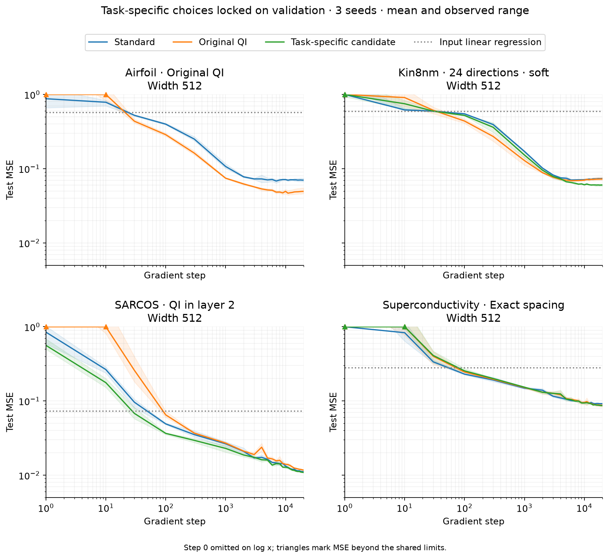
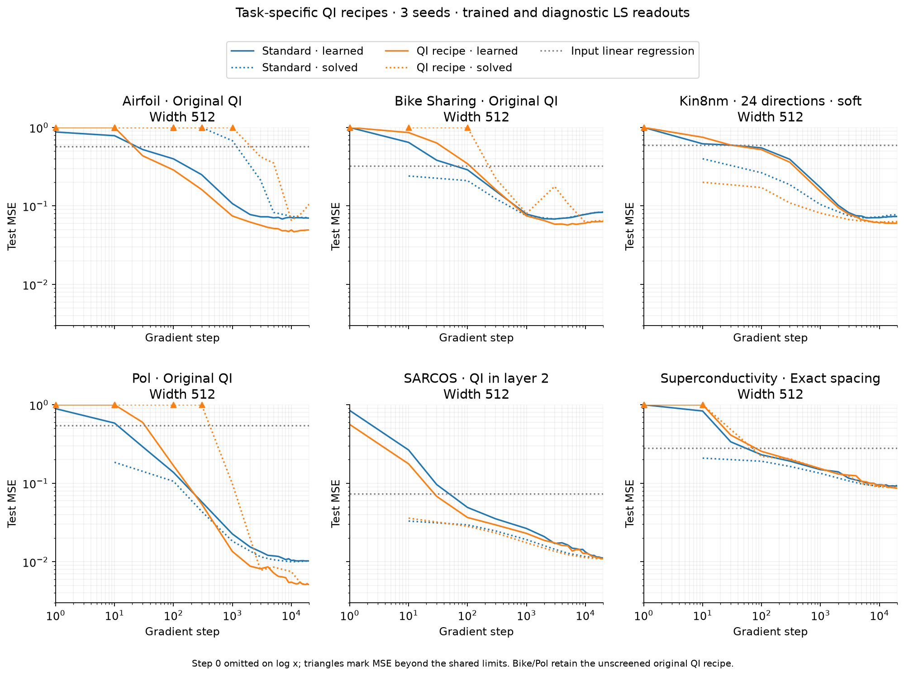
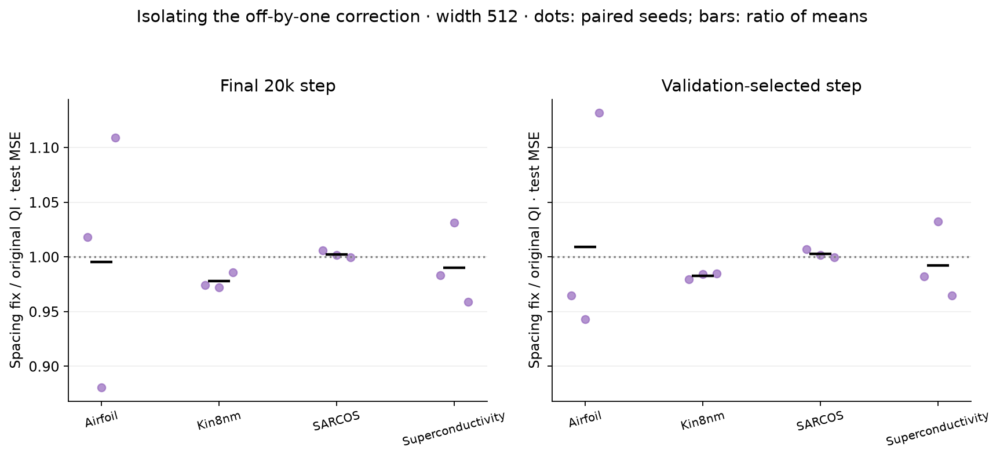

# expD39: theory audit and corrected QI initializers — Status: complete

## TL;DR

- Direction-dependent row norms are compatible with QI geometry. The relevant invariant is slope times actual center spacing, not a single gamma for the entire layer. D38's endpoint-count inconsistency is real and is corrected in a separately versioned initializer.
- The validation screen does not identify a clear universal improvement. Across thirteen variants, the best new aggregate score is only 0.3% below original QI; a narrower gamma histogram is not itself a useful optimization target.
- The task-specific leads survive three-seed confirmation: softer banks lower Kin8nm test MSE by 11.8% versus original QI, and QI only in the second hidden layer lowers SARCOS by 6.7%, at validation-selected checkpoints. The improvements over standard initialization are 14.7% and 2.5%, respectively.
- All 88 new training runs are complete: 52 validation-only screens and 36 confirmations, alongside 36 reused D38 controls. All runs retain two width-512 tanh hidden layers and the same per-task training recipe. The global candidate is effectively tied with original QI; the isolated spacing fix yields small, mixed changes.

## Question / hypothesis

Does the broad first-layer gamma distribution indicate a violation of QI theory, and can correcting actual discrepancies improve ordinary two-hidden-layer training? Separate geometry correctness, frozen-span approximation, and learned generalization rather than treating them as equivalent.

## Experiment design

For a bank of unit directions $u_r$ and endpoint-inclusive centers $c_{rj}$, the feature is $\tanh(\gamma_r(u_r^T x-c_{rj}))$. The weight-row norm is $\gamma_r$. If the projected interval has midpoint $m_r$, half-width $A_r$ and $P_r$ centers, the actual spacing is $h_r=2A_r/(P_r-1)$, so $\gamma_r=\lambda/h_r$. In normalized projected coordinates $(u_r^T x-m_r)/A_r$, the slope is $\gamma_rA_r=\lambda(P_r-1)/2$. Different projection ranges therefore imply different physical row norms even when the dimensionless construction is consistent.

D38 instead used $h_r=2A_r/P_r$ together with endpoint-inclusive centers. Its nominal $\lambda=.25$ is actually .261905 in a 22-center bank and .3 in the six-center remainder. The correction-only arm changes the divisor while preserving the historical direction allocation and projection ranges. The old initializer, trained checkpoints and D38 results are retained unchanged.

The first stage contains eleven arms. All are dense, unconstrained, trainable MLPs after initialization; none ties directions during training.

| Arm | Difference from its parent |
|---|---|
| Original QI | Historical control: 23 banks of 22 plus six remaining neurons; origin-centered 99.9% absolute-projection ranges |
| Exact spacing | Original QI with actual gap count used in gamma |
| Balanced banks | Exact spacing, 24 banks of sizes 21/22 |
| Centered banks | Balanced banks with lower/upper .0005/.9995 projection quantiles and corresponding bias translation |
| 25% collar | Centered banks with projected half-ranges multiplied by 1.25; fixed total width |
| Common gamma | Centered banks using one common spacing large enough to cover every estimated interval |
| Lambda .5 / 1 | Centered banks with only the bandwidth parameter changed |
| 64 directions | Centered geometry with 64 banks of eight centers, lambda .25 |
| QI in layer 1 / layer 2 | Centered-bank initialization only in the named layer; Xavier in the other |

The second iteration addresses a confound in the 64-direction comparison: fewer centers also lower normalized slope at fixed lambda. Two further arms approximately complete a direction-allocation by normalized-slope factorial. With 24 directions, lambda .0875 gives $\gamma A=.875/.91875$; with 64 directions, lambda $5/7$ gives $\gamma A=2.5$. Existing centered banks have normalized slope $2.5/2.625$, while eight-center banks at lambda .25 have slope .875. The 21/22-center mismatch is explicit. Across direction counts, both allocation and direction samples change; this is not an isolated angular-coverage experiment. This adaptive extension was recorded after some first-stage validation results were visible and before its own runs. No new test scores were used.

The architecture and training recipes are inherited unchanged from D38: two tanh hidden layers, width 512, scalar linear readout, fp64 Adam, batch size 256, no weight decay, and a flat first 20% of the budget followed by cosine decay to 1% of the initial learning rate. The learning rates selected in D38 are fixed for every arm within a task: $10^{-4}$ for Bike Sharing and Kin8nm, $10^{-3}$ for the other tasks. All arms share the same seed-specific Xavier readout and independently seeded minibatch sequence. Initialization uses only fitting inputs, at most 4096 rows per layer. All 24-bank corrected arms share directions; the 64-bank arms change the subsequent RNG offset. Layer-only controls preserve second-layer direction pairing by consuming and then discarding the first-bank draw when appropriate.

The 52 screening runs cover Airfoil, Kin8nm, corrected SARCOS and Superconductivity, seed 0, 10k steps. Superconductivity supplies an input dimension above the 24-direction rank limit. Screening evaluates fitting and validation splits only. Each arm is scored by its minimum validation MSE over the common checkpoint schedule, divided by original QI's corresponding minimum; the four task ratios are combined geometrically. The globally best **new** arm is retained for confirmation even if its score does not beat original QI. Task-specific winners are separately retained, following Sam's permission for per-task tuning. These are exploratory comparisons, not a preregistered population-level significance test.

Before confirmation, the candidate identities, all 52 screening files, their hashes, training source hashes and the complete confirmation job list were locked. The global candidate is 64 directions with lambda $5/7$. The task-specific choices are original QI for Airfoil, softer 24-direction banks for Kin8nm, second-layer-only QI for SARCOS, and the isolated spacing correction for Superconductivity. Thirty-six new 20k-step runs cover the global candidate on all six tasks, the distinct task-specific candidates, and the spacing control on all four screened tasks, with seeds 0/1/2. D38's 36 standard/original-QI controls are reused only after matching training configuration, data metadata, split/source hashes and checkpoint schedules.

The six-panel task-recipe figures retain original QI on Bike Sharing and Pol because those tasks were not included in the task-specific screen. These are explicitly labeled defaults, not additional discoveries or task-specific selections from confirmation test errors. The separate global-candidate comparison includes all six tasks.

Each confirmation run records the actual trained readout and an observational centered-SVD least-squares readout at the same checkpoints as D38. The solve uses cutoff $10^{-12}$ and never changes the model or Adam state. Initial frozen-feature ridge uses validation-selected regularization. Input affine regression remains the non-neural reference. Both final 20k-step errors and errors at the validation-selected checkpoint are reported; they answer different questions. MSE is measured in train-standardized target units.

The separate scalar geometry check uses three analytic targets, interior interval counts 16/32/64, lambda .25/.5/1 and zero or sixteen halo neurons per side: 54 cells. Features and readouts are fitted on 2049 uniform points and evaluated on 2049 staggered points, with fixed SVD cutoff $10^{-12}$. Adding halo here holds interior spacing fixed and increases total width from $N+1$ to $N+33$; it is not a matched-parameter training comparison. The actual derivative-convolution constructor is also exercised in its documented fp64 mode. Initial tabular diagnostics separate weight-matrix rank from centered nonlinear-feature rank, saturation, derivative magnitude and actual gamma-times-spacing.

**Code & data**

- `experiments/expD39_qi_init_theory/{config.yaml,initialization.py,run.py,followup.py,confirm_campaign.py,diagnostics.py,analyze.py,movement.py,reference_check.py}`.
- `tests/test_expD39_qi_init_theory.py`; inherited readout and data controls in `tests/test_expD38_readout_baseline.py`.
- Posthoc screening audits: `experiments/expD39_qi_init_theory/pilot_probes.py`, `pilot_readout_probes.json`, `pilot_probe_note.md`; focused view: `plot_bandwidth_tradeoff.py`.
- This output directory: `STATUS.md`, `followup_plan.md`, `theory_audit.md`, `variant_manifest.json`, `selection.json`, `geometry.json`, `analytic_checks.json`, and confirmation summaries.
- Traces and final checkpoints: `data/pilot/`, `followup/data/pilot/`, `data/compare/`. Historical control data remain in D38.
- Figures: `figures/validation_screen.png`, `screen_*_trajectories.png`, `gamma_and_spacing.png`, `initial_feature_spectra.png`, `analytic_geometry.png`, and confirmation plots.
- Theory sources: `papers/QIs_workshop.pdf`, `papers/Section_3_Rewrite.pdf`, `papers/practical_implementation.tex`; current qualified bandwidth note in `results/checkpoint_C_geometry/expC07_lambda_energy_rule/lambda_rule/hardened_rule.md`; ridge/depth notes and the newer supplied three-theorem manuscript linked in `theory_audit.md`.

## Results

The corrected banks satisfy $\gamma\Delta c=\lambda$ to numerical precision, including coordinate translations and the common-gamma arm. Eighteen focused tests passed. The real fp64 derivative-convolution construction reaches sampled maximum error $4.8\times10^{-12}$ on $\sin(\pi x)$ at 64 interior intervals, consistent with the documented construction regime. A separate complete-construction check on $\sin(2\pi x)$, including copying every hidden and readout coefficient into an ordinary PyTorch MLP, reaches maximum error $2.8\times10^{-15}$ over 2001 evaluation points with offline mpmath coefficients and float64 model evaluation. This is a sampled error, not a certified continuous supremum. The two coefficient-generation examples use their documented, different lambda/halo settings and are not a pure precision ablation. The scalar span checks recover the strong influence of halos and the tradeoff between resolution and bandwidth, without certifying the tabular initializer.

On the four-task screen, the isolated spacing correction is essentially tied with original QI. Balancing, projection centering, a collar, and a common gamma do not deliver an aggregate improvement. Simply increasing lambda is unfavorable, especially on Kin8nm. The direction/slope controls show that softer 24-direction banks reproduce and slightly exceed the Kin8nm improvement initially seen with 64 directions; extra directions are not the only plausible explanation.

The posthoc initial/final readout audit verifies real feature learning in every one of the 52 pilots: final-feature LS training MSE improves over initial-feature LS, and final trained validation MSE improves over validation-tuned ridge on the frozen initial features. The trained readout is only 4.1% above the final LS training MSE at the median, while unrestricted LS worsens validation in 45 of 52 runs. In the controlled Kin8nm bandwidth comparison, increasing lambda from .25 to 1 lowers final fitting MSE from .0337 to .00204 but raises validation MSE from .0670 to .206. Re-solving the head does not remove this difference. Better conditioning and fitting therefore do not establish better generalization.

The aggregate selection margin is too small to support a new universal default. The global 64-direction candidate has a geometric-mean test-MSE ratio of .9959 versus original QI at validation-selected checkpoints, and .9952 at the final 20k step. It wins 10 of 18 paired seed comparisons at validation-selected checkpoints. These small, mixed differences do not establish a meaningful aggregate improvement.

The stronger task-specific effects persist. The table reports **test MSE at each run's validation-selected checkpoint**, averaged over seeds 0/1/2. All candidate recipes were selected using the four-task validation screen; Bike Sharing and Pol retain the original-QI default.

| Task | Standard | Original QI | Task recipe | Recipe MSE | Change vs original QI |
|---|---:|---:|---|---:|---:|
| Airfoil | .068549 | .048397 | Original QI | .048397 | — |
| Bike Sharing | .068065 | .057364 | Original QI, unscreened | .057364 | — |
| Kin8nm | .070709 | .068388 | Centered, balanced 24 banks; lambda .0875 | .060311 | −11.8% |
| Pol | .010236 | .005284 | Original QI, unscreened | .005284 | — |
| SARCOS | .011236 | .011735 | Centered, balanced QI in layer 2 only | .010951 | −6.7% |
| Superconductivity | .094281 | .087817 | Isolated exact-spacing correction | .087132 | −0.8% |

Kin8nm improves over both original QI and standard in all three paired seeds. SARCOS improves over original QI in all three, but over standard in only two of three; its 2.5% mean advantage over standard is modest. At the final 20k step, Kin8nm's softer recipe has test MSE .060262 versus original QI .072520 (16.9% lower), while SARCOS has .010914 versus .011735 (7.0% lower). The task-specific recipes include balanced, centered, exact-spacing banks; comparison against the historical QI initializer does not isolate bandwidth or layer placement alone. The screening comparisons against the centered parent provide the corresponding one-factor evidence.

The isolated spacing correction changes validation-selected mean test MSE by +0.9% on Airfoil, −1.7% on Kin8nm, +0.3% on SARCOS, and −0.8% on Superconductivity. Kin8nm improves in all three pairs; the other effects are mixed. Formula correctness is a reason to use the corrected implementation in future work, not evidence of a large empirical gain.

The Airfoil movement diagnostic compares original QI with the **global** 64-direction candidate at seed 0; Airfoil's task-specific choice remains original QI. Original QI's median row norms grow by factors 1.20 and 1.07 in layers 1/2; median cosines to their own initial directions are .959 and .954. Median within-bank pairwise cosines fall from 1 to .901 and .871. The second weight matrix expands from numerical rank 24 to 512 using relative singular-value cutoff $10^{-12}$. Thus substantial memory of initial directions coexists with broken bank alignment and newly available weight directions. The global candidate behaves similarly, with row-norm ratios 1.15/1.06, own-row cosines .976/.963, within-bank cosines .927/.904, and second-layer rank 64 to 512. These measurements describe one run; near-full numerical rank is not a claim about effective spectral dimension.

Confirmation validation checks passed for all 72 new/reused runs: matching run identities, data metadata, source/split hashes, unchanged training sources and full checkpoint schedules. At all 720 recorded LS observations, the solved fitting loss is no greater than the trained fitting loss within tolerance.

### Figures

- **Gamma and spacing:** two rows for the hidden layers, raw row norms on the left and actual gamma-times-spacing on the right. Common bins and corresponding axis limits show that broad physical scales can coexist with a correct invariant.
- **Validation screen:** thirteen arms by four tasks, plus aggregate ratios. Values below one improve on original QI; these are selected validation scores from one seed, not held-out evidence.
- **Screen trajectories:** separate four-panel views for the correction ladder, alternative bandwidth/layer choices, and the direction/slope factorial. Log-log axes share limits and the same training budget.
- **Initial/final readout probes:** four task rows, fitting versus validation columns. Initial LS and validation-tuned ridge are compared with the final trained and final LS readouts. All 52 initial/final models reproduce saved trace errors; off-scale LS values are marked, with complete values retained in JSON.
- **Bandwidth fitting/generalization tradeoff:** Airfoil and Kin8nm, fitting and validation columns, the same centered 24-bank family at four lambda values. Solid/dotted lines distinguish trained and LS heads; all other per-task training choices are shared.
- **Initial feature spectra:** four tasks, centered second-hidden-layer features on fitting inputs, singular values normalized by each matrix's largest. These nonlinear-feature spectra must not be equated with the rank of the hidden weight matrices.
- **Complete-construction reference:** pointwise error across the scalar input interval for the two documented fp64/mpmath coefficient-generation operating points, evaluated by an ordinary float64 tanh MLP. This checks the source construction, not the tabular initialization.
- **Analytic geometry:** three scalar targets, relative error versus interior interval count; color denotes lambda, line style denotes halo allocation. Total width is stated in the legend. Solver cutoff and finite-interval fitting qualify the numerical floors.
- **Task-specific confirmation:** four screened tasks, standard/original-QI/task-candidate test trajectories, with means and observed ranges across three seeds. The range is not a confidence interval.
- **Global confirmation:** six tasks comparing the single locked 64-direction candidate against standard and original QI, separately for validation and test MSE.
- **Trained/solved readout comparisons:** six tasks, blue standard and orange QI; solid trained and dotted diagnostic LS heads; gray input affine regression. Separate global-candidate and task-recipe figures prevent conflating their selection rules. All panels share log-log limits with MSE ceiling 1; triangles identify values outside the displayed range and step 0 is omitted on the log x axis. Full values remain in the run JSON files.
- **Spacing control:** final and validation-selected test errors, expressed as exact-spacing/original-QI ratios. Dots show paired seeds; bars show ratios of task means.
- **Bank alignment:** initial-to-final row cosines and final within-original-bank pairwise cosines, in both hidden layers, for original QI and the global candidate on Airfoil seed 0. This supplements the earlier D38 standard/QI movement histograms.

## Additional details

The complete QI theorem is not an ordinary-training initialization theorem. It requires scalar target regularity, suitable grids and boundary treatment, and target-dependent or adequately fitted coefficients. The conditional depth result additionally needs useful scalar channels, tracked ranges and controlled downstream amplification. Random ridge directions, a random readout and unconstrained two-layer Adam do not inherit these guarantees. In particular, the fp64-motivated lambda choice need not minimize noisy validation error.

The paper audit identifies three issues in older displayed arguments: a fixed aliasing contribution absorbed into an exponential-width claim, inconsistent finite-convolution reindexing, and a missing factor of grid spacing in a Toeplitz right-hand side. The code implements the latter normalization correctly. The newer supplied manuscript separates representation, finite-data recovery and numerical certification and retains an explicit replica contribution. This audit changes how the old statements should be cited; it does not modify the manuscripts or claim to validate all proofs in the newer document.

The original first-layer gamma spread follows direction-specific ranges; the six-neuron tail is a separate allocation artifact. The second layer uses hidden-coordinate directions. Once training separates rows that began in the same bank, assigning one scalar center spacing and lambda to that entire final bank is not well-defined without an alignment qualification. Row retention and within-bank pairwise alignment are therefore measured separately.

All repetitions share one fixed data split. They quantify initialization and minibatch variability, not uncertainty across data splits or populations. D38's overlap caveats remain: these are random-row interpolation benchmarks; Superconductivity contains repeated input vectors, and no new-material-family generalization claim follows. SARCOS uses the corrected disjoint split of the training source, excluding its duplicated supplied test file.

## Conclusions

The broad gamma histogram is not, by itself, evidence against QI theory. The spacing inconsistency is a genuine implementation defect, now corrected in a separately versioned and checked initializer. For new experiments, use actual center gaps when computing gamma; preserve the historical initializer as a labeled control.

The theory provides a useful organization for initialization—projection domains, spacing, bandwidth, boundary coverage and angular allocation—but does not give a universal noisy-data training recipe. A narrower gamma histogram, more directions, better feature conditioning and smaller fitting error each fail as sufficient criteria for better held-out performance here. Retain the confirmed softer Kin8nm and second-layer-only SARCOS recipes as task-specific candidates, with matched standard and original-QI controls. There is no evidence to replace the global default with the 64-direction candidate.

The six tasks continue to learn nonlinear representations and beat input linear regression. The readout audit additionally shows that these improvements cannot be explained by fitting a linear head on unchanged initial features. Unregularized LS remains a fitting-capacity diagnostic; its lower training loss does not make it a better predictor.

## Open questions

- Do task-specific bandwidth and layer-placement effects persist across fresh data splits?
- Can smooth data-density-matched center allocation improve training without sacrificing the local spacing invariant?
- Does a useful two-layer theory require preserving bank structure during training, or can unconstrained feature learning reliably benefit from it only at initialization?
