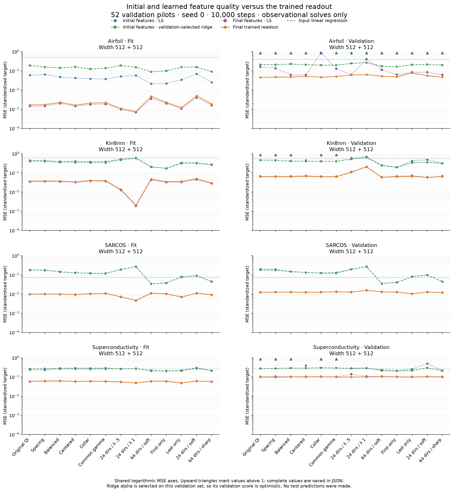

# Initial and final readout probes on the validation pilots

All 52 saved 10k-step pilots were checked at initialization and completion.
Reconstructed initial predictions and saved final-model predictions reproduce
the recorded training/validation MSEs within relative tolerance `1e-10` and
absolute tolerance `1e-12`. Checkpoint identities, data metadata, source hashes,
and the locked selection were checked. No test predictions, training updates,
or selection changes were made.

One centered SVD per geometry supplies the observational LS head at relative
cutoff `1e-12`; the initial SVD also supplies D38's frozen-ridge grid, whose
alpha is selected on validation. Coefficient norms, retained rank, retained
condition number, participation rank, and all fit/validation errors are in
[pilot_readout_probes.json](pilot_readout_probes.json). The ridge validation
score is optimistic because that same validation set chooses alpha. Retained
condition number is the ratio within the kept singular subspace, not the
condition number of a discarded or rank-deficient full matrix.

The left column measures training fit; the right measures validation. Blue is
the initial-feature LS head, green the initial-feature validation-selected
ridge head, purple the final-feature LS head, and orange the final trained
head. Every panel shares logarithmic axes capped at MSE 1. Upward triangles
mark off-scale values; the JSON retains their full magnitudes. These are four
tasks, thirteen initializer arms, and one seed on fixed splits.

Three findings separate the mechanisms:

- **Feature learning contributes in every pilot.** Final-feature LS training
  MSE is lower than initial-feature LS training MSE in all 52 runs. Final
  trained validation MSE also beats the validation-tuned initial frozen-ridge
  baseline in all 52. This does not identify a universally best initializer.
- **Larger lambda can improve fitting while hurting generalization.** On
  Kin8nm, centered 24-direction banks at lambda .25 versus 1 have initial
  participation ranks 8.31 versus 20.35 and retained condition numbers
  `1.14e8` versus `1.27e3`. Final trained fit MSE improves from .03368 to
  .00204, while validation worsens from .06696 to .20620. Final LS validation
  is .06935 versus .20764, so re-solving the readout does not remove this
  difference. Airfoil has the same fit/validation tradeoff; SARCOS worsens
  more mildly, and Superconductivity's trained validation is nearly unchanged.
  These data support a fitting/generalization tradeoff, not the claim that
  larger lambda simply prevents learning.
- **An unregularized solve is often a worse validation model.** Final LS
  improves or matches training fit as required, but worsens validation versus
  the trained head in 45 of 52 pilots. Initial Airfoil LS is particularly
  unstable: original QI gives validation MSE `4.39e8`, whereas its
  validation-selected ridge gives .2103. The fixed tiny singular-value cutoff
  is a capacity/access diagnostic, not an appropriate universal noise model.

The SVD implementation was numerically checked against D38's independent
`gelsd` LS helper and frozen-ridge helper on a deterministic full-rank problem.
Three real-data spot checks also agree: the ill-conditioned initial Airfoil
QI validation MSE differs by .0245% between `gesdd` and `gelsd`, with identical
retained rank 446; final Airfoil QI and initial Kin8nm lambda 1 agree much more
closely. Small solver differences do not explain the observed validation
failures.

The locked sharp64 candidate remains unchanged. This posthoc audit supplies
mechanistic evidence; it is not an additional round of parameter selection,
an independent test set, or a proof that conditioning determines generalization.
