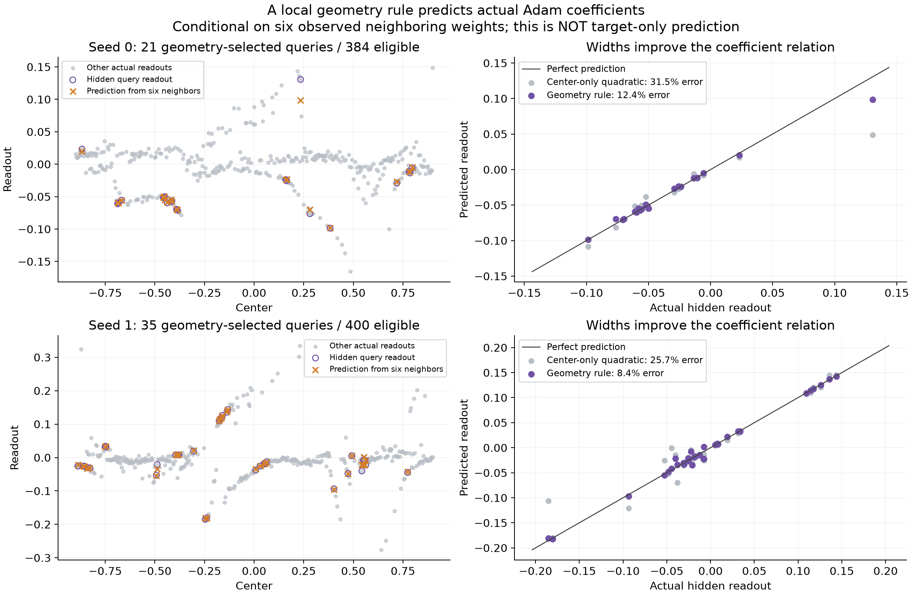
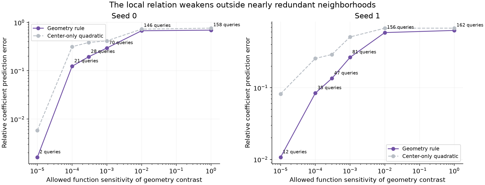
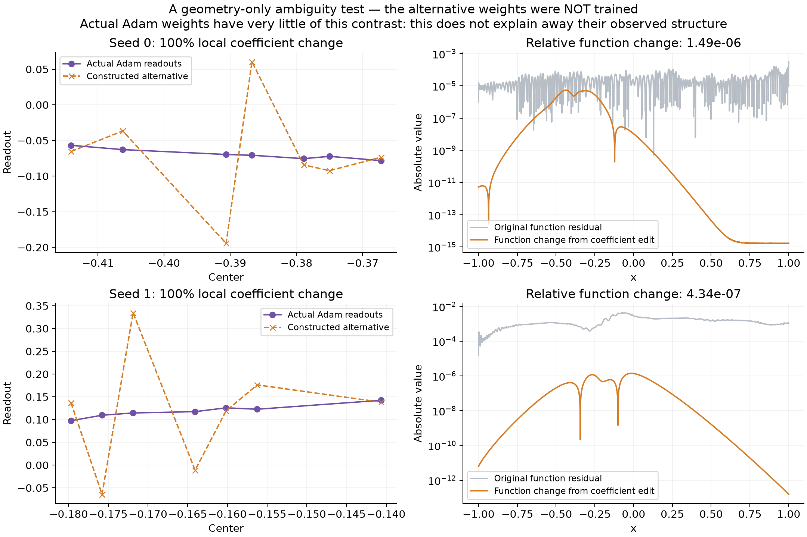

# Actual Adam readouts: failed derivative encoders and a local geometry relation

Literature follow-up, September 30: see the source map at the end. The coefficient relation below has classical vanishing-moment and polynomial-interpolation foundations; its limited empirical validity on these Adam states is the observation being tested.

September 30, 2026. Codex. Fixed saved solutions; no new training.

## Outcome

The desired result has **not** been established: we still cannot explain the actual Adam branches as specified measurements of target derivatives using a compact target-to-readout rule.

Two tested derivative-encoding models fail on actual readouts. A separate, narrower success concerns **relations among readouts**: a geometry-derived relation predicts one hidden coefficient from six nearby observed coefficients substantially better than a center-only interpolation control, in selected nearly redundant neighborhoods. This is conditional coefficient prediction, not prediction from the target.

The distinction is central. None of the results below is presented as a successful reconstruction of the user's proposed derivative lens.

Sources are the expD06 fixed-center, collectively normalized Adam controls at 2.3 million steps, seeds 0 and 1, for the target \(\sqrt2\sin(2\pi x)\). These are the same states used in the recent Adam figure, not the unavailable earlier 320k screenshot states. All 559 neurons are retained when evaluating functions. Coefficient diagnostics use the declared subset \(|c|<0.9,\gamma>5\): 384 neurons for seed 0, 400 for seed 1.

## 1. The target-derivative models that failed

Let \(v_j\) be a saved physical readout, \(c_j\) its center, and \(\gamma_j>0\) its inverse width after absorbing any negative slope sign into the readout. Write \(q=f'\), where \(f\) is the known target. A uniform family with spacing \(h\) suggests \(v_j\approx hq(c_j)/2\).

For a sinusoidal derivative of frequency \(\omega\), equal-width smoothing has multiplier

\[
H_\gamma(\omega)=
\frac{\pi\omega/(2\gamma)}{\sinh(\pi\omega/(2\gamma))}.
\]

This motivates an explicit branch profile

\[
p_{bj}=\mathbf1_{j\in b}\frac{h_{bj}}{2H_{\gamma_j}(\omega)}q(c_j),
\]

where \(b\) is a geometry-defined log-width bin and \(h_{bj}\) is the local Voronoi spacing among centers in that bin. The tested bins divide the log interval from gamma 5 to 160 into 2, 3, 4, 6, 8, or 12 groups; larger gammas enter the last group. Groups with fewer than three members are omitted.

We also allow a phase-shifted derivative profile, proportional to \(\sin(\omega c_j)\), and a constant profile. For each geometry-defined pattern family, a small function-space least-squares fit supplies its amplitudes using the target and geometry only. It never sees the actual Adam readouts.

The important control then permits amplitudes to be fitted directly to the Adam weights. This is deliberately an **oracle/descriptive upper bound**, not a prediction. If even that fit fails, the chosen pattern family cannot describe those readouts irrespective of how its amplitudes are calculated.

Across the entire tested bank, the best oracle relative coefficient errors are approximately **90.6% for seed 0 and 90.5% for seed 1**. Target-only predictions are also poor. Thus these log-width families, each carrying scaled/phase-shifted derivative profiles with the stated spacing correction, do not explain the observed branches.

This does not reject all geometry-dependent derivative interpretations. In particular, a global width bin is not necessarily a genuine learned branch. It rejects this explicit low-dimensional model.

A second model proposes one latent one-dimensional field \(u\), with every readout obtained by averaging that same field at its own center and width:

\[
v_j\approx (k_{\gamma_j}*u)(c_j).
\]

This direction is different from summing neurons to reconstruct a derivative. A periodic Fourier representation on length 4 gives explicit geometry features
\(H_{\gamma_j}(\omega_m)\cos(\omega_m c_j)\) and
\(H_{\gamma_j}(\omega_m)\sin(\omega_m c_j)\).
We test 4–96 harmonics, both physical and source-reference metrics, fitting two-thirds of eligible readouts and predicting every third eligible readout. The minimum held-out errors are about **92.4% and 100.1%**. Larger models overfit and worsen held-out error. Target-only versions also fail to predict the coefficients.

These results do not rule out an arbitrarily complex latent field, other boundary models, or several coupled fields. They rule out the tested compact single-field interpretation.

All model settings, errors, and descriptive-oracle results are saved in metrics.json. The exploratory scripts also remain here.

## 2. An explicit geometry relation between nearby coefficients

This test asks a narrower question: does geometry impose recognizable relations between neighboring Adam readouts?

For each eligible anchor neuron \(i\), choose its seven nearest eligible neurons using the dimensionless geometry distance

\[
d_{ij}^2=[\gamma_i(c_j-c_i)]^2+
          [\log(\gamma_j/\gamma_i)]^2.
\]

This selection does not use the target or readouts. Let \(J\) denote those seven indices. Relative to the anchor, define dimensionless coordinates

\[
u_j=\frac{\gamma_j-\gamma_i}{\gamma_i},
\qquad t_j=-\gamma_j(c_j-c_i),\quad j\in J.
\]

If \(z_i(x)=\gamma_i(x-c_i)\), then the difference between affine preactivations is exactly

\[
\delta_j(x)=\gamma_j(x-c_j)-z_i(x)=u_jz_i(x)+t_j.
\]

Construct the real \(6\times7\) matrix

\[
M=
\begin{pmatrix}
1\\u_j\\t_j\\u_j^2\\u_jt_j\\t_j^2
\end{pmatrix}_{j\in J}.
\]

Its rows evaluate all bivariate monomials of total degree at most two on these seven geometric points. Independently rescaling the \(u,t\) coordinates improves numerical conditioning without changing its nullspace.

Define a coefficient contrast \(d\in\mathbb R^7\) by cofactors:

\[
d_j\ \propto\ (-1)^j\det M_{\widehat j},
\qquad \|d\|_2=1,
\]

where \(M_{\widehat j}\) is the \(6\times6\) matrix obtained by deleting column \(j\). Laplace expansion of a determinant with a duplicated row gives \(Md=0\). Degenerate candidates are skipped. This requires small determinants, not a full network solve or a singular-vector fit.

### What is exact

The identities \(Md=0\) imply, for every real \(x\),

\[
\sum_jd_j=0,\qquad
\sum_jd_j\delta_j(x)=0,\qquad
\sum_jd_j\delta_j(x)^2=0.
\]

Taylor expansion of tanh around \(z_i(x)\) therefore cancels all terms through second order:

\[
\begin{aligned}
\sum_jd_j\tanh(z_i+\delta_j)
&=\sum_jd_j
\left[\tanh(z_i)+\tanh'(z_i)\delta_j+
\tfrac12\tanh''(z_i)\delta_j^2+
\tfrac16\tanh'''(\xi_j)\delta_j^3\right]\\
&=\tfrac16\sum_jd_j\tanh'''(\xi_j)\delta_j^3.
\end{aligned}
\]

Here \(\xi_j\) lies between \(z_i\) and \(z_i+\delta_j\), separately for each \(x,j\). Since
\(\sup_{z\in\mathbb R}|\tanh'''(z)|=2\),

\[
\left|\sum_jd_j\phi_j(x)\right|
\le \frac13\sum_j|d_j|\,|\delta_j(x)|^3,
\qquad
\phi_j(x)=\tanh(\gamma_j(x-c_j)).
\]

This is a local geometric cancellation mechanism. The bound can be conservative far from the cluster, so we independently evaluate the function sensitivity

\[
\varepsilon_J=
\left[\frac1{2049}\sum_{\ell=1}^{2049}
\left(\sum_{j\in J}d_j\phi_j(x_\ell)\right)^2\right]^{1/2}
\]

on equally spaced points in \([-1,1]\). This remains geometry-only: no target or readout enters.

### What is an empirical hypothesis, not a theorem about Adam

If a coefficient vector minimizes its Euclidean norm along a direction that leaves the represented function unchanged, it is orthogonal to that direction. Indeed,

\[
\|v_J-\tau d\|_2^2
=\|v_J\|_2^2-2\tau d^\mathsf Tv_J+\tau^2
\]

is minimized by \(\tau=d^\mathsf Tv_J\). For nearly invisible directions, approximate orthogonality is a plausible local selection property.

**This does not prove that Adam minimizes that norm**, or force an arbitrary fitted solution to obey \(d^\mathsf Tv_J\approx0\). That is the coefficient-level hypothesis tested on the saved states.

Choose the query index \(j_*\) with largest \(|d_j|\), using geometry alone. Predict its coefficient from the other six:

\[
\boxed{
v_{j_*}^{\rm pred}
=-\frac{\sum_{j\in J,\ j\ne j_*}d_jv_j}{d_{j_*}}.
}
\]

The actual query coefficient is not used in the prediction. This is equivalently quadratic interpolation of a coefficient field in the two affine-feature parameter coordinates. The geometric cancellation calculation supplies a reason to select neighborhoods and predicts where this local relation should be weak.

Repeated queries are deduplicated using the smallest geometry sensitivity, never the smallest observed prediction error. The control fits a quadratic in center alone to precisely the same six observed neighboring readouts.

## 3. Actual coefficient prediction results

At the illustrative sensitivity threshold \(10^{-4}\):

| State | Unique query neurons | Fraction of eligible neurons | Geometry prediction error | Center-only control error |
|---|---:|---:|---:|---:|
| Seed 0 | 21 / 384 | 5.5% | 12.39% | 31.52% |
| Seed 1 | 35 / 400 | 8.8% | 8.42% | 25.66% |

Errors are relative Euclidean coefficient errors over the selected query set. These are leave-one-neuron-out conditional predictions, not target-only predictions or validation on newly trained networks. The threshold sweep is exploratory; this threshold was not preregistered.

The stricter threshold \(10^{-5}\) gives errors 0.163% and 1.071%, but covers only 2 and 12 neurons. Relaxing to \(10^{-3}\) covers 70 and 81 neurons and raises errors to 29.6% and 26.6%. Broadening to all available deduplicated queries gives errors 69.3% and 63.1%.

Thus the evidence supports a local relation in selected neighborhoods, not a global interpretation of the full coefficient plot.

## 4. A controlled ambiguity test, with an important positive qualification

Choose the lowest-sensitivity cluster in each state using geometry alone. Add a multiple of its contrast to the seven readouts, with the multiplier equal to the norm of those seven original weights. This changes the local coefficient vector by 100% in relative norm.

| State | Change of full coefficient vector | Relative function change | Relative derivative change |
|---|---:|---:|---:|
| Seed 0 | 14.01% | \(1.49\times10^{-6}\) | \(3.25\times10^{-6}\) |
| Seed 1 | 16.74% | \(4.34\times10^{-7}\) | \(1.02\times10^{-6}\) |

These are constructed alternatives, not additional Adam outcomes. They demonstrate that geometry and accurate function/derivative agreement do not uniquely constrain every local readout at those tolerances.

However, the actual Adam readouts have almost no component in these particular directions:

\[
\frac{|d^\mathsf Tv_J|}{\|v_J\|_2}
=0.000442\quad\text{and}\quad0.000849.
\]

The actual visible curves are much smoother in these local geometry coordinates than the constructed alternatives. Therefore the intervention **does not explain away the observed branch structure as arbitrary noise**. It separates a weakly constrained coefficient direction from a regularity property actually exhibited by the learned weights.

## What remains to be established

We now have evidence for a local geometry relation between actual Adam coefficients, and explicit failures of two proposed derivative encoders. The missing connection is still the user's central one: which target-derivative measurement fixes the remaining degrees of freedom in those locally related readouts?

The data support investigating identifiable combinations of nearby coefficients and a rule selecting their allocation. They do not yet justify labeling a decoded curve as the target derivative, or claiming that the observed branches have been explained.

Because the present target is sinusoidal, its higher odd derivatives are proportional to its first derivative and its even derivatives to the original sine. Any eventual derivative-order identification also needs richer targets; one sine cannot distinguish those orders from shape alone.

Reproduce with analyze.py in this folder using the repository Python environment. metrics.json records source hashes, all thresholds, all failed model settings, query selections, and interventions. The mathematical core was independently reviewed, then all reported numerical results were reproduced by the coordinating agent.

## Literature grounding (September 30 follow-up)

The closest existing framework for the desired target-to-coefficient interpretation is ridgelet analysis. This is distinct from establishing that our particular finite Adam readouts follow one chosen ridgelet field. Primary sources and their specific relevance:

- [Sonoda, Ishikawa and Ikeda, 2024, unified Fourier-slice method](https://arxiv.org/html/2402.15984v2#S1.SS3): Definition 1.2 and Theorem 1.1 construct an explicit coefficient field from the target and an admissible analysis waveform. The analysis waveform generally differs from the neuronal activation.
- [Sonoda, Ishikawa and Ikeda, AISTATS 2021](https://proceedings.mlr.press/v130/sonoda21a/sonoda21a.pdf): Theorems 3.3–3.4 connect regularized solutions to ridgelet spectra. Conditions include a periodic activation, positive coefficient regularization, and a uniform limiting hidden-parameter measure. These assumptions do not describe the saved Adam geometry.
- [Sonoda and Murata, 2017](https://arxiv.org/pdf/1505.03654): Sections 5–7 characterize admissible activation/analysis pairs. Table 5 supplies examples; choosing an arbitrary activation derivative as the analysis waveform is not justified.
- [Sonoda, Ishikawa and Ikeda, Ghosts, version 2 (July 2026)](https://arxiv.org/pdf/2106.04770v2): Theorem 21 characterizes continuous coefficient ambiguity. Section 10.1 explicitly distinguishes that from possible injectivity of a fixed finite neuron list. Our interventions exhibit approximate finite cancellation, not an exact nullspace theorem.
- [Harbrecht and Multerer, Samplets, 2022](https://www.sciencedirect.com/science/article/pii/S0021999122006799), with their [2025 exposition](https://arxiv.org/html/2503.17487v1): localized signed combinations on scattered points annihilate polynomials. Our seven-neuron cofactor construction is a local instance of this vanishing-moment mechanism, not a new general mathematical principle. A full hierarchical transform could replace the isolated neighborhood tests.
- [Peano kernel theorem, Fasshauer, Theorem 1.19](https://www.math.iit.edu/~fass/478578_Chapter_1.pdf): supplies the classical framework for the earlier checkpoint's exact derivative-measurement formula after polynomial annihilation. The formula alone does not establish localization or interpretation of Adam weights.
- [Parhi and Nowak, 2021](https://jmlr.org/papers/v22/20-583.html): links neural networks with truncated-power activations to variational ridge splines. It provides a rigorous foundation for derivative measures and polynomial baseline terms, under its stated variational problem.
- [Unser, Aldroubi and Eden, 1993](https://bigwww.epfl.ch/publications/unser9301.html): spline coefficients are obtained through explicit filters; useful for the uniform-tent and inverse-overlap examples.
- [Balazs and Gröchenig, localized frames](https://arxiv.org/abs/1611.09692): provides conditions under which geometry-dependent dual features remain localized. Such conditions must be verified, not assumed for broad, redundant learned neurons.
- [Fornberg, Larsson and Flyer, Gaussian RBF flat-limit computations](https://uu.diva-portal.org/smash/get/diva2%3A232153/FULLTEXT01.pdf): closely related to the broad-kernel cancellation problem and stable changes of basis. It is not a theorem for arbitrary tanh readouts.

A concrete next coefficient-level comparison suggested by this literature is to integrate a prescribed target-derived ridgelet density over geometry-defined regions and compare it with the sum of actual readouts in those regions. This is a proposed test, not a completed result. Its activation/analysis pair, boundary convention, parameter measure and normalization must be fixed first. Passing aggregate tests would still not establish predictions of individual readouts. Geometry-only samplet coordinates could then expose where the finer coefficient allocation departs from the prescribed field.

In particular, in center/inverse-width coordinates, a continuous coefficient density and a physical finite readout have different units. Quadrature cell weights and the Jacobian from affine parameters must be included when applicable. There is no established reason yet to treat this learned finite cloud as quadrature for a smooth two-dimensional density.
