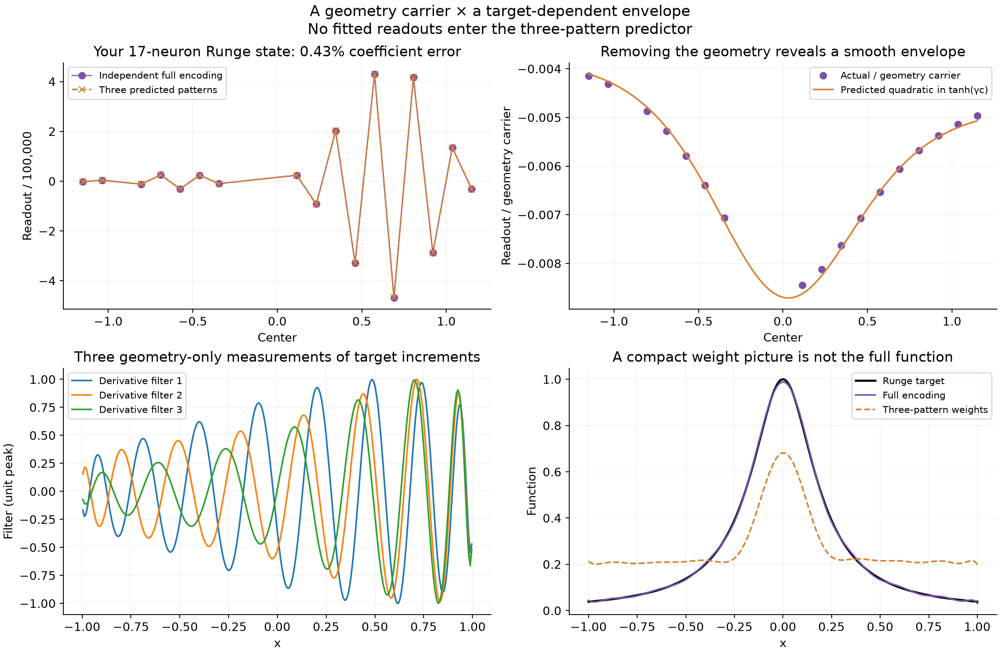
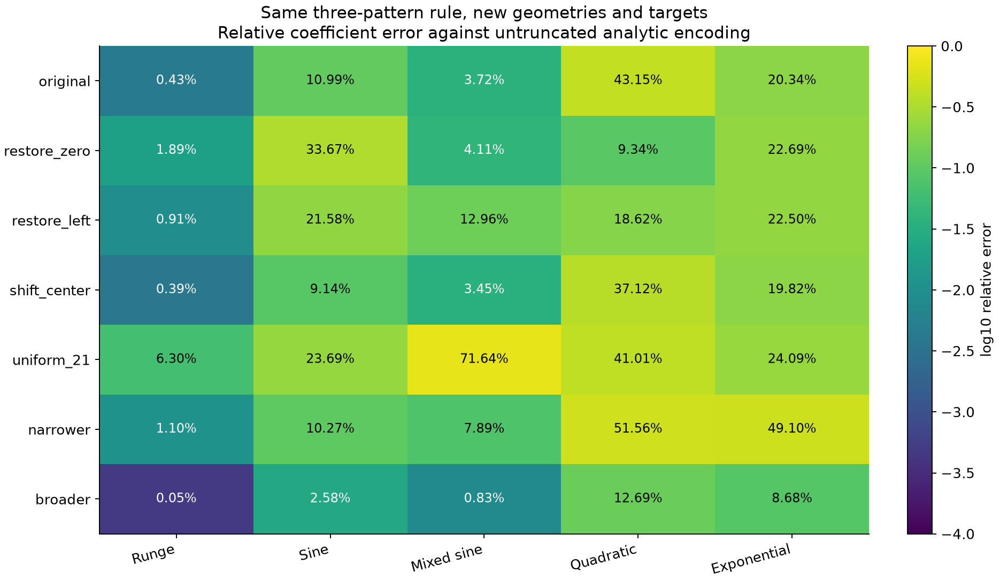
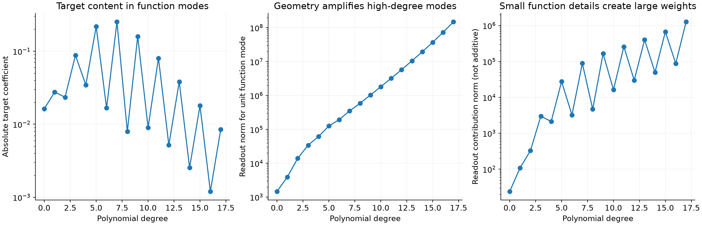
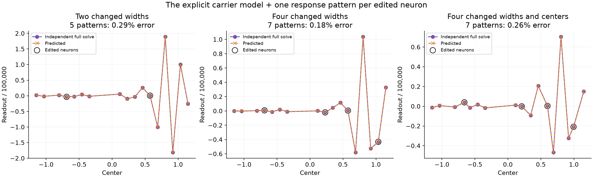

# Predicting the alternating readout branches

Codex research report · September 30, 2026

The concrete result is a decomposition of the readouts into an **alternating pattern determined by geometry** and an **envelope determined by the target**. In the shared 17-neuron Runge example, a quadratic envelope predicts the 17 readouts with **0.43% relative coefficient error**, including every sign. Its three amplitudes come from three explicit measurements of the target, without fitting them to the solved weights.

This explains a visible part of the structure Sam pointed to. It also exposes a limitation: those approximate weights give **42.24% relative function error**, versus **1.16%** for the complete solution. Small components of the coefficient vector remain essential to the function. A compact explanation of the large readout curves is not automatically a compact representation of the target.

The investigation concerns a saved interactive least-squares solution, not a new Adam run. It does not yet explain every branch in the earlier, much larger Adam figure.

## 1. What was tested

The saved workbench state has 17 tanh neurons, a free output bias, and common physical width \(s=0.575\). Thus its inverse width is \(\gamma=1/s\approx1.73913\). The target is \(f(x)=1/(1+25x^2)\), fitted at 256 equally spaced points on \([-1,1]\).

The centers are

\[
(-1.15,-1.035,-.805,-.69,-.575,-.46,-.345,
.115,.23,.345,.46,.575,.69,.805,.92,1.035,1.15).
\]

These are a 21-slot grid with the slots at \(-.92,-.23,-.115,0\) removed. Ordered readout signs alternate at all 16 adjacent pairs. Their Euclidean norm is approximately \(9.17\times10^5\), although the target is of order one.

The app's relative singular-value cutoff is \(10^{-10}\). All 18 feature directions, including bias, survive that cutoff in this state. The untruncated construction below therefore predicts the same mathematical solution the app requests.

An independent 80-digit direct QR solve agrees with the complete polynomial construction to \(1.95\times10^{-16}\) in relative coefficient norm after export to double precision. Agreement with the saved browser weights is \(7.13\times10^{-9}\). Raising the construction's working precision from 70 to 100 decimal digits leaves the exported result unchanged. These checks matter because the weights are highly sensitive to cancellation.

Throughout, “coefficient error” means the Euclidean error of the neuron readout vector divided by the norm of the reference neuron readout vector; it excludes bias. “Function error” means relative Euclidean error on the 256 fitting samples. These function errors are not a held-out generalization test.

## 2. An exact coordinate system for common-width tanh

Let \(n\) be the number of neurons. Each center \(c_j\) and the common inverse width \(\gamma>0\) are real scalars, with distinct centers. The coefficient vector \(v\in\mathbb R^n\) and scalar bias \(b\) specify the real-valued function

\[
F(x)=b+\sum_{j=1}^n v_j\tanh(\gamma(x-c_j)).
\]

Introduce a transformed input \(u=\tanh(\gamma x)\) and transformed centers \(z_j=\tanh(\gamma c_j)\). Both lie in \((-1,1)\). The subtraction identity gives

\[
\tanh(\gamma(x-c_j))=\frac{u-z_j}{1-u z_j}.
\]

Define the geometry polynomial

\[
D(u)=\prod_{\ell=1}^n(1-u z_\ell).
\]

Every factor is positive for real \(|u|<1\), so this denominator has no singularities on the real fitting interval. Multiplying the network by it produces a polynomial:

\[
\begin{aligned}
P(u)&=D(u)F(x(u))\\
&=bD(u)+\sum_jv_j(u-z_j)
       \prod_{\ell\ne j}(1-u z_\ell),\\
\deg P&\le n.
\end{aligned}
\]

Consequently the fixed-geometry network space is exactly

\[
\mathcal V_\theta=
\left\{x\longmapsto\frac{P(\tanh(\gamma x))}
 {D(\tanh(\gamma x))}:\deg P\le n\right\}.
\]

Here \(\theta=(c_1,\ldots,c_n,\gamma)\) denotes geometry; \(\mathcal V_\theta\) is an \((n+1)\)-dimensional space of functions. This is the earlier rational-function observation made into a usable coordinate system.

To recover an individual readout, first suppose \(z_j\ne0\) and substitute \(u=1/z_j\) into the polynomial identity for \(P\). Every term except the \(j\)-th vanishes:

\[
\begin{aligned}
P(1/z_j)
&=v_j(1/z_j-z_j)
  \prod_{\ell\ne j}(1-z_\ell/z_j)\\
&=v_j(1-z_j^2)z_j^{-n}
  \prod_{\ell\ne j}(z_j-z_\ell).
\end{aligned}
\]

For any polynomial \(P\) of degree at most \(n\), define its degree-\(n\) reversal by \(\widetilde P(z)=z^nP(1/z)\). This is a polynomial, including at \(z=0\). Define the geometry scalars

\[
B_j=\frac{1}{(1-z_j^2)\prod_{\ell\ne j}(z_j-z_\ell)}.
\]

We obtain the exact formula

\[
\boxed{v_j=B_j\widetilde P(z_j).}
\tag{1}
\]

The zero-center case follows continuously, or by extracting polynomial coefficients rather than dividing by \(z_j\). Thus restoring the missing center at zero causes no mathematical problem.

This also proves the claimed dimension. If a linear combination of the original features vanishes identically, evaluating at the distinct denominator zeros eliminates all nonzero-center readouts. Any remaining zero-center feature is \(u\), so its coefficient and the constant bias must also vanish. There are therefore \(n+1\) independent functions. Evaluating them at at least \(n+1\) distinct fitting points preserves independence: a nonzero numerator of degree at most \(n\) cannot vanish at all those points.

Already, \(B_j\) reveals a geometry effect. For ordered centers, its signs alternate; close transformed centers make the products of differences small and can require large coefficients. But \(B_j\) alone is not a sufficiently compact explanation of the observed envelope. On this example, a quadratic multiplying \(B_j\), even with its best coefficient-space amplitudes, has roughly 56% relative error. We need the part of the geometry that comes from the fitting interval and measure too.

## 3. Including the fitting measure, without a feature-matrix inverse

Let \(M>n\) be the number of distinct fitting samples \(x_i\), and let \(u_i=\tanh(\gamma x_i)\). For this experiment \(M=256\), with equal sample weights.

For real polynomials \(p,q\), define the geometry-dependent inner product

\[
\langle p,q\rangle_D
=\frac1M\sum_{i=1}^M
\frac{p(u_i)q(u_i)}{D(u_i)^2}.
\]

Let \(p_0,\ldots,p_n\) be the orthonormal polynomials for this inner product, each with positive leading coefficient. They depend on geometry and the fitting samples, not on the target.

They can be constructed by a three-term recurrence. Start with

\[
p_{-1}=0,\qquad
p_0=\left[\frac1M\sum_iD(u_i)^{-2}\right]^{-1/2},
\qquad b_0=0.
\]

Having constructed \(p_{k-1},p_k\), calculate

\[
\begin{aligned}
a_k&=\langle up_k,p_k\rangle_D,\\
r_{k+1}(u)&=(u-a_k)p_k(u)-b_kp_{k-1}(u),\\
b_{k+1}&=\sqrt{\langle r_{k+1},r_{k+1}\rangle_D},\\
p_{k+1}&=r_{k+1}/b_{k+1}.
\end{aligned}
\tag{2}
\]

Why are only two previous polynomials needed? For \(\ell\le k-2\),
\(\langle up_k,p_\ell\rangle_D=\langle p_k,up_\ell\rangle_D=0\):
the polynomial \(up_\ell\) has degree at most \(k-1\). The projection onto \(p_{k-1}\) equals \(b_k\) by the preceding recurrence and symmetry of the inner product. Subtracting the \(p_k\) and \(p_{k-1}\) components therefore makes the residual orthogonal to every lower degree.

Define real-valued functions

\[
q_k(x)=\frac{p_k(\tanh(\gamma x))}
 {D(\tanh(\gamma x))}.
\]

Their sampled vectors are orthonormal under the mean inner product. Let \(Q\in\mathbb R^{M\times(n+1)}\) have entries \(Q_{ik}=q_k(x_i)\), with degrees \(k=0,\ldots,n\). Then

\[
Q^\mathsf TQ/M=I.
\]

Let \(A\in\mathbb R^{M\times(n+1)}\) be the original sampled feature matrix: its first \(n\) columns are the tanh neurons and its last column is the constant bias feature. Let \(R\in\mathbb R^{(n+1)\times(n+1)}\) contain, in column \(k\), the readouts and bias representing \(q_k\). Equation (1) gives its neuron entries directly:

\[
R_{j,k}=B_j z_j^n p_k(1/z_j).
\tag{3}
\]

Again evaluate the right-hand side polynomially when \(z_j=0\). At \(x=0\), \(u=0\), \(D(0)=1\), and the neuron value is \(-z_j\), so the bias entry is

\[
R_{b,k}=p_k(0)+\sum_jz_jR_{j,k}.
\tag{4}
\]

These formulas imply \(AR=Q\). If \(f\in\mathbb R^M\) is the vector of target samples, define the function-mode amplitudes

\[
\beta=Q^\mathsf Tf/M\in\mathbb R^{n+1}.
\]

The exact untruncated fitted coefficient vector, including bias, is

\[
\boxed{w=R\beta.}
\tag{5}
\]

Indeed, minimizing \(\|Q\beta-f\|_2^2\) gives
\(Q^\mathsf TQ\beta=Q^\mathsf Tf\), hence the formula for \(\beta\); multiplying by \(R\) converts function coordinates back to neuron coordinates.

The recurrence and orthogonal-polynomial facts are standard mathematics, not a new least-squares principle. See [NIST DLMF, orthogonal polynomials](https://dlmf.nist.gov/18.2). Orthogonal rational functions are also an established field; [Eichinger, Lukić, and Young](https://arxiv.org/abs/2008.11884) provide related mathematical context, not evidence for the particular compression tested here.

**Using all columns of \(R\) merely reproduces least squares in another basis. The additional claim we test is that a few prescribed patterns explain the visible readout structure.**

## 4. A geometry pattern whose alternation can be proved

Define the vector \(a\in\mathbb R^n\) by the readouts of the highest-degree function mode:

\[
a_j=R_{j,n}=B_j\widetilde p_n(z_j),
\qquad
\widetilde p_n(z)=z^np_n(1/z).
\]

This vector is the alternating geometry pattern, or carrier. It incorporates centers, common width, fitting interval, and sample measure, but no target.

The degree-\(n\) orthogonal polynomial has \(n\) simple roots \(r_\ell\) in the interior of the convex hull of the transformed sample points. A brief proof is useful here. If \(p_n\) had fewer than \(n\) sign-changing roots there, form the polynomial \(s\) whose factors correspond to those roots. Then \(\deg s<n\), but \(p_ns\) has constant sign over the support and is nonzero at some support point. Its positive-weight sum cannot vanish. This contradicts \(\langle p_n,s\rangle_D=0\). Thus there are \(n\) such roots; the degree leaves room for no others or repeated roots.

With positive leading coefficient \(\kappa_n\), reversal gives

\[
\widetilde p_n(z)=\kappa_n\prod_{\ell=1}^n(1-r_\ell z)>0
\quad\text{for }|z|<1,
\]

because \(|r_\ell|<1\). Therefore, for ordered centers,

\[
\boxed{\operatorname{sign}(a_j)=(-1)^{n-j}.}
\tag{6}
\]

The target did not enter this proof. The geometry possesses a function mode whose readout coefficients alternate, irrespective of whether the target itself oscillates.

For lower degrees, define \(\widetilde p_k(z)=z^kp_k(1/z)\). Substituting (3) into (5), then dividing by \(a_j\), gives the exact target-dependent envelope

\[
\boxed{
v_j=a_j e_f(z_j),\qquad
e_f(z)=\sum_{k=0}^n\beta_k
\frac{z^{n-k}\widetilde p_k(z)}
 {\widetilde p_n(z)}.
}
\tag{7}
\]

This is more specific than saying that weights are a projection. It predicts where an alternating factor comes from and identifies what remains after removing it. The actual readouts need not alternate everywhere: the envelope can cross zero or vary rapidly.

The envelope is analytic for
\(|z|<1/\max_\ell|r_\ell|\), a disk strictly larger than the unit disk. Analyticity offers a reason to try a low-degree envelope, but does not guarantee that a quadratic suffices.

For a quantitative statement, suppose all \(|z_j|\le r\), and choose
\(r<\rho<1/\max|r_\ell|\). If \(|e_f(z)|\le H_\rho\) on \(|z|=\rho\), Cauchy's coefficient bound says that its Taylor coefficients satisfy \(|t_m|\le H_\rho\rho^{-m}\). Truncating before degree \(m\) gives

\[
\begin{aligned}
|e_f(z)-\sum_{\ell=0}^{m-1}t_\ell z^\ell|
&\le\sum_{\ell=m}^\infty H_\rho(r/\rho)^\ell\\
&=\frac{H_\rho(r/\rho)^m}{1-r/\rho}.
\end{aligned}
\]

Multiplication by the carrier yields the coefficient bound

\[
\|v-a\odot e_{m-1}(z)\|_2
\le \|a\|_2
\frac{H_\rho(r/\rho)^m}{1-r/\rho}.
\tag{8}
\]

Here \(\odot\) means componentwise multiplication. The target enters through \(H_\rho\); the geometry enters through the carrier, transformed centers, and root locations. This explains why analyticity alone does not imply uniformly accurate three-pattern predictions.

## 5. Predicting the envelope from the target

The tested model fixes the three-dimensional coefficient subspace

\[
\mathcal S_3
=\operatorname{span}\{a,\ a\odot z,\ a\odot z^2\}
\subset\mathbb R^n.
\]

Let \(E\in\mathbb R^{n\times3}\) be any orthonormal basis of these three prescribed vectors. Orthogonalizing these vectors is a three-column calculation; it does not inspect the solved readouts. Let \(R_v\in\mathbb R^{n\times(n+1)}\) contain the neuron rows of \(R\). Precompute the geometry-dependent matrix

\[
W=E^\mathsf TR_vQ^\mathsf T/M\in\mathbb R^{3\times M}.
\]

For a new sampled target \(f\), predict

\[
\boxed{v_{\rm pred}=E(Wf).}
\tag{9}
\]

Equivalently, there are three target-dependent scalars \(A_f,B_f,C_f\) such that

\[
v_j^{\rm pred}
=a_j(A_f+B_fz_j+C_fz_j^2).
\]

These amplitudes are calculated from target samples, not fitted to reference readouts. Equation (9) is the coefficient-space orthogonal projection \(EE^\mathsf Tv\); that establishes the best approximation *within the prescribed subspace*. It does not establish that this subspace is good. The numerical errors test that separate claim.

There is an important cost qualification: generating \(W\) here uses the complete geometry recurrence and change-of-basis matrix. It is a structured way to precompute three rows of an encoding operator, not a demonstrated computational improvement over all general-purpose solvers. Calling the full construction “SVD-free” would not by itself establish new explanatory content. The content is the explicit alternating carrier, its analytic envelope, and the observed low-dimensional approximation.

### The connection to derivative measurements is exact

The free bias fits a constant target with zero neuron coefficients. Therefore \(W\mathbf1=0\). Consider one row, with entries \(W_{\ell i}\). Define cumulative weights

\[
d_{\ell i}=-\sum_{r=1}^{i}W_{\ell r},
\qquad i=1,\ldots,M-1.
\]

Expanding the difference sum gives

\[
\begin{aligned}
\sum_{i=1}^{M-1}d_{\ell i}(f_{i+1}-f_i)
&=-d_{\ell1}f_1
 +\sum_{i=2}^{M-1}(d_{\ell,i-1}-d_{\ell i})f_i
 +d_{\ell,M-1}f_M\\
&=\sum_{i=1}^M W_{\ell i}f_i.
\end{aligned}
\tag{10}
\]

The first two coefficient identities follow from the cumulative definition; the final one uses the zero row sum.

For an absolutely continuous target,
\(f_{i+1}-f_i=\int_{x_i}^{x_{i+1}}f'(x)\,dx\). If \(d_\ell(x)\) is the piecewise constant function taking value \(d_{\ell i}\) on that interval, then

\[
\boxed{(Wf)_\ell=\int_{x_1}^{x_M}d_\ell(x)f'(x)\,dx.}
\tag{11}
\]

Thus the three envelope amplitudes are three explicit geometry-dependent measurements of the derivative. The two numerical calculations agree to about \(10^{-15}\) relatively.

This is a concrete instance of the first checkpoint's dual-feature identity. However, these particular measurement functions are global and oscillatory, as the figure shows. They are not narrow windows centered at individual neurons, so the local QI rule \(v_j\approx(h/2)f'(c_j)\) is not appropriate here.

## 6. What the predictions did and did not capture

The three-pattern choice was made after examining the original Runge case. The same degree was then used for all listed changes of target and geometry. These are controlled transfer tests, not a preregistered search or an exhaustive validation.

For the original geometry:

| Target | Relative coefficient error |
|---|---:|
| Runge \(1/(1+25x^2)\) | 0.43% |
| Sine \(\sin(2\pi x)\) | 10.99% |
| Mixed sine \(\sin(2\pi x)+0.5\sin(6\pi x)\) | 3.72% |
| Quadratic \(x^2\) | 43.15% |
| Exponential \(e^x\) | 20.34% |

Keeping Runge but changing geometry gives 1.89% error after restoring the center at zero, 0.91% after restoring the center at \(-.92\), 0.39% after moving the center .345 to .385, and 6.30% after restoring the whole uniform 21-center grid.

The narrower row means common \(\gamma=2.2\); broader means \(\gamma=1.3\). The latter has especially small Runge coefficient error, 0.048%, but also very large coefficients. All entries compare with the **untruncated** mathematical solution, checked against a reference cutoff \(10^{-14}\). In the broader row, the app's \(10^{-10}\) cutoff would remove one direction, so those entries do not predict the app's truncated readouts. All other listed transfer geometries retain every direction at the app cutoff.

These results reject the claim that every target has a sufficiently quadratic envelope. They support a more restricted statement: the large alternating readout structure of this Runge example, and several related geometries, concentrates in a simple geometry-prescribed family.

### Why accurate large weights can still give a poor function

The columns of \(Q\) are orthonormal in function space; the corresponding columns of \(R_v\) can have radically different norms in coefficient space. The target contribution of mode \(k\) has function norm \(|\beta_k|\), while its readout contribution has norm
\(|\beta_k|\|R_{v,:,k}\|_2\).

In the original state, the highest-degree mode accounts for only **2.15% of the target's sampled function norm**, but its readout contribution has norm **\(1.27\times10^6\)**. The total readout norm is only **\(9.17\times10^5\)** because different modal readout vectors partially cancel.

This gives a mechanism for the striking branches: modest function-space details can produce very large, organized coefficient curves when their representation is strongly amplified by geometry. Other coefficient components can be visually inconspicuous yet indispensable for the sum of neurons.

The direct function comparison confirms this. The full solution's sampled error is 1.16%; the three-pattern weights, with their output bias optimally refitted, give 42.24%. The relative readout approximation is good because it captures the dominant large coefficients, not because it preserves every functionally important direction.

## 7. Several different widths and centers: the old perturbation theory becomes useful

The common-width formula can serve as a background for a finite number of arbitrary edits. Suppose \(p\) neurons are designated as edited. Remove them temporarily, leaving \(n-p\) common-width background neurons and a bias.

For this background, construct:

- \(Q_B\in\mathbb R^{M\times(n-p+1)}\), orthonormal sampled function modes, with \(Q_B^\mathsf TQ_B/M=I\);
- \(R_B\in\mathbb R^{(n-p+1)\times(n-p+1)}\), the conversion to background readouts and bias;
- \(E_B\in\mathbb R^{(n-p)\times3}\) and \(W_B\in\mathbb R^{3\times M}\), the three-pattern predictor.

Let \(\Psi\in\mathbb R^{M\times p}\) contain the edited neurons evaluated at the sample points. Each edited neuron may have a different center and gamma. Define

\[
C=Q_B^\mathsf T\Psi/M,\qquad
U=\Psi-Q_BC.
\]

Here \(C\) gives the part of each edited feature reproducible by the background; \(U\) contains the remaining features. Direct substitution gives \(Q_B^\mathsf TU=0\).

Let \(y\in\mathbb R^{n-p+1}\) denote background function coordinates, and \(\alpha\in\mathbb R^p\) denote edited-neuron readouts. The sampled network is

\[
Q_By+\Psi\alpha=Q_B(y+C\alpha)+U\alpha.
\]

Write \(\beta_B=Q_B^\mathsf Tf/M\) and
\(r=f-Q_B\beta_B\). Orthogonality splits the least-squares objective:

\[
\|Q_B(y+C\alpha)-Q_B\beta_B\|_2^2
+\|U\alpha-r\|_2^2.
\]

For a fixed \(\alpha\), the first term is minimized exactly by
\(y=\beta_B-C\alpha\). If the columns of \(U\) are independent, the remaining normal equations give

\[
\alpha=(U^\mathsf TU)^{-1}U^\mathsf Tr
       =(U^\mathsf TU)^{-1}U^\mathsf Tf.
\]

Only a \(p\times p\) system is solved. The exact background coefficients are

\[
w_B=R_B(\beta_B-C\alpha).
\tag{12}
\]

Replacing only the unedited background target encoding by its three-pattern approximation produces

\[
\boxed{
v_{B,\rm pred}=E_BW_Bf-(R_BC)_v\alpha,
\qquad v_{J,\rm pred}=\alpha.
}
\tag{13}
\]

The subscript \(v\) means neuron rows, excluding bias; \(J\) is the set of edited neurons. Each edited feature contributes one combined pattern: its own coefficient and the compensating changes across the background. There are \(3+p\) prescribed patterns, with \(3+p\) target measurements. No full edited-geometry solve enters this predictor.

This is precisely the earlier residualized-feature theory, now coupled to an explicit background carrier rather than an unexplained inverse.

There is also an exact error identity. Let \(v_{B,0}=(R_B\beta_B)_v\) be the readouts before reinserting the edited features. Then

\[
v_{B,\rm pred}-v_{B,\rm exact}
=(E_BE_B^\mathsf T-I)v_{B,0}.
\tag{14}
\]

The compensation terms cancel. For a fixed choice of edited neurons and target, the **absolute approximation error is independent of their new widths and centers** under the full-rank assumptions. Relative errors change because the norm of the complete new solution changes. Thus success across a width sweep is partly guaranteed by the exact correction; it is not evidence that we discovered a new approximate width law.

### Numerical checks

For a single edited neuron originally centered at .345, multiply gamma by the indicated factor:

| Gamma factor | New edited readout | Relative coefficient error, four patterns |
|---|---:|---:|
| 0.5 | 165,191 | 0.281% |
| 0.8 | 130,456 | 0.676% |
| 1.0 | 201,420 | 0.275% |
| 1.2 | 34,793 | 0.207% |
| 2.0 | −137 | 0.362% |

Gamma is inverse width, so a factor of two makes that kernel narrower. The exact edited-neuron calculation captures the sign change.

For four edits, use original centers
\((-.69,.23,.575,1.035)\), gamma multipliers
\((.6,1.25,1.8,.8)\), and, in the joint center-and-width case, center changes
\((+.03,-.02,+.025,-.04)\).

| Change | Number of patterns | Relative coefficient error |
|---|---:|---:|
| Two changed gammas at \(-.69,.575\) | 5 | 0.285% |
| Four changed gammas | 7 | 0.175% |
| Four changed gammas and centers | 7 | 0.256% |

All 18 feature directions survive the app cutoff in these cases. The noncompressed update agrees with independent full solves to relative errors between roughly \(10^{-10}\) and \(10^{-9}\). These checks validate the implementation of the exact extension and quantify the remaining background compression error. Increasing the number of edited patterns increases model complexity; the smaller errors are not a free gain.

## 8. A diagnostic for when the solver changes the visible branches

The same carrier family approximates an important fragile direction of the feature matrix.

Since \(AR=Q\) and \(Q^\mathsf TQ=MI\),

\[
A^\mathsf TA=MR^{-\mathsf T}R^{-1},
\qquad
(A^\mathsf TA)^{-1}=RR^\mathsf T/M.
\tag{15}
\]

Thus large eigenvalues of \(RR^\mathsf T\) correspond to small singular values of \(A\): large readout changes producing small function changes.

Extend the three neuron patterns by one independent bias direction to form a column-orthonormal matrix \(E_f\in\mathbb R^{(n+1)\times4}\). Define the small matrix

\[
K=E_f^\mathsf TR\in\mathbb R^{4\times(n+1)}.
\]

The largest eigenvalue \(\lambda_{\max}\) of \(KK^\mathsf T\) estimates the largest inverse amplification. It predicts

\[
\sigma_{\min}(A)\approx\sqrt{M/\lambda_{\max}}.
\]

The prediction is \(9.35372\times10^{-8}\); the independent value is \(9.35342\times10^{-8}\), a **0.00329% relative error**.

If \(u\in\mathbb R^4\) is a normalized eigenvector of the small matrix, the corresponding approximate coefficient direction is \(E_fu\). Truncating that direction removes
\(E_fu\,u^\mathsf TK\beta\) from the complete coefficients. Summing this expression over the predicted discarded directions gives the cutoff experiment.

At cutoff \(10^{-8}\), the model predicts one discarded direction, as observed, and predicts the changed coefficients with 5.34% error. It fails for larger changes: error reaches 118% at \(10^{-7}\) and 169% at \(10^{-6}\), where it also misses one discarded direction.

This diagnostic uses the independently measured largest singular value to normalize the *relative* cutoff. It is therefore not a wholly independent prediction of every cutoff threshold. It shows that the explicit carrier family captures the first fragile direction very well; it does not capture the entire truncation behavior.

## 9. How this connects to the previous checkpoints

The [first checkpoint](../../../../docs/geometry_readout_theory_codex/checkpoint.md) says that solved readouts are geometry-dependent measurements of the target derivative. It becomes the familiar derivative-sampling rule only when the measurement functions are sufficiently local and similarly shaped. Equation (11) identifies three such measurements for an actual alternating branch family. They are global, which explains why reading individual coefficients as local derivative samples fails here.

The [finite-edit lens report](../lens_construction_20260930/report.md) says that changing a few neurons creates distinct residual features, and their readouts determine how the other neurons compensate. Equations (12)–(14) use exactly that mechanism. The additional ingredient is an explicit, compressed model of the background coefficient pattern.

The [smooth-density and branch report](../learned_branches_20260930/report.md) describes how groups of kernels carry a smoothed derivative density. That addresses aggregate, slowly varying content. The present calculation addresses a different scale: alternating coefficient patterns that can be large while their function contribution is small. Both are needed. Coarse derivative density alone cannot reconstruct these large compensating branches.

For tanh, the common-width rational identity makes this calculation unusually explicit. ReLU and tent kernels have different algebra; GELU does not share this denominator polynomial. The general dual-measurement and residual-feature statements still apply, but this particular carrier theorem has not been established for those activations. Nor has the three-pattern hypothesis been validated on an arbitrary Adam geometry with every gamma different.

## 10. What has actually advanced

We now have a geometry-derived explanation of the alternating signs, a precise envelope after removing that geometry, and a compact predictor that succeeds quantitatively on one difficult readout pattern and several controlled variations. We can calculate the target measurements, including their derivative form, rather than just call them an unspecified lens. We can also transport that explanation through several simultaneous neuron edits.

The result is narrower than “the weights secretly are the derivative.” They contain derivative information encoded through measurement functions, but geometry can strongly amplify a small part of that information into the most visually prominent coefficient branches. The dominant visible branch need not contain most of the target's functional content.

The next consequential test is whether learned, variable-gamma geometries admit a small number of similarly explicit carrier families. It should require predictions on held-out targets and geometry changes, report coefficient and function errors separately, and compare against a generic low-rank baseline. Another useful test is to predict when multiple carriers are necessary from the geometry and target mode content, instead of selecting the number after observing the solved weights.

Those are research directions, not results of this report. A universal description of the earlier Adam branches remains open.

## Reproduction and saved evidence

All artifacts are in this folder. The source state is saved in [shared_workbench_state.npz](shared_workbench_state.npz), with its checksum recorded in [metrics.json](metrics.json). The complete measurements and carrier arrays are in [workbench_prediction.npz](workbench_prediction.npz). Independent precision checks are in [verification.json](verification.json).

From the repository root:

    OMP_NUM_THREADS=1 OPENBLAS_NUM_THREADS=1 VECLIB_MAXIMUM_THREADS=1 .venv/bin/python results/checkpoint_G_interactive/geometry_reader_codex/branch_modes_20260930/analyze.py
    OMP_NUM_THREADS=1 OPENBLAS_NUM_THREADS=1 VECLIB_MAXIMUM_THREADS=1 .venv/bin/python results/checkpoint_G_interactive/geometry_reader_codex/branch_modes_20260930/verify.py

The geometry recurrence is in [rational_modes.py](rational_modes.py); the experiment and plotting logic are in [analyze.py](analyze.py). Earlier exploratory scripts are retained for provenance. All four figures also have PDF versions in this directory.
