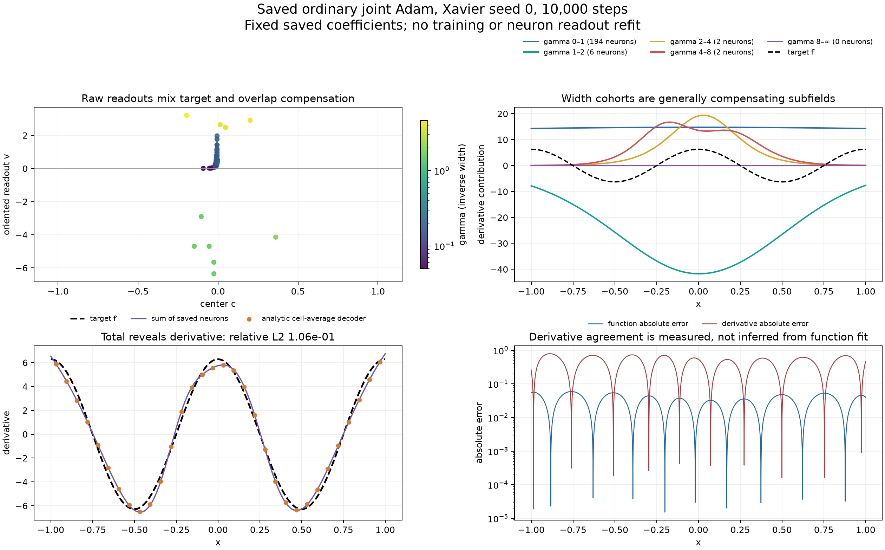
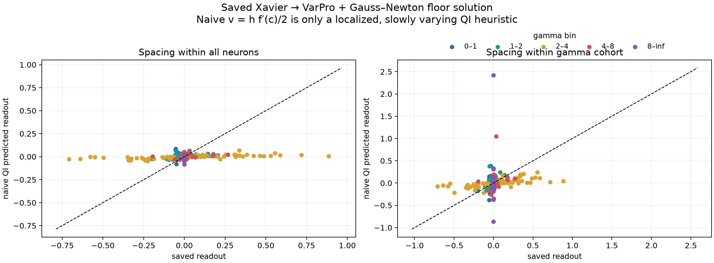

# Fixed learned tanh solutions: width cohorts, derivative decoding, and pole geometry

Status: completed read-only analysis of two saved solutions, September 29, 2026. No training or neuron-readout fitting was performed.

The strongest result is that the accurate learned solution does encode the target derivative to high precision, but its fixed width cohorts do not separately behave as independent copies of that derivative. They combine target content with mutually cancelling smooth fields. This supports a shared synthesis object with overlapping components; it does not establish that every learned width branch is a separate QI lattice.

## Question and design

The primary network is the saved sine Xavier → VarPro + Gauss–Newton solution from `results/checkpoint_D_optimizers/expD04_varpro/varpro_corrected/06_sine_xavier_seeds/geometry_sine_xavier_N256_s0.npz`. It contains 461 neurons, of which 242 centers lie in [−1,1]. Original readouts were computed with truncated SVD cutoff 10⁻¹³. Its output bias was not saved; this analysis recovers only the scalar mean residual on its original 2003-point training grid, keeping all neuron coefficients fixed. The secondary network is the actual saved ordinary joint-Adam sine/tanh/Xavier-seed-0 solution at 10,000 steps from expD41, containing 204 neurons. Its bias and readouts are used exactly as saved. No solved readout replaces an Adam readout.

Tanh sign symmetry is removed by setting γ=|a|, c=−b/a, and v=sign(a) times the saved readout. The analytic derivative is evaluated directly:

\[
\widehat f'(x)=\sum_j v_j\gamma_j\operatorname{sech}^2\!\bigl(\gamma_j(x-c_j)\bigr).
\]

We split **all neurons**, including those outside the fitting interval, into fixed inverse-width bins [0,1), [1,2), [2,4), [4,8), and [8,∞). For each bin b, denote its derivative contribution by u_b. These are descriptive bins, not inferred latent families. The signed target fraction is ⟨u_b,f′⟩/‖f′‖². The cancellation ratio is Σ_b‖u_b‖/‖Σ_bu_b‖; the analogous neuron ratio sums norms before grouping. All reported norms use the same uniform evaluation grid on [−1,1]. Grid refinement from 8,193 to 16,385 points verifies stability.

## Results

- **The floor solution has high derivative accuracy as well as high function accuracy.** At 16,385 points, relative function L2 error is 6.51×10⁻¹⁵ and relative derivative L2 error is 2.22×10⁻¹³. At 8,193 points these are 6.53×10⁻¹⁵ and 2.25×10⁻¹³. Maximum derivative error is 3.22×10⁻¹¹, concentrated near the left endpoint. This derivative agreement is measured directly; it does not follow from small function L2 error alone. See the bottom row of the anatomy figure.
- **Width cohorts are compensating fields, not individually derivative-shaped signals.** For the floor solution, the γ<1 cohort has norm 0.415 times ‖f′‖ but cosine similarity only 0.00693 to f′; [1,2) has norm 0.321 and cosine −0.000477. The [2,4) cohort carries most of the target-direction projection but also a substantial component orthogonal to f′. Their sum has negligible error. See the upper-right panel and table below.
- **The saved ordinary Adam solution exhibits stronger cancellation and an imperfect derivative.** Its relative function error is 0.04844 and derivative error 0.10609; grid refinement changes these only in the fifth decimal place. Cohort cancellation is 13.66, compared with 2.03 for the floor solution. These two solutions have different training procedures and widths; this is an anatomy comparison, not a controlled optimizer comparison.
- **A local-spacing QI amplitude formula is not a successful coefficient predictor for these irregular learned geometries.** The heuristic v_j=(h_j/2)f′(c_j), with h_j the mean of adjacent center gaps, gives interior relative coefficient errors of 0.928–1.210 in the first four floor gamma bins and 863 in the nearly inactive sharp bin. Computing spacing separately within each gamma bin also fails. This falsifies this particular naive approximation, not arbitrary finer family decompositions or geometry-aware inverse filters. See the QI heuristic scatter figures.

| Floor-solution gamma bin | All neurons | ‖u_b‖ / ‖f′‖ | Signed target fraction | Cosine to f′ | Orthogonal part / ‖f′‖ |
|---|---:|---:|---:|---:|---:|
| [0,1) | 190 | 0.41479 | 0.002873 | 0.006927 | 0.41478 |
| [1,2) | 102 | 0.32072 | −0.000153 | −0.000477 | 0.32072 |
| [2,4) | 98 | 1.11098 | 0.933481 | 0.840232 | 0.60240 |
| [4,8) | 39 | 0.18170 | 0.063806 | 0.351152 | 0.17013 |
| [8,∞) | 32 | 0.00008379 | −0.00000736 | −0.087857 | 0.00008346 |

The target fractions sum to one to numerical accuracy. Orthogonal components cancel vectorially. For this solution the cohort cancellation ratio is 2.0283 and the individual-neuron ratio is 8.1284.

## Additional structure: low-degree baseline compensation

The compensating fields are more structured than arbitrary smooth curves. We projected each width cohort onto Legendre polynomials of degree at most d, using their explicit integral coefficients, a_n=(2n+1)∫u_b(x)P_n(x)dx/2. This is a fixed polynomial diagnostic, not a neuron readout solve. Removing the constant leaves only 4.86% of the γ<1 cohort's norm. Removing degrees through three leaves 0.0803%, meaning its cubic component accounts for approximately 99.99994% of that cohort's squared norm. The [1,2) cohort leaves 4.82% after the same cubic removal.

The main [2,4) cohort has cosine similarity 0.840 to the target derivative before baseline removal; this rises to 0.971 after removing constants, 0.990 after removing affine functions, and 0.996 after removing quadratics. In every comparison **the same polynomial projection is removed from the target derivative as well**. This is descriptive evidence that broad neurons supply polynomial-like baseline corrections while middle widths carry most of the oscillation. The degree choices and bins are exploratory; this is not a universal decomposition theorem.

There is also an independent, target-free prediction of the broad baseline from geometry moments. Let P_0(t)=t and P_{n+1}(t)=(1−t²)P_n′(t). The chain rule gives P_n(tanh z)=dⁿtanh(z)/dzⁿ. Taylor expansion of the broad cohort about x=0 therefore gives

\[
u_{<1}(x)=\sum_{m\ge0}M_mx^m,\qquad
M_m=\frac1{m!}\sum_{\gamma_j<1}v_j\gamma_j^{m+1}P_{m+1}(\tanh(-\gamma_jc_j)).
\]

These coefficients use only saved centers, gammas, and readouts; they do not use target values, fitted polynomial coefficients, or a new least-squares solve. The directly computed first four moments are

\[
u_{<1}(x)\approx-1.897996-0.196235x+0.165676x^2+0.150768x^3.
\]

This cubic has relative L2 error 0.006855 against the actual broad cohort. Extending the same analytic expansion through degrees 5, 7, and 9 gives errors 0.001215, 0.0002056, and 0.0001283. Unlike the earlier Legendre diagnostic, these coefficients are predicted locally from the neuron formula rather than extracted by projecting the evaluated field over the interval.

The pole geometry explains why this expansion is legitimate globally on [−1,1]: for every γ<1 neuron its nearest complex pole has modulus √(c²+π²/(4γ²))>π/2>1. Thus its Taylor series around zero converges throughout the fitting interval. A Cauchy bound on any smaller pole-free circle gives a geometric tail bound; the observed error values above are direct checks, not that upper bound.

## What derivative decoding does and does not establish

For cell edges x_i and common cell width h, define the geometry-only matrix

\[
D_{ij}=\frac{\tanh(\gamma_j(x_{i+1}-c_j))-\tanh(\gamma_j(x_i-c_j))}{h}.
\]

Then Dv equals the exact cell average of the derivative of the saved network. This is an analytic identity and contains no least-squares solve. Comparing it with exact target derivative cell averages gives relative errors 4.99×10⁻¹⁴, 7.46×10⁻¹⁴, and 1.22×10⁻¹³ for 32, 64, and 128 cells in the floor solution. The ordinary Adam solution gives 0.1027, 0.1052, and 0.1059. Smoothing the cells slightly improves the latter.

This decoder proves that irregular learned readouts can be transported to a common derivative representation. It is **not itself a discovery of latent QI families or a predictive theory of coefficients**: it synthesizes the function already represented by the network. Its useful role here is to provide a canonical observable against which proposed geometric factorizations can be checked.

## A concrete analytic geometry: poles and residues

Each neuron extends meromorphically to complex z. Its poles and residues follow directly from tanh=sinh/cosh. Zeros of cosh occur at iπ(k+1/2), and its derivative sinh is nonzero there. Therefore tanh has residue one at each such zero. Composition with γ(z−c) divides the residue by γ:

\[
z_{j,k}=c_j+\frac{i\pi(k+1/2)}{\gamma_j},\qquad
\operatorname{Res}_{z=z_{j,k}}v_j\tanh(\gamma_j(z-c_j))=\frac{v_j}{\gamma_j}.
\]

Thus centers position vertical pole ladders, gamma sets their distance from the real axis and their spacing, and readouts set residues. If several neuron ladders share a pole, their residues add and may cancel. The displayed nearest-upper-pole plot is a visualization of **neuron-level** geometry; it does not merge coincident poles into the net function's singularities. Higher gamma places the nearest poles closer to the real axis. Broad kernels correspond to more distant poles.

For a common γ, set t=e^(2γx) and p_j=e^(2γc_j). Then

\[
\tanh(\gamma(x-c_j))=\frac{t-p_j}{t+p_j}=1-\frac{2p_j}{t+p_j},
\]

so the network is a fixed-pole rational function of t. This exact common-variable rational representation generally does not extend to arbitrary unequal gammas. The complex pole-ladder description does.

## Interpretation and limits

The data support analyzing a network as a redundant derivative-kernel synthesis system with cross-width compensation. The well-fitted model reveals the target derivative after synthesis, but that result alone does not show that each visible readout trajectory is a separately meaningful approximation of f′. Broad, almost horizontal coefficient bands can represent smooth offsets that cancel offsets introduced by other widths. The fixed gamma bins are only a first test: it remains possible that grouping by both gamma and local spacing identifies more meaningful families.

The pole formulation supplies an exact activation-specific geometry, not a claim that tanh models are uniquely determined by visible nearby poles or that the same object alone predicts numerical conditioning. Conditioning also depends on pole proximity to each other, residue cancellation, fitting norm, sampling, and the readout convention. Near-null coefficient changes can preserve the real-axis function while changing neuron-level structure.

Reproducibility: `analyze.py` reads only the two existing checkpoints and writes outputs in this directory. `metrics.json` includes source SHA-256 hashes, exact metrics, grid checks, and all heuristic diagnostics. The saved `.npz` anatomy files contain only derived arrays. Run from the repository root with `OMP_NUM_THREADS=1 OPENBLAS_NUM_THREADS=1 VECLIB_MAXIMUM_THREADS=1 .venv/bin/python results/checkpoint_G_interactive/geometry_reader_codex/geometry_object_20260929/learned_solution/analyze.py`.
