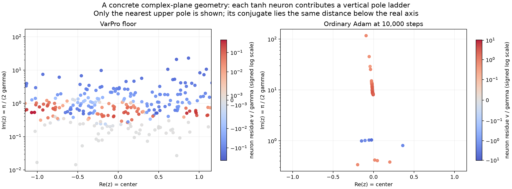
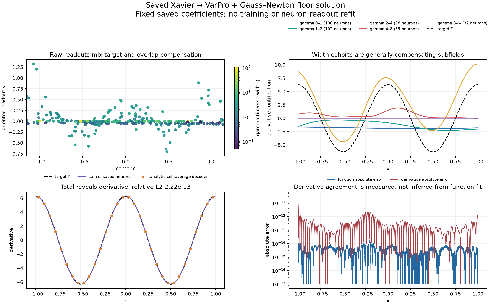
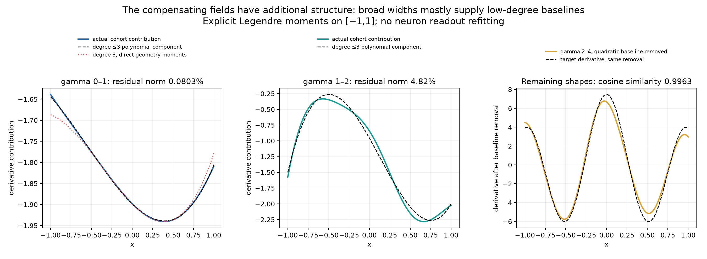
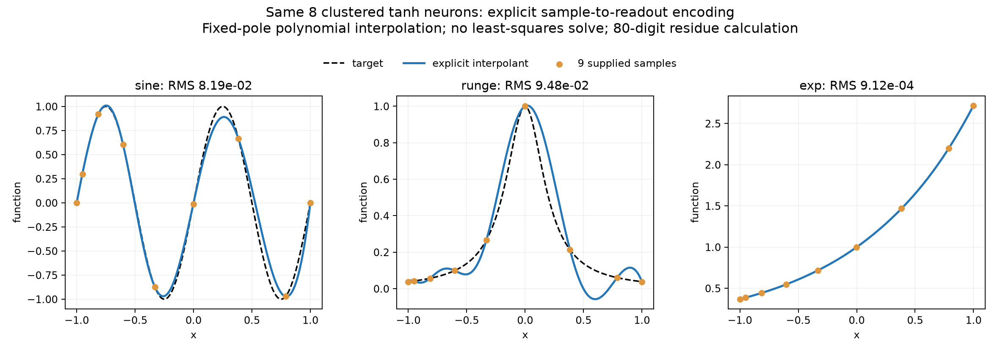

# The geometry of fixed one-layer solutions

Codex research checkpoint, September 29, 2026. Fixed saved solutions and controlled approximation calculations; no new training.

## What changed in this investigation

There is a concrete object behind the geometry lens. For a common-width tanh network it is a **space of rational functions with a geometry-selected denominator**, observed through the original fitting norm. Neuron readouts are one coordinate system on this space: they specify residues at fixed poles. They can be extremely ill-conditioned coordinates even when another explicit coordinate system for the same space is well conditioned. With unequal widths, the exact object is a constrained family of meromorphic functions with vertical pole ladders; the derivative-kernel frame describes its real-axis synthesis and overlap.

This is a precise fixed-solution statement. It is not a claim to have characterized all learned networks or why training finds them. The rational, frame, and projection ingredients are established mathematics; the contribution of this checkpoint is their explicit specialization, predictions, and tests for the geometries in this project.

Three findings anchor the theory:

1. In the saved 461-neuron near-floor sine solution, the analytic derivative agrees with the target derivative to relative L2 error **2.22e−13**. The width groups are not independently copies of that derivative: broad groups mainly supply smooth baseline corrections that cancel offsets in the oscillatory groups.
2. An illustrative eight-neuron geometry resembling the screenshot fits sine with RMS **0.04347**, despite having seven centers near −1 and only one on the right. Its raw tanh matrix has condition number **6.96e10**. An explicit rational-coordinate matrix spanning exactly the same functions has condition number **14.97**. This change comes from algebra, not a numerically discovered singular-vector basis.
3. The rational description gives an explicit target-samples-to-readouts encoder without least squares. We implemented it for three targets. It is an interpolant, with its own approximation error, and the enormous residue coordinates require high precision. It is not a replacement for an optimal LS solve on arbitrary irregular geometry.

The earlier general dual and perturbation theory remains in [the original checkpoint](../../../../docs/geometry_readout_theory_codex/checkpoint.md). The detailed independent mathematical audit for this investigation is [here](theory_audit.md).

## 1. What is the geometric object?

Fix a finite interval I=[a,b], positive fitting measure, and a baseline convention. For tanh with a free output bias, write

\[
\widehat f(x)=b_0+\sum_{j=1}^n v_j\phi_j(x),\qquad
\phi_j(x)=\tanh\bigl(\gamma_j(x-c_j)\bigr),\quad\gamma_j>0.
\]

The geometry specifies a finite-dimensional function space

\[
V_{\mathcal G}=\operatorname{span}\{1,\phi_1,\ldots,\phi_n\}.
\]

The fitting norm gives distances and angles between its functions. The individual neurons give coordinates on that space. These are three distinct pieces: the attainable functions, how approximation error is measured, and how a function is encoded as coefficients. If a minimum-coefficient-norm convention matters, it adds another metric; an arbitrary change of basis preserves the attainable functions but usually changes that coefficient norm.

The ordinary Gram matrix G_ij=⟨φ_i,φ_j⟩ describes overlap in the chosen coordinates. Calling its inverse a lens is exact but insufficiently explanatory. We want structure that determines G, or bypasses these coordinates altogether: translation symmetry, pole locations, or cluster expansions.

For a finite set of distinct oriented tanh parameters, the continuous features are actually linearly independent. To see this, analytically continue a putative zero linear combination. At any selected center, choose the neuron with largest gamma. Its nearest upper complex pole cannot belong to a neuron at a different center, or a smaller-gamma neuron at the same center. Its residue must therefore vanish. Remove it and repeat. The constant then vanishes too. Thus the practical redundancy in a numerical rank-81, 462-column fit is **effective redundancy at the chosen tolerance**, not 381 exact functional identities. Sampling, cutoffs, duplicates, and sign symmetries require separate treatment.

Consequently, a practical comparison of networks giving approximately the same function must specify its interval, norm, and tolerance. Being within a tolerance is not itself a transitive equivalence relation; an exact quotient can instead be defined by equality after a specified observation or spectral projection. Equality of real-axis approximations to 12 digits does not imply equality of their analytic continuations or pole sets.

## 2. Why the derivative is the common observable

For tanh, define a unit-mass bump

\[
\kappa_\gamma(x)=\frac{\gamma}{2}\operatorname{sech}^2(\gamma x),
\qquad \int_{\mathbb R}\kappa_\gamma=1.
\]

Differentiation gives the exact synthesis map

\[
d_{\mathcal G}(x)=\widehat f'(x)=2\sum_jv_j\kappa_{\gamma_j}(x-c_j).
\tag{1}
\]

This maps any saved readouts to a common function coordinate system. The bias disappears. It does not prove that each v_j is a local derivative sample, or that the network derivative accurately matches the target. Both need additional evidence.

The original function-fitting norm must also be retained. Let J_0u be the primitive of u with zero mean on I. If f is absolutely continuous, optimizing the output bias gives exactly

\[
\min_{b_0}\|f-b_0-\textstyle\sum_jv_j\phi_j\|_{L^2(I)}^2
=\|J_0(f'-d_{\mathcal G})\|_{L^2(I)}^2.
\tag{2}
\]

Proof: the derivative of the residual is f′−d_G. Every primitive differs by a constant, and subtracting the mean is precisely the optimal constant adjustment. Function fitting is therefore a projection of derivatives in an **integrated-error norm**, not ordinary derivative L2. On a periodic mean-zero domain this weights frequency ω by 1/ω². This explains why tiny function error alone cannot certify tiny derivative error.

For an activation whose rth derivative is a useful kernel, the same construction uses σ^(r), an independently fitted polynomial baseline of degree <r, and an r-fold primitive norm. ReLU then gives curvature measures at knots, while smooth activations give smooth kernels. This general framework does not require tanh's pole structure.

## 3. The tanh geometry is exactly a pole geometry

Extend x to a complex variable z. Since tanh=sinh/cosh, its poles occur where cosh vanishes. Therefore

\[
z_{j,k}=c_j+\frac{i\pi(k+1/2)}{\gamma_j},\qquad
\operatorname{Res}_{z=z_{j,k}}v_j\phi_j(z)=\frac{v_j}{\gamma_j}.
\tag{3}
\]

The residue formula follows because the derivative of the denominator is γ_j sinh at the pole, cancelling the numerator up to 1/γ_j. Each neuron supplies a vertical ladder of poles, all with the same residue. Its center moves the ladder horizontally. Its gamma moves the nearest poles toward or away from the real axis. Coincident poles contribute summed residues.

This is consistent with the Fourier kernel lens. With transform convention \(\widehat g(\omega)=\int g(x)e^{-i\omega x}dx\),

\[
\widehat\kappa_\gamma(\omega)
=H_\gamma(\omega)
=\frac{\pi\omega/(2\gamma)}{\sinh(\pi\omega/(2\gamma))},\qquad H_\gamma(0)=1.
\tag{4}
\]

The high-frequency decay rate is controlled by π/(2γ), exactly the distance of the nearest poles. A wide real bump and a distant complex pole describe the same suppression of rapid variation. The derivation and use of tanh pole sets also have precedents in [neural-network identifiability theory](https://www.mins.ee.ethz.ch/pubs/files/nn-aff-id-2020.pdf).

The following figure maps both saved solutions into nearest-pole coordinates. It is an exact reparameterization of each neuron, not evidence by itself that the target's singularities have been recovered.

## 4. Common gamma gives an explicit rational coordinate system

Assume all n neurons share gamma and have distinct centers. Put

\[
t=e^{2\gamma x},\qquad a_j=e^{2\gamma c_j}>0,
\qquad Q(t)=\prod_{j=1}^n(t+a_j).
\]

Then

\[
\phi_j(x)=\frac{t-a_j}{t+a_j}=1-\frac{2a_j}{t+a_j}.
\]

Writing B=b_0+Σ_jv_j and multiplying by Q yields

\[
\widehat f(x)=\frac{P(t)}{Q(t)},\qquad
P(t)=BQ(t)-\sum_j2a_jv_j\frac{Q(t)}{t+a_j},
\quad \deg P\le n.
\tag{5}
\]

At t=−a_j every term vanishes except the jth term. Thus

\[
P(-a_j)=-2a_jv_jQ'(-a_j),\qquad
\boxed{v_j=-\frac{P(-a_j)}{2a_jQ'(-a_j)}}.
\tag{6}
\]

The leading coefficient of P is B, because Q is monic; then b_0=B−Σv_j. These formulas prove a bijection between network coefficients and all polynomials of degree at most n. There is no SVD hidden in this change of coordinates.

In these coordinates the geometry selects Q, while the represented function selects P. The geometry-transformed target is

\[
g_{\mathcal G}(t)=Q(t)f\!\left(\frac{\log t}{2\gamma}\right).
\tag{7}
\]

Changing variables dx=dt/(2γt) gives

\[
\|f-\widehat f\|_{L^2(I)}^2
=\int_{e^{2\gamma a}}^{e^{2\gamma b}}
|g_{\mathcal G}(t)-P(t)|^2
\underbrace{\frac{1}{2\gamma tQ(t)^2}}_{w_{\mathcal G}(t)}dt.
\tag{8}
\]

Thus fixed-geometry function fitting is exactly **weighted polynomial approximation of a known transformation of the target**. This gives a specific version of the proposed lens: its warp, multiplier, approximation space, and norm are all explicit.

It also explains coefficient amplification. Q′(−a_j)=∏_{k≠j}(a_k−a_j) becomes small when centers cluster. Evaluating P at the negative poles is an extrapolation from the positive t interval on which the fit is constrained. Modest changes in a well-resolved real-axis function can produce large residue changes. Close poles do not force large coefficients for every target: P can vanish near those poles as well.

For arbitrary unequal gammas the pole-ladder statement remains exact, but there is generally no single finite-degree rational representation in this t coordinate. Integer-multiple gammas permit a common rational denominator with a constrained numerator space. Simply rounding learned gammas into bins does not preserve the original network.

## 5. A stable coordinate chart for clustered neurons

For numerical work use a bounded coordinate instead of exponentials. Fix a reference center c_0, set s=1/γ, and define

\[
u=\tanh((x-c_0)/s),\qquad d_j=\tanh((c_j-c_0)/s).
\]

The tanh subtraction formula gives

\[
\phi_j(x)=\frac{u-d_j}{1-ud_j},\qquad
q(u)=\prod_j(1-ud_j),\qquad \widehat f=P(u)/q(u).
\tag{9}
\]

Again the numerator ranges over degree≤n polynomials. Represent it in Chebyshev polynomials after mapping the observed u interval affinely to [−1,1]. The resulting function basis is T_k(z(u))/q(u). Geometry determines this basis explicitly.

If many centers approach c_0, their d_j approach zero and their denominator factors approach one. The limiting approximation space becomes polynomial-like in tanh coordinates. Equivalently, Taylor expansion of nearby translates gives

\[
\sum_jv_j\phi(x-c_0-\delta_j)
=\sum_{m=0}^{p}\frac{(-1)^m}{m!}
\left(\sum_jv_j\delta_j^m\right)\phi^{(m)}(x-c_0)+R_{p+1}(x).
\tag{10}
\]

The combinations Σv_jδ_j^m are cluster moments. Alternating, large readouts can encode a finite higher derivative through finite-difference cancellation. A rigorous remainder bound retains Σ|v_j||δ_j|^(p+1) times the maximum relevant derivative; huge coefficients mean a low-order truncation must be checked, not assumed. Exact coincident centers collapse rank; the derivative basis is a limit of spaces with appropriately diverging coefficients, not the dictionary obtained by simply setting every center equal.

The exact rational chart avoids that truncation. In the controlled eight-neuron example, the tanh-plus-bias and Chebyshev-numerator matrices have the same nine-dimensional span. Their measured condition numbers are 6.96e10 and 14.97. The largest raw coefficient is 1.01e9; the largest numerator coefficient is 0.403. Both full-rank LS fits have sine RMS 0.04347 and agree within 7.62e−7 in double precision. The residual disagreement is small relative to the cancellation scale, but the raw readouts remain intrinsically sensitive; changing coordinates does not make their recovery stable.

## 6. Deleting a neuron has an exact polynomial meaning

Hold gamma and all surviving centers fixed in the common-gamma model. Deleting neuron j means v_j=0. Equation (6) makes this equivalent to

\[
P(-a_j)=0.
\tag{11}
\]

Then P has the factor (t+a_j), which cancels the same factor of Q. The smaller network is an explicit codimension-one subspace of the old rational space.

This connects directly to the earlier defect-response theory. Let P_0 be the old weighted-L2 projection of g_G onto degree≤n polynomials. Let K_n(t,z) be the reproducing kernel of that polynomial space in the weight w_G from (8):

\[
K_n(t,z)=\sum_{m=0}^n p_m(t)p_m(z),
\]

where p_m are any orthonormal polynomial basis in w_G. For every polynomial P in the space,

\[
\langle P,K_n(\cdot,z)\rangle_{w_G}=P(z).
\]

This follows by expanding P in the orthonormal basis and taking its inner product term by term. Therefore K_n(·,−a_j) is normal to the hyperplane of polynomials vanishing at −a_j. Subtract the normal component of P_0:

\[
\boxed{P_{\mathrm{deleted}}(t)=P_0(t)-
\frac{P_0(-a_j)}{K_n(-a_j,-a_j)}K_n(t,-a_j).}
\tag{12}
\]

The extra optimal squared function error is exactly

\[
\boxed{\Delta E^2=\frac{|P_0(-a_j)|^2}{K_n(-a_j,-a_j)}.}
\tag{13}
\]

To verify the error statement, the original projection residual is orthogonal to the whole polynomial space. Pythagoras separates it from the correction in (12), whose squared norm equals (13) by the reproducing identity. For several deletions, the correction is a sum of kernel sections with coefficients solving only the small evaluation matrix K_n(−a_i,−a_j). The [audit](theory_audit.md) contains the full formula.

The computational gain depends on knowing or approximating this kernel from geometry. Computing it generically could cost as much as an ordinary solve. The theoretical gain is an explicit structural fact: deletion imposes a zero at a known external pole, and its global compensation is the associated polynomial evaluation kernel. This derivation does not apply unchanged to the workbench's delete action, because that action also rescales surviving widths.

## 7. How uniform QI and mixed widths fit this object

QI makes the geometry approximately translation invariant. In the infinite-lattice, low-alias envelope approximation, equal spacing h and common gamma give

\[
f'\approx\frac2h\kappa_\gamma*v,\qquad
\widehat v(\omega)\approx\frac h2\frac{\widehat{f'}(\omega)}{H_\gamma(\omega)}.
\tag{14}
\]

Since H_γ≈1 at sufficiently low frequencies, v_j≈(h/2)f′(c_j). The next smooth-target correction is

\[
v(c)\approx\frac h2\left[f'(c)-\frac{\pi^2}{24\gamma^2}f'''(c)+\cdots\right],
\tag{15}
\]

obtained by expanding 1/H=sinh(z)/z=1+z²/6+… with z=πω/(2γ), then using the Fourier transform of the second derivative. Thus the derivative-shaped readout is the leading term of a translation-invariant inverse filter. It is not restricted to a separate physical mechanism.

For several ideal uniform populations s with spacings h_s, common gamma within each, negligible retained alias information, and a minimum ordinary readout-norm convention, the continuum envelope calculation gives

\[
\widehat v_s(\omega)=
\frac{\overline{H_{\gamma_s}(\omega)}}
{2\sum_t |H_{\gamma_t}(\omega)|^2/h_t}\widehat{f'}(\omega).
\tag{16}
\]

Each population's contribution is the target derivative filtered by its share |H_s|²/h_s divided by the sum of those shares. The inverse filter and the allocation between widths are different operations. This derivation is exact for the stated continuum minimum-norm model; it has not been established for the saved irregular solution.

Aliases and the coefficient convention are consequential. Consider

\[
B_\epsilon=\begin{pmatrix}1&1\\ \epsilon&2\epsilon\end{pmatrix},\qquad
y=\begin{pmatrix}1\\0\end{pmatrix}.
\]

For every nonzero ε, the exact solution is (2,−1). Setting ε=0 and taking minimum norm gives (1/2,1/2). An arbitrarily tiny second observable selects completely different coefficients. Therefore tiny high-frequency aliases can matter enormously to raw readouts even when they scarcely matter to the fitted function. The exact periodic frequency-block calculation, including the 1/ω² function-fitting weights and global cutoff convention, is in the [audit](theory_audit.md).

The classical connection is to projection in shift-invariant spaces, stable translates, and frame bounds; see [Unser's sampling tutorial](https://bigwww.epfl.ch/tutorials/unser0703.pdf). These results supply the mathematical foundation, rather than a claim of a newly discovered general principle of deep learning.

## 8. What the actual learned solutions show

We analyzed the saved near-floor Xavier → VarPro + Gauss–Newton sine model without refitting neuron readouts. It has 461 neurons. Its missing output bias was recovered as the scalar mean residual on its original 2003-point grid. The second model is the actual 204-neuron, 10,000-step Adam sine/tanh/Xavier-seed-0 checkpoint from expD41, including its saved bias. No training was run.

Evaluation on 16,385 points, checked against 8,193 points:

| Saved model | Relative function L2 | Relative derivative L2 | Sum of cohort norms / norm of total |
|---|---:|---:|---:|
| VarPro + Gauss–Newton floor | 6.51e−15 | 2.22e−13 | 2.03 |
| Ordinary Adam, 10k steps | 0.04844 | 0.10609 | 13.66 |

These are different models and procedures, not a controlled optimizer comparison.

We grouped all neurons, including exterior centers, into fixed gamma bins. The broadest floor-model group, gamma<1, has derivative-contribution norm 0.415 times the target's derivative norm, but cosine similarity only 0.00693 to that derivative. The next group, 1≤gamma<2, has norm 0.321 and almost zero signed alignment. The 2≤gamma<4 group contains most target oscillation: its signed projection onto f′ is 0.9335, alongside a substantial orthogonal correction. Other groups complete and cancel these fields.

The simplest local rule v_j=h_j f′(c_j)/2 does not predict these saved coefficients. Using the whole center set or spacing within each coarse width bin fails. This rejects that particular approximation; it does not rule out finer geometry-aware families.

There is, however, a more informative decomposition. The broad groups are largely low-order polynomial fields. Removing a constant from the gamma<1 group's derivative leaves only about 4.86% of its norm; removing degree≤3 leaves about 0.0803%. Removing a constant from both the main gamma2–4 contribution and the target raises their cosine from about 0.840 to 0.971. These are descriptive decompositions of saved fields, not newly fitted neuron coefficients. The [learned-solution report](learned_solution/report.md) gives the exact definitions and further checks.

Pole distance gives a reason to expect this behavior: when gamma<1, the nearest tanh poles have imaginary distance >π/2, outside a unit disk around the interval center. Such features admit convergent Taylor expansions across [−1,1]. Their low-order moments are geometry/readout-dependent polynomial coordinates. Cancellation can complicate relative-error bounds, so the measured low-degree concentration is useful evidence rather than an automatic theorem about every broad cohort.

We checked that explanation with a decoder that does not fit a polynomial to the observed field. Define tanh derivative polynomials R_0(t)=t and R_(m+1)(t)=(1−t²)R_m′(t). The recurrence follows directly from differentiating R_m(tanh z). Differentiating the network m+1 times at zero gives its derivative-field Taylor coefficient

\[
M_m=\frac1{m!}\sum_{j\text{ in cohort}}v_j\gamma_j^{m+1}
R_{m+1}\!\bigl(\tanh(-\gamma_jc_j)\bigr).
\tag{17}
\]

The map v↦(M_0,M_1,…) depends only on geometry. Applied to the saved gamma<1 readouts, its first four entries give

\[
u_{<1}(x)\approx-1.897996-0.196235x+0.165676x^2+0.150768x^3.
\]

This direct cubic has relative error0.006855 against the entire broad cohort, using no target values and no polynomial or readout fit. Taylor degrees5,7,9 give errors0.001215,0.0002056,0.0001283. This is a genuine compression of the saved cohort into a few interpretable coordinates. It is not a prediction of its unknown neuron readouts from geometry alone. The optimal cubic polynomial component in the figure is a separate Legendre projection and is more accurate, as expected.

A geometry-only cell decoder also maps the saved coefficients to exact derivative averages:

\[
D_{ij}=\frac{\tanh(\gamma_j(x_{i+1}-c_j))-\tanh(\gamma_j(x_i-c_j))}{h},\qquad
(Dv)_i=\frac1h\int_{x_i}^{x_{i+1}}\widehat f'(x)dx.
\]

For 32 cells its relative error against the target's cell averages is 4.99e−14 in the floor model. This establishes that a common derivative representation is numerically recoverable here. It is a synthesis identity, not by itself evidence for hidden QI sublattices.

## 9. The screenshot: few centers are not few observations

The independent workbench inspection found two relevant facts. The function fit still uses **256 samples across [−1,1]**. Deleting a neuron does not delete observations. Also, preserving mean lambda after changing the count rescales every unlocked surviving width by new_h/old_h. Deleting from 48 to 8 neurons increases those widths by 47/7≈6.71 under the workbench's spacing convention. The surviving features become global functions.

The illustrative reproduction uses centers [−1.15,−1.10,−0.98,−0.92,−0.86,−0.74,−0.62,1.10], common width s=1.3142857, a free bias, 256 evenly spaced fitting samples, and cutoff1e−12 retaining all nine columns. It is not a recovery of the screenshot's exact state. On 32,768 independent midpoints it gives RMS0.04347, individual derivative peaks up to7.72e8, and max readout magnitude1.01e9. Keeping the same centers with much narrower kernels gives RMS0.5749.

The cluster's nearly dependent translates act like derivatives of a broad feature, or equivalently polynomial numerator modes in the rational chart. Those modes can oscillate globally. There is no inference from an isolated target observation on the right. This experiment concerns approximation between many supplied observations and a global basis; it does not establish out-of-domain generalization or a general statistical prior.

## 10. A genuinely explicit sample-to-readout construction

For common gamma, choose n+1 distinct t_i in the observed positive interval and set y_i=f(log(t_i)/(2γ)). The degree-n interpolation polynomial for the transformed target is

\[
P(t)=\sum_{i=0}^n y_iQ(t_i)L_i(t),\qquad
L_i(t)=\prod_{k\ne i}\frac{t-t_k}{t_i-t_k}.
\]

Substituting into the residue formula gives

\[
\boxed{v_j=-\frac{\sum_i y_iQ(t_i)L_i(-a_j)}{2a_jQ'(-a_j)}}.
\tag{18}
\]

Every factor except y_i depends only on the geometry and chosen sample sites. This is a concrete answer to one proposed capability of the lens, within a clearly specified geometry class and interpolation criterion.

The implementation uses the bounded u chart, nine Chebyshev-Lobatto sites in its observed interval, and 80-digit arithmetic for residue recovery. The same eight-neuron geometry is used for all targets. There is no target LS solve or training.

| Target | RMS on 1,025 uniform evaluation points | Maximum absolute readout |
|---|---:|---:|
| sin(2πx) | 0.08191 | 2.26e8 |
| 1/(1+25x²) | 0.09478 | 1.11e9 |
| exp(x) | 0.0009120 | 1.22e7 |

The numerator and tanh-residue representations agree to better than 1.2e−71 at 41 check points in 80-digit arithmetic; the nine supplied samples interpolate to the same order. Converting back to float64 raw readouts gives discrepancies up to3.90e−7 in this set. This is exact encoding algebra with nonzero approximation error. In particular, the sine interpolant is worse than the same geometry's LS fit, as expected because it optimizes a different criterion. The Runge panel demonstrates that a fixed low-degree space and interpolation rule can still approximate a target poorly.

## 11. What is established, and the next research question

The precise object now has complementary descriptions:

- **General activation:** a function space with a fitting norm, a neuron coordinate system, and possibly a coefficient norm/cutoff convention.
- **Derivative interpretation:** kernel synthesis in the integrated-error metric inherited from function fitting.
- **Tanh:** a constrained pole geometry; for common width, an explicit rational denominator and a full polynomial numerator space.
- **Uniform geometry:** an inverse convolution filter, with multiscale allocation and alias corrections.
- **Clustered geometry:** derivative moments and polynomial-like rational coordinates, often hidden by large residue cancellation.

The saved solution is consistent with a mixture of oscillatory content and broad low-order compensation. Coarse gamma groups are not independent QI copies. A sharper next test is to build geometry-predicted coordinates for those components—using pole distance and cluster moments for broad groups, and inverse filters for approximately translated groups—and predict coefficients on held-out targets or controlled geometry changes. This requires checking approximation error of the coordinate reduction, not merely fitting another map to already solved coefficients. A comparably explicit and useful coordinate reduction for unequal widths remains open here; generic unequal gammas do not share the single finite rational chart.

We have not established a universal classification of activations, an account of training, a theory of generalization, or an extension to depth and higher dimensions. Those would require separate questions and evidence.

## Reproducibility and companion material

- [Saved-model anatomy and exact metrics](learned_solution/report.md); source hashes and grid checks in [metrics.json](learned_solution/metrics.json).
- [Workbench inspection, clustered reproduction, and derivations](sparse_centers/report.md); exact settings in [metrics.json](sparse_centers/metrics.json).
- [Independent theorem audit, multiscale formulas, and deletion proof](theory_audit.md).
- [Explicit encoder measurements](analytic_encoder/metrics.json).

All scripts reside next to their outputs. They use the existing local Python environment with NumPy, SciPy, Matplotlib, mpmath, and PyTorch only for loading the saved Adam checkpoint. Existing checkpoints and application code were not modified. Figures and raw metrics distinguish illustrative reconstruction from saved-model evidence, sampled calculations from continuous theorems, and solved readouts from actual Adam readouts.
