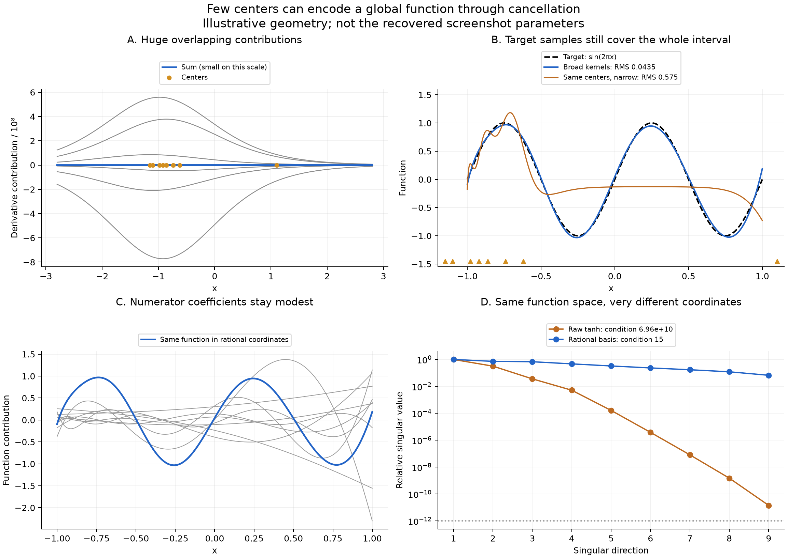
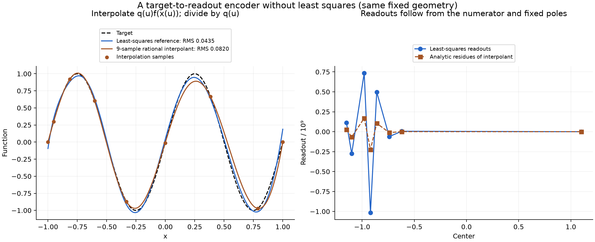

# Sparse centers, broad kernels, and a fixed-pole rational space

Status: code inspection and illustrative numerical experiment completed 2026-09-29. This is not an exact reconstruction of Sam's screenshot; its saved parameter state was not recovered. No training was performed and the workbench was not modified.

## Main finding

For a common-width tanh network, the geometric object has an exact, elementary description: it is a space of rational functions with fixed poles. Centers select the poles; the readouts are their residues. Clustered centers can produce enormous opposing residues while the rational function itself remains modest and smooth. This is a concrete explanation of how a few broad, clustered kernels can represent a globally oscillatory target.

The workbench also continues to fit target values at 256 sites across the entire interval after kernels are deleted. Its center dots are not data observations. In addition, deleting a kernel automatically broadens all surviving unlocked kernels to preserve mean lambda. These two implementation facts are essential to interpreting the screenshot.

In an illustrative eight-neuron geometry resembling the screenshot, a sine fit has RMS error 0.04347, although its individual derivative contributions reach 7.72×10⁸. The exact same nine-dimensional function space, represented by a polynomial numerator divided by a fixed denominator, has a sampled design condition number of 14.97 instead of 6.96×10¹⁰. This comparison changes coordinates, not the function space or the fitting observations.

## What the workbench actually does

Source inspected: `/Users/sam/.codex/visualizations/2026/09/26/01a0ded8-c952-7301-87c2-2541403061d0/qi-kernel-workbench.html`.

The function represented is

\[
\widehat f(x)=b+\sum_{j=1}^{n}v_j\tanh((x-c_j)/s_j).
\]

The displayed derivative curves are

\[
v_j\,s_j^{-1}\operatorname{sech}^2((x-c_j)/s_j).
\]

The function-mode solve uses 256 equally spaced target values on \([-1,1]\), independently of the center locations (source lines 214–239). The displayed function RMS uses 512 midpoint evaluation sites (line 253). The screenshot itself does not expose the selected fitting mode or cutoff, so function-mode reproduction below is an explicit assumption rather than a recovered fact. Derivative mode likewise samples the whole interval.

Deletion calls `preserveLambdaOnCountChange` (line 444). Its reference spacing is \(h=2.3/(n-1)\), with a special convention at one neuron. For unlocked equal-width kernels, preserving \(\lambda=h/s\) means

\[
s_{\rm new}=s_{\rm old}\frac{h_{\rm new}}{h_{\rm old}}.
\]

For example, reducing 48 kernels to 8 multiplies each surviving unlocked width by \(47/7\approx6.714\). A starting width near 0.196 therefore becomes about 1.314. The app has not simply left a gap between unchanged narrow functions: it has also made the remaining functions much more global. Locks can prevent this rescaling, so the screenshot alone does not prove which widths were rescaled.

## Exact rational-space theorem

Assume all widths equal \(s>0\), all centers are distinct, and a free constant \(b\) is included. Set

\[
t=e^{2x/s},\qquad a_j=e^{2c_j/s}>0.
\]

Using \(\tanh z=(e^{2z}-1)/(e^{2z}+1)\),

\[
\tanh((x-c_j)/s)=\frac{t-a_j}{t+a_j}
=1-\frac{2a_j}{t+a_j}.
\]

Therefore, with \(B=b+\sum_jv_j\),

\[
\widehat f(x)=B-2\sum_j\frac{v_ja_j}{t+a_j}
=\frac{P_n(t)}{Q_n(t)},\qquad Q_n(t)=\prod_j(t+a_j),
\]

where

\[
P_n(t)=BQ_n(t)-2\sum_jv_ja_j\prod_{\ell\ne j}(t+a_\ell)
\]

is a polynomial of degree at most \(n\).

Conversely, every polynomial \(P_n\) of degree at most \(n\), divided by this \(Q_n\), has a constant polynomial part plus a unique sum of simple partial fractions, because the \(a_j\) are distinct. Thus the network spans **all** numerators of degree at most \(n\) over this fixed denominator. This is an exact equality of spaces.

Multiply \(P_n/Q_n\) by \(t+a_j\) and evaluate at \(t=-a_j\). The residue is

\[
\frac{P_n(-a_j)}{Q_n'(-a_j)}=-2v_ja_j.
\]

The readout is consequently

\[
\boxed{v_j=-\frac{P_n(-a_j)}{2a_jQ_n'(-a_j)}},\qquad
Q_n'(-a_j)=\prod_{\ell\ne j}(a_\ell-a_j).
\]

The leading coefficient of \(P_n\) is \(B\), since \(Q_n\) is monic. Hence \(b=B-\sum_jv_j\). A given rational function and fixed poles determine all readouts, without solving a least-squares system for them.

This formula explains the alternating signs and large magnitudes of readouts near a cluster. The factors \(a_\ell-a_j\) are small; their signs alternate as one moves through the sorted poles. A numerator that stays smooth need not vanish at those negative pole locations. Large alternating residues can therefore describe a moderate function on the positive real fitting interval. This is a generic mechanism, not a guarantee of a particular sign pattern for every target.

## A better coordinate for a clustered family

The exponential coordinate is exact but may itself create inconvenient numerical scales. Choose a reference center \(c_0\) near the cluster and define

\[
u=\tanh((x-c_0)/s),\qquad d_j=\tanh((c_j-c_0)/s).
\]

The tanh subtraction identity gives

\[
\tanh((x-c_j)/s)=\frac{u-d_j}{1-u d_j}.
\]

The same space can therefore be written

\[
\widehat f(x)=\frac{p_n(u)}{q_n(u)},\qquad
q_n(u)=\prod_j(1-u d_j),\quad\deg p_n\le n.
\]

All factors in \(q_n\) are positive for real \(x\), because \(|u|,|d_j|<1\). Let \(z\) be the affine transformation taking the fitting interval in \(u\) to \([-1,1]\). Expressing \(p_n\) in Chebyshev polynomials \(T_k(z)\) gives the explicit basis

\[
\frac{T_0(z)}{q_n(u)},\ldots,\frac{T_n(z)}{q_n(u)}.
\]

This is not an SVD-defined basis or a newly chosen function space. Its formula follows directly from the centers and the shared width. Its conditioning is not universally bounded; the numerical improvement reported here is for the specified clustered example.

For nonzero \(d_j\), the pole is \(r_j=1/d_j\). The neuron has residue

\[
\lim_{u\to r_j}(u-r_j)\frac{u-d_j}{1-u d_j}
=-\frac{1-d_j^2}{d_j^2}.
\]

Comparing with the residue \(p_n(r_j)/q_n'(r_j)\) yields another exact coefficient formula:

\[
v_j=-\frac{d_j^2}{1-d_j^2}\frac{p_n(1/d_j)}{q_n'(1/d_j)}.
\]

At \(u=0\), every neuron equals \(-d_j\), and \(q_n(0)=1\), so \(b=p_n(0)+\sum_jv_jd_j\). If a center exactly equals \(c_0\), its neuron is simply \(u\); the exponential-coordinate residue formula avoids this exceptional finite-pole parametrization.

## Clustered translates become a derivative basis

Write \(\phi_c(x)=\tanh((x-c)/s)\). For nearby centers \(c_0+\epsilon\xi_j\), Taylor expansion in the center gives

\[
\phi_{c_0+\epsilon\xi_j}(x)
=\sum_{k=0}^{m-1}\frac{(\epsilon\xi_j)^k}{k!}\partial_c^k\phi_{c_0}(x)+O(\epsilon^m).
\]

For distinct \(\xi_j\), the Vandermonde matrix of their powers is invertible. Linear combinations of the translated features, with coefficients containing negative powers of \(\epsilon\), therefore approach the derivatives \(\partial_c^k\phi_{c_0}\). Equivalently, divided differences in the center converge to \(\partial_c^k\phi_{c_0}/k!\). The limiting function space contains a jet of the activation at one center, even though the raw center dots have nearly coincided.

The first few derivatives make the connection concrete. Writing \(u=\tanh((x-c_0)/s)\),

\[
\phi_{c_0}=u,\qquad
\partial_c\phi_{c_0}=-s^{-1}(1-u^2),\qquad
\partial_c^2\phi_{c_0}=-2s^{-2}u(1-u^2).
\]

At order \(k\), the derivative is a polynomial in \(u\) of degree \(k+1\) with nonzero leading coefficient. Thus a free constant plus the first \(m\) derivatives, including order zero, spans every polynomial in \(u\) of degree at most \(m\). This is the confluent limit of the fixed-pole theorem: the cluster contributes small \(d_j\), so its denominator factors tend to one.

With seven cluster centers and one distant center, the limiting denominator has only the distant factor \(1-u d_{\rm right}\); the numerator has degree at most eight. A rational function of this degree can have several turns even when almost all its raw neuron centers sit near the left edge. The surviving right neuron does not have to independently create the entire right-hand oscillation.

These limits require coefficient magnitudes to diverge as centers merge unless the target happens to need fewer modes. They describe a limiting span after a change of basis, not the span obtained by replacing distinct centers with exactly identical columns and keeping finite readouts.

## Numerical design and evidence

The illustrative centers are \((-1.15,-1.10,-0.98,-0.92,-0.86,-0.74,-0.62,1.10)\), all with width \(s=1.3142857\). The reference center is \(c_0=-0.91\). The target is \(\sin(2\pi x)\). Fits use the same 256 uniformly spaced sites as the workbench, a free bias, and relative singular cutoff \(10^{-12}\). All nine directions are retained. Evaluation uses 32,768 midpoints on \([-1,1]\).

- The broad raw tanh fit has function RMS 0.04347366. The largest readout is 1.0146×10⁹ and the largest derivative-kernel peak is 7.71996×10⁸. This reproduces the qualitative combination of a small global fit error and huge individual contributions, without claiming the screenshot's exact parameters.
- Refitting the same target in the explicit rational basis gives the same RMS, and its function differs from the raw evaluation by at most 7.61×10⁻⁷. The raw design condition number is 6.9573×10¹⁰; the rational design condition number is 14.9716. Both have nine columns spanning the same exact function space. This is coordinate conditioning, not evidence that the geometry or its generalization error is universally benign.
- The largest Chebyshev numerator coefficient is 0.40344. Small coefficients here are representation dependent; this is not a claim that a smaller parameter norm universally implies better generalization.
- Keeping the same centers while reducing their width to 0.19574468 increases function RMS to 0.57489. Thus the broad support is essential in this example; center coverage alone does not describe approximation capacity.
- The rational fit's derivative RMS error is about 0.93360, even though its function RMS is 0.04347. The top panel's enormous vertical scale hides derivative errors as well as the derivative sum. Function closeness does not establish high derivative accuracy.

## A simple target encoder without least squares

The rational theorem immediately permits interpolation instead of regression. Choose \(n+1\) distinct sites \(u_i\) in the transformed interval, observe the target at \(x_i=c_0+s\operatorname{arctanh}(u_i)\), and set

\[
h_i=q_n(u_i)f(x_i).
\]

Let \(L_i(u)=\prod_{\ell\ne i}(u-u_\ell)/(u_i-u_\ell)\) be the degree-\(n\) Lagrange cardinal polynomial. Then

\[
p_n(u)=\sum_i h_iL_i(u),\qquad
\widehat f(x)=p_n(u(x))/q_n(u(x))
\]

interpolates all supplied target values. Its readouts follow from the residue formula above, with no least-squares solve. If the target already belongs to this exact rational space, this encoder recovers it in exact arithmetic. For other targets it produces an interpolant, not the least-squares optimal numerator.

The implementation chooses Chebyshev extrema in the rescaled \(u\) coordinate and computes the polynomial coefficients by an explicit discrete cosine transform of \(q_n(u_i)f(x_i)\). With only nine function samples its sine RMS is 0.08195, versus 0.04347 for the 256-site least-squares reference. Residues are evaluated with 70-digit arithmetic; evaluating the resulting raw tanh network in float64 differs from the stable rational interpolant by at most 9.0×10⁻⁸. This example establishes an analytic encoder, not a uniformly accurate substitute for least squares.

## Interpretation and limits

The screenshot is not evidence that a model inferred the target on the right from one observed target point. The solver still receives function information across the right-hand interval. It is evidence that basis centers need not coincide with regions in which the resulting approximation varies.

There is a finite-complexity restriction: a fixed set of centers and one shared width selects a fixed-pole rational space of dimension at most \(n+1\). Projection chooses a member of that space using global observations. That restriction can support useful interpolation, but neither the screenshot nor this experiment establishes extrapolation, a target-independent generalization guarantee, or a universal low-complexity prior selected by Adam.

The rational description is exact for common widths. Multiple equal-width cohorts give a sum of such rational spaces in different transformed coordinates. Arbitrary distinct widths generally do not reduce to one fixed-degree rational function in one common exponential coordinate. Extending this structure to the irregular saved learned model is separate work.

Code and machine-readable evidence: `analyze.py`, `metrics.json`, and `illustrative_data.npz` in this directory. The script uses least squares only for diagnostic reference fits. Its interpolation encoder uses the stated cosine transform and residue formulas.
