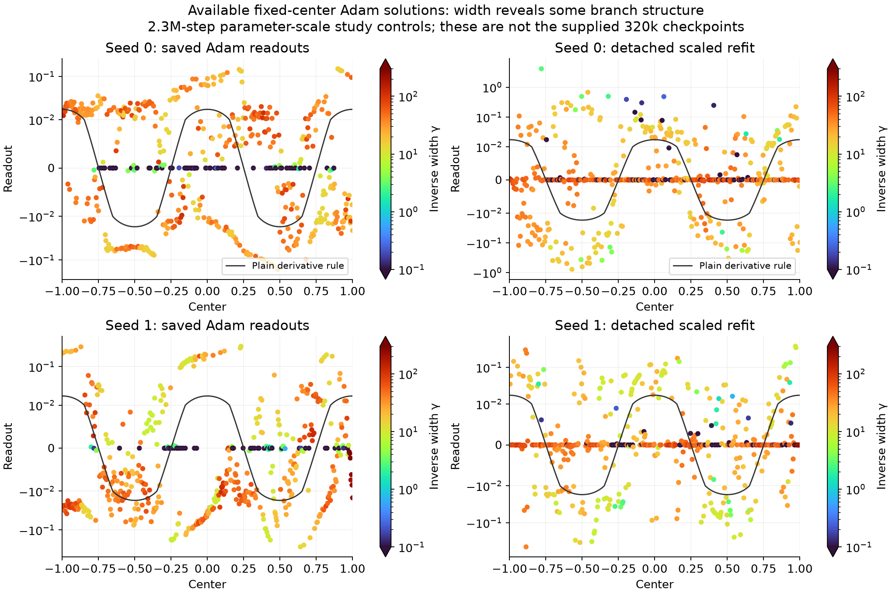
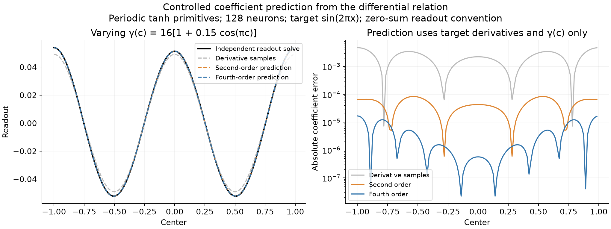
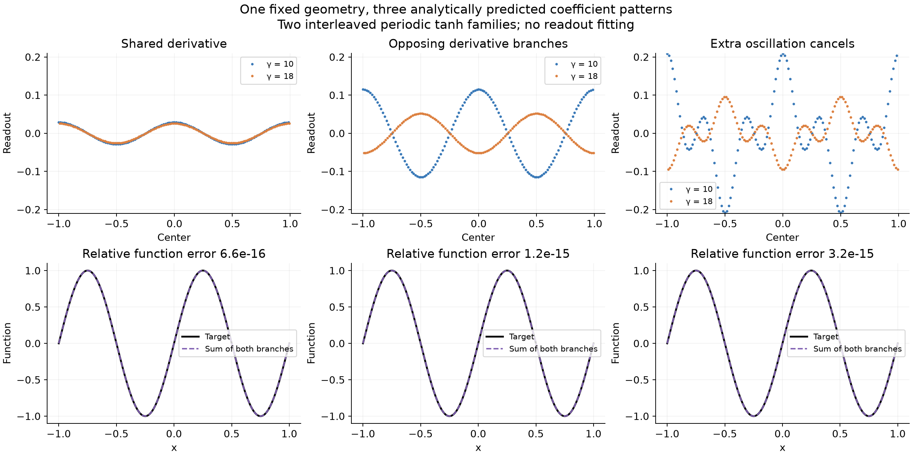
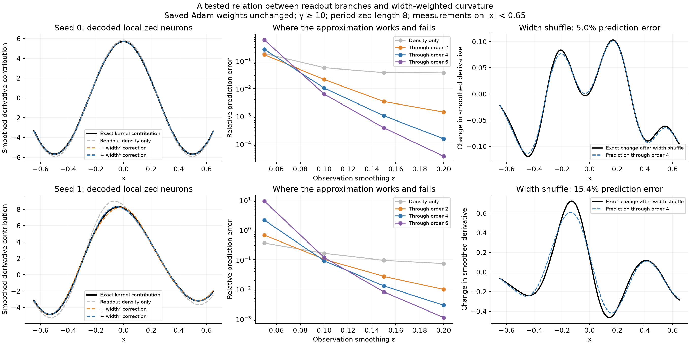

# Readout branches as coupled derivative densities

September 30, 2026 · Codex · static solutions, no new training.

## Result and scope

The question is what organizes the curves visible when learned readouts are plotted against centers. A general least-squares dual identity does not answer that question. Here we develop and test a more specific relation: **readout branches jointly encode the derivative through their local signed mass and their width-weighted curvature.** One resolved, uniform-width family reduces to the familiar derivative rule. Multiple families can carry opposing, smoothly organized contributions.

Three results have different evidence roles:

1. An explicit two-family construction produces three different readout patterns on the **same geometry**, including opposite-sign branches and an extra oscillation that cancels. All reproduce the same sine to about \(10^{-15}\), without fitting readouts. This demonstrates a mechanism for branch structure, not its identification in a particular Adam branch.
2. A differential formula predicts coefficients for smoothly varying widths. In the highlighted case, plain derivative samples have 6.64% relative coefficient error; second- and fourth-order corrections reduce it to 0.137% and 0.0159%. The predictor uses target and geometry only. A full solve is a separate reference.
3. On two available Adam solutions, width-weighted readout fields predict the combined contribution of localized neurons better than uncorrected readout density. This is **decoding known weights**, not predicting all learned weights from the target. Fine-resolution failures are included.

This supplies a useful relation among branches and a controlled coefficient predictor. It does not yet select every branch of an arbitrary learned network.

## Source states

The supplied picture comes from experiments/expD06_fixed_center_scales/stall_analysis.py: scaled Adam at shared rate 0.001, seeds 0 and 1, 320,000 steps, fixed centers, trained slopes, reference-envelope initialization. Its detached fit uses reference-scaled coordinates and singular-value truncation.

Those particular exports are absent from both Mac checkouts; a read-only cluster connection timed out. **The figures here use different saved runs**, from:

    results/checkpoint_D_optimizers/expD06_fixed_center_scales/parameter_scale_analysis/states/adam_N512_s{0,1}_scaled_eta0.001/checkpoint_002300000.npz

These are the collective-normalization controls of the later parameter-scale study, at 2.3 million steps, using scaled-Xavier readout initialization. Each has 559 fixed-center neurons including halo, fitting \(\sqrt2\sin(2\pi x)\) on \([-1,1]\). The source convention is \(h=2/512\), with 513 core centers.

Slope signs are absorbed into readouts: \(\gamma_j=|\gamma_j^{\rm stored}|\), \(v_j=\operatorname{sign}(\gamma_j^{\rm stored})v_j^{\rm stored}\). Functions are unchanged. Actual Adam readouts and detached refits remain separate.

| Saved run | Actual relative function L2 error | Detached refit error | Retained rank |
|---|---:|---:|---:|
| Seed 0 | \(3.37\times10^{-5}\) | \(3.09\times10^{-11}\) | 346 of 560 |
| Seed 1 | \(1.69\times10^{-3}\) | \(3.65\times10^{-11}\) | 340 of 560 |

Refits include bias, the source reference diagonal scaling, 8,193 equally spaced points, and relative cutoff \(10^{-12}\).

Width adds information but does not collapse these coefficients onto the plain derivative rule. An exploratory leave-one-out interpolation check using four neighbors gives \(R^2=-0.321,-0.066\) using center alone, versus \(0.478,0.566\) using center and log-gamma. Coordinates were scaled by 0.1 and 0.4 respectively, with inverse-square distance weighting, on \(|c|<0.9,\gamma>5\). This descriptive check is not a theoretical predictor or tuned out-of-sample result.

## 1. Coordinates for what the branches encode

For input \(x\in\mathbb R\), scalar bias \(b\), real readouts \(v_j\), centers \(c_j\), and positive inverse widths \(\gamma_j\), write

\[
F(x)=b+\sum_jv_j\tanh(\gamma_j(x-c_j)).
\]

The unit-mass kernel \(k_\gamma:\mathbb R\to\mathbb R\) is

\[
k_\gamma(x)=\frac{\gamma}{2}\operatorname{sech}^2(\gamma x),
\qquad \int k_\gamma=1.
\]

Therefore

\[
F'(x)=\sum_j2v_jk_{\gamma_j}(x-c_j). \tag{1}
\]

Each neuron carries signed derivative mass \(2v_j\). The finite signed measure
\(\mu=\sum_j2v_j\delta_{(c_j,\gamma_j)}\) lies on center–inverse-width space \(\mathbb R\times(0,\infty)\). Geometry gives its support; readouts give its masses. Naming this synthesis map alone would not explain the structure.

The useful step is to track its width moments. For integer \(m\ge0\), define the signed measure on the center axis

\[
M_{2m}=\sum_j2v_j\gamma_j^{-2m}\delta_{c_j}. \tag{2}
\]

Here \(\delta_c\) is a unit point mass at \(c\). \(M_0\) records readout mass, \(M_2\) weights it by squared physical width, and \(M_4\) by fourth powers of width. They become ordinary smooth functions after convolution with a Gaussian; denote that smoothing operation by \(S_\epsilon\), where \(\epsilon\) is its standard deviation.

The central approximation is

\[
\boxed{
S_\epsilon F'\approx S_\epsilon M_0
+\frac{\pi^2}{24}\partial_x^2S_\epsilon M_2
+\frac{7\pi^4}{5760}\partial_x^4S_\epsilon M_4+\cdots .
} \tag{3}
\]

This is a finite-order, resolution-dependent approximation, not a generally convergent series at arbitrary resolution. A branch contributes signed mass and width-dependent curvature corrections. Branches need not individually resemble \(f'\); their contributions must combine to resemble it when derivative accuracy has actually been established. Small function L2 error alone does not imply that accuracy.

## 2. Derivation and a remainder bound

Let \(\eta:\mathbb R\to\mathbb R\) be a smooth test function with bounded derivatives. Substitution \(u=\gamma_j(x-c_j)\) gives

\[
\int 2v_jk_{\gamma_j}(x-c_j)\eta(x)\,dx
=2v_j\int k_1(u)\eta(c_j+u/\gamma_j)\,du.
\]

Taylor-expand \(\eta\) at \(c_j\). Odd powers integrate to zero because \(k_1\) is even. With moments \(\mu_{2m}=\int u^{2m}k_1(u)\,du\), the result is

\[
2v_j\sum_{m=0}^p
\frac{\mu_{2m}}{(2m)!\gamma_j^{2m}}\eta^{(2m)}(c_j)+R_j.
\]

Expanding through order \(2p+1\) before bounding the remainder yields

\[
|R_j|\le
\frac{|2v_j|\mu_{2p+2}}{(2p+2)!\gamma_j^{2p+2}}
\|\eta^{(2p+2)}\|_\infty. \tag{4}
\]

By definition of distributional derivatives,
\(\langle\partial^{2m}\delta_c,\eta\rangle=\eta^{(2m)}(c)\).
Summing gives
\(F'=\sum_{m=0}^p\mu_{2m}\partial^{2m}M_{2m}/(2m)!+R\)
on test functions, with remainder bounded by the sum of (4). Choosing \(\eta\) to be a translated Gaussian proves (3), including a conservative pointwise truncation bound.

The constants follow explicitly from the kernel. With Fourier convention
\(\widehat k(\omega)=\int k(x)e^{-i\omega x}\,dx\), substitute \(u=e^{2\gamma x}\):

\[
\widehat{k_\gamma}(\omega)
=\int_0^\infty\frac{u^{-it}}{(1+u)^2}\,du
=\Gamma(1-it)\Gamma(1+it)
=\frac{\pi t}{\sinh(\pi t)},\qquad t=\frac{\omega}{2\gamma}.
\]

The middle equality is the beta integral; the last is Euler's reflection identity. Define the scalar multiplier

\[
H_\gamma(\omega)=
\frac{\pi\omega/(2\gamma)}{\sinh(\pi\omega/(2\gamma))},\qquad H_\gamma(0)=1.
\]

Expanding \(z/\sinh z\) gives

\[
H_\gamma(\omega)=1-\frac{\pi^2\omega^2}{24\gamma^2}
+\frac{7\pi^4\omega^4}{5760\gamma^4}
-\frac{31\pi^6\omega^6}{967680\gamma^6}+\cdots .
\]

Since \(\widehat{\partial^{2m}g}=(i\omega)^{2m}\widehat g\), this gives the signs and constants in (3). The Taylor series in frequency has radius \(2\gamma\); Gaussian smoothing is not a strict frequency cutoff.

## 3. Why QI displays the derivative, and an explicit coefficient predictor

Consider a continuum family with smooth signed derivative-mass density \(\rho(c)\) and smooth positive inverse width \(\gamma(c)\). It represents

\[
q(x)=\int\rho(c)k_{\gamma(c)}(x-c)\,dc. \tag{5}
\]

Here \(q\) is the represented derivative; a desired exact representation sets \(q=f'\). Repeating the test-function calculation and integrating by parts gives

\[
q=\rho+a_2\partial^2(\gamma^{-2}\rho)
+a_4\partial^4(\gamma^{-4}\rho)+\cdots ,
\quad a_2=\frac{\pi^2}{24},\quad a_4=\frac{7\pi^4}{5760}. \tag{6}
\]

The derivatives act on the **product**, so gradients of width matter. The continuum approximation also requires a sufficiently resolved quadrature; a coarse or irregular neuron set introduces additional errors.

Define operators on smooth densities:
\(L_2\rho=a_2\partial^2(\gamma^{-2}\rho)\),
\(L_4\rho=a_4\partial^4(\gamma^{-4}\rho)\).
A formal small-width inverse through fourth order is

\[
\rho^{[2]}=q-L_2q,\qquad
\rho^{[4]}=q-L_2q+L_2^2q-L_4q. \tag{7}
\]

To check this, multiply \(I+L_2+L_4\) by \(I-L_2+L_2^2-L_4\). Terms of second order cancel as \(L_2-L_2\); fourth-order terms cancel as \(L_4-L_2^2+L_2^2-L_4\). Remaining terms start at sixth order in the width expansion. Operators need not commute; preserve the ordering in \(L_2^2\). The expansion assumes bounded derivatives at the spatial scales considered.

For centers spaced by \(h\), quadrature of (5) requires \(v_j=h\rho(c_j)/2\). Zeroth order \(\rho=q=f'\) gives the QI rule. The second-order prediction is

\[
\boxed{
v_j^{[2]}=\frac h2\left[f'(c_j)-\frac{\pi^2}{24}
\left.\frac{d^2}{dc^2}\left(\frac{f'(c)}{\gamma(c)^2}\right)\right|_{c=c_j}\right].
} \tag{8}
\]

At constant width this is \(h[f'-\pi^2f'''/(24\gamma^2)]/2\). The formula uses target derivatives and prescribed widths, with no feature overlaps, singular vectors, or fitted readouts.

### Controlled validation

Use 128 uniformly spaced neurons on a length-2 circle, with periodic primitives of tanh derivative kernels and separate output mean. Fit \(\sin(2\pi x)\) with
\(\gamma(c)=\gamma_0[1+A\cos(\pi c)]\).
Predictor and reference share a zero-sum readout convention. The independent reference solves the function-value Fourier least-squares problem through harmonic 512 with cutoff \(10^{-13}\). It does not enter (7).

| \(\gamma_0\) | \(A\) | Plain derivative coefficient error | Second order | Fourth order |
|---:|---:|---:|---:|---:|
| 12 | 0 | 10.44% | 0.347% | 0.00555% |
| 12 | 0.15 | 11.40% | 0.412% | 0.0715% |
| 12 | 0.30 | 14.71% | 0.740% | 0.669% |
| 16 | 0 | 6.071% | 0.114% | 0.00103% |
| 16 | 0.15 | 6.638% | 0.137% | 0.0159% |
| 16 | 0.30 | 8.619% | 0.279% | 0.169% |
| 24 | 0 | 2.764% | 0.0233% | 0.0000935% |
| 24 | 0.15 | 3.025% | 0.0283% | 0.00170% |
| 24 | 0.30 | 3.946% | 0.0669% | 0.0211% |

Errors are relative Euclidean coefficient errors. The full sweep exposes variation with width and modulation.

In the highlighted \(\gamma_0=16,A=0.15\) case, fourth-order coefficients give relative function error \(5.68\times10^{-5}\); the independent floor is \(2.55\times10^{-15}\). Good coefficient prediction is not floor-level function accuracy.

Increasing reference harmonics from 512 to 1024 leaves coefficients unchanged; using 256 changes them by \(6.07\times10^{-8}\) relatively. Cutoffs \(10^{-12},10^{-13},10^{-14}\) agree. FFT differentiation retains frequencies through \(64\pi\), suppressing roundoff amplification in negligible modes.

## 4. Several organized branches can encode one derivative

For two continuum families with constant widths, let \(\rho_1,\rho_2\) be their derivative-mass densities. Then

\[
q=k_{\gamma_1}*\rho_1+k_{\gamma_2}*\rho_2,\qquad
\widehat q=H_{\gamma_1}\widehat\rho_1+H_{\gamma_2}\widehat\rho_2. \tag{9}
\]

Each spatial frequency supplies one constraint on two branch amplitudes. Adding \(a\cos(\nu c)\) to the first density is compensated by adding
\(-aH_{\gamma_1}(\nu)\cos(\nu c)/H_{\gamma_2}(\nu)\)
to the second. This predicts the compensation's amplitude and sign from geometry.

For \(q(c)=\omega\cos(\omega c)\), representing \(f(x)=\sin(\omega x)\), take

\[
\begin{aligned}
\rho_1(c)&=\frac{\alpha}{H_{\gamma_1}(\omega)}q(c)+a\cos(\nu c),\\
\rho_2(c)&=\frac{1-\alpha}{H_{\gamma_2}(\omega)}q(c)
-a\frac{H_{\gamma_1}(\nu)}{H_{\gamma_2}(\nu)}\cos(\nu c).
\end{aligned} \tag{10}
\]

Convolution multiplies each cosine by its \(H\). The target terms become \(\alpha q+(1-\alpha)q=q\), and the extra oscillations cancel exactly. If \(\alpha>1\), the second derivative-carrying branch is negative.

Sample (10) on two interleaved lattices, each with 128 centers on a length-2 circle, with \(\gamma_1=10,\gamma_2=18,\omega=2\pi,\nu=6\pi\). Set \(v=h\rho/2\), using each family's spacing \(h=2/128\). The three columns below use \((\alpha,a)=(0.5,0),(2,0),(2,12)\).

The continuum identities are exact. Finite sampled versions have residual aliasing rather than an asserted exact finite-dimensional nullspace. Independent real-space evaluation of periodized tanh sums gives errors \(6.41\times10^{-16},1.23\times10^{-15},3.19\times10^{-15}\).

This establishes a mechanism for branches containing derivative information and structured cancellation. It does not explain which allocation an optimizer selects. A norm convention supplies extra information: minimizing \(a_1^2+a_2^2\) subject to \(H_1a_1+H_2a_2=Q\) gives \(a_b=H_bQ/(H_1^2+H_2^2)\), by a scalar Lagrange multiplier. Other conventions can select other allocations; finite irregular geometries add boundary and alias constraints.

## 5. Actual learned-state test and intervention

Evaluate (3) on unchanged saved Adam weights, approximating neurons with \(\gamma\ge10\): 478 in seed 0 and 451 in seed 1. Broader neurons are evaluated exactly when forming the full derivative.

Use periodized kernels on length 8, Gaussian widths \(\epsilon=0.05,0.10,0.15,0.20\), and measure error on \(|x|<0.65\). This is a declared coarse-resolution diagnostic, not unsmoothed pointwise accuracy or extrapolation.

At \(\epsilon=0.15\):

| Error against exact smoothed localized-neuron contribution | Seed 0 | Seed 1 |
|---|---:|---:|
| Readout mass only | 3.762% | 9.426% |
| Through width-squared correction | 0.340% | 2.717% |
| Through width-fourth-power correction | 0.104% | 1.298% |
| Through width-sixth-power correction | 0.0381% | 0.818% |

Including the exact broad cohort, the full smoothed derivative differs from the similarly smoothed sine derivative by 0.228% and 0.510%. This also reflects periodization and smoothing beyond the original fitting interval.

**Failure:** at \(\epsilon=0.05\), fourth-order errors are 25.8% and 212.5%, with sixth order worse. Adding terms does not automatically improve this expansion.

For an intervention, permute widths among these localized neurons, holding centers and readouts fixed. \(M_0\) stays unchanged, but

\[
\Delta(S_\epsilon F')\approx
a_2\partial^2S_\epsilon\Delta M_2+
a_4\partial^4S_\epsilon\Delta M_4
\]

predicts the change. For one fixed permutation seed, prediction errors are 4.97% and 15.39% relative to the actual change. The changes have magnitudes 1.64% and 7.36% of the smoothed target derivative norm. This is a measured approximate counterfactual, not an exact readout prediction.

## 6. Connection to the checkpoint and other activations

The earlier checkpoint's dual identities and controlled geometry-edit formulas remain valid. The addition here is a description of **what several branches encode together** in center and width coordinates.

For smooth branches indexed by \(b\), with densities \(\rho_b\) and inverse widths \(\gamma_b(c)\),

\[
q\approx\sum_b\rho_b+
a_2\partial^2\sum_b\frac{\rho_b}{\gamma_b^2}
+a_4\partial^4\sum_b\frac{\rho_b}{\gamma_b^4}+\cdots . \tag{11}
\]

The derivative constrains a combination of branches, generally not every branch separately. Different allocations can have the same resolved derivative. In finite networks this is usually equivalence at a specified tolerance, resolution, and domain, not exact nonuniqueness of independent features.

The argument extends whenever a suitable activation derivative is an integrable normalized kernel:

| Feature | Represented quantity | Signed mass per neuron | Unit-scale second moment |
|---|---|---|---|
| Tanh \(\tanh(\gamma(x-c))\) | \(F'\) | \(2v\) | \(\pi^2/12\) |
| Raw tent \(T(\gamma(x-c))\), \(T(u)=(1-|u|)_+\) | \(F\) | \(v/\gamma\) | \(1/6\) |
| Raw GELU \(\sigma(\gamma(x-c))\), \(\sigma(u)=u\Phi(u)\) | \(F''\) | \(v\gamma\) | \(-1\) |
| Raw ReLU \(\max(0,\gamma(x-c))\) | Distributional \(F''\) | \(v\gamma\) | Zero: Dirac kernel |

For GELU, \(\sigma''(u)=(2-u^2)\varphi(u)\), with standard normal density \(\varphi\). Its mass is \(2-1=1\), and second moment \(2\mathbb E Z^2-\mathbb E Z^4=2-3=-1\). Signed kernels are allowed; remainder bounds use absolute moments. ReLU gives exact slope-jump measures and no independent smooth width after amplitude normalization. Relating those masses to sampled \(f''\) requires resolved knots and an appropriate fitting problem.

These activation extensions were derived, not empirically tested in this task. They do not establish training performance. Kernel asymptotics and neural quasi-interpolation have established literatures; the underlying expansion is not claimed as new. Context: [Berry and Harlim's variable-bandwidth kernel analysis](https://arxiv.org/abs/1406.5064) and [Costarelli and Spigler's sigmoidal approximation operators](https://www.sciencedirect.com/science/article/abs/pii/S0893608013001007). Neither reference validates the learned-branch hypotheses tested here.

## Unresolved issue

We have not identified a unique small family decomposition of the supplied Adam figure or predicted all its individual coefficients. Its exact 320k states remain unavailable here. Decoding known weights is not a theory selecting those weights.

The specific open problem is whether visible branches admit a small set of smooth width functions and signed densities satisfying (11), plus a reproducible rule for their compensating components. That must predict actual readouts on held-out neurons or geometries. Fitting an unrestricted surface to every coefficient would not answer it.

Evidence is strongest for the explicit predictor in smooth geometries and the two-family balance law. Application to irregular learned branches is partial and resolution-dependent. No training-dynamics or general deep-learning claim follows from these tests.

## Reproducibility

The local analysis script reads existing states and writes figures, derived arrays, and metrics.json here. It does not train or mutate a saved state. Metrics include source hashes, configurations, all nine smooth-geometry tests, every observation resolution, and grid-refinement comparisons. verification.json records independent real-space and reference-cutoff checks.

From the repository root:

    OMP_NUM_THREADS=1 OPENBLAS_NUM_THREADS=1 VECLIB_MAXIMUM_THREADS=1 .venv/bin/python results/checkpoint_G_interactive/geometry_reader_codex/learned_branches_20260930/analyze.py
