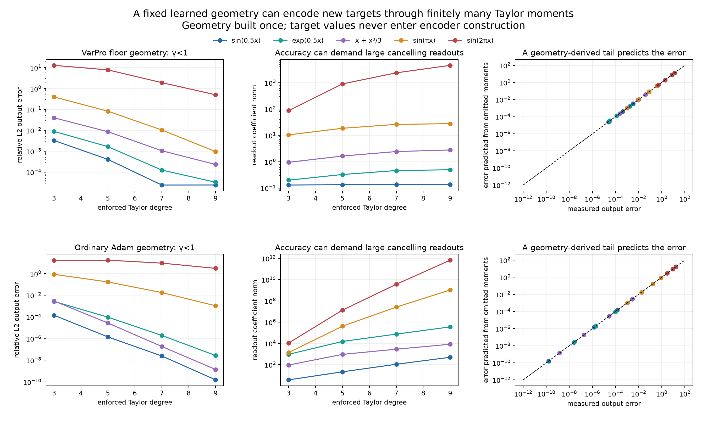
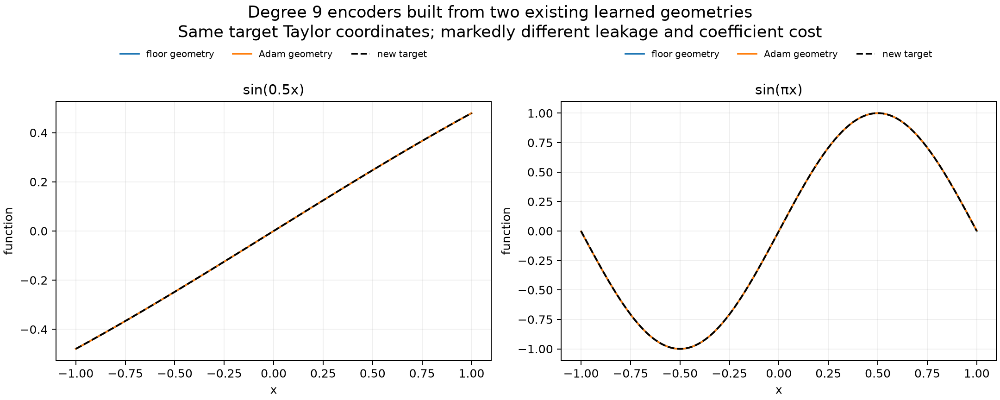

# Target transfer through a Taylor-moment lens on actual learned geometry

Status: completed fixed-geometry construction and validation, September 30, 2026. No training occurred. Encoder construction never uses a fit to target function values.

The subsequent [sampled-input extension and original-readout decoding](sampled_report.md) uses these same stored geometry encoders. Statements below about requiring analytic target coordinates describe the initial experiment, not the completed extension.

The construction succeeds for slowly varying new targets on a restricted part of an actual learned geometry. It also has an unusually explicit failure explanation: the moments not constrained by the encoder predict the measured output error. This is a small, interpretable model-reduction result, not a universal replacement for least squares.

## Question

Can an existing learned geometry be turned into a reusable coefficient encoder, with an understood intermediate representation and a quantitative prediction of its error? Merely precomputing a pseudoinverse of the full feature matrix would not answer the structural question. Here the intermediate coordinates are finitely many derivatives at one point, and complex poles explain when those coordinates control the function over an interval.

## Geometry and construction

We freeze two existing tanh geometries from the previous analysis: the 461-neuron VarPro + Gauss–Newton sine floor solution, and the 204-neuron ordinary-Adam sine/Xavier-seed-0 solution at 10,000 steps. The current analysis changes no centers or widths. It uses neurons with γ<1 and sets all other readouts to zero. This leaves 190 neurons in the floor geometry and 194 in the ordinary-Adam geometry. Thus this is explicitly a construction on a restricted subspace of each saved geometry, not an encoder for its entire learned dictionary or a reproduction of its original coefficients.

The closest neuron pole to x=0 has modulus

\[
R_j=\sqrt{c_j^2+\frac{\pi^2}{4\gamma_j^2}}.
\]

The smallest R_j among the selected neurons is 1.64682 for the floor geometry and 8.05751 for the Adam geometry. Every selected feature therefore has a convergent Taylor series throughout [−1,1]. This gives a target-independent reason to use polynomial moments.

For φ_j(x)=tanh(γ_j(x−c_j)), write

\[
\phi_j(x)=\sum_{k=0}^{\infty}E_{kj}x^k,
\qquad E_{kj}=\frac{\gamma_j^k}{k!}P_k(\tanh(-\gamma_jc_j)),
\]

where P_0(t)=t and P_{k+1}(t)=(1−t²)P_k′(t). This recurrence follows from the chain rule because d(tanh z)/dz=1−tanh²z. All E entries depend only on the saved geometry. They are computed at 65 decimal digits and then stored as float64.

Let F_M contain rows 1 through M of E. A target with Taylor coefficients t_k=f^(k)(0)/k! supplies the vector t=(t_1,…,t_M). We require

\[
F_Mv=t.
\]

The minimum-Euclidean-norm solution of these finite moment constraints is

\[
\boxed{v=C_Mt,\qquad C_M=F_M^T(F_MF_M^T)^{-1}.}
\]

To derive this, minimize ‖v‖²/2 subject to F_Mv=t. The Lagrangian is ‖v‖²/2−α^T(F_Mv−t); differentiation gives v=F_M^Tα. Substitution into the constraint gives F_MF_M^Tα=t. The rows are independent for the tested cases. Numerically, row-normalized QR applies this formula without squaring its condition number. It is not claimed that this standard linear algebra is new theory.

A free output bias enforces the constant coefficient exactly:

\[
b=t_0-\sum_jE_{0j}v_j.
\]

The same C_M is reused unchanged for five targets. Degrees M=3,5,7,9 are fixed in advance. No target-specific geometry choice, regularization search, or function-value solve is used in the encoder. Target Taylor coordinates are supplied analytically; this experiment does **not** yet demonstrate stable recovery of high derivatives from noisy function samples.

Four targets are different from the sine used to learn these geometries: sin(0.5x), exp(0.5x), x+x³/3, and sin(πx). The fifth, sin(2πx), is the original training target and is included as a higher-complexity stress control, not a held-out target.

## Why the omitted moments predict the error

For k>M, the constructed function has coefficient E_kC_Mt, although the target would require t_k. Consequently,

\[
\widehat f(x)-f(x)=\sum_{k>M}\left(E_kC_Mt-t_k\right)x^k
\]

in exact arithmetic wherever both Taylor series converge. The first M coefficients vanish by construction. Small numerical constraint defects are included in the computed prediction.

This separates two sources of error. The geometry produces a tail E_kC_Mt beyond the moments that were prescribed; the target itself has a tail t_k. They may reinforce or cancel. A large target Taylor tail does not by itself determine the final error.

For a finite error polynomial d(x)=Σ_{k=0}^Kd_kx^k, its squared L2 norm has an exact expression:

\[
\int_{-1}^1d(x)^2\,dx
=\sum_{k,l=0}^{K}d_kd_lH_{kl},\qquad
H_{kl}=\begin{cases}2/(k+l+1),&k+l\text{ even},\\0,&k+l\text{ odd}.\end{cases}
\]

We predict the final error using moments through K=21, independently of evaluating the network against target samples. These polynomial integrals are accumulated at high precision. This prediction has an explicit truncation limitation. For any pole-free circle of radius r>1, the Cauchy estimate bounds the remaining analytic tail geometrically by a constant times r^(−K−1)/(1−1/r). The constant depends on the constructed readouts and function magnitude on the circle. We do not substitute pole distance alone for that constant or claim a rigorous numerical certificate from the finite prediction.

## Results

The target-transfer figure shows output error, coefficient cost, and independently predicted error for every tested geometry/degree/target combination.

- **The Adam broad-neuron geometry supports accurate transfer to new slow targets.** At degree 9, relative L2 error is 1.55×10⁻¹⁰ for sin(0.5x), 1.41×10⁻⁹ for x+x³/3, and 2.74×10⁻⁸ for exp(0.5x). These targets were not used to construct the encoder. Corresponding readout norms are 494, 8,305, and 356,660. Its very broad, closely spaced features create an effective polynomial basis through cancellation.
- **The floor geometry has lower coefficient cost but more leakage beyond the prescribed moments.** Its degree-9 errors for the same three targets are 2.44×10⁻⁵, 2.33×10⁻⁴, and 3.30×10⁻⁵; readout norms are 0.136, 2.80, and 0.496. Its nearest poles are closer, so a low-degree moment description leaves a larger unconstrained tail. These errors are not the best approximation errors of that geometry.
- **Higher-frequency transfer exposes the limitation.** For sin(πx), degree-9 error is 9.68×10⁻⁴ on the floor geometry and 1.06×10⁻³ on Adam geometry. For sin(2πx), the errors are 0.504 and 3.02. The Adam readout norms reach 1.06×10⁹ and 6.76×10¹¹ respectively. Accurate low-order moments do not guarantee accurate global reconstruction when target complexity and cancellation grow.
- **The analytic tail predicts successes and failures.** Across all 40 cases, the predicted and measured error norms differ by at most 0.276% of the measured value for the floor geometry and 0.0234% for the Adam geometry. This is a check of a truncated analytic prediction, not an SVD-based post hoc reproduction of the fitted coefficients.
- **Grid refinement is stable.** Changing from 4,097 to 8,193 evaluation points changes reported relative errors by at most 0.000616%. The primary results use trapezoidal approximation of continuous L2 on [−1,1].

| Target, degree 9 | Floor-geometry error | Floor readout norm | Adam-geometry error | Adam readout norm |
|---|---:|---:|---:|---:|
| sin(0.5x) | 2.44×10⁻⁵ | 0.136 | 1.55×10⁻¹⁰ | 494 |
| exp(0.5x) | 3.30×10⁻⁵ | 0.496 | 2.74×10⁻⁸ | 356,660 |
| x+x³/3 | 2.33×10⁻⁴ | 2.80 | 1.41×10⁻⁹ | 8,305 |
| sin(πx) | 9.68×10⁻⁴ | 27.9 | 1.06×10⁻³ | 1.06×10⁹ |
| sin(2πx) | 0.504 | 4,564 | 3.02 | 6.76×10¹¹ |

## Separate diagnostic comparisons

For context only, we also fit function values on 1,025 points using a centered free bias and SVD relative cutoff 10⁻¹³. One benchmark uses all selected broad neurons; another uses only the M-dimensional feature family ΦC_M. Neither solve feeds into encoder construction or target-transfer predictions.

The same jet-generated feature family can generally fit a target more accurately when its coordinates are adjusted through global least squares instead of constrained to the target's Taylor coefficients. For example, sin(0.5x) at degree 9 has errors 2.44×10⁻⁵ versus 1.34×10⁻⁷ on the floor geometry, and 1.55×10⁻¹⁰ versus 4.80×10⁻¹³ on Adam geometry. Thus the moment encoder is not presented as producing the optimal coefficients in its own span. Its advantages here are interpretable coordinates, target-independent construction, and an explicit error mechanism.

Numerical SVD cutoffs depend on parameterization. On the Adam broad geometry, the diagnostic raw-feature solve retains rank 8, while the moment-transformed coordinates permit different directions to survive the same relative cutoff. Some jet-span results therefore beat the raw-feature truncated-SVD diagnostic. This is not a violation of subspace inclusion and is not evidence of beating the mathematical least-squares optimum. All benchmark ranks and errors are retained in `metrics.json`.

## What is established and what remains

This builds a restricted coefficient encoder from a learned geometry and identifies the intermediate object concretely: a Taylor-moment map whose right inverse creates functions with prescribed derivatives. The matrix algebra alone is generic. The substantive approximation claim is that the broad learned features admit a convergent, low-complexity moment description, and the geometry-derived omitted moments predict when that claim succeeds or fails.

A low-degree Taylor lens gives a useful positive result for slowly varying analytic targets, while also explaining why full local moment matching can be expensive and inaccurate for more oscillatory targets. A geometry with farther poles can have a smaller truncation tail and a much more expensive moment inverse simultaneously. Local analyticity and numerical encoding stability are different properties.

This is not yet the desired general sampled-function-to-coefficients lens for arbitrary learned neurons. It ignores the narrow neurons, assumes analytic target coordinates, and can produce very large readouts. Natural next tests would replace local Taylor coordinates with stable interval-wide coordinates while retaining an explicit tail model, and divide the geometry into analytically justified scale groups. Those are directions, not completed claims.

## Reproducibility

`analyze.py` reads derived saved geometry arrays from the previous `geometry_object_20260929/learned_solution` analysis. Those arrays came from the original saved VarPro and ordinary-Adam checkpoints documented there. `metrics.json` contains all 40 cases, benchmark ranks, coefficient norms, moment constraint defects, and grid comparisons. `*_encoder_degree*.npz` contain the actual reusable geometry-only encoder matrices and masks; `*_predictions.npz` contain plotted outputs. `probe.py` records the initial bounded feasibility probe. No saved source checkpoint was altered.

Run from the repository root with `OMP_NUM_THREADS=1 OPENBLAS_NUM_THREADS=1 .venv/bin/python results/checkpoint_G_interactive/geometry_reader_codex/lens_construction_20260930/learned_transfer/analyze.py`.
