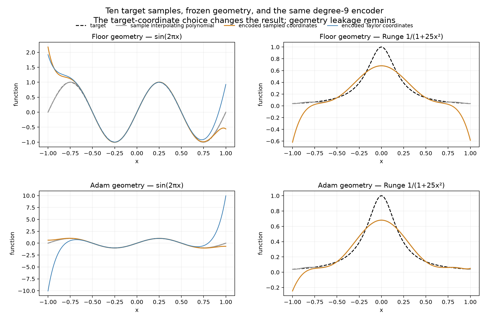
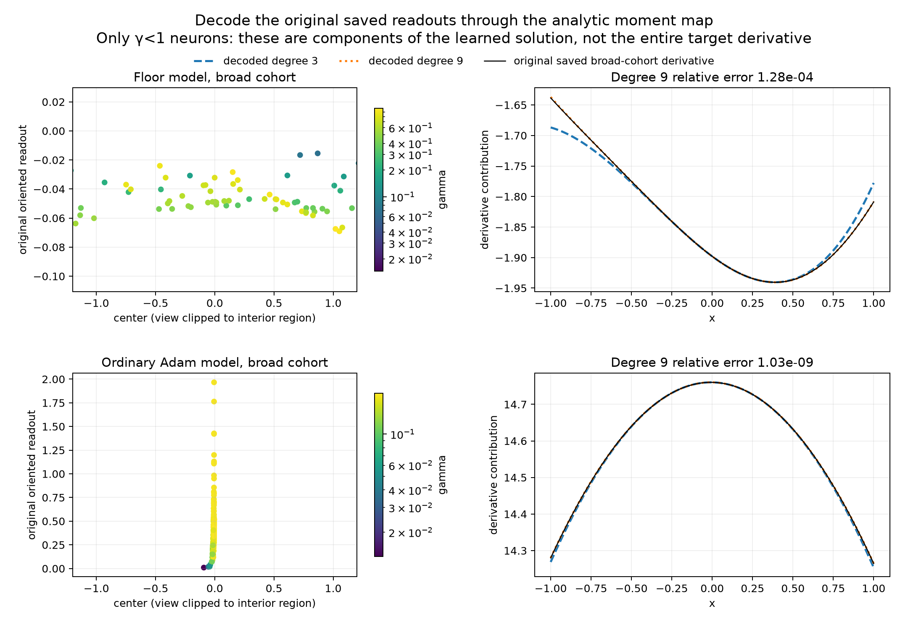

# Sampled function values through the unchanged learned-geometry encoder

Status: completed extension of the Taylor-moment construction. All original results and encoder matrices are preserved. No new geometry, training, or target least-squares solve was introduced.

This extension gives a literal sampled-function-to-readouts pipeline. Ten target values are enough for a strong result on sufficiently slow targets, but changing target coordinates alone does not solve the broad-neuron encoder's high-order leakage.

## The fixed pipeline

For degree M, sample the target at the M+1 Chebyshev-Lobatto points

\[
x_j=\cos(j\pi/M),\qquad j=0,\ldots,M.
\]

Form the unique degree-M interpolating polynomial p_M. Its Chebyshev coefficients are computed by a type-I discrete cosine transform: divide the transform by M and halve the resulting coefficients at indices 0 and M. Equivalently,

\[
a_k=\frac{2}{M\nu_k}\sum_{j=0}^{M}\omega_j f(x_j)\cos(kj\pi/M),
\]

where ω_0=ω_M=1/2 and all other ω_j=1; ν_0=ν_M=2 and all other ν_k=1. The endpoint factors come from the discrete orthogonality of cosines on the Lobatto grid. This is interpolation, not a fit with free residuals.

The Chebyshev recurrence T_0(x)=1, T_1(x)=x, T_{k+1}(x)=2xT_k(x)−T_{k−1}(x) converts p_M=Σa_kT_k into its monomial coefficients t_0,…,t_M. Those coordinates are sent to the **same previously saved** C_M:

\[
\boxed{v=C_M(t_1,\ldots,t_M)^T,\qquad b=t_0-E_0v.}
\]

Thus the complete map is target samples → fixed cosine transform → polynomial-coordinate conversion → fixed geometry encoder. Only the target-input representation changes from the earlier experiment. The geometry and all C_M matrices are unchanged. No target derivatives are required. The actual implementation preserves these stages instead of treating a potentially ill-conditioned composed matrix as a numerically harmless operation.

## Error decomposition and prediction

The error separates exactly into

\[
\widehat f-f=(\widehat f-p_M)+(p_M-f).
\]

The second term is the target information missed by M+1 samples and degree-M interpolation. The first is what the geometry encoder adds beyond the requested polynomial moments. Writing t_k=0 for k>M, the geometry term has Taylor coefficients

\[
\delta_k=E_kC_Mt-t_k\quad(k\ge1),\qquad\delta_0=0.
\]

In exact arithmetic these vanish through degree M. The previously derived pole-radius argument ensures the remaining geometry series converges on [−1,1]. The code truncates it at degree 21 to predict output error, then compares that prediction with direct evaluation of the actual tanh network.

For the five entire-function targets, the independent analytic target Taylor series gives the same polynomial-integral prediction used previously. For Runge, the Taylor series at zero does not converge across [−1,1], so it is explicitly **not** used. Instead, the known Runge function supplies the interpolation residual p_M−f, combined with the degree-21 geometry-tail prediction. This is a validation calculation using the known test target, not a guarantee that unseen behavior between arbitrary samples can be known.

## Results

Six targets, four degrees, and two frozen geometries produce 48 cases. Degree 9 uses ten samples. Four targets differ from the sine on which the geometries were learned; Runge is an additional unseen stress case; sin(2πx) remains the original-target stress control.

| Target, degree 9 | Polynomial interpolation error | Floor-geometry encoded error | Adam-geometry encoded error |
|---|---:|---:|---:|
| sin(0.5x) | 4.36×10⁻¹⁴ | 2.44×10⁻⁵ | 1.63×10⁻¹⁰ |
| exp(0.5x) | 5.63×10⁻¹³ | 3.30×10⁻⁵ | 2.74×10⁻⁸ |
| x+x³/3 | 2.47×10⁻¹⁶ | 2.33×10⁻⁴ | 1.41×10⁻⁹ |
| sin(πx) | 8.58×10⁻⁶ | 1.15×10⁻³ | 7.45×10⁻⁴ |
| sin(2πx) | 0.009402 | 0.4779 | 0.1916 |
| 1/(1+25x²) | 0.2366 | 0.4290 | 0.2601 |

- **A sampled-input lens now works on actual saved geometry.** For the very broad Adam cohort, ten target samples reproduce sin(0.5x) with relative error 1.63×10⁻¹⁰, the cubic with 1.41×10⁻⁹, and exp(0.5x) with 2.74×10⁻⁸. These results are close to the earlier analytic-derivative-input construction.
- **Global sample coordinates help the oscillatory target, but geometry leakage dominates the remaining error.** For sin(2πx), switching from Taylor coefficients to sample-interpolation coefficients reduces Adam-geometry error from 3.015 to 0.1916. The input polynomial alone has error 0.00940. The geometry contribution ‖fhat−p_M‖/‖f‖ is 0.1919, so sampling is not the remaining dominant obstruction. For the floor geometry, the same switch changes error only from 0.5037 to 0.4779.
- **Runge exposes both limitations.** Its degree-9 polynomial has error 0.2366. The additional geometry contribution has norm 0.1086 on Adam geometry and 0.3588 on floor geometry, resulting in total errors 0.2601 and 0.4290. These norms do not add as scalar errors because the residual functions may correlate.
- **There is an exact sampling-alias example.** At M=3 the Lobatto points are −1, −1/2, 1/2, and 1. sin(2πx) is zero at every one. The sampled encoder receives the same data as the zero function and consequently has relative error one, regardless of which of these geometries it uses. The tiny floating-point values returned by sine evaluation do not change this conclusion.
- **The geometry-tail prediction remains quantitative.** Across all 48 cases, predicted and directly measured error norms differ by at most 0.2732% for the floor geometry and 0.00864% for Adam geometry. Refining the evaluation grid from 4,097 to 8,193 points changes errors by at most 0.000438%.

## Coefficient cost and numerical checks

The geometry restriction is unchanged: 190 γ<1 neurons from the 461-neuron floor geometry, and 194 from the 204-neuron Adam geometry. All other readouts are zero. The high accuracy on slow targets does not imply a uniformly well-conditioned encoder.

For degree-9 sampled input, the Adam readout norms are approximately 494 for sin(0.5x), 8,305 for the cubic, 356,728 for exp(0.5x), 7.62×10⁸ for sin(πx), 2.24×10¹¹ for sin(2πx), and 3.06×10¹¹ for Runge. Large norms reflect cancellation and make the encoder sensitive to input and arithmetic perturbations.

For the two largest-coefficient cases, we evaluated the **same float64 coefficients, geometry, and stored float64 output bias** at 65 decimal digits on 65 points. Direct float64 evaluation differs from high-precision evaluation by at most 8.1×10⁻⁶ for Adam sin(2πx) and 1.1×10⁻⁵ for Adam Runge. These roundoff effects are real but much smaller than their approximation errors. For Adam sin(0.5x), the difference is 2.2×10⁻¹⁴, below its measured 1.63×10⁻¹⁰ approximation error. Corresponding floor-geometry stress cases differ by at most 1.2×10⁻¹². Thus the reported high-frequency failures are not explained by ordinary evaluation roundoff.

Primary plots use the numerically convenient centered form Σv_j(φ_j(x)−φ_j(0))+t_0. `sampled_metrics.json` also reports direct evaluation Σv_jφ_j(x)+b. Those error norms differ by at most 0.000638% across the sampled cases. High-precision checks retain the stored bias rather than silently recomputing a more favorable one.

## Implication

The change produces the requested input/output mechanism for a restricted actual learned geometry: function samples enter a fixed, interpretable operator and produce readout coefficients without a new least-squares solve. It also cleanly separates three obstacles: information missing from target samples, polynomial approximation error, and leakage introduced by realizing that polynomial in the learned neurons. A fourth obstacle, coefficient conditioning, remains substantial.

The result does not establish a universal lens or near-optimal readouts. Improving target coordinates alone cannot remove geometry leakage. The original moment constraints guarantee derivatives at zero; they do not constrain the higher moments that those neurons inevitably introduce. The next encoder improvement must address those higher moments or use a different global coordinate system, rather than claiming success from a better target interpolant alone.

## Files and reproduction

`sampled_input.py` reads the unchanged `*_encoder_degree*.npz` files. `sampled_metrics.json` contains all 48 cases, exact sample locations and values, polynomial coordinates, error decompositions, coefficient norms, direct-evaluation metrics, and high-precision checks. `*_sampled_predictions.npz` preserves the degree-9 outputs, interpolating polynomials, readouts, and output biases. The original `report.md`, `metrics.json`, encoder matrices, and Taylor-input figures are unchanged.

Run from the repository root with `OMP_NUM_THREADS=1 OPENBLAS_NUM_THREADS=1 .venv/bin/python results/checkpoint_G_interactive/geometry_reader_codex/lens_construction_20260930/learned_transfer/sampled_input.py`.

## Separate check: decode the original learned readouts

The transfer experiment constructs **new** readouts for new targets. It does not decode or recover the original learned coefficients. We therefore performed a separate check using the actual saved readouts and the same geometry-moment matrix.

For any saved broad-cohort readout v_original, derivative polynomial coordinates are

\[
a_m=(m+1)\sum_jE_{m+1,j}(v_{\mathrm{original}})_j,
\qquad
\widehat f_{\mathrm{broad}}'(x)=\sum_{m\ge0}a_mx^m.
\]

This is an explicit geometry-only decoder from readouts to a common derivative chart. It is the forward moment map, not the right inverse used for constructing new readouts. No fitted target values or new readout solve enters it.

For the saved floor solution's γ<1 cohort, derivative reconstruction errors at polynomial degrees 3, 9, and 19 are 0.006853, 0.0001282, and 1.36×10⁻⁶. For the actual saved Adam cohort, the errors are 0.0002563, 1.03×10⁻⁹, and approximately 1.0×10⁻¹⁶. The last value is numerical agreement at float64 precision, not a certified mathematical error bound.

These decoded curves are the **broad cohorts' contributions**, not the entire target derivative. Other width cohorts supply the remaining learned function and substantial cancellation. Applying a single Taylor series about zero to every neuron of the full saved models would lack the convergence guarantee used here: some narrower neurons have poles inside the unit disk. We therefore do not imply that the restricted decoder recovers the complete learned target or that broad-cohort target transfer reproduces the original solution.

`decode_original.py` and `original_decode_metrics.json` contain this separate check and all polynomial coordinates.
