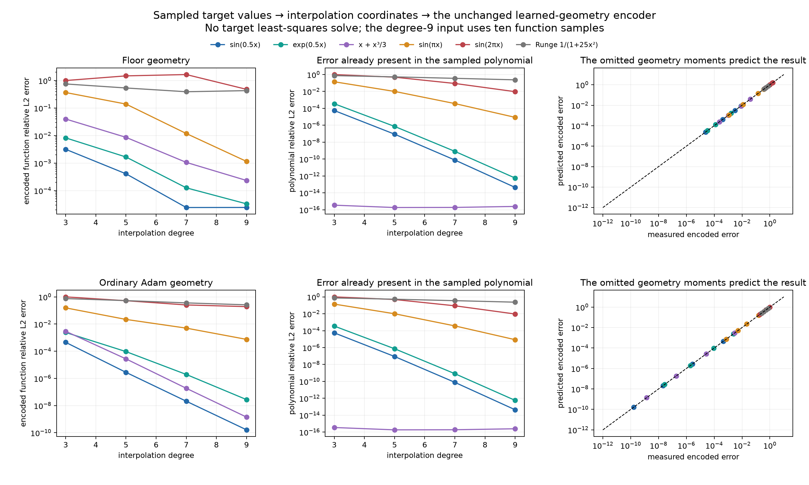

# Constructing and testing the geometry lens

September 30, 2026 · Codex · fixed one-dimensional solutions; no new training.

## What now exists

Two working constructions turn target information into readouts through a reusable geometry-dependent operator.

1. **An exact finite-edit encoder.** Start with a uniform geometry whose inverse is explicit, then change several centers and widths. The encoder predicts all readouts using that reference formula plus a system involving only the edited neurons. Tests cover finite tents and periodic tanh/GELU primitives, with up to twelve simultaneous edits.
2. **A moment encoder and decoder on actual saved learned geometry.** Broad tanh neurons are expressed in common polynomial coordinates. Original learned readouts can be decoded into derivative coordinates. In the other direction, a precomputed encoder turns target samples into new readouts. The omitted moments predict the approximation error.

The first construction reproduces the independently solved coefficients to roughly \(10^{-11}\) or better in the tested cases. The second gives strong results for slow new targets but fails substantially on more oscillatory ones. Both its successes and failures are quantitatively explained below. They are different results: exact finite-edit least-squares prediction versus approximate target transfer through a restricted learned dictionary.

All predictors are independent of the new target's full feature-matrix least-squares solve. Full solves are used only as diagnostic references. Small geometry systems remain; their standard linear algebra is not claimed as new theory. The useful structure is the explicit reference inverse, the interpretable correction terms, and their tested consequences.

## 1. The kernel-difference proposal gives the exact decomposition

Fix \(N\) neurons and a fitting domain \(\Omega\). Readout vectors live in a coefficient space \(X\subseteq\mathbb R^N\), with the Euclidean inner product. Usually \(X=\mathbb R^N\); the periodic experiment instead imposes \(X=\{v\in\mathbb R^N:\sum_jv_j=0\}\). Targets and predicted outputs live in an observation space \(\mathcal H\), equipped with the inner product defining the fitting loss. For continuous fitting, \(\mathcal H=L^2(\Omega)\) and \(\langle g,h\rangle_{\mathcal H}=\int_\Omega g(x)h(x)\,dx\). For finitely sampled fitting, \(\mathcal H\) is a space of sample vectors instead. Any independently fitted baseline, such as the periodic output mean, is handled separately; the target \(f\in\mathcal H\) and features below describe the remaining fitting problem.

Each original feature \(\phi_j\in\mathcal H\) is a function in the continuous formulation; write \(\phi_j^{\rm new}\in\mathcal H\) for its counterpart after the geometry edit. Unchanged features have \(\phi_j^{\rm new}=\phi_j\). For a readout vector \(v\in X\), define the reference synthesis operator \(A_0:X\to\mathcal H\) and edited synthesis operator \(A:X\to\mathcal H\) by

\[
(A_0v)(x)=\sum_{j=1}^N v_j\phi_j(x),
\qquad
(Av)(x)=\sum_{j=1}^N v_j\phi_j^{\rm new}(x).
\]

Thus **\(A_0\) and \(A\) are linear maps from readout vectors to functions** in the continuous formulation. Sampling their outputs gives ordinary design matrices. For example, at \(m\) fitting points \(x_i\), where the features and target have defined values, the unweighted sample representation has \((A_0)_{ij}=\phi_j(x_i)\) and \(A_{ij}=\phi_j^{\rm new}(x_i)\): both are \(m\times N\) matrices acting on \(v\in X\), and \(f\) is represented by \((f(x_i))_{i=1}^m\). Quadrature weights can be included by multiplying row \(i\) and target entry \(i\) by the square root of its weight. The spectral experiment instead retains finitely many Fourier coordinates, so its design matrix has frequency rows. Sampled or truncated fits have their own observation space and fitting norm; all adjoints and comparisons must use that same norm.

Change \(p\) features, with ordered indices \(J=(j_1,\ldots,j_p)\). Define \(U:\mathbb R^p\to\mathcal H\) by its \(p\) feature differences: its \(\ell\)-th column is \(U_\ell=\phi_{j_\ell}^{\rm new}-\phi_{j_\ell}\in\mathcal H\), and \(U\alpha=\sum_{\ell=1}^p\alpha_\ell U_\ell\). Here “column” means a function until finite output coordinates are chosen; in sampled coordinates \(U\) is an \(m\times p\) matrix. For \(v\in X\), let \(\alpha=v_J=(v_{j_1},\ldots,v_{j_p})^T\in\mathbb R^p\). The edited output is then

\[
Av=A_0v+U\alpha.
\]

Therefore,

\[
f-Av=(f-U\alpha)-A_0v.
\]

This is the adjusted-target interpretation with a minus sign. Its adjusted target depends on the unknown coefficients. It becomes more informative when the kernel differences are separated into what the old geometry can and cannot express.

The adjoint \(A_0^*:\mathcal H\to X\) maps an output back to feature correlations. For \(X=\mathbb R^N\), its \(j\)-th entry is \((A_0^*g)_j=\langle\phi_j,g\rangle_{\mathcal H}\). For a constrained \(X\), project that correlation vector orthogonally onto \(X\). Throughout, a star means the adjoint for the specified inner products; this is a transpose for real Euclidean matrices, or a conjugate transpose in complex coordinates, with the coefficient-space restriction retained.

The Gram operator \(G_0=A_0^*A_0:X\to X\) measures reference-feature overlap. In the unconstrained case it is the \(N\times N\) matrix with entries \((G_0)_{ij}=\langle\phi_i,\phi_j\rangle_{\mathcal H}\). Assume \(A_0\) is injective on \(X\), so \(Q=G_0^{-1}:X\to X\) exists. When using neuron-indexed matrix blocks below, represent \(Q\) as an \(N\times N\) matrix by extending it as zero on \(X^\perp\). If \(X\) is constrained, this extended matrix is not an inverse on all of \(\mathbb R^N\).

Define a reference readout vector \(a\in X\), a residual function \(r\in\mathcal H\), a coefficient map \(B:\mathbb R^p\to X\), and a new-component synthesis map \(W:\mathbb R^p\to\mathcal H\) by

\[
a=QA_0^*f,\quad r=f-A_0a,\qquad
B=QA_0^*U,\quad W=U-A_0B.
\]

Here \(a\) is the old target encoding; \(r\) is what it missed. The map \(B\) is an \(N\times p\) matrix whose columns are readout vectors in \(X\). Each column encodes one feature change using the old geometry. Each column of \(W\), by contrast, belongs to \(\mathcal H\) and is the genuinely new function that remains. The residual \(r\) and every column of \(W\) are orthogonal to the old output space \(\operatorname{ran}(A_0)=\{A_0v:v\in X\}\subseteq\mathcal H\).

Substitution gives

\[
f-Av=A_0(a-v-B\alpha)+(r-W\alpha).
\]

For a coefficient vector \(z\in X\), write \(\|z\|_{G_0}^2=\langle z,G_0z\rangle_X=\|A_0z\|_{\mathcal H}^2\). The two residual terms above lie in orthogonal subspaces of \(\mathcal H\), so the loss splits exactly:

\[
\boxed{
\|f-Av\|_{\mathcal H}^2
=\|a-v-B\alpha\|_{G_0}^2+\|r-W\alpha\|_{\mathcal H}^2.
}
\tag{1}
\]

This is the constructed geometric object in reference coordinates: a change of encoding \(B\), a collection of new function directions \(W\), and the metric measuring their overlaps.

The adjoint \(W^*:\mathcal H\to\mathbb R^p\) measures inner products against the new components. Thus \(W^*W\in\mathbb R^{p\times p}\) is their overlap matrix and \(W^*r\in\mathbb R^p\) is a vector of target-residual measurements. For an exactly reference-representable target, \(r=0\), and the second term is the scalar

\[
\alpha^*W^*W\alpha.
\]

That is precisely a geometry-induced quadratic penalty. For a general target it also contains

\[
-2\operatorname{Re}\langle W^*r,\alpha\rangle.
\]

The new directions may help fit information the old geometry missed. This is why treating every feature change as only regularization would omit part of the mechanism.

## 2. The usable encoder

The full derivation eliminates all unchanged coefficients. Using the ordered index set \(J\), the block \(Q_{JJ}\) consists of \(p\) selected rows and columns, \(Q_{:,J}\) consists of all rows and those \(p\) columns, \(B_J\) consists of the selected rows of \(B\), and \(a_J\) is the selected part of \(a\). Their dimensions are \(p\times p\), \(N\times p\), \(p\times p\), and \(p\), respectively. Define three \(p\times p\) matrices, with \(I_p\) the identity on \(\mathbb R^p\):

\[
C=Q_{JJ},\qquad H=C^{-1},\qquad M=I_p+B_J.
\]

Here \(C\) is positive definite when the edited coordinates can be chosen independently within \(X\). This holds for \(X=\mathbb R^N\), and for the zero-sum space when \(p<N\), as in these tests. The matrix \(H\) defines the coefficient norm \(\|z\|_H^2=z^THz\) for \(z\in\mathbb R^p\); it is distinct from the function space \(\mathcal H\). The edited readouts \(\alpha\in\mathbb R^p\) solve

\[
\min_{\alpha\in\mathbb R^p}
\|a_J-M\alpha\|_H^2+\|r-W\alpha\|_{\mathcal H}^2.
\]

The matrix \(M^*HM+W^*W\) is \(p\times p\); its right-hand-side vector \(M^*Ha_J+W^*r\) lies in \(\mathbb R^p\). When the edited synthesis map \(A\) is injective on \(X\), this matrix is positive definite. Differentiating the quadratic and collecting terms then gives

\[
\boxed{
\alpha=(M^*HM+W^*W)^{-1}
\bigl(M^*Ha_J+W^*r\bigr).
}
\tag{2}
\]

The full readout vector \(v\in X\subseteq\mathbb R^N\) then follows from

\[
\boxed{
v=a-B\alpha+Q_{:,J}H(M\alpha-a_J).
}
\tag{3}
\]

The last term permits the optimum to change the old-space approximation instead of insisting it remain exact. Its selected coordinates are \(M\alpha-a_J\), so equation (3) has \(v_J=\alpha\), as required.

Every matrix in equations (2–3) is geometry-only. Once built, it is reused across targets. The target-dependent inputs are \(a\in X\) and the \(p\)-vector \(W^*f=W^*r\); the output is \(v\in X\).

The [complete proof](theory.md) includes the constrained periodic model, stability, deletion, error prediction, and identifiability. It states exactly when inverses exist. This report's comparisons use full-rank problems; a pseudoinverse cannot silently substitute a different choice among nonunique coefficients.

### How the reference is obtained without a full numerical inverse

For standard finite tents with uniform center spacing \(h>0\) and half-width \(h\), only adjacent features overlap. Here \(X=\mathbb R^N\), and the fitting interval contains every tent's full support. The Gram matrix is the \(N\times N\) matrix \((h/6)\operatorname{tridiag}(1,4,1)\), whose inverse has an explicit hyperbolic-sine formula. Its alternating spatial response is the same mechanism behind the earlier alternating readout corrections.

Even target measurements are explicit. In this continuous-function setting, let \(F_2\) be a scalar function with \(F_2''=f\). For a center \(c\in\mathbb R\) and half-width \(w>0\), define the peak-one tent \(T_{c,w}(x)=\max(1-|x-c|/w,0)\). Assuming the fitting interval contains its full support, the scalar inner product obeys

\[
\langle f,T_{c,w}\rangle
=\frac{F_2(c-w)-2F_2(c)+F_2(c+w)}{w}.
\]

This follows from the three point-masses in the tent's second derivative and two integrations by parts. Sine, Runge, and constant targets have elementary second primitives. Old/new tent overlaps are exact piecewise-quadratic integrals.

For periodic uniform tanh/GELU primitives, the reference inverse is diagonal in coefficient Fourier coordinates. Each frequency divides by the explicit sum of kernel spectral energies over its aliases. Let \(s\) denote the derivative order, with \(s=1\) for tanh and \(s=2\) for GELU, and let \(\omega\ne0\) be angular frequency. The factor \(1/(i\omega)^s\) stays in the feature spectrum, preserving the original function-fitting norm. In the resolved principal band, the rule reduces to the target's \(s\)-th derivative spectrum divided by the kernel spectrum: the QI derivative picture with the filtering made explicit. The symbol \(r\) continues to denote the residual function, not a derivative order.

These are concrete reference formulas. They give the finite-edit reduction structural content beyond simply factorizing an arbitrary new feature matrix.

## 3. Finite center and width changes: measured predictions

The tent experiment has 65 neurons and changes 4, 8, or 12 simultaneously. Center shifts reach \(0.5h\), and widths range from \(0.4h\) to \(3h\). Targets include sine, Runge, a frequency mixture, a constant, and controls exactly in the reference span.

The spectral experiment has 48 neurons, with 1, 4, or 12 simultaneous edits, across two activations and five targets. These are periodized normalized primitives with an explicit zero-sum mass constraint and separate output mean. They are controlled analogues of ordinary tanh/GELU networks, not an unstated claim about finite-interval boundary handling.

The following errors compare predicted coefficient vectors with independent full least-squares coefficients:

| Construction | Neurons | Largest edit group | Worst relative coefficient error |
|---|---:|---:|---:|
| Finite tents | 65 | 12 | \(2.05\times10^{-12}\) |
| Periodic tanh primitive | 48 | 12 | \(1.72\times10^{-11}\) |
| Periodic GELU primitive | 48 | 12 | \(8.36\times10^{-12}\) |

Blue predicts the new readouts, orange checks them with a full solve, and gray is the original encoding. The right panels increase the geometry changes. The exact finite correction stays accurate while the first-order approximation and coordinate transport alone depart.

The blue and orange functions coincide, including the distortions introduced by this poor geometry. The black dashed target can remain visibly different: predicting the optimum is separate from making its approximation floor small.

The spectral encoder also accepts function samples directly. Across four targets and both activations, feeding 4,096 uniform target values instead of analytic Fourier coefficients changes the predicted readouts by at most \(5.24\times10^{-14}\). No target derivatives are supplied. The sample-based method still requires adequate resolution; a sample-count threshold alone cannot rule out target aliasing.

## 4. What the tests explain

### Large changes can be exact coordinate changes

For an integer \(m\ge1\), an aligned tent widened to \(m\) times the spacing satisfies

\[
T_{c_j,mh}
=\sum_{k=-m+1}^{m-1}
\left(1-\frac{|k|}{m}\right)T_{c_{j+k},h},
\]

provided the indicated reference tents exist. The two sides have the same piecewise-linear nodal values, so this is an exact identity. Thus \(W=0\): no new function direction appears.

Changing twelve aligned widths to \(2h\) and \(3h\) makes transport alone exact to \(3.77\times10^{-13}\) in the tested cases. By comparison, off-grid width/center changes produce nonzero \(W\), and transport alone reaches coefficient errors of 6.26 for tents and 82.4 for the tested GELU construction.

The distinction is whether the geometry changes the function space, not just whether the parameter changes are small.

### Multiple defects interact through identifiable terms

The off-diagonal entries of \(W^*W\) measure interactions between the new parts of different edited neurons. The matrix \(H\) also couples their reference-coordinate constraints. Adding isolated single-neuron corrections omits these interactions.

For the twelve-edit tent cases, including \(W^*W\) but omitting \(W^*r\) reduces the worst coefficient error from 6.26 to 0.0137. Adding the target residual measurement recovers the exact coefficients. For reference-space targets, \(r=0\), so the same residual-free encoder is already exact. These controls test individual terms in the derivation.

### A new geometry can need genuinely new target information

An explicit witness takes the target to be one nonzero column of \(W\). It has zero old encoding, just like the zero target, because it is orthogonal to every old feature. The changed geometry nevertheless captures part of it: its relative fitting error is 0.5417 instead of 1, and the finite encoder predicts its coefficients to \(2.51\times10^{-15}\).

Therefore, old coefficients alone cannot universally determine the new optimal coefficients. The extra measurements \(W^*f\) are needed precisely when the new geometry accesses target directions discarded by the old one. This determines what information the lens must retain.

### Geometry predicts fragile representations

Moving a tanh center onto its neighbor makes a difference of two neuron coefficients invisible. Before the collision, the small geometry matrix already identifies the weakening direction. At separation \(0.002h\), its conditional energy is \(4.35\times10^{-6}\) of the reference value; the sine's coefficient norm rises from 1.36 to 45.7.

The tested coefficient predictions remain accurate. The result predicts declining identifiability rather than claiming an observed numerical failure. [Collision figure and conventions](spectral/report.md).

## 5. A second construction on actual learned geometry

The reference-grid construction applies when a useful explicit reference and a finite edit group are available. To work directly with irregular learned neurons, the second branch constructs common polynomial coordinates.

The saved geometries are a 461-neuron VarPro/Gauss–Newton sine solution that reached the numerical floor, and a 204-neuron Xavier/Adam sine solution after 10,000 steps. This test selects their \(\gamma<1\) neurons: 190 and 194 respectively. Other readouts are set to zero. No new training takes place.

In this section, let \(n\) be the number of selected neurons, so their readout vector lies in \(\mathbb R^n\). Each selected center \(c_j\in\mathbb R\) and inverse width \(\gamma_j>0\) defines the scalar function \(\phi_j(x)=\tanh(\gamma_j(x-c_j))\) on \([-1,1]\). Define polynomials \(P_k:\mathbb R\to\mathbb R\) recursively by \(P_0(u)=u\) and \(P_{k+1}(u)=(1-u^2)P_k'(u)\), for integers \(k\ge0\).

The geometry's Taylor coefficients form an infinite-row table \(E=(E_{kj})_{k\ge0,\,1\le j\le n}\). Each row \(E_k\in\mathbb R^{1\times n}\) is a finite linear map from readouts to one scalar Taylor coefficient. It is defined by

\[
\phi_j(x)=\sum_{k\ge0}E_{kj}x^k,\qquad
E_{kj}=\frac{\gamma_j^k}{k!}P_k(\tanh(-\gamma_jc_j)),
\]

Thus \(E_kv=\sum_jE_{kj}v_j\in\mathbb R\) is the coefficient of \(x^k\) in \(\sum_jv_j\phi_j(x)\). The full \(Ev\) denotes the sequence of these coefficients; finite row blocks of \(E\) are ordinary finite matrices. The recurrence generates them directly from the geometry.

The nearest complex pole has modulus \(\sqrt{c_j^2+\pi^2/(4\gamma_j^2)}\). The selected cohorts' minimum radii are 1.65 and 8.06, so their expansions converge throughout \([-1,1]\). This is why the restriction was imposed. Pole distance alone does not bound the error independently of coefficient magnitude.

### Decode original readouts

For the saved readouts \(v\in\mathbb R^n\), define the scalar derivative coefficients \(d_k\in\mathbb R\), \(k\ge0\), by

\[
\boxed{d_k=(k+1)\sum_jE_{k+1,j}v_j.}
\]

The infinite series \(\sum_{k\ge0}d_kx^k\) represents the selected cohort's derivative contribution. For a chosen nonnegative integer degree \(q\), truncating to \(d_0,\ldots,d_q\) gives a vector in \(\mathbb R^{q+1}\) and a degree-at-most-\(q\) polynomial. A degree-nine decoder gives relative error \(1.28\times10^{-4}\) for the floor model's broad cohort and \(1.03\times10^{-9}\) for Adam's broad cohort.

These are actual original readouts, with no refit. The decoded component is not the full target derivative: other width groups supply remaining structure and cancellation. A single Taylor expansion about zero is not justified for all narrower neurons.

### Encode new sampled targets

Choose a positive integer polynomial degree \(q<n\). The moment matrix \(F_q\in\mathbb R^{q\times n}\) consists of rows 1 through \(q\) of \(E\); it maps a readout vector to its first \(q\) nonconstant Taylor coefficients. Assuming these rows are independent, precompute its minimum-readout-norm right inverse \(C_q:\mathbb R^q\to\mathbb R^n\), with \(I_q\) denoting the identity on \(\mathbb R^q\):

\[
C_q=F_q^*(F_qF_q^*)^{-1}\in\mathbb R^{n\times q},
\qquad F_qC_q=I_q.
\]

The matrix inverted here is \(q\times q\); numerically the right inverse is applied through a row-scaled QR factorization, not normal equations. A sample vector \(y=(f(x_i))_{i=0}^q\in\mathbb R^{q+1}\), at Chebyshev-Lobatto points \(x_i=\cos(i\pi/q)\), determines an interpolating polynomial \(p_q\in\mathcal P_q\), where \(\mathcal P_q\) is the space of real polynomials of degree at most \(q\). An explicit cosine transform and polynomial conversion give its scalar coefficients:

\[
p_q(x)=t_0+\sum_{k=1}^q t_kx^k,
\qquad t=(t_1,\ldots,t_q)^T\in\mathbb R^q.
\]

The constant coefficient \(t_0\in\mathbb R\) is handled by a scalar output bias \(b\). Using the row \(E_0\in\mathbb R^{1\times n}\) defined above, set

\[
v=C_qt\in\mathbb R^n,\qquad b=t_0-E_0v\in\mathbb R,
\qquad
\widehat f(x)=b+\sum_{j=1}^n v_j\phi_j(x).
\]

The constructed function \(\widehat f\) belongs to \(L^2([-1,1])\). The entire geometry encoder is fixed before any of the new target values enter. The target-to-readout map passes from samples in \(\mathbb R^{q+1}\), through polynomial coefficients, to readouts in \(\mathbb R^n\); it does not fit target function values with the neuron design matrix.

With ten samples, the restricted Adam geometry gives:

| Target | Relative function error | Readout norm, approximately |
|---|---:|---:|
| \(\sin(0.5x)\) | \(1.63\times10^{-10}\) | 494 |
| \(x+x^3/3\) | \(1.41\times10^{-9}\) | 8,305 |
| \(e^{0.5x}\) | \(2.74\times10^{-8}\) | 356,728 |
| \(\sin(\pi x)\) | \(7.45\times10^{-4}\) | \(7.62\times10^8\) |
| \(\sin(2\pi x)\) | 0.1916 | \(2.24\times10^{11}\) |
| \(1/(1+25x^2)\) | 0.2601 | \(3.06\times10^{11}\) |

The slow targets work, with substantial cancellation cost. The faster sine exposes a structural limitation: its ten-sample polynomial alone has error 0.00940, but realizing the requested low-order moments in these neurons introduces a much larger tail.

For each integer \(k>q\), the row \(E_k\in\mathbb R^{1\times n}\) maps the constructed readout vector \(C_qt\) to an unwanted scalar coefficient. The tail is therefore predicted from the same geometry:

\[
\widehat f(x)-f(x)=(p_q(x)-f(x))
+\sum_{k>q}(E_kC_qt)x^k.
\]

The first term is the input interpolation error. The second is the unconstrained higher-order contribution of the learned neurons. Including measured numerical moment defects, terms through degree 21 predict the directly measured errors across 48 cases within 0.274% relative disagreement. This is a tested truncated prediction, not a rigorous certified bound for arbitrary targets.

High-precision evaluation of the same stored coefficients shows roundoff around \(10^{-5}\) in the largest Adam stress cases, far below their 0.19–0.26 approximation errors. Thus their failure is primarily the encoder's unwanted higher moments, not ordinary function-evaluation roundoff.

The target-sampling limit is separately visible: with four Lobatto samples, \(\sin(2\pi x)\) vanishes at every sample. Any such encoder receives the zero function's data. That failure precedes the geometry.

## 6. What has and has not been achieved

There is now an implemented route from an explicit QI-style reference to finite irregular geometry, including interacting width and center changes. Its exact decomposition explains coordinate compensation, additional function directions, residual target information, and loss of identifiability.

There is also a working route from actual learned broad-neuron geometry to common derivative coordinates, and from sampled new targets back to readouts. Its approximation error is predicted by the geometry's omitted moments. This encoder is not least-squares optimal, and its high-frequency coefficient cost is prohibitive.

The experiments do not yet construct a compact global encoder for every neuron of an arbitrary learned network. They also do not establish training dynamics, multilayer theory, or generalization from undersampled targets. The present actionable obstacle is specific: a useful global coordinate system must cover narrow as well as broad neurons while controlling both unwanted function components and the norm of the required readouts.

## Reusable artifacts and validation

- [Full finite-edit theory and proofs](theory.md).
- [Finite tents: formulas, controls, and results](tents/report.md); reusable encoder in [lens.py](tents/lens.py).
- [Spectral encoder: normalization, Fourier formula, sample interface, and checks](spectral/report.md).
- [Learned moment construction and error derivation](learned_transfer/report.md).
- [Sampled-input extension and original-readout decoding](learned_transfer/sampled_report.md).
- [Independent spectral implementation audit](audit.md).

All branches preserve their scripts, geometry-only encoder matrices, plotted data, numerical metrics, and validation records alongside the reports. The spectral validation disables dense least-squares access while predictions run. Tents check analytic overlap/target measurements against independent quadrature and retain all 65 diagnostic directions. Learned transfer checks evaluation-grid refinement and high-precision evaluation of the stored coefficients.

No application code or saved model was changed, and no model was trained. Existing unrelated repository changes were preserved.
