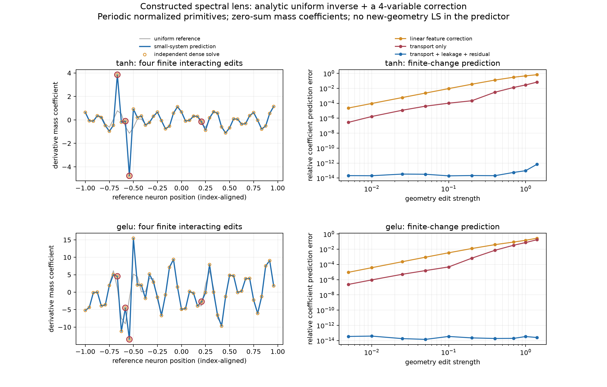
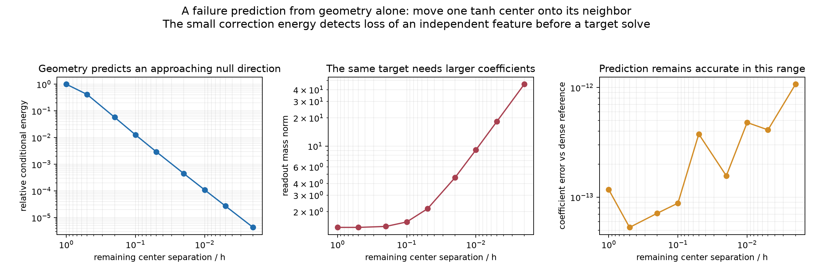

# Fourier reference encoder with finite geometry changes

September 30, 2026. Fixed solutions, no training. The predictor uses an explicit uniform Fourier encoder and a correction involving only the edited neurons. Dense least squares appears only in an independent validator.

## What was constructed

The implementation accepts target samples, centers, and widths, and returns the solved mass coefficients for a specified periodic tanh- or GELU-derived dictionary. A geometry is precomputed once and reused across targets. The largest correction in the experiments has 12 unknowns, against 48 neurons in the full dictionary.

Across 30 activation/geometry/target cases, the maximum relative coefficient discrepancy from an independently assembled full SVD is 1.72×10⁻¹¹. This is coefficient prediction accuracy; it is not the target approximation error.

The gray line is the original geometry's encoding. Blue is the predicted new encoding; orange circles are the independent full solve. Red rings mark edited indices. Horizontal positions are original, index-aligned centers, so the coefficient change is visible separately from the center displacement. The right panels show what is lost by retaining only the first-order feature correction or by ignoring new function directions.

## Model and normalization

The domain is a circle of length \(L=2\), with \(N=48\) reference centers \(c_j=-1+2j/N\) and \(h=2/N\). These are periodic normalized primitives, not ordinary finite-interval tanh/GELU features. The ordinary function-fitting norm is retained.

For tanh, the differentiated unit-mass kernel is \(\kappa_\gamma(x)=(\gamma/2)\operatorname{sech}^2(\gamma x)\), and \(r=1\). For exact GELU, the unit-mass curvature kernel is \(\kappa_\gamma(x)=\gamma(2-\gamma^2x^2)\varphi(\gamma x)\), and \(r=2\), where \(\varphi\) is the standard Gaussian density. The normalized primitives on the line are respectively \(\tanh(\gamma x)/2\) and \(\operatorname{GELU}(\gamma x)/\gamma\). Thus a mass coefficient \(m_j\) corresponds to raw readout \(m_j/2\) for tanh or \(m_j/\gamma_j\) for GELU.

For angular frequency \(\omega\), the kernel transforms are

\[
H_{\tanh}(\omega/\gamma)
=\frac{\pi\omega/(2\gamma)}{\sinh(\pi\omega/(2\gamma))},
\qquad
H_{\rm GELU}(\omega/\gamma)
=\bigl(1+(\omega/\gamma)^2\bigr)e^{-(\omega/\gamma)^2/2}.
\]

The first is the transform of the normalized sech-squared kernel. The second follows by transforming \((2-x^2)\varphi(x)\), using that multiplication by \(x^2\) becomes minus the second frequency derivative.

The Fourier coefficient of feature \(j\), at nonzero integer mode \(\ell\), is

\[
A_{\ell j}=
\frac{H(\pi\ell/\gamma_j)e^{-i\pi\ell c_j}}
{L(i\pi\ell)^r}.
\]

The \(1/(i\pi\ell)^r\) factor matters: discarding it would change function-value least squares into derivative-value least squares. Here it stays in the fitting operator.

The coefficient space is explicitly constrained by \(\sum_j m_j=0\). The function mean is fitted separately. This coefficient constraint is part of the model, not a numerical cutoff: removing a constant coefficient vector would otherwise remove alias harmonics as well as its mean derivative mass. Both the predictor and validator enforce the identical constraint.

All spectral function errors in metrics.json are relative errors of the mean-zero target component. For the periodic Runge target, whose separately fitted mean is \(1/\sqrt{26}\), they are not errors divided by the full uncentered target norm.

## The reference inverse is a Fourier formula

Let \(d_\ell=A_{\ell0}\), and let \(\widetilde a_q=\sum_j a_j e^{-2\pi iqj/N}\) be the coefficient DFT. Uniform spacing gives

\[
(A_0a)_\ell=d_\ell\widetilde a_{\ell\bmod N}.
\]

Consequently, each coefficient frequency \(q\) is an independent scalar fitting problem involving all its aliases:

\[
\boxed{
\widetilde a_q=
\frac{\displaystyle\sum_{\ell\bmod N=q}\overline{d_\ell}\,\widehat f_\ell}
{\displaystyle\sum_{\ell\bmod N=q}|d_\ell|^2},
\qquad q\ne0;\quad \widetilde a_0=0.
}
\]

An inverse DFT returns \(a\). No full matrix factorization is used. The inverse Gram multiplier in coefficient DFT coordinates is

\[
Q_q=\left(N\sum_{\ell\bmod N=q}|d_\ell|^2\right)^{-1},\qquad q\ne0.
\]

When principal-band aliases are negligible, this divides the target's \(r\)-th derivative spectrum by the kernel spectrum. That is the explicit connection to the QI derivative lens. The implementation retains aliases and the fitting norm, rather than assuming this approximation is exact.

## Add the changed geometry

Let \(J\) index the \(p\) edited features, \(U\) contain their exact new-minus-old feature differences, and \(a\) be the reference target encoding. Compute

\[
B=QA_0^*U,\quad W=U-A_0B,\quad r=f-A_0a,\quad M=I+B_J.
\]

The reference Fourier formula supplies every column of \(B\). The component \(W\) is orthogonal to the allowed reference function space.

With \(C=Q_{JJ}\), \(H=C^{-1}\), the edited readouts \(\alpha=v_J\) solve

\[
(M^*HM+W^*W)\alpha=M^*Ha_J+W^*r.
\]

Recover the other readouts through

\[
v=a-B\alpha+Q_{:,J}H(M\alpha-a_J).
\]

The implementation whitens this small system with a Cholesky factor of \(C\). The complete derivation, including the zero-sum constraint and identifiability conditions, is in [theory.md](../theory.md).

## Measurements and controls

Reference overlap parameters are \(\gamma h=0.70\) for tanh and \(1.1\) for GELU. They were selected for stable reference conditioning, not claimed to be optimal bandwidths. Reference design condition numbers on the allowed coefficient space are 1,367 and 2,645.

Tests change 1, 4, or 12 neurons. The four-neuron case uses indices \((8,10,11,29)\), center displacements \(h(0.4,-0.25,0.35,-0.3)\), and gamma ratios \((0.5,2,0.7,1.5)\). The twelve-neuron case edits several nearby groups, so independent single-neuron predictions are insufficient. Exact settings are in run.py.

Targets are \(\sin(2\pi x)\), two trigonometric mixtures, a periodic Runge function \(1/[1+25\sin^2(\pi x/2)]\), and an exactly reference-representable control. For each activation and edit count, the table reports the worst coefficient prediction error across these five targets.

| Activation | Edited neurons | Full finite encoder | Transport alone |
|---|---:|---:|---:|
| tanh-derived | 1 | 4.65×10⁻¹⁴ | 2.18×10⁻⁵ |
| tanh-derived | 4 | 1.51×10⁻¹³ | 0.0282 |
| tanh-derived | 12 | 1.72×10⁻¹¹ | 6.55 |
| GELU-derived | 1 | 5.40×10⁻¹⁴ | 4.96×10⁻⁸ |
| GELU-derived | 4 | 5.79×10⁻¹⁴ | 0.0744 |
| GELU-derived | 12 | 8.36×10⁻¹² | 82.4 |

Transport alone enforces the reference coordinates but omits \(W^*W\) and \(W^*r\). Large coefficient errors do not necessarily imply comparably large output errors; the full output metrics are retained in metrics.json.

For the four-edited-neuron mixed-sine example, relative target errors are 0.000749 for tanh and 0.001967 for GELU. Predicted and independently solved functions differ by only about 10⁻¹⁵ relative to the target.

Feeding the same precomputed encoders 4,096 uniformly spaced target values instead of analytic Fourier coefficients changes the predicted coefficients by at most 5.24×10⁻¹⁴ across eight activation/target combinations. The target's analytic derivative is not needed by this interface. Sample values are transformed by FFT with the phase correction for a grid starting at −1.

The numerical operator includes modes \(1\le|\ell|\le512\). Increasing the cutoff to 1,024 changes the tested four-edit mixed-sine predictions by less than displayed floating-point resolution. The exact formulas concern the chosen observation operator; refinement supports its approximation to continuous periodic fitting in these tested cases.

## A geometry-only warning of unstable coefficients

Moving one tanh center onto its neighbor drives the conditional energy of the small correction toward zero. At gap \(0.002h\), this energy is \(4.35\times10^{-6}\) of its reference value; the sine's coefficient norm rises from 1.36 to 45.7. At exact coincidence there is an exact null direction: the two coefficients can cancel.

This predicts lost identifiability from geometry before fitting a target. The tested encoder still agrees with the dense reference to about 10⁻¹² at the smallest plotted gap. The figure does not demonstrate a numerical breakdown; it demonstrates declining conditional energy and increasing coefficient demand.

## Using and checking the encoder

From this directory:

~~~python
import numpy as np
from run import Reference, Lens, geometry

reference = Reference("tanh")
indices, centers, gammas = geometry(reference, p=4)
lens = Lens(reference, indices, centers, gammas)  # geometry only

x = -1 + 2 * np.arange(4096) / 4096
mass, mean = lens.encode_samples(np.sin(2*np.pi*x))
~~~

Lens.encode accepts nonzero Fourier coordinates directly. Lens.save stores geometry-only arrays; example files are included. Samples must be uniformly spaced on \([-1,1)\), with count exceeding twice the Fourier cutoff. Accuracy still requires adequate sampling of the target.

The separate validator blocks access to dense least squares while predictions are made and checks the reference inverse, synthesis, loss decomposition, zero-sum condition, and independent coefficient comparisons. Its results are saved in validation.json. All checks passed.
