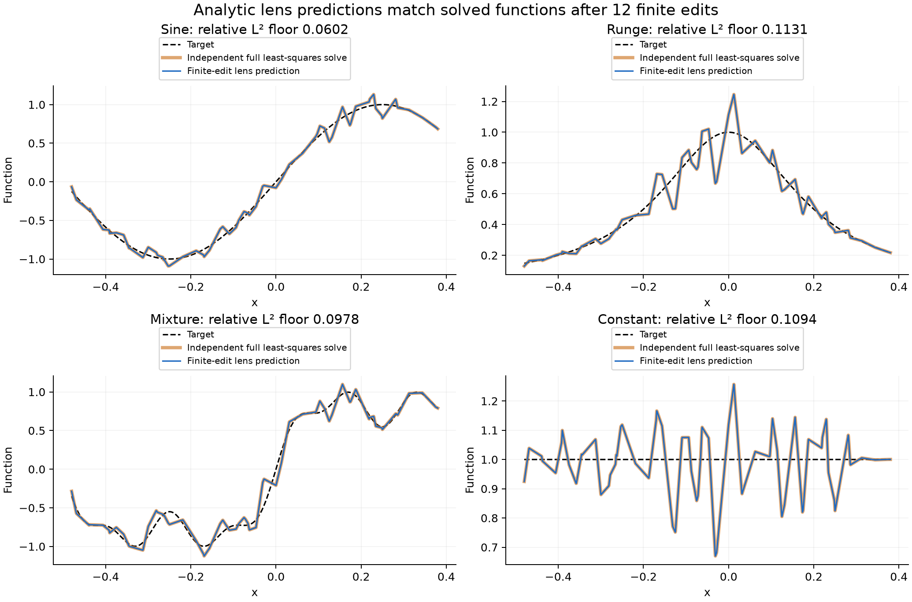
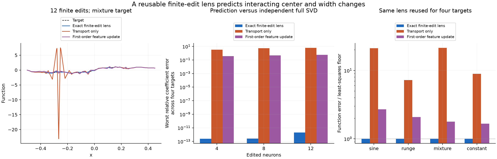
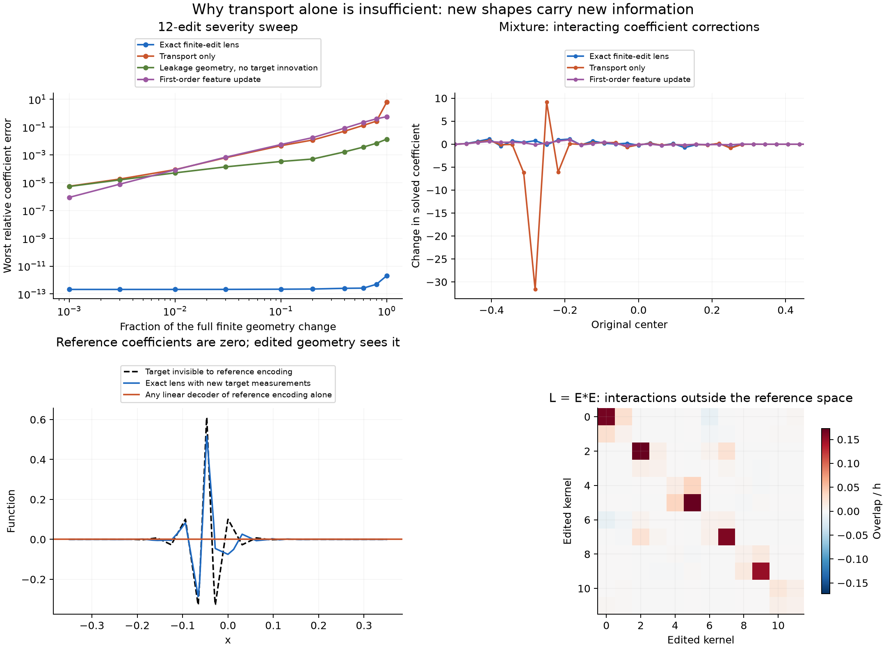

# An explicit finite-edit geometry lens for overlapping tents

Status: completed 2026-09-30. No training. The predictor uses an analytic finite-grid inverse, exact piecewise-polynomial overlap integrals, and matrices of dimension at most the number of edited kernels. An independently assembled full design SVD is used only to check predictions.

## Result

The lens predicts 4, 8, and 12 simultaneous interacting center and width changes, including center displacements up to half a grid spacing and half-widths between 0.4 and 3 grid spacings. Reusing the same geometry construction across sine, Runge, mixed-sine, and constant targets gives a worst relative coefficient discrepancy of **2.04×10⁻¹²** against the independent full least-squares solve.

The substantive distinction is between **coordinate transport** and **new function directions**. Transport says how the new kernels project into the old space. It is insufficient by itself: the new kernels also contain components outside that space. Accounting for their overlap produces a small exact correction system. For arbitrary targets, the correction must also measure target information outside the old space.

For the largest edits, transport alone has relative coefficient errors as large as 6.26. Including the new-component overlap but omitting their target measurements reduces that maximum to 0.0137. Including both yields the exact prediction. This is a finite-change construction, not a first-order perturbation formula.

## Design

The reference features are peak-one hats

\[
\phi_j(x)=\max\{1-|x-c_j|/h,0\},\quad
c_j=-1+jh,\quad j=0,\ldots,64,\quad h=1/32.
\]

Continuous least squares is taken over \(\Omega=[-1-h,1+h]\), containing the entire support of every reference hat and every edited hat. There is no output bias: in particular, the constant target must be represented by the hats themselves. The finite endpoints are retained exactly; there is no infinite-grid approximation or assumed halo truncation.

The four smooth targets on this interval are

\[
\begin{aligned}
f_{\sin}(x)&=\sin(2\pi x),\\
f_{\rm Runge}(x)&=(1+25x^2)^{-1},\\
f_{\rm mix}(x)&=\sin(2\pi x)+0.3\sin(6\pi x)+0.15\sin(14\pi x),\\
f_{\rm const}(x)&=1.
\end{aligned}
\]

We also repeat each comparison with its reference-space interpolant \(f=A_0a\), where \(a_j=f(c_j)\). Those controls have exactly zero residual outside the reference space and isolate the geometry term from missing target information.

The ordered set of edited column indices is \((23,24,31,32,39,40,27,28,35,36,19,20)\). The 4- and 8-edit cases use its first 4 and 8 entries. At full edit severity, center displacements in units of \(h\) are \((0.5,-0.45,-0.5,0.4,0.35,-0.5,-0.4,0.5,0.3,-0.35,0.45,-0.5)\); half-width ratios are \((0.4,3,0.6,2.7,1.8,0.45,3,0.7,2.3,0.55,1.5,2.9)\). The nearby edited pairs and broad supports interact. The severity sweep multiplies the center displacement and the change from width ratio one by \(\alpha\in\{0.001,0.003,0.01,0.03,0.1,0.2,0.4,0.6,0.8,1\}\).

All reported function errors are relative continuous \(L^2(\Omega)\) errors. Endpoint approximation contributes to the absolute floor for targets nonzero at the support boundary; every method is compared on the same finite problem, and error ratios use its actual optimal floor.

## 1. The reference encoder is explicit

Let \(A_0\) synthesize functions from reference coefficients: \(A_0a=\sum_j a_j\phi_j\). Use the ordinary integral inner product on \(\Omega\). Only adjacent hats overlap, giving

\[
G_0=A_0^*A_0=\frac h6
\begin{pmatrix}
4&1&&\\1&4&1&\\&\ddots&\ddots&\ddots\\&&1&4
\end{pmatrix}.
\]

For example, a hat's squared integral is \(2\int_0^h(1-x/h)^2dx=2h/3\), while adjacent overlap is \(\int_0^h(x/h)(1-x/h)dx=h/6\).

Write \(Q=G_0^{-1}\), \(N=65\), and \(\theta=\operatorname{arcosh}(2)\). Its entries, using one-based indices in this formula, are

\[
\boxed{
Q_{ij}=\frac6h(-1)^{i+j}
\frac{\sinh(\min(i,j)\theta)\sinh((N+1-\max(i,j))\theta)}
{\sinh\theta\sinh((N+1)\theta)}.
}
\]

To verify the formula, fix its column \(j\). Away from \(i=j\), multiplication by the tridiagonal matrix gives zero because

\[
\sinh((i-1)\theta)-4\sinh(i\theta)+\sinh((i+1)\theta)=0,
\]

using \(2\cosh\theta=4\). The alternating signs convert this relation into the required positive-off-diagonal recurrence. The factors at \(i=0\) and \(i=N+1\) vanish. At \(i=j\), the numerator's discrete Wronskian is \(\sinh\theta\sinh((N+1)\theta)\), giving the unit source. Multiplication by \(6/h\) then inverts \(G_0\). No numerical inversion of the 65×65 reference matrix is used.

Given target correlations \(b_0=A_0^*f\), the reference encoding is \(a=Qb_0\), and \(r=f-A_0a\) is orthogonal to the reference space.

## 2. Tent target measurements also have a direct formula

For a tent \(\phi_{c,w}(x)=\max(1-|x-c|/w,0)\), its distributional second derivative is

\[
\phi_{c,w}''=\frac1w\{\delta_{c-w}-2\delta_c+\delta_{c+w}\}.
\]

If \(F_2''=f\), two integrations by parts, with the compactly supported tent eliminating endpoint terms, give

\[
\boxed{\langle f,\phi_{c,w}\rangle
=\frac{F_2(c-w)-2F_2(c)+F_2(c+w)}w.}
\]

Thus each target measurement requires three evaluations of a second primitive. Linear and constant ambiguities in \(F_2\) cancel. The experiment uses

\[
F_{2,\sin}(x)=-\frac{\sin(2\pi x)}{(2\pi)^2},\qquad
F_{2,\rm Runge}(x)=\frac{x\arctan(5x)}5-\frac{\log(1+25x^2)}{50},\qquad
F_{2,\rm const}(x)=\frac{x^2}2,
\]

and the corresponding linear combination for the mixed sine. The Runge expression differentiates first to \(\arctan(5x)/5\) and then to \((1+25x^2)^{-1}\).

This is an explicit target encoder for these functions. With arbitrary sampled functions, the same correlations can be approximated by quadrature; that would introduce a separate measurement error. The present experiment avoids that error in the predictor.

## 3. Split an edited kernel into transport and a new component

Let \(J\) be the \(p\) edited indices, and \(U\) the unchanged indices. Let \(C\) contain the new \(p\) tent functions. Define the geometry-only matrices

\[
B=A_0^*C,\qquad T_J=QB,\qquad E=C-A_0T_J.
\]

By construction,

\[
A_0^*E=B-G_0QB=0.
\]

So \(T_J\) gives the coefficients of the old-space projection of each new kernel, and \(E\) contains what that projection cannot represent. Their remaining overlap is

\[
\boxed{L=E^*E=C^*C-B^TQB.}
\]

All entries of \(B\) and \(C^*C\) are computed analytically by dividing overlapping supports at their centers. On each resulting interval both hats are linear, so their product is quadratic. Simpson's three-point formula is exact there. This calculation integrates the piecewise polynomial, not sampled data or an approximate SVD basis.

The full coefficient transport \(T\) is the identity with columns \(J\) replaced by \(T_J\). The changed synthesis operator is exactly

\[
A=A_0T+E\mathcal R_J,
\]

where \(\mathcal R_Jv=v_J\) selects edited coefficients. Since \(f=A_0a+r\), the fitted residual separates orthogonally:

\[
f-Av=A_0(a-Tv)+(r-Ev_J),
\]

and hence

\[
\boxed{\|f-Av\|^2=(a-Tv)^TG_0(a-Tv)+\|r-Ev_J\|^2.}
\]

The second term is

\[
\|r\|^2-2v_J^Tz+v_J^TLv_J,\qquad
z=E^*r=C^*f-B^Ta.
\]

The vector \(z\) contains target information that was discarded by the original reference projection. It vanishes for a target already in the reference space. It cannot in general be recovered from \(a\) alone.

## 4. Eliminate the unchanged readouts and solve only the edited interaction

Let \(K=(T_J)_{J,:}\), and define

\[
S=(Q_{JJ})^{-1}=G_{0,JJ}-G_{0,JU}G_{0,UU}^{-1}G_{0,UJ}.
\]

The equality is the block inverse identity; the implementation uses only the \(p\times p\) block \(Q_{JJ}\). For fixed \(v_J\), let \(e=a-Tv\). Its edited coordinates are \(e_J=a_J-Kv_J\). Minimizing \(e^TG_0e\) over \(e_U\) yields

\[
G_{0,UU}e_U+G_{0,UJ}e_J=0,
\]

so its minimized value is \(e_J^TSe_J\). The entire remaining optimization is

\[
\min_{v_J}\ (a_J-Kv_J)^TS(a_J-Kv_J)+v_J^TLv_J-2v_J^Tz+\|r\|^2.
\]

Differentiating with respect to \(v_J\), dividing by two, and rearranging gives the exact finite-edit encoder:

\[
\boxed{v_J=(K^TSK+L)^{-1}(K^TSa_J+z).}
\]

Finally, \(G_{0,UU}^{-1}G_{0,UJ}=-Q_{UJ}S\) from the same block inverse identity. Substitution into \(e_U=-G_{0,UU}^{-1}G_{0,UJ}e_J\), followed by \(v_U=a_U-(T_J)_{U,:}v_J-e_U\), gives

\[
\boxed{v_U=a_U-(T_J)_{U,:}v_J-Q_{UJ}S(a_J-Kv_J).}
\]

There is no assumption that the center or width changes are small. The factors \(Q,T_J,K,S,L\) depend only on geometry and are reused for all four targets. The target enters through its reference coefficients \(a\) and the \(p\) new measurements \(z\). Predictor factorizations have dimension at most \(p\), not 65. Positive definiteness requires that the edited dictionary remain independent; all evaluated examples retain rank 65.

This is still an exact least-squares coefficient computation, organized by known geometry. The point is not to rename arbitrary numerical inversion. Here the reference inverse, all feature overlaps, and all target measurements are explicit, and only the finite group of interacting edits remains to solve.

## 5. What the simpler predictors omit

**Transport only** sets both \(L\) and \(z\) to zero. If \(K\) is invertible, it solves \(Kv_J=a_J\). This preserves the target's original-space coordinates exactly but does not penalize the unwanted function \(Ev_J\) that the changed geometry also produces.

There are large geometry changes for which transport alone is exact. If an edited center stays on the grid and its half-width becomes the integer multiple \(mh\), its hat is exactly

\[
\phi_{c_j,mh}=\sum_{k=-m+1}^{m-1}\left(1-\frac{|k|}{m}\right)\phi_{j+k},
\]

provided all indicated reference hats exist. Both sides are piecewise linear on the same knots and have identical nodal values, proving the identity. Such edits remain inside the reference space, so \(E=L=z=0\); if \(T\) is invertible they preserve the whole span. As a positive control, changing twelve aligned hats to alternating widths \(2h\) and \(3h\) gives transport coefficient error below 3.77×10⁻¹³ for all four targets. Its computed maximum \(|L_{ij}|\) is 3.27×10⁻¹⁶, numerical zero. Thus the failure of transport in the main cases has a precise geometric cause, not merely a large edit magnitude.

**New-component overlap without target innovation** includes \(L\) but sets \(z=0\). It is exact for \(f\in\operatorname{range}(A_0)\). For other functions it can be a good approximation when their discarded reference component has weak overlap with the new directions.

**First-order feature update** uses the exact finite feature difference \(\Delta A=A-A_0\), but retains only the first-order change in the solution:

\[
v^{(1)}=a+Q\{(\Delta A)^*r-A_0^*(\Delta A)a\}.
\]

This comes from differentiating \(A^*(f-Av)=0\): \((dA)^*r-A_0^*(dA)a-G_0\,dv=0\). In the implementation \(A_0^*\Delta A\) has only \(p\) nonzero columns \(B-G_{0,:,J}\), and \((\Delta A)^*r\) has only \(p\) nonzero coordinates. This control does not pretend that finite changes remain infinitesimal. It is a first-order expansion in feature change, not separately linearized center and width derivatives.

## Results

The orange independent solve and blue lens prediction coincide in these plots. The true targets can still differ from the best approximation: exact coefficient prediction does not mean every edited geometry has a small approximation floor.

- Across four smooth targets, the largest relative coefficient errors are:

| Edited kernels | Exact finite lens | Transport only | Include overlap, omit target innovation | First order |
|---:|---:|---:|---:|---:|
| 4 | 2.41×10⁻¹³ | 3.251 | 0.00594 | 0.3721 |
| 8 | 2.54×10⁻¹³ | 5.597 | 0.00839 | 0.4865 |
| 12 | 2.04×10⁻¹² | 6.258 | 0.01368 | 0.5665 |

- For 12 edits, the full changed design has condition number 26.88 and retains all 65 directions. Thus transport-only failure is not caused by an almost-singular full dictionary. The small exact correction matrix has condition number 408.98; the transport-only block \(K\) has condition number 200.97.
- For the mixed sine, the exact relative function error is 0.0977501. Transport alone produces error 2.10065, about 21.49 times the optimum; first order gives 0.174808. Including \(L\) while omitting \(z\) gives 0.0978033: its coefficients are measurably different, but its function error is close to the optimum.
- For all four reference-space targets, including \(L\) and omitting \(z\) agrees with the full SVD to numerical precision, as the theory predicts.

- At severity \(\alpha=0.001\), the first-order predictor's worst coefficient error is 8.82×10⁻⁷; at 0.01 it is 8.42×10⁻⁵. Its useful local approximation degrades under finite edits, reaching 0.566 at full severity. The exact lens stays between approximately 2.1×10⁻¹³ and 2.0×10⁻¹² over the sweep.
- The overlap matrix \(L\) contains off-diagonal terms for the edited kernels: their new function directions interact. Independent single-neuron adjustments would omit these terms.
- For an explicit information-loss witness, take \(f=E_j\), choosing the edited column with largest new-component norm. It satisfies \(A_0^*f=0\), so its reference encoding is identical to the zero function's encoding. Nevertheless, the edited geometry can capture part of it. The exact lens predicts the dense solved coefficients to relative error 2.51×10⁻¹⁵, and its relative function error is 0.54166. A linear decoder of the old encoding alone outputs zero and has error 1. No target-independent map of old coefficients alone can recover both this target and the zero target. This obstruction is about lost information, not deficient numerical precision.

## Validation and limits

The independent diagnostic uses a 12-point Gauss–Legendre rule on every interval cut by old and new tent corners, then performs a full weighted design SVD. Polynomial hat products are integrated exactly by this rule; the smooth-target correlation disagreement with the analytic second-primitive formula is at most 3.94×10⁻¹⁵. The analytic reference inverse satisfies \(\|G_0Q-I\|_{\max}<1.2\times10^{-14}\). All 65 directions survive the diagnostic cutoff of \(10^{-13}\). These checks and the coefficient comparisons are asserted by `run.py` and recorded in `validation.json`.

The exact construction applies to a finite set of edited features, including large edits, provided the resulting least-squares problem is identifiable. Its dimensional reduction is useful when the number of edits is small relative to the dictionary. It does not remove the cost of an arbitrary completely unrelated geometry, and it does not establish training behavior. The orthogonal split and small-system derivation apply to other activations; tents supply particularly explicit reference inverses and overlap measurements.

The reusable `TentLens` class in `lens.py` accepts any finite uniform reference grid plus the indices, new centers, and positive half-widths of the edited neurons. Construct it once, then call `encode(F2)` for any vectorized second primitive satisfying \(F_2''=f\). Alternatively, `encode_measurements` accepts old and new target correlations, and `encode_reference` accepts a target known to belong to the reference space. The latter's optional innovation argument makes the additional information explicit. All three interfaces reuse the stored geometry factors. The independently checked API has maximum relative coefficient error 2.05×10⁻¹² across the finite-edit cases.

Reproducible artifacts in this directory: `lens.py`, `run.py`, `results.json`, `validation.json`, `lens_geometry.npz`, and the three figures. No saved Adam or VarPro model was modified.
