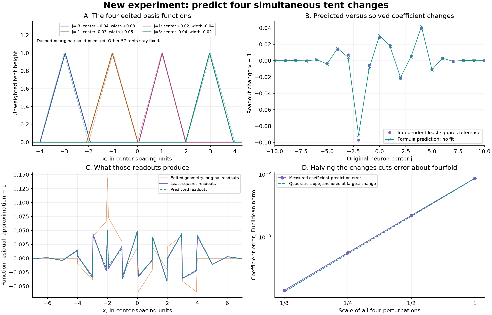
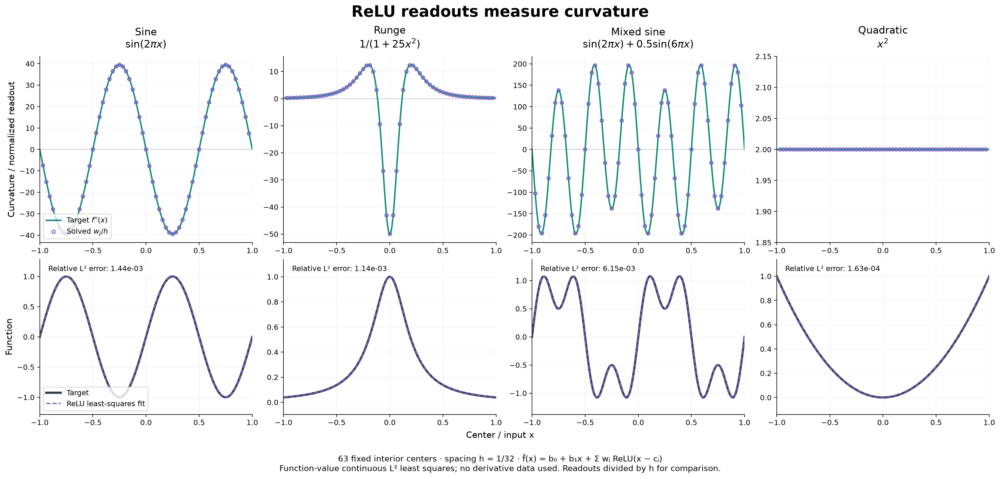
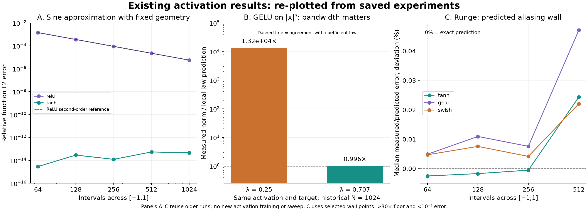

# Results report on geometry changes and activation choice

September 29, 2026. Codex version.

This report separates three kinds of evidence: the new four-neuron tent prediction, the earlier ReLU experiment from this conversation, and an audit of older activation experiments already stored in the repository. The figures below present those results directly. No new activation sweep or training was performed for this report.

## Four simultaneous center and width changes

The new result is a closed-form first-order coefficient predictor for standard translated tents. Its coefficients are obtained from the analytic inverse-overlap response, not from a numerical solve of the perturbed model. A separate continuous least-squares solve supplies the reference.

### Setup

Use the raw height-one tent T(x) = max(1 − |x|, 0), with 61 baseline centers at the integers −30 through 30, spacing and half-width both one, and no output bias. All baseline coefficients are one. The target is the sum of those original tents: exactly one over the interior, tapering on the two outer cells. The figure shows the interior around the changes.

Four selected neurons have both their centers and widths edited; the other 57 features stay fixed. All readouts may compensate.

| Original center | Center movement, in spacings | New half-width / old half-width | New gamma / old gamma |
|---:|---:|---:|---:|
| −3 | +0.04 | 1.03 | 0.97087 |
| −1 | −0.03 | 1.05 | 0.95238 |
| 1 | +0.02 | 0.96 | 1.04167 |
| 3 | −0.04 | 0.98 | 1.02041 |

Gamma is inverse width. The test is repeated after multiplying every center movement and half-width change by 1/2, 1/4, and 1/8. These scaled-width configurations correspond to gamma ratios 1/(1 + scaled width change).

Panel A shows only the four edited unweighted basis functions; dashed curves are their original shapes. Panel B compares the analytically predicted readout changes with independent least-squares readouts. Panel C shows the resulting function residual, approximation minus the constant target. Panel D tests how coefficient-prediction error changes as the edits shrink.

### The prediction

Set r = √3 − 2, approximately −0.267949. If n is the integer distance from an edited neuron, the two response sequences are

\[
C_n=3\operatorname{sgn}(n)r^{|n|},\qquad
W_n=\sqrt3r^{|n|}-2\mathbf1_{n=0}.
\]

For center movements d_j and fractional half-width changes eta_j,

\[
v_k^{\rm pred}=1+\sum_{j\in\{-3,-1,1,3\}}
\left[d_jC_{k-j}+\eta_jW_{k-j}\right].
\]

These constants are derived, not fitted. The baseline Gram matrix has diagonal 2/3 and adjacent entries 1/6. Its inverse has entries sqrt(3) r^|j−k|. Differentiating the normal equations and integrating the center/width derivatives against neighboring tents produces C and W. The full derivation and a second-order coefficient remainder bound are in Section 9 of the [theory checkpoint](../../../../../docs/geometry_readout_theory_codex/checkpoint.md).

A center shift produces an odd correction, with opposite signs on opposite sides. A width change produces an even correction. Both alternate and decay by about 0.268 per extra site. Small changes add at first order; finite changes have interaction corrections.

### Measured results

The relative error below divides by the norm of the actual coefficient change, not by the much larger all-one baseline.

| Scale of all changes | Absolute coefficient error, Euclidean norm | Relative error in the coefficient change | Largest absolute coefficient error |
|---:|---:|---:|---:|
| 1 | 0.0085672 | 7.49% | 0.0060828 |
| 1/2 | 0.0022035 | 3.92% | 0.0015518 |
| 1/4 | 0.0005596 | 2.01% | 0.0003923 |
| 1/8 | 0.0001411 | 1.02% | 0.0000986 |

Halving the edits reduces absolute coefficient error by factors 3.89, 3.94, and 3.97, consistent with the proved quadratic remainder. The dashed quadratic line in panel D is anchored at the largest-error point to compare slopes; its vertical prefactor is not a separately predicted error constant.

At the largest changes, the function residual L2 norm is 0.0668336 with least-squares readouts and 0.0670375 with predicted readouts, about 0.31% higher. This does not mean the constant is recovered exactly: panel C shows the remaining approximation error. It means the analytic coefficients produce almost the same approximation quality as the refitted coefficients in this test.

The reference integration splits at every old and new tent corner. The feature products are piecewise quadratic, so three-point Gaussian quadrature is exact in exact arithmetic. Raising the order to five changes readouts by less than 5e−15.

The result establishes a useful local prediction for this geometry. It does not test four large changes, a nonconstant target, or tanh/GELU multi-defect responses. The theory is formulated for an infinite baseline; the numerical reference uses distant finite boundaries. A separate boundary-size convergence sweep was not performed for this four-defect check.

## ReLU readouts and target curvature

This experiment was performed earlier in the conversation. It fits function values in continuous L2 on [−1,1], using 63 equally spaced interior knots and a separately fitted affine term:

\[
\widehat f(x)=b_0+b_1x+\sum_j w_j(x-c_j)_+,
\qquad h=1/32.
\]

No derivative observations enter the fit. The top row plots solved w_j/h against the analytic target second derivative; the bottom row plots the fitted functions.

| Target | Relative function L2 error | Relative discrepancy between w/h and target curvature at the centers |
|---|---:|---:|
| sin(2πx) | 0.1443% | 0.1584% |
| 1/(1+25x²) | 0.1141% | 0.0303% |
| sin(2πx)+0.5 sin(6πx) | 0.6155% | 0.5173% |
| x² | 0.01628% | approximately 1e−12 as a relative fraction |

The precise interpretation is a slope jump: the distributional second derivative of the network is sum_j w_j delta(x−c_j). Dividing the mass w_j by spacing h gives a curvature density to compare with f''. It is not the pointwise second derivative of a piecewise-linear network.

For x² the exact continuous-L2 spline solution has w_j=2h, while its relative function error is h²/6. Thus the coefficient law can be exact even though the finite spline cannot represent the target exactly. Replacing ReLU(x−c) by ReLU(4(x−c)) leaves the fitted function and effective coefficients 4v unchanged: positive ReLU gamma only rescales a feature.

The independent nodal-hat solve agrees with hinge coefficients within 1e−11. Quadrature doubling agrees within 2e−12, and the gamma-rescaling check agrees within 2.5e−11. Boundary effects account for much of the sine coefficient discrepancy.

## What existing activation experiments show

The next figure re-plots stored experiments. It is an evidence review, not a new training or activation campaign. Historical N here counts intervals, with h=2/N; halos add further neurons.

### Smooth-target approximation efficiency

Panel A fits sine with uniform geometry. The measured ReLU errors are approximately 1.44e−3, 3.60e−4, 8.99e−5, 2.25e−5, and 5.67e−6 as the interval count doubles from 64 to 1024. The roughly fourfold error reduction is the predicted second-order spline behavior. Tanh is already around 1e−15–1e−14 in those stored cells.

This is evidence about shallow, fixed-geometry approximation at these settings. It does not imply that ReLU cannot attain high precision with enough knots or depth, or that tanh is universally better. For a piecewise-linear target with knots at its kinks, ReLU can be exact.

### GELU's apparent readout-law failure depends strongly on geometry

Panel B compares the same activation and target, GELU on |x|³ at historical N=1024, in two saved runs. The local-law prediction includes the lambda-dependent normalization:

\[
\|v\|_2\approx \frac{h^{3/2}}{\lambda}\|f''\|_2,
\qquad \|f''\|_2=\sqrt{24}.
\]

| Lambda | Measured interior readout norm | Predicted norm | Measured / predicted |
|---:|---:|---:|---:|
| 0.25 | 22.3243 | 0.00169146 | 13,198 |
| 0.707 | 0.000595698 | 0.000598110 | 0.99597 |

At lambda 0.707, the law agrees within about 0.4%; the saved function error is 2.46e−11. At lambda 0.25, the simple local coefficient law fails badly. The change in that interpretation is about readout structure, not evidence that the earlier model could not approximate the target at all. Both saved solves used a default rank cutoff; bandwidth, deconvolution, and numerical rank can all affect coefficient behavior.

### The aliasing wall is quantitatively predicted

Panel C shows the median measured/predicted error ratio for Runge, expressed as percentage deviation from one. In the plotted tanh, GELU, and Swish cases the medians are within about 0.05% of the predicted wall curve.

These comparisons select points to the right of each minimum, above 30 times its numerical floor and below 1e−3 error. Agreement on those points does not validate the arithmetic floor or predict every minimizing lambda. It does support the geometric aliasing mechanism across several activations.

The relevant theory ties a target frequency to aliases whose amplitude ratios are determined by the activation's localized-derivative spectrum. If the squared ratios sum to S, least squares has relative error sqrt(S/(1+S)) in the specified periodic setting. This applies to function fitting with the correct derivative-order attenuation, not by silently substituting a derivative-fitting loss.

## Findings and remaining questions

The new tent result shows that several geometry edits can be predicted from explicit response functions, including the signs and spatial decay of compensating readouts. Its limitation is finite-perturbation interaction: accuracy improves as the changes shrink, and the arbitrary finite-change smooth-kernel case remains open.

Existing results show that activation choice has to be coupled to target and geometry. ReLU's finite spline order, smooth-kernel aliasing, gamma normalization, and target roughness produce distinct, testable behaviors. They do not yield a universal ranking for deep learning.

Two exact negative controls are derived but were not newly tested: a degree-p polynomial activation stays in a space of degree at most p, and translations of a single fixed-frequency sine span at most sin(γx) and cos(γx). Trainable/distinct frequencies or changing architecture alter those restrictions.

The proposed next work remains controlled finite changes and interaction laws, followed by activation × target × geometry comparisons with predictions fixed before solving. No broader experiment program was launched.

## Reproducibility and source data

* [Analytic predictor and independent reference](multiple_tent_prediction.py), [measurements](multiple_tent_prediction.json), and [saved coefficient arrays](multiple_tent_prediction.npz).
* [Presentation-only plotting script](report_figures.py) and [values used in the activation figure](report_figure_values.json). This script reads saved results and performs no solves.
* [Earlier ReLU report](../relu_test/report.md) and [measurements](../relu_test/results.json).
* [Historical ReLU/tanh scaling data](../../../../../results/checkpoint_A_numerics/expA06_readout_structure/scaling_law/scaling_rows.json).
* [Original GELU norm data](../../../../../results/checkpoint_A_numerics/expA07_inner_norm_rule/expA07_rows.json) and [activation-specific-bandwidth data](../../../../../results/checkpoint_A_numerics/expA07_inner_norm_rule/smoothness/expA07s_rows.json).
* [Runge wall ratios](../../../../../results/checkpoint_C_geometry/expC07_lambda_energy_rule/lambda_rule/data/c09_wall_ratios.json) and [hardened interpretation](../../../../../results/checkpoint_C_geometry/expC07_lambda_energy_rule/lambda_rule/hardened_rule.md).
* [Complete theory checkpoint with proofs](../../../../../docs/geometry_readout_theory_codex/checkpoint.md).
