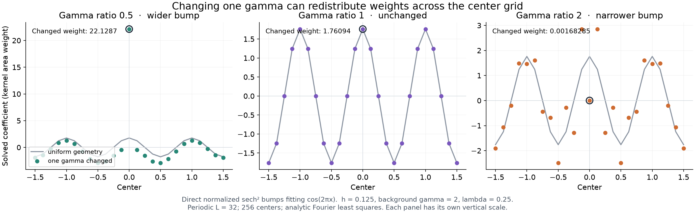

# Predicting readouts when one gamma changes

Codex analysis, 2026-09-29. This is a derivation and saved-checkpoint diagnostic, not a new training experiment. The user's infinite-width idealization means infinitely many centers at fixed spacing, not dense centers and not infinitely wide individual bumps.

## What the proposed model can say exactly

There are two useful statements:

1. For identifiable ordinary least squares with a free intercept, each solved neuron coefficient is a geometry-dependent linear measurement of the target derivative. A local sample of the derivative is a special approximation to that measurement.
2. Replacing one basis function has an exact residual-projection formula. If the old target is exactly represented, the entire readout change is its old coefficient multiplied by a response determined only by the old geometry and the replacement function.

Neither statement implies that a coefficient is determined by its own center and gamma alone. The response includes how all the other basis functions can compensate. Nor does the derivative representation, by itself, establish locality: the same integration-by-parts identity is available for other bases with a free intercept.

## Exact derivative-analysis kernel

Use a finite fitting interval [a,b] for this statement, ordinary continuous L2 loss, and linearly independent basis functions

\[
\phi_0(x)=1,\qquad \phi_j(x)=\tanh(\gamma_j(x-c_j)).
\]

Let G be their Gram matrix, G_ij=integral phi_i phi_j, and define the dual functions

\[
\psi_j(x)=\sum_i(G^{-1})_{ji}\phi_i(x).
\]

The optimal coefficient is v_j=integral f psi_j. For j other than the intercept, biorthogonality gives integral psi_j=0. Therefore

\[
D_j(x)=-\int_a^x\psi_j(t)\,dt,
\qquad D_j(a)=D_j(b)=0,
\]

and integration by parts, for an absolutely continuous target with the relevant integrals defined, gives

\[
\boxed{v_j=\int_a^b f'(x)D_j(x)\,dx.}
\]

D_j is an **analysis kernel**, which extracts a coefficient. It is not the forward bump gamma_j sech^2(gamma_j(x-c_j)), which synthesizes the derivative. Geometry changes D_j; it can be nonlocal, signed, and oscillatory. Weighted least squares includes the sampling weight inside the primitive.

The sampled version is also exact. If L=A-dagger and the columns, including the intercept, are independent, then each nonintercept row of L sums to zero. For ordered fitting samples,

\[
v_j=\sum_{\ell=1}^{m-1}
\left(\sum_{i=\ell+1}^{m}L_{ji}\right)
\left[f(x_{\ell+1})-f(x_\ell)\right].
\]

This expresses a solved readout as a weighted sum of target increments. A globally truncated SVD can break the zero-row-sum property, as can an underdetermined minimum-norm representation that shares a constant across columns. In those settings include the constant-response term or explicitly separate the intercept before asserting the derivative-only identity. The floor checkpoint analyzed here uses a truncated solve, so the full-rank identity is theoretical context, not an unqualified identity for that stored readout.

There is a related identity that does remain exact for the minimum-norm truncated solve. If A=U Sigma V* and r denotes the retained singular components, set q=U_r Sigma_r^(-2) U_r* y. Then v=A* q, so for positive-oriented tanh neurons the readouts sample a shared two-variable surface:

\[
\mathcal V(c,\gamma)=\sum_i q_i\tanh(\gamma(x_i-c)),
\qquad v_j=\mathcal V(c_j,\gamma_j).
\]

Every fixed gamma gives a smooth curve in c, although it need not be slowly varying or simple. This gives a mechanism for width groups to trace coefficient branches. The dual vector q depends on all the geometry, target samples, and cutoff. It must change when one neuron is perturbed, so this surface identity alone is not a fixed-q prediction of that perturbation. Nor is q generally stable to evaluate in ordinary precision when squared singular values are tiny. It is a mathematical description, not a recommendation to form inverse squared singular values in a numerical solver.

## Exact response to one changed gamma

Let B collect every unchanged feature (and an intercept when applicable). Fix its span and the fitting inner product. Let P project onto that span. Write the changed feature as phi_gamma and define

\[
r=(I-P)y,\qquad u_\gamma=(I-P)\phi_\gamma.
\]

Here r is what remains of the target when the selected neuron is removed; u_gamma is the part of its proposed new shape that the others cannot reproduce. For nonzero u_gamma,

\[
\boxed{\beta(\gamma)=\frac{\langle u_\gamma,r\rangle}{\|u_\gamma\|^2}},
\qquad
\boxed{v_{-j}(\gamma)=B^\dagger y-\beta(\gamma)B^\dagger\phi_\gamma.}
\]

Proof: with beta fixed, solving the other coefficients leaves residual r-beta u_gamma. Minimizing its squared norm is a scalar least-squares problem. For independent columns this determines every readout uniquely. If B is rank deficient, its displayed coefficients select a minimum-norm background representation; the full-model minimum-norm convention must still be specified if u_gamma vanishes.

This formula also works on a prescribed, fixed retained subspace of B. It is not generally equivalent to recomputing a global truncated SVD of the new full feature matrix, because the latter can rotate or change the retained subspace.

Suppose initially y=Bv_-j^0+beta_0 phi_gamma0 exactly. Then r=beta_0 u_gamma0 and

\[
\boxed{\beta(\gamma)=\beta_0
\frac{\langle u_\gamma,u_{\gamma_0}\rangle}{\|u_\gamma\|^2}},
\]

\[
\boxed{v_{-j}(\gamma)-v_{-j}^0=
\beta_0 B^\dagger\phi_{\gamma_0}
-\beta(\gamma)B^\dagger\phi_\gamma.}
\]

The whole response is therefore one old readout times a geometry-only response. For an old residual e=y-A_0 v_0, add <phi_gamma,e>/||u_gamma||^2 to the changed coefficient. A small output residual does not guarantee a small coefficient correction if ||u_gamma|| is very small.

Several simultaneous defects use the same construction with U=(I-P)Phi_changed and a small solve beta=(U*U)^(-1)U*r, subject to full rank. Their responses interact; independent one-defect corrections cannot generally just be added for finite changes.

## Infinitesimal motion

For full-column-rank A and residual e=y-Av, differentiation of the normal equations gives

\[
\frac{dv}{d\gamma_j}=(A^\top A)^{-1}
\left[e_j\langle\partial_{\gamma_j}\phi_j,e\rangle
-v_j A^\top\partial_{\gamma_j}\phi_j\right].
\]

At an exact fit this reduces to -v_j A-dagger partial_gamma phi_j. For tanh,

\[
\partial_{\gamma_j}\phi_j=(x-c_j)\operatorname{sech}^2(\gamma_j(x-c_j)).
\]

The pseudoinverse redistributes the compensation for this known shape change. Center motion uses the same formula with partial_c phi_j=-gamma_j sech^2(gamma_j(x-c_j)). Constant-rank pseudoinverse differentiation is classical [Golub–Pereyra (1973)](https://epubs.siam.org/doi/10.1137/0710036).

## Infinite fixed-spacing lattice

For localized bumps K(x-kh) on the real line, assume their translates form a Riesz sequence, so synthesis and coefficient recovery are bounded inverses on their closed span. The Gram matrix is convolution:

\[
G_{k\ell}=g_{k-\ell},\quad
g_n=\langle K,K(\cdot-nh)\rangle,\quad
v=G^{-1}b,\quad b_k=\langle y,K(\cdot-kh)\rangle.
\]

Its discrete Fourier symbol is

\[
\widehat g(\theta)=\frac1h\sum_{m\in\mathbb Z}
\left|\widehat K\!\left(\frac{\theta+2\pi m}{h}\right)\right|^2,
\qquad \widehat v(\theta)=\widehat b(\theta)/\widehat g(\theta).
\]

This keeps lattice aliases; it does not replace the fixed-spacing grid with continuous centers. A single changed gamma is a defect in this uniform operator. Translation symmetry makes its response a shifted copy of the response to a defect at the origin. For scale-family kernels, nondimensionalization gives a response depending on k-j, background lambda=gamma_0 h, and gamma/gamma_0. A center displacement adds displacement/h. For an exactly represented target the response is scaled by the original v_j, as above.

This provides a concrete family of predictable geometries: a uniform background with a finite number of gamma/center defects. Computing a geometry-only response once is more informative than refitting a separate empirical rule for each target. It is not a claim that every response has an elementary expression or a local finite stencil.

Individual tanh translates are not square integrable on the whole real line. Whole-line function-LS requires appropriate cancellation/anchoring or a weighted/other function-space formulation. Moving to derivative-LS makes localized bumps available but changes the loss. The finite-interval identities above do not silently assert otherwise.

## Uniform readouts already involve a filter

Normalize K_gamma=(gamma/2)sech^2(gamma x), whose mass is one. The tanh derivative expansion is f_hat'=2 sum v_k K_gamma(x-kh). Ignoring lattice aliases in the low-frequency regime gives the approximation

\[
v(c)\approx\frac h2 K_\gamma^{-1}*f'(c).
\]

Since the Fourier multiplier of K_gamma is z/sinh(z), z=pi |omega|/(2 gamma), its inverse has the low-frequency derivative expansion

\[
v(c)\approx\frac h2\left[f'(c)
-\frac{\pi^2}{24\gamma^2}f'''(c)
+\frac{\pi^4}{1920\gamma^4}f^{(5)}(c)+\cdots\right].
\]

The derivative-sampling rule is the leading term. This expansion needs suitable target regularity and a sufficiently low-frequency regime; it is not the exact discrete lattice formula, and inserting each individual gamma into it does not account for the compensation by other neurons.

## Endpoint qualifications

| Feature and limit | Fixed coefficient | Reoptimized coefficient can change the limit |
|---|---|---|
| tanh(gamma(x-c)), gamma to infinity | A step sign(x-c) | Step coefficient need not vanish in function-LS |
| tanh(gamma(x-c)), gamma to zero | Zero on bounded intervals | Coefficient of order 1/gamma retains a linear feature |
| raw sech^2(gamma(x-c)), gamma to zero | Constant on bounded intervals | With an intercept, divergent coefficients can cancel the constant and leave a quadratic feature |
| normalized bump, gamma to infinity, continuous bump-LS | Narrow spike at fixed mass weight | Against a smooth residual with fixed finite background, the optimal mass weight is typically O(1/gamma), and its L2 contribution tends to zero |

For the last row, ||K_gamma||_2^2=gamma/3 and <K_gamma,r> tends to r(c). Thus beta is asymptotically 3 r(c)/gamma when the background projection stays bounded in the relevant sense. The optimized bump contribution has norm O(gamma^(-1/2)). Sampling a finite set of points can change this limit; a bump centered exactly on a sample is a special case.

These compact-interval limits are not uniform statements on the whole line. The infinite-background, gamma-to-zero, and coefficient-divergence limits need not commute. A 'gap' can be a good observed regime without being the general limiting feature.

## Numerical verification and illustrations

`theory/check_single_gamma.py` uses analytic Fourier coefficients of **periodized normalized bumps**, fitting cos(2 pi x), spacing h=0.125 and background gamma=2 (lambda=0.25). This is continuous direct-bump L2 fitting on a circle, not tanh function fitting and not an exactly infinite line. Periods 16 and 32 hold h and the target frequency fixed while doubling the center count from 128 to 256. No fitting-sample aliasing is introduced.

For the period-32 model, the selected coefficient at center zero is:

| Gamma / background gamma | Solved mass coefficient |
|---:|---:|
| 0.5 | 22.12865585 |
| 1 | 1.76094247 |
| 2 | 0.001682846 |
| 4 | 0.00002710146 |
| 8 | 0.000002965416 |

The wider-bump case has a large positive selected weight with compensating negative neighbor changes. The narrower-bump case develops alternating neighbor corrections toward the deletion pattern. This is a measured example, not a monotonicity theorem for all targets or geometries.

The residual-projection prediction agrees with four independently recomputed full SVD solves per model to at most 5.8e-10 in relative coefficient norm. The background condition number is approximately 6.7e6; no singular direction is cut off in the tested full solves. Period doubling changes coefficients within 12 grid positions of the selected neuron by at most 5.6e-7 absolute over gamma ratios 0.5–8. At gamma ratio 0.125 that difference reaches 0.286 (about 0.26% of the largest coefficient), so that very broad case is not presented as boundary-converged.

Fourier sums are truncated at 12 N positive and negative modes. The displayed gamma ratios 0.5, 1, and 2 have exponentially negligible kernel tails at that cutoff. The entire extended sweep is diagnostic data, not a uniformly certified endpoint computation.

Saved trained geometries, exact file hashes, fit conventions, and the branch/gamma evidence are in [the trained-run report](trained_runs/report.md). All artifacts were generated without changing the interactive app or running training.
