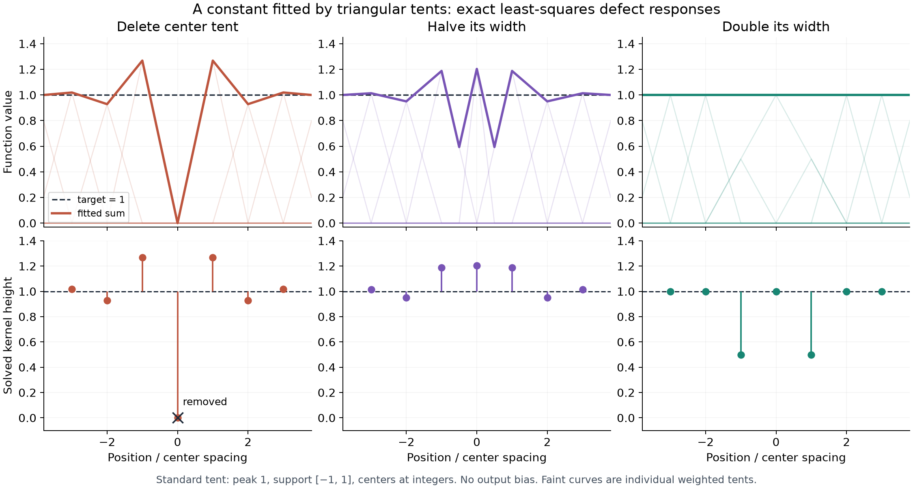

# Two exact tests with translated tent kernels

Use T(t)=max(1-|t|,0), centers kh on the infinite line, no output bias, and target 1. The model is sum_k v_k T(x/h-k). All coefficients equal to one give the exact constant because the tents form a partition of unity. Fit the continuous integrated squared error, requiring a square-summable coefficient perturbation from the all-one baseline. This avoids trying to give the non-square-integrable constant itself an L2 norm and avoids the degenerate infinite-domain mean-error criterion.

## Delete the center tent

Treat the removed weight as v_0=0 and define delta_k=v_k-1. Neighboring tents overlap with integral h/6, each squared norm is 2h/3, and more distant tents do not overlap. Stationarity for k not equal to zero gives

\[
\delta_{k-1}+4\delta_k+\delta_{k+1}=0,
\qquad \delta_0=-1.
\]

The characteristic roots are -2 plus/minus sqrt(3). Only r=sqrt(3)-2 has magnitude less than one. The decaying solution is

\[
\boxed{v_k=1-r^{|k|},\quad r=\sqrt3-2.}
\]

Weights at distances 1,2,3,4 are 1.2679491924, 0.9282032303, 1.0192378865, 0.9948452239. The fitted function equals zero at the deleted center regardless of the other weights: all remaining standard tents vanish there. The alternating correction reduces the integrated error but cannot restore an exact constant. The minimum integrated squared error is h/sqrt(3).

This is well conditioned. The Gram Fourier symbol is h(2/3+cos(theta)/3), ranging from h/3 to h, hence condition number 3. Alternation here does not require a numerically near-null direction or undersampling of the target. It is the sign structure of the inverse overlap operator.

## Change only the selected tent's width

Replace T(x/h) by T(x/(rho h)), keeping its height parameter as its coefficient. All other tent widths and centers stay fixed. Width ratio rho is the inverse of the corresponding gamma ratio.

For 0<rho<=1 let a=2-sqrt(3), r=-a. The exact coefficient on the changed tent is

\[
\boxed{\beta(\rho)=\frac{3-(1+a)\rho}{2-a\rho^3}.}
\]

Every other coefficient is

\[
\boxed{v_k(\rho)=1+[\beta(\rho)\rho^2-1]r^{|k|},\quad k\ne0.}
\]

Derivation in h=1 units: its overlap with each adjacent standard tent is rho^2/6 and its squared norm is 2rho/3. Removing the center splits the Gram matrix into two identical semi-infinite tridiagonal blocks. The coefficients of the projection of the changed tent onto either block are rho^2 a r^(k-1), k>=1. The squared norm of its residual after projection is (2rho-a rho^4)/3. Its overlap with the target residual from deletion is rho-(1+a)rho^2/3. Their ratio is beta above. Multiplying every integral by h leaves the coefficients unchanged.

The integrated squared error is

\[
E(\rho)=h\left[\frac1{\sqrt3}
-\frac{\rho[3-(1+a)\rho]^2}{3(2-a\rho^3)}\right].
\]

At rho=1 all weights equal one. At rho=1/2, beta=1.2031618421, and the first neighboring weights are 1.1873526314, 0.9497990137, 1.0134513137. E/h=0.1028983553. As rho decreases to zero the selected peak height tends to 3/2, while its area and L2 norm tend to zero; all other coefficients approach the deletion solution. If the kernel were normalized to unit area, its readout would instead be rho h beta and tend to zero. The single-point peak limit and the L2 function limit differ.

## Widening can fit exactly

For rho=2,

\[
T(t/2)=\tfrac12 T(t+1)+T(t)+\tfrac12 T(t-1).
\]

Thus an exact constant is recovered with selected weight 1, the two adjacent weights 1/2, and all other weights 1. No alternating tail is needed.

More generally, for positive integer m,

\[
T(t/m)=\sum_{|k|<m}(1-|k|/m)T(t-k).
\]

An exact constant is obtained with selected weight 1, v_k=|k|/m for 0<|k|<m, and v_k=1 farther away. For noninteger rho, the replacement tent has slope changes at new off-grid points. The unchanged tents cannot cancel those slope changes unless the replacement coefficient is zero, and then the missing center cannot be filled. Consequently a noninteger width cannot give an exact constant in this particular fixed-background model. This conclusion concerns this piecewise-linear activation and knot alignment, not smooth kernels in general.

## Verification and interpretation

`tent_check.py` independently solves a finite model with centers -20 through 20 using Gaussian quadrature split at every kernel corner. Feature products and squared residuals are piecewise quadratic, so three-point Gauss integration is exact up to roundoff. The computed weights agree with the infinite-grid formulas within 3.7e-12, with the tiny discrepancy at the far boundaries. The deletion error agrees with 1/sqrt(3); integer-width cases have numerical integrated errors below 2e-28. `tent_verification.json` contains all values.

The projection/overlap theory is activation-independent. Its numerical response, conditioning, spatial extent, and exact-representability conditions depend on the activation. The same every-other-node correction can occur in a well-conditioned compact-support basis; calling every such correction aliasing would conceal the more general inverse-overlap mechanism.

A free output bias would trivialize this constant-target test. Fitting only the center samples also changes the result: the ordinary tent matrix is cardinal there, so the center-sampled loss does not generate the continuous-L2 alternating correction.

