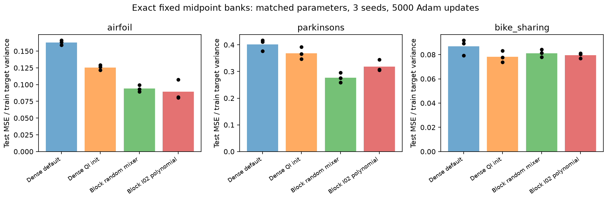
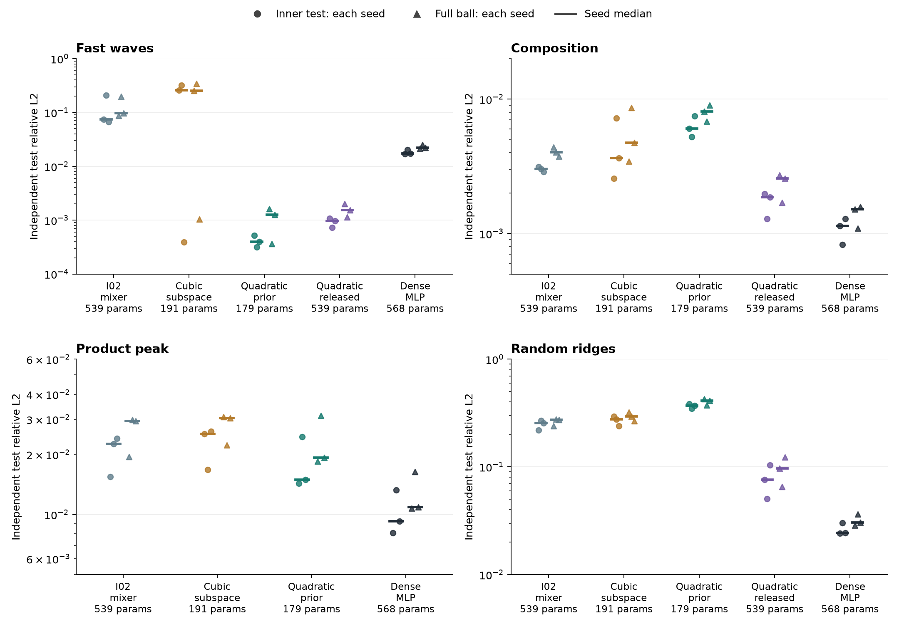
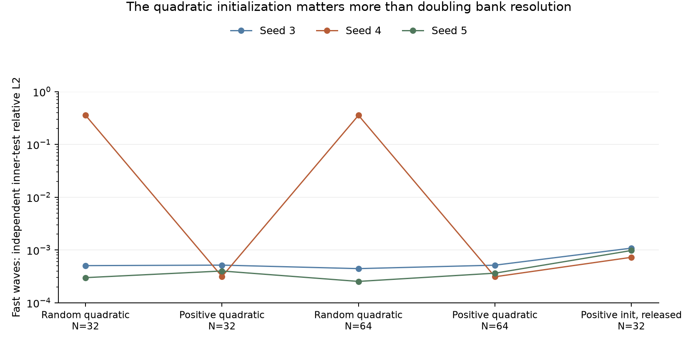
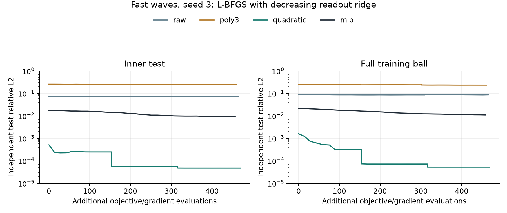

# expI03 — What works in checkpoint I, and why

**Status: completed investigation, September 6, 2026; numerical findings are data-obvious within the stated tests; broader research implications remain proposals.**

## TL;DR

- **There is useful QI-block behavior to keep.** A compact fixed-bank network trained with ordinary Adam beats similarly sized dense networks on two of three real-data regressions and is competitive on the third. This is the strongest practical result of this investigation.
- **Within the controlled analytic protocol, initialization alone produces large gains.** On three paired fast-wave runs, a quadratic initialization with all coefficients subsequently free reduces median relative error from $0.075$ to $0.00098$ at exactly the same parameter count. Both use the new common ridge-head policy. Keeping a compact quadratic restriction improves this further, but that restriction hurts other targets.
- **Depth beyond two layers is not yet the main source of value.** I reproduced the successful two-layer result and grew it to three/four layers without changing its initial function or objective. Additional depth improved error by only $5$–$6\%$ in that controlled case. Some original failed deep runs had become constant far outside the mesh.
- **F's approximately tenfold initialization gain is real in its one-dimensional synthetic ladder.** Its real-data initialization gains are smaller. Nevertheless, the advantage of two layers survives new comparisons that match parameter count and use separate validation for checkpoint selection.

## Question

Which checkpoint-I results reflect useful compositional approximation, which reflect initialization or fitting failures, and which support a practical multilayer QI model? In particular, what transfers from F's initialization, and does extra depth add value once the comparison is controlled?

## Experiment design

### What the papers and A–C establish for this question

I read both supplied PDFs, the implementation notes, and the A–C results before testing I. The relevant distinction is between **having an accurate scalar approximation space, finding useful internal coordinates, and fitting the final coefficients**. The papers and earlier checkpoints strongly support the first of these under their construction and sampling assumptions. They do not show that end-to-end learning finds the required internal coordinates in a composition.

For a scalar input $t$, the common feature is $\phi_j(t)=\tanh(\gamma(t-c_j))$, with spacing $h$ and $\gamma h\approx0.25$. A–C show that jointly chosen spacing and bandwidth give accurate fitted readouts, that SVD-based fitting can use this geometry despite severe redundancy, and that small soft features can preserve useful smooth components. B's sampling experiments also distinguish clean approximation from noise-limited regression. These are empirical findings in their tested regimes; statements such as “only uniform centers can work” or “conditioning cannot matter” should not be promoted to universal claims about learned compositions.

If a target factors as $f=g\circ P$, inner error matters through the sensitivity of the outer function. On a domain containing the true and learned inner ranges, if $g$ is $L_g$-Lipschitz,

$$
\|g\circ P-\widehat g\circ\widehat P\|_\infty
\le L_g\|P-\widehat P\|_\infty+\|g-\widehat g\|_\infty.
$$

Thus a finely resolved outer bank cannot compensate for the wrong inner coordinate. Its approximation guarantee also says little if training moves that coordinate outside the interval on which the bank was designed and fitted.

### Analytic model and paired tests

The tested two-stage block computes

$$
p_r(x)=v_r^T x+a_r,\qquad
z_k(x)=b_k+\sum_{r=1}^{M}\sum_{j=1}^{N_1}C_{rjk}\phi_j(p_r(x)),\qquad
\widehat f(x)=b+\sum_{k=1}^{K}\sum_{j=1}^{N_2}w_{kj}\phi_j(z_k(x)).
$$

Each bank uses midpoint centers $c_j=-1+(j+\tfrac12)h$, $h=2/N$, $j=0,\ldots,N-1$, and $\gamma=0.25/h$. These finite banks do not include the halo of the earlier scalar construction. Directions, projection biases and inner mixing coefficients are learned; centers and bank bandwidths stay fixed.

Exploratory seeds $0,1$ tested the existing smooth-profile initialization, smaller coefficient steps, the approximate derivative-coefficient law $C_j\approx(h/2)q'(c_j)$ for random smooth profiles $q$, persistent low-degree mixer restrictions, and stabilized head fitting. None of the first three was sufficient as a general repair. The primary confirmation then fixed a recipe and used seeds $3,4,5$ on fast waves, composition, product peak and random ridges in three dimensions. Each run uses $2,560$ training points, $2,000$ Adam updates, learning rate $0.005$, a $50$-step warmup and cosine schedule, and band penalty coefficient $0.01$. All arms within a seed share the data. Final-step errors are reported, without selecting a checkpoint using test error.

The four primary arms are: the I02 initialization with unrestricted inner coefficients; a persistent cubic subspace represented through the same QI bank; a persistent quadratic subspace with positive quadratic initialization; and a dense tanh MLP with two hidden layers. Their actual parameter counts are respectively $539$, $191$, $179$ and $568$. The dense control matches the unrestricted block approximately; it is larger than the restricted models. Every arm uses the same per-step ridge head policy,

$$
\min_{w,b}\;\frac1n\|Fw+b\mathbf1-y\|_2^2+\alpha\|w\|_2^2,\qquad\alpha=10^{-6},
$$

solved by centered SVD with the bias unpenalized. Gradients through the nonlinear parameters use the envelope theorem with the fitted head held fixed. This is a diagnostic fitting policy: the block has $128$ head features versus $21$ in the dense control, so equal updates do not imply equal training compute.

The quadratic initializer uses repeated random orthogonal direction frames, positive quadratic coefficients and small random linear terms, followed by the existing train-input calibration. It uses no target labels, target anchor, oracle direction or latent supervision. It deliberately encodes a radial structural prior. The cubic/quadratic restrictions are persistent changes to the learned function class, not merely initializations; their basis functions are QI approximations to polynomials.

Three follow-up controls distinguish these effects. Random versus positive quadratic initialization uses the same $179$-parameter subspace. Doubling $N_1$ from $32$ to $64$ changes scalar bank resolution while retaining that subspace and parameter count. Finally, “quadratic released” expands exactly the same initialized inner function into unrestricted coefficients before training, restoring all $539$ parameters. These follow-ups reuse the confirmation seeds after examining the main results: they are paired mechanism tests, not a second untouched benchmark. A separate seed-$3$ diagnostic applies L-BFGS while reducing the head ridge through $10^{-6},10^{-8},10^{-10}$.

Analytic error is relative $L_2$, $\|\widehat f-y\|_2/\|y\|_2$. Each run evaluates $4,096$ independent samples inside $90\%$ of the training-ball radius, following I02, and another $4,096$ samples over the full training ball. The latter includes the outer shell; it is not distant extrapolation. Three-dimensional training balls have radius $0.3$ about the existing anchor.

### Practical model, F controls and depth controls

The practical model implements the same two-bank composition with more channels and fewer centers: twelve channels and eleven centers at each stage. Each stage is an affine projection, a fixed bank, then flattening. Initialize projection rows as independent unit Gaussian directions, divide each row by the $99.9$th percentile of its absolute projected training values, and repeat over the actual preceding bank outputs. Calibration runs once on at most $4,096$ training inputs. Training thereafter is ordinary Adam: no solved head, forward normalization, geometry updates or band penalty.

Airfoil, Parkinsons and bike-sharing comparisons use three seeds, approximately matched parameter counts, $5,000$ identical minibatches per seed, batch size $128$, and Adam learning rate $0.001$. Each seed withholds $20\%$ of the original training split for validation and trains on at most $4,096$ remaining rows. Target standardization uses the actual training subset. Validation selects among checkpoints every $100$ updates; test data do not select the checkpoint. The metric is test MSE divided by training target variance, averaged over seeds. All seeds share each task's cached outer test split. These are existing random-row interpolation splits, not future-time or held-out-patient tests.

Separate F probes compare one versus two hidden layers at matched parameter counts, frozen initial dictionaries, temporary versus permanent direction sharing, and I02-style polynomial versus simple random mixing. A final approximate $1,800$-parameter sweep varies centers per channel over $4,8,16,32$, adjusting the channel count to fit the budget.

The depth study first reproduces the exact successful four-dimensional A2 setup: $12,288$ training points, $10,000$ inner-ball test points, seed $0$, and $2,000$ updates. One or two zero-initialized residual QI layers are then inserted into the trained model. The primary continuation preserves both its initial function and its regularized objective, including the gradient on its original parameters. All arms receive another $1,000$ updates; the original layer uses learning rate $0.001$ and added layers $0.0003$. Scratch-depth, sample-count and frozen-original-layer controls are supplementary.

**Code & data.** The [experiment README](../../../experiments/expI03_investigation/README.md) provides reproduction commands and a model usage example; [config](../../../experiments/expI03_investigation/config.yaml) records the protocols. Primary code: [analytic runner](../../../experiments/expI03_investigation/probe.py), [refinement](../../../experiments/expI03_investigation/refine.py), [summary plots](../../../experiments/expI03_investigation/summarize.py), [reusable fixed-bank model](../../../experiments/expI03_investigation/f_init/fixed_qi_mlp.py), and [canonical real-data runner](../../../experiments/expI03_investigation/f_init/canonical_run.py). Primary analytic records: [confirmation](../investigation_20260906/confirm_d3.json), [released coefficients](../investigation_20260906/quadratic_release.json), [full tables](../investigation_20260906/analytic_tables.md), [initialization ablation](../investigation_20260906/quadratic_init_ablation.json), [resolution ablation](../investigation_20260906/quadratic_resolution.json), and [refinement](../investigation_20260906/confirm_d3_refine.json). Scoped reports contain the other raw records, plots and commands: [F and practical blocks](../investigation_20260906/f_init/report.md), [depth](../investigation_20260906/depth/report.md), [saved-evidence audit](../investigation_20260906/evidence_audit/evidence_audit.md), [corrected GN](../investigation_20260906/evidence_audit/solver_audit.md), and [independent code review](../investigation_20260906/evidence_audit/new_code_review.md). Source papers: [workshop PDF](../../../papers/QIs_workshop.pdf), [replacement Section 3](../../../papers/Section_3_Rewrite.pdf), and [implementation notes](../../../papers/practical_implementation.tex). Earlier evidence: [A06](../../checkpoint_A_numerics/expA06_readout_structure/expA06_results.md), [B01](../../checkpoint_B_scaling/expB01_sampling_and_noise/expB01_results.md), [B02](../../checkpoint_B_scaling/expB02_scaling_laws/expB02_results.md), and [C synthesis](../../checkpoint_C_geometry/expC_results.md).

## Results

### The promising evidence in I is real, but the local notebook does not establish the broad claim

The saved I01 notebook and its JSON contain numerical results only for E0 and E6. E0 reaches near-machine precision with a shallow fixed bank and solved head. E6's best California block has RMSE $0.494$, versus $0.462$ for its dense MLP. The local files contain no saved E1–E5 learned-composition outputs; an external Colab result may exist, but I cannot verify it here. E1's planned oracle latent supervision would in any case answer a different question from end-to-end learning.

I02 itself contains stronger useful positives than some of its summaries suggest. The A2 fast-wave block reaches $1.06\times10^{-3}$ with $1,195$ parameters, versus $0.151$ for a $1,249$-parameter MLP. Composition and product peak also have useful parameter-efficient points. B1's same-seed product-peak improvement after GN is about $286\times$, and Lorenz has a roughly fivefold error advantage over its matched MLP across three trajectory pairs. These are valuable architecture-plus-fitting results. Their optimizer differences and limited seeds prevent treating them as isolated architectural or equal-compute wins.

Conversely, random ridges and Fashion-MNIST have meaningful negative results. The written three-bump GN improvement mixes a three-seed median with a seed-$0$ endpoint; the actual same-seed gain is about fivefold. Several failed deep runs have channel means tens of mesh widths outside the intended interval and exactly zero late-channel variance. “The architecture cannot represent the target” is not an adequate explanation for those collapsed states.

### F's useful initialization establishes coverage at an appropriate scale

F04 groups a width-$W$ layer into bundles of approximately $P=\sqrt W$ neurons sharing an initial random direction. Offsets cover that direction's observed input projections, and bandwidth scales with $P$ divided by the observed range. The second layer is initialized from actual first-layer activations. Thus the initializer supplies a collection of shifted features along each direction at a usable scale. Merely making every isolated neuron sharp according to total width does not provide that coverage.

The approximately tenfold gains are present in F's **one-dimensional GELU synthetic ladder**; they mostly disappear by dimensions $8$–$16$. Across F's real-data tasks, final-loss initialization gains are much smaller, typically around $1.1$–$1.2\times$. Moreover, the newly fitted frozen QI dictionary starts worse than the ordinary dictionary on all three tested regressions. The practical benefit develops during training; installing an already-superior fixed high-dimensional approximation space does not explain these results.

The original one-versus-two-layer comparison also combined equal widths with different parameter counts, and final evaluation with best-evaluation epoch selection. The new matched comparisons remove both issues. Two-layer QI test MSE improves from $0.338$ to $0.162$ on airfoil, $0.614$ to $0.377$ on Parkinsons, and $0.299$ to $0.088$ on bike, at nearly equal parameter counts. Depth therefore adds something beyond the initializer and parameter count. A natural interpretation is that the second bank can apply nonlinear functions to learned combinations of first-bank features. These experiments do not isolate that representational explanation from every optimization effect of depth.

### The simple compact block is the strongest practical outcome

| Test MSE / training variance | Dense default | Dense QI initialization | Fixed-bank block, random mixing |
|---|---:|---:|---:|
| Airfoil | $0.16296$ | $0.12558$ | **$0.09414$** |
| Parkinsons | $0.40174$ | $0.36830$ | **$0.27692$** |
| Bike sharing | $0.08676$ | **$0.07818$** | $0.08118$ |

These are three-seed means. The block has $1,801/1,969/1,885$ parameters versus $1,834/1,996/1,925$ for the corresponding dense controls. Against the QI-initialized dense model, it reduces MSE by about $25\%$ on airfoil and Parkinsons and is about $4\%$ worse on bike. MSE ratios should not be described as equal-sized RMSE gains.

Permanent tying retains much of the performance of the much larger F network. Fixed midpoint banks then make the parameter saving explicit. The optional I02 polynomial mixer initialization also works at this modest resolution, but is unnecessary and worse on Parkinsons. Large initial coefficient norms alone are therefore not a sufficient explanation for failure: the polynomial control can have norms near $2,000$ while the successful simple initializer has norms near $4$.

The approximately fixed-budget resolution sweep rejects a universal “more centers” rule. Integer channel counts give actual budgets of $1,630$–$1,971$ parameters. Four centers per channel are poor on all three tasks at this budget. Moving from eight to thirty-two helps airfoil, changes little on Parkinsons, and worsens bike error by about $30\%$. More scalar resolution costs learned channels at a fixed parameter budget. The twelve-channel, eleven-center default is a measured useful compromise, not an established universal optimum.

This is parameter efficiency, not a measured wall-time advantage. On this CPU the small block takes roughly $2.0$–$2.7$ seconds per run including evaluations, versus $1.1$–$1.3$ seconds for the small dense models. Also, at the final training step, $60$–$73\%$ of second-stage coordinates lie outside the nominal bank interval. These models can use tanh tails successfully for ordinary regression. This final-state diagnostic does not describe every validation-selected checkpoint, and the result does not establish uniform approximation precision or show that strict mesh confinement is necessary.

### On analytic targets, useful inner coordinates matter more than a precision head

The main confirmation and the released-coefficient follow-up give the following median inner-test relative errors:

| Target | I02 initialization, $539$ params | Positive quadratic, restricted, $179$ | Positive quadratic, released, $539$ | Dense MLP, $568$ |
|---|---:|---:|---:|---:|
| Fast waves | $0.07492$ | **$0.000400$** | $0.000977$ | $0.01741$ |
| Composition | $0.003020$ | $0.006048$ | $0.001862$ | **$0.001136$** |
| Product peak | $0.02255$ | $0.01492$ | not run | **$0.009251$** |
| Random ridges | $0.2549$ | $0.3720$ | $0.07599$ | **$0.02432$** |

Fast waves has the form $\cos(6\pi\sqrt{s})$ with $s=\|x-a\|^2/2$. Starting with positive quadratic summaries therefore puts the model near a useful family of internal coordinates; the target's center $a$ is still unknown to the initializer. The free-coefficient control shows that the benefit is not solely due to keeping a restricted polynomial model. It retains a roughly $77\times$ error reduction over the original initialization at the same parameter count and training policy, and is roughly $18\times$ better than this dense baseline. This is a targeted initialization result, not a target-agnostic optimum.

Releasing the quadratic coefficients improves over the original initialization in all nine paired runs, including composition and random ridges. The gain therefore extends beyond the radial target within this small test, but the dense MLP remains better on those two controls.

The restricted quadratic arm is more accurate and consistent on fast waves, but worse on composition and random ridges. Random initialization within the same quadratic subspace succeeds on two seeds and fails on seed $4$ with error $0.356$; positive initialization succeeds on all three. Doubling inner-bank resolution leaves the failed random-quadratic run essentially unchanged. These controls distinguish reaching a useful inner representation from resolving it more finely once found.

The full-ball tests preserve the main fast-wave gain: median errors are approximately $0.0975$ for the I02 initialization, $0.00126$ for the restricted quadratic model, $0.00154$ after releasing coefficients, and $0.0220$ for the MLP. Some errors increase in the outer shell, so the inner-only score should not be interpreted as uniform coverage of the training domain.

L-BFGS plus decreasing head ridge takes the useful seed-$3$ quadratic fit to $4.74\times10^{-5}$ inner-test error and $5.30\times10^{-5}$ full-ball error. It leaves the poorly fitted I02 and cubic initializations near $0.071$ and $0.241$. All four arms receive $458$–$469$ additional objective/gradient evaluations. Much of the quadratic improvement occurs when ridge decreases; this is not an isolated L-BFGS gain. The experiment supports refinement after useful feature discovery, and does not establish a general precision-learning algorithm.

### Extra depth can preserve a good solution, but offers little additional accuracy here

The exact A2 two-layer reproduction reaches $1.265\times10^{-3}$. From that trained state, the continuation errors are:

| Depth | Parameters | Final relative test error |
|---|---:|---:|
| Two | $683$ | $9.340\times10^{-4}$ |
| Three, identity insertion | $941$ | $8.862\times10^{-4}$ |
| Four, identity insertion | $1,199$ | $8.814\times10^{-4}$ |

All three begin with the same predictions and regularized objective. The extra layers provide only $5$–$6\%$ improvement for substantially more parameters and work. Freezing the original representation and training only added layers improves the reproduced error by about $1\%$ in a supplementary control.

Starting four layers from scratch with identity residuals and small inserted-layer steps reaches $1.58\times10^{-3}$, versus historical random-depth-four error near $0.48$. This shows that at least one apparent deep failure is repairable without changing the target or adding oracle supervision. But the analogous depth-three run still fails, and the smaller-data screening has substantial failures even at depth two. The intervention is not a reliable scratch-depth recipe.

The failed runs show actual channel escape and unsupported readout directions, including one case with training error $0.556$, test error $3.57\times10^6$, and channels around $[-117,126]$. That failure is much more severe than the moderate use of tanh tails by the practical regressor. Occupancy needs to be interpreted alongside channel variance, readout stability and held-out error, rather than as a binary success criterion.

### Figures

- **Saved scaling and depth diagnostics** in the evidence audit replot historical I02 results: parameter count versus error, and learning curves alongside channel means and band escape. They show both useful small-block points and the collapsed states hidden by broad negative summaries.
- **F historical ratios, controlled depth and initial dictionaries** in the F report distinguish the low-dimensional tenfold gain from the modest real-data initializer gain, then show validation-selected depth comparisons and frozen-feature controls.
- **Canonical practical comparison** has one panel per regression task and three-seed results for approximately matched models; its companion resolution plot varies centers per channel at an approximately fixed parameter budget.
- **Analytic comparison** below has one panel per target. Circles show each seed's inner-test error, triangles its full-ball error, and short horizontal segments the median. The quadratic prior helps fast waves decisively while the dense MLP wins the other targets in this fixed recipe.
- **Quadratic controls** joins the same seeds across random/positive quadratic initialization, inner-bank resolution and released coefficients. The persistently bad random seed survives doubled resolution; positive initialization repairs it.
- **Refinement comparison** shows inner/full-ball errors versus actual additional objective evaluations. Ridge changes between stages; the abrupt drops should be read as part of that combined procedure.
- **Depth continuation trajectories** in the depth report start from exactly equal function and objective values, then compare errors and channel means. The small advantage of extra depth is visible without conflating it with a different initial model.

## Additional details

**Numerical and protocol faults were separated from the empirical claim.** I02 omits a shallow projection bias from its nonlinear parameter list, and its shallow helper fails to pass the chosen learning rate. The shared GN implementation projects away all QR columns even when the head solve discarded numerical null directions; it also uses inconsistent flattening for vector outputs. A separate corrected dense GN reference now uses the retained SVD subspace and explicit sample/output axes. Finite-difference and train/test separation checks pass. The correction improves a redundant two-output diagnostic by about $3.8\times$, but does not rescue the sampled scalar-QI failure. It is therefore a real defect with a bounded demonstrated effect, not an explanation for all of checkpoint I.

**The practical and precision questions remain distinct.** The compact model has ordinary Adam state and bounded one-time calibration. The analytic runner factors a full sample-by-feature matrix each step; the GN utility additionally materializes dense Jacobians. They are measuring instruments, not proposals satisfying the project's scalable-optimizer requirement. The derivative-profile screen also did not show that the A06 coefficient law by itself solves inner-coordinate discovery.

**Generalization claims are deliberately limited.** The analytic confirmation fixed its initial recipe before seeds $3$–$5$, but the quadratic follow-ups reused those seeds. The real-data recipe was developed through probes on these same three tasks and cached splits. Validation selects individual checkpoints correctly, yet the entire investigation is not an untouched benchmark of a pre-registered method. No result here validates patient-level or temporal transfer, a broad classification claim, large-depth reliability, fp32 behavior, or machine-precision end-to-end training.

**Verification and preservation.** The combined suite passed $33$ tests: the $24$ existing I02 tests, four new analytic checks, two fixed-bank invariant tests and three corrected-solver tests. The depth scripts additionally check exact identity insertion, input gradients, objective preservation and agreement with the existing training loop. The final summary figures were inspected. Existing user-modified code and results were preserved; all new code, data and reports have separate paths. No commits or publication were performed.

## Conclusions

The tested useful regimes are a compact two-stage fixed-bank regressor and a structurally appropriate initialization for a small analytic block. The experiments establish large initialization sensitivity, real parameter-efficient wins, and a small controlled benefit from further depth; they do not establish one recipe that learns precise compositions reliably across targets.

## Open questions

- Can the released quadratic initialization retain its benefit across fresh target families and dimensions, with channel count varied independently of scalar resolution? The present result makes this a specific candidate to test, rather than a reason to assume any smooth initialization should work.
- Can a method identify when to add a channel, refine a scalar bank or add a layer using training/validation evidence? The measured tradeoffs favor resolving this allocation question before a larger depth sweep.
- Can the inner-coordinate discovery and final precision fit both work with scalable optimizer state and matched training compute? The practical block is a concrete baseline for that question; the dense diagnostic solves are not its solution.
