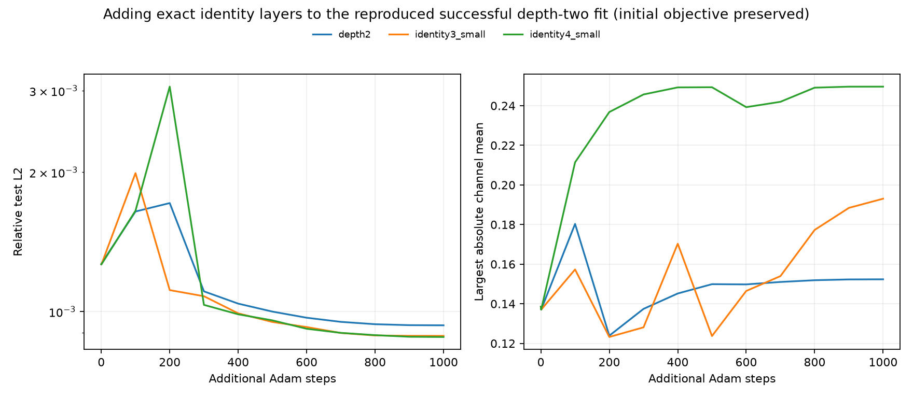
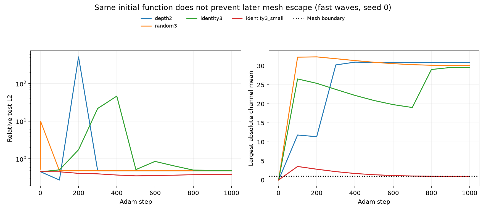

# Depth in checkpoint I: exact identity insertion

**Finding.** Extra QI layers can retain a successful two-layer fit and continue training, but the measured gain from extra depth is small. The severe earlier failures are not evidence that the deeper architecture lacks capacity: the original optimizer can push channel values far beyond the fixed mesh, after which the solved head is either nearly constant or numerically unstable. Starting added residual layers at the exact identity removes one source of disruption; it does not by itself make training reliable.

These are 53 new fits: a three-seed screening experiment, a reproduction of the successful A2 baseline, and controlled growth from that trained baseline. All original I02 source and results were read-only. New code is under `experiments/expI03_investigation/depth/`.

## The useful positive result: grow a working model without destroying it

The exact A2 fast-waves setup was reproduced at dimension 4, seed 0, 12,288 training points, 10,000 inner-ball test points and 2,000 Adam updates. The two-layer error was **1.265e-3**, matching the historical 1.3e-3. This trained model was then copied into all continuation arms. Depth 3 or 4 was formed by inserting one or two zero-initialized residual QI layers immediately before the original readout. These layers compute `z + QI(z)` with the QI mixer coefficients and bias initially zero. The initial features, predictions, head parameters and input derivatives are exactly unchanged.

The most controlled continuation preserves the initial regularized objective too. If `R(p)` is the original band penalty on one bank's input, use

\[
R(p_0)+\frac{1}{L-1}\sum_{\ell=1}^{L-1}R(p_\ell),
\]

where `L` counts all QI layers, including the readout layer. At insertion all later inputs equal the original channel vector, so this equals the original two-layer penalty. The objective difference was zero; the maximum difference in the original first-layer parameter gradients was below 1.3e-19.

All continuations used another 1,000 updates with the original first layer trainable, its Adam learning rate 0.001, and the added layers' rate 0.0003. Both rates have the original 50-step warmup and cosine schedule. The head uses the original VarPro solve at every step.

| continuation | parameters | initial test error | final test error | reduction versus continuing depth 2 |
|---|---:|---:|---:|---:|
| depth 2 | 683 | 1.265e-3 | 9.340e-4 | — |
| identity-inserted depth 3 | 941 | 1.265e-3 | 8.862e-4 | 5.1% |
| identity-inserted depth 4 | 1,199 | 1.265e-3 | 8.814e-4 | 5.6% |

This is a useful way to grow the model, but not evidence of a substantial benefit from more depth. The modest error reduction costs 38% or 76% more parameters and more work per update. It is one target and seed. With the original first layer frozen, training only the new layers reduced 1.265e-3 to approximately 1.252e-3: about 1%. Those frozen runs used the original summed band penalty, so their comparison is supplementary.

With the original summed penalty, the same trainable continuations ended at 8.570e-4 and 8.949e-4. Preserving the objective therefore does not change the practical conclusion.



*Figure: test error and channel means during continuation from the reproduced successful depth-two fit. All models start with exactly the same predictions and regularized objective. The extra layers give a small improvement; the channel means remain near the mesh's useful region.*

## Starting deeper from scratch remains fragile

The paired screen used dimension 4, `(M,N1,K,N2)=(8,32,2,64)`, 2,048 training points, 4,096 test points, seeds 0–2 and 1,000 updates. Each seed changes both the sampled data and initialization; all arms within a seed share those data. The base and original random-layer learning rate is 0.02. Added-layer small-step arms use `0.02/64`; the original first layer's rate remains 0.02. Geometry and forward equations are unchanged, and every model uses the original band penalty and head solve.

Median relative test errors:

| initialization | fast waves | composition |
|---|---:|---:|
| depth 2 | 0.438 | 0.00756 |
| random smooth depth 3 | 0.483 | 0.207 |
| random smooth depth 4 | 0.484 | 0.210 |
| exact identity depth 3 | 0.496 | 0.0510 |
| exact identity depth 4 | 0.526 | 0.493 |
| exact identity depth 3, smaller added-layer step | 0.419 | 0.0842 |
| exact identity depth 4, smaller added-layer step | 0.458 | 0.188 |

These medians hide very large failures: the identity depth-three fast-waves arm reached 3.57e6 test error on one seed. Full seed ranges and all trajectories are in `tables.md` and `screen.json`. The shallow fast-waves screen itself often failed, so these rows cannot establish that extra depth is intrinsically worse.

At the exact larger A2 setup and 2,000 steps, identity insertion with the smaller added-layer step gave **0.217 at depth 3 but 1.578e-3 at depth 4**, versus 1.265e-3 at depth 2. The depth-four result is roughly 300 times better than the historical random-depth-four result near 0.48, and close to the shallow fit. This establishes a trainable deeper example without supplying the target's factorization. It does not establish a reliable from-scratch recipe.

Training budget and sample/calibration size matter. At 2,048 points, seed 0 and the same 10,000-point test set, extending depth-two training to 2,000 updates yields 1.566e-2; at 12,288 points it yields 1.265e-3. The smaller-data 1,000-step screen gave approximately 0.482. The large-data protocol also calibrates on 4,096 points rather than 2,048; this comparison does not isolate calibration from training sample count.

## What actually fails

In the smaller fast-waves screen, seed-zero depth two finishes with channel means `[30.85, 8.34]`, far outside the fixed `[-1,1]` mesh. Its augmented 129-column head feature matrix has numerical rank 4 at the existing cutoff. The solved head norm is 4.39e9 even though the resulting predictor is almost constant. An identity residual path does not prevent the first layer from moving into this regime.

The seed-one identity-depth-three failure is more severe. Final channel values span approximately `[-117,126]`; the head norm is 5.65e8. Training predictions remain below about 1 in absolute value, but one inner-ball test prediction reaches 6.72e7. Relative training error is 0.556 and relative test error is 3.57e6. The data domain itself has not been expanded. A severely distorted channel map and the poorly conditioned head can produce enormous errors between observed samples.



*Figure: seed-zero fast waves in the smaller screen. Exact identity insertion starts with the shallow model's function. During training the first and later channel means still escape the fixed mesh, and accuracy stalls. The horizontal dotted line marks the mesh boundary, not a rescaling operation.*

A separate numerical check found an initial head norm of 3.00e8 on seed two. A fixed-head finite difference agreed with autodiff to 4.75e-6 at perturbation 1e-5, but deteriorated to an absolute discrepancy of 0.106 at perturbation 1e-8. The identity equality checks remained exact. This is why the recorded finite-difference checks use a step-size sweep rather than one fixed perturbation.

## Interpretation and limits

The existing depth-two architecture already provides most of the value on this fast-waves task. Extra trainable channel layers add capacity, but once a good representation has been found they buy only a few percent at this budget. The useful general lesson is to preserve a working representation when growing depth, control the actual function change from new bank coefficients, and monitor channel occupancy and solved-head conditioning. A zero residual initialization addresses the first issue only.

The deeper model's class contains the shallow model exactly through its identity residual paths; the failed runs cannot be capacity obstructions for this family. This does not prove that every nonresidual QI stack has the same property. The successful continuation evidence is one target and seed, uses more computation for deeper arms, and is not a task-independent benchmark win. No target factor, forward normalization, moving mesh, or geometry update rule was introduced.

## Reproduce and verify

Run from the repository root, using the existing PyTorch 2.4.1 environment. Each process sets fp64 and one CPU thread. Several processes ran concurrently with other investigation work, so recorded wall times are not comparative benchmarks.

```sh
.venv/bin/python experiments/expI03_investigation/depth/run.py --steps 1000
.venv/bin/python experiments/expI03_investigation/depth/run.py --steps 2000 --n-train 12288 --n-test 10000 --seeds 0 --targets fast_waves --arms depth2 identity3_small identity4_small --name a2_matched
.venv/bin/python experiments/expI03_investigation/depth/continue_trained.py
.venv/bin/python experiments/expI03_investigation/depth/continue_trained.py --name continuation_preserved --penalty-mode preserve_identity --no-frozen
.venv/bin/python experiments/expI03_investigation/depth/run.py --steps 2000 --n-train 2048 --n-test 10000 --seeds 0 --targets fast_waves --arms depth2 --name sample_count_control
.venv/bin/python experiments/expI03_investigation/depth/summarize.py
```

The scripts save per-run trajectories, first-step gradient and parameter-update norms, occupancy statistics, configurations and trained state dictionaries. Existing JSON keys are skipped. For reruns with changed settings, use a new `--name`; do not reuse an old result name for a different configuration.

Verification: a 20-step paired check against the unchanged `qi2.fit` produced exactly identical model parameters (maximum difference 0.0) and final errors; `protocol_check.json` records the result. All inserted models passed exact initial prediction, feature, head and input-gradient equality checks. The objective-preserved continuation also passed the regularized-objective and original-parameter-gradient checks. Finite-difference checks and all measured diagnostics are recorded alongside the fits. The three new scripts passed Python compilation.
