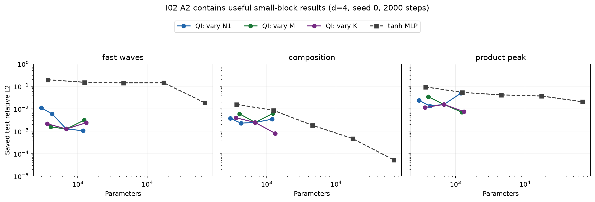
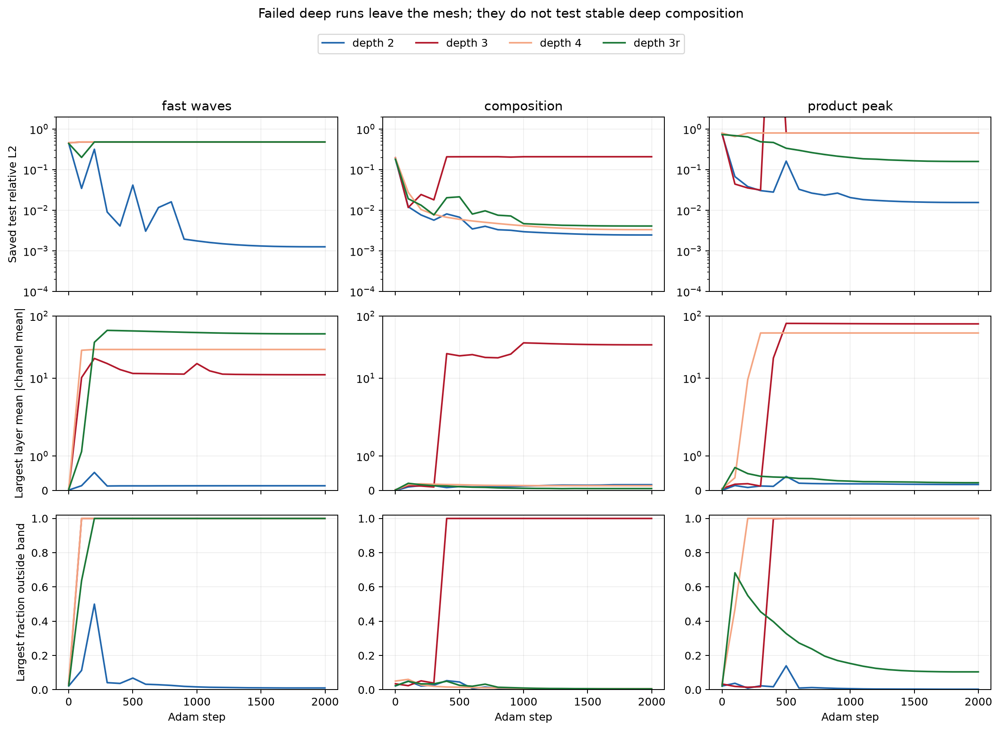

# Checkpoint I evidence and protocol audit

Status: read-only audit of saved records, September 6, 2026. Numerical correctness probes passed; no new training study. Local context revision supplied by the coordinator: `d7eb04d1bf15a82975546d5302bae8caf6be7fa8` (local check passed, remote sync unavailable).

The saved record supports useful small QI blocks on specific smooth compositional targets, and it exposes a repeatable failure of deeper blocks: learned channels leave the mesh, saturate, and sometimes become exactly constant. It does **not** establish that the architecture generally lacks value. The initial notebook also does not contain the locally saved learned-composition wins that its planned experiments might suggest.

## What actually exists in the notebook

`experiments/expI01_compositional_qi/compositional_qi_colab.ipynb` has saved numerical output in E0 and E6 only. Its sibling `expI01_out/results.json` has exactly two top-level keys, `E0` and `E6`; there are no local saved E1–E5 results. The config says full size, 4,000 Adam steps, 40 Gauss–Newton iterations, seed 0, CPU. The notebook PLAN still says that the full study was to be run on Colab. A missing external Colab/Drive result cannot be inferred from these files.

- E0's $7.6\times10^{-15}$ sine error and $10^{-13}$–$10^{-14}$ two-dimensional geometry results use a **shallow fixed bank with a solved head**. They validate the earlier QI numerics, not learned composition.
- E6 California uses log targets standardized over the full dataset. Best block RMSE is 0.49379 (one channel), shallow 0.55909, matched MLP 0.46186. This is a modest gain over that shallow baseline and a loss to the MLP, not a learned-precision result.
- E1, if run, explicitly supplies true latent targets and oracle directions. E2/E3 learn from output labels. Their errors answer different questions.

## Strongest useful saved positives

All analytic errors here are relative $L_2$ on the inner 90% of a small data ball, not on the full original domain. A2 is one seed at 2,000 steps, and needs replication; B1 has three first-order seeds but Gauss–Newton only at seed 0.

| Saved study and target | Actual block result | Useful comparison |
|---|---:|---|
| A2, $d=4$, fast waves | $1.06\times10^{-3}$, 1,195 parameters, $N_1=64$ | MLP with 1,249 parameters has $1.51\times10^{-1}$; MLP with 67,329 parameters has $1.86\times10^{-2}$ |
| A2, $d=4$, product peak | $7.07\times10^{-3}$, 1,235 parameters, $M=16$ | MLP with 1,249 parameters has $5.37\times10^{-2}$; MLP with 67,329 parameters has $2.07\times10^{-2}$ |
| A2, $d=4$, composition | $8.08\times10^{-4}$, 1,325 parameters, $K=4$ | MLP with 1,249 parameters has $8.53\times10^{-3}$; wider MLPs eventually improve beyond the tested block |
| B1, $d=5$, product peak, seed 0 | $4.02\times10^{-2}\to1.41\times10^{-4}$ after 20 GN iterations | Same-seed improvement is $286\times$; shallow plus GN stays at $5.50\times10^{-2}$ |
| B1, $d=5$, three bumps, seed 0 | $1.08\times10^{-3}\to2.15\times10^{-4}$ after GN | Same-seed improvement is $5.05\times$; shallow plus GN is $8.30\times10^{-3}$ |
| B2, Lorenz flow map | Median standardized RMSE about 0.002 across three independent trajectory pairs | Matched MLP about 0.010; no GN |

The A2 block comparisons combine a solved head during training with Adam on nonlinear parameters; the MLP trains its head and gets a final solve. They demonstrate a useful **architecture-plus-fitting recipe**, not an isolated architecture advantage or equal training cost.



This figure replots the existing A2 data with the parameter axis made explicit. Each panel is one target. The colored curves vary one block size parameter; the gray curve varies MLP width. The valuable regime is particularly clear for fast waves. The composition MLP improvement at tens of thousands of parameters does not erase the block's efficiency near one thousand parameters.

There are also honest negatives. On the $d=5$ random-ridge control, median block error 0.339 is worse than MLP 0.0582. Gaussian and fast-wave results have large seed variation. Fashion-MNIST blocks trail matched MLPs by approximately one percentage point. The one-dimensional Poisson block's operator solve reaches $3.4\times10^{-7}$, but a shallow QI construction on this problem already reaches about $10^{-12}$ without training; this is evidence for resolved features and operator fitting, not a reason to prefer depth.

## What the failed deep runs actually did

The raw A2 JSON records per-layer channel means, standard deviations, and fractions outside $|p|\le0.9$. These explain the depth failures more specifically than the writeup's phrase “depth breaks it.”

| A2 run | Final channel state from saved `band` entries |
|---|---|
| Fast waves, depth 4 | Later bank-input mean magnitudes 28.9, 23.2, 13.6; the last two channel standard deviations are exactly zero; all values outside the band |
| Composition, depth 3 | Later means 34.3 and 26.6; final standard deviation exactly zero; all values outside the band |
| Product peak, depth 3 | Later means 74.5 and 27.3; final standard deviation exactly zero; all values outside the band |
| Composition, depth 4 | Means remain below 0.15 in later banks; final error 0.00335, close to depth 2's 0.00247 |
| Composition, depth 3 residual | Occupancy remains controlled; final error 0.00411 |



The first row shows solved-head test error; the second the largest per-layer average absolute channel mean; the third the largest fraction outside the occupied band. The failures coincide with excursions tens of mesh widths beyond a bank designed for $[-1,1]$. Stable runs continue learning. This is strong evidence to investigate initialization and channel-step scaling before making a capacity or depth claim. The weak band penalty in its present form did not prevent saturation.

The existing claim “no channel collapsed” appears in the A1 discussion; extending it to A2 is false. Likewise “three- and four-layer stacks do not train first order” needs to distinguish failed saturated runs from the depth-4 composition and depth-3 residual runs that did train. None of these records tests a reliably stable deep initialization.

## Concrete implementation and reporting faults

1. **Shallow projection bias is excluded from optimization.** `QIStack.nonlinear_params()` appends the last layer's `V` but omits its `bV` (`experiments/expI02_block_prior/qi2.py:314`). In a depth-1 network this is the input projection. The one-step probe records a nonzero bias-gradient norm 0.00368 and exactly zero bias update. Depth-2 blocks include their entire first layer, including this bias. This weakens the shallow baseline; the existing files were not changed.

2. **Shallow ignores the selected learning rate.** `run.py:315` takes optimizer and penalty from the recipe but fails to pass its `lr` to `qi2.fit`. Thus downstream blocks use the selected 0.02 while shallow uses the default 0.005. The MLP separately uses 0.003. A comparison of tuned fitting recipes can allow different learning rates, but the shallow helper's stated shared-recipe behavior is not what it implements.

3. **Gauss–Newton projects off all QR columns, including numerically discarded head directions.** `qiblocks.py:359` uses untruncated QR to form $QQ^T$, whereas head fitting uses truncated SVD. For an exactly rank-deficient design, reduced QR contains arbitrary extra directions outside the design's true column space. The correctness probe builds a three-column, rank-2 design: the current projector erases a unit tangent to $1.0\times10^{-15}$, while projection against the retained rank leaves norm 1. This can suppress useful nonlinear steps in the very redundant or collapsed states used here. Fixing the retained-space projector would align this component with the head solve; a hard truncated-SVD objective can still need care at rank changes. This fault affects both notebook and shared GN implementations.

4. **Vector-output Gauss–Newton uses the wrong flattening order.** `qiblocks.py:350` flattens sample-major $(n,q)$ residuals, but line 361 slices them as $q$ contiguous output-major vectors of length $n$. The toy probe gives an 84% relative projection error and a retained head-space component 5.20 versus $1.75\times10^{-15}$ with correct indexing. This is a latent library fault; the reported B1 GN runs are scalar and B2 Lorenz does not call GN, so it does **not** explain those saved numbers.

5. **The reported three-bump GN gain mixes seeds.** The writeup's approximately $40\times$ compares the three-seed first-order median 0.00780 with seed-0 GN 0.000215. Seed 0 actually starts at 0.001084, making the GN gain $5.05\times$. Product peak's approximately $300\times$ same-seed gain is real.

6. **Several broad summaries exceed the numerical evidence.** B1 “within $3\times$ of shallow on every target” is false for Gaussian: median block 0.03460 versus shallow 0.002988, an $11.6\times$ loss. Conversely A2 “no size knob moves it” hides fast-wave $N_1=8\to64$ improving approximately $10\times$, and helpful $M$/$K$ changes. “Every learned number is three to six orders above the oracle” is false for A2 product peak: base error 0.0156 versus achieved oracle error 0.00130 is about $12\times$. Oracle fitting is an achieved representational upper bound with true latent supervision, not proof of the architecture's best possible error.

## Important protocol differences and limitations

- **I01 headline plots favor the QI optimizer and mis-match the untied model.** `build_notebook.py:459` and 469 select the smaller of final and post-GN **test** errors; MLP gets no GN. The MLP width is matched to the rank-1 block at line 631, then that same MLP is plotted against the larger untied block. Any external E2/E4 notebook results would need to be unpacked arm by arm before claiming matched architecture wins.
- **I01 data sizes can differ across matched arms.** `run_comp` and `run_shallow` scale training rows with units, while `run_mlp` fixes 4,096 rows (`build_notebook.py:448`, 463, 472). At larger size/dimension this violates the PLAN's same-training-set rule. I02's `run_matched` correctly passes the same data dictionary to all arms.
- **I01 E6 preprocessing sees the test split.** `build_notebook.py:788`–789 computes feature and target means/standard deviations before splitting. This is preprocessing leakage, although it affects all arms and cannot manufacture evidence of learned machine precision. I02's structured-data standardization uses training statistics only (`tasks.py:142`).
- **I02 selects recipes using the quantity called test error.** A1 chooses the winner on seed-0 `final` test errors (`run.py:202`), then uses those targets again to tune the learning rate. These are development measurements, not an untouched test-set estimate of a preselected method. A2/B1 change dimensions and are more distinct checks, but a final claim needs untouched tasks/seeds after fixing the recipe.
- **Neither parameter nor FLOP matching includes the head-solve training cost.** The block gets a least-squares solve each full-batch step; the MLP gets gradient head updates and a final solve. Forward FLOP counters are also proxies: the QI counter includes one bank-operation term while I02 MLP counts matrix products. Wall-clock data were collected with shared machine load. Equal step counts do not establish equal training compute.
- **The “old” I02 rung is an approximation to the notebook protocol.** A1 has 2,560 training samples and 2,000 steps, against the notebook's minimum 4,096 rows and 4,000 steps. Shared numerical dtype-derived truncation, solvers, and parameter seeding also differ. It is a useful recipe control, not an exact replication of an absent I01 learned result.
- **Saved profile GIFs do not rescue a broad initial win.** `profile_good_composition.log` reports trained error 0.00820 and refit 0.00934; `profile_good_gauss.log` reports trained 0.0271 and refit approximately 4,110. These runs use $M=8,N_1=N_2=128,K=8$, not the small A1 base. The GIF panels plot raw center coefficients, not the actual learned univariate functions. A smooth or dramatic coefficient picture is not independent evidence of an accurate composed function.

## Verification and scope

`audit.py` reads the existing JSON, performs one shallow optimization step and two algebraic projection checks, and creates both figures. `correctness_probes.json` records the measurements. All assertions pass using the repository's `.venv` (PyTorch 2.4.1), float64, one CPU thread. The figures were visually inspected. No existing experiment, result, test, or model file was edited.

Reproduction from the repository root:

```sh
OMP_NUM_THREADS=1 OPENBLAS_NUM_THREADS=1 XDG_CACHE_HOME=/private/tmp/i_evidence_fontcache .venv/bin/python results/checkpoint_I_depth_theory/investigation_20260906/evidence_audit/audit.py
```

The discriminating next measurement is whether a target-independent initialization and appropriately scaled updates keep deeper channels in their resolved bands across seeds, while preserving the useful two-layer regime. The existing record gives a concrete failure to prevent and concrete positive cases to retain; it does not yet identify a generally reliable solution.
