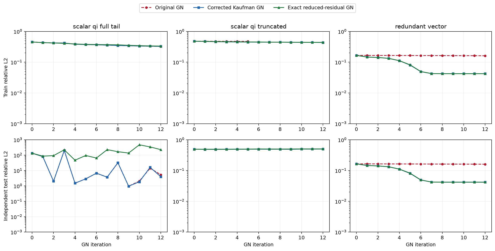

# Independent correction of diagnostic variable-projection GN

Status: implemented and checked, September 6, 2026. Diagnostic dense solver only. Existing I01/I02 code and results were not changed.

The projection faults are real and materially hurt a vector-output test, but these bounded checks do not show that fixing GN recovers the large missing scalar-QI gains. The correctly sampled scalar test improves training fit more after the correction and achieves essentially the same held-out error. A poorly conditioned head can still generalize disastrously under either solver.

## What changed

The independent utility is `experiments/expI03_investigation/solver_audit/varpro_gn.py`. It selects nonlinear parameters by excluding the actual readout parameter storage from `named_parameters()`. This includes the shallow projection bias `bV`, which the I02 nonlinear-parameter list omits, and also handles older readout interfaces that return reshaped views.

Head fitting and its retained left-singular subspace now come from one SVD with one effective relative cutoff, $\max(\texttt{rcond},100\varepsilon_{\rm dtype})$. The projector never uses the arbitrary extra QR vectors supplied by a deficient design. Jacobians retain explicit sample, output, and parameter axes until the final flattening, fixing the vector-output indexing error. Each accepted step must reduce the actual training residual norm. Test data are only evaluated for logging; a regression test changes all test labels and obtains identical training trajectories and final parameters. There is no range recalibration during GN, so the training objective stays fixed.

The utility provides two derivative modes. `jacobian="kaufman"` applies the corrected retained-space projector to the fixed-head feature Jacobian. This isolates the original projection/indexing mechanism as closely as possible. The default `jacobian="full"` differentiates the reduced residual itself, including the residual-dependent term omitted by Kaufman and the movement of the retained singular subspace when nonzero singular modes are discarded. Both are dense diagnostics, not scalable training proposals.

For a full-rank or exactly constant-rank feature design $A(\theta)$, fitted weights $W=A^+Y$, and residual $R=AW-Y$, the distinction is

$$
\mathrm dR=(I-AA^+)\,\mathrm dA\,W-(A^+)^T(\mathrm dA)^T R.
$$

Kaufman keeps the first term. With genuinely nonzero truncated modes, differentiating the retained projector also involves retained/discarded singular-value gaps; the implementation handles these directly. The derivative requires a locally stable cutoff rank with a spectral gap. At a cutoff crossing, the hard-truncated objective need not have a classical derivative; the trial head is nevertheless re-solved and accepted only on actual training improvement.

## Correctness evidence

Three pytest tests pass. The executable comparison script also checks every saved training trajectory for monotonicity.

| Check | Measurement |
|---|---|
| Two-output design with singular values $8,3,1,0.2,0.05$, cutoff 0.05, nonzero residual | Retains exactly three modes; full reduced Jacobian agrees with centered finite differences to relative $1.66\times10^{-10}$ at step $10^{-6}$ |
| Same finite-difference check, steps $10^{-4},10^{-5},10^{-6}$ | Errors $2.85\times10^{-7},2.85\times10^{-9},1.66\times10^{-10}$; the convergence pattern resolves the derivative rather than checking a single convenient step |
| Actual nonlinear model with four augmented head columns, one exact duplicate, two outputs, nonzero residual | Rank 3; full residual Jacobian agrees with finite differences to $4.72\times10^{-10}$ |
| Shallow QI projection bias | Old nonlinear list excludes it; corrected list includes it; the earlier one-step audit independently measured nonzero gradient and zero old update |
| Change every held-out label | Training objective, ranks, and final nonlinear parameters remain identical |
| Readout returned as a view | Head leaves remain excluded from the nonlinear parameter list |

The full-vs-Kaufman Jacobian difference on the truncated nonzero-residual linearized design is 0.880 in relative norm. That difference is expected mathematically; testing Kaufman's approximate residual Jacobian for equality to an exact finite difference away from the solution would itself be an incorrect test.

## Bounded empirical comparison

Every arm starts from the same initialized model, uses at most 12 GN iterations, logs an independent held-out set, and retains monotone training objective. The original solver is the unchanged `qiblocks.gauss_newton`. Its endpoint training values were captured with local instrumentation at the initial state and completed iteration endpoints, not at rejected trials.

The scalar QI target is the repository's three-dimensional fast waves, seed 3, with $M=3,N_1=8,K=2,N_2=32$. The ordinary scalar check has 768 training and 1,024 held-out points, satisfying the original eight-training-rows-per-unit rule, and uses a common $10^{-6}$ cutoff to create a clean numerical-rank test. A separate deliberately under-sampled tail stress check uses 192 rows and $10^{-14}$ cutoff; it is not a reproduction of the study's recommended training protocol. The vector test has 65 training and 256 distinct held-out points, two output functions built from a shifted tanh plus polynomial and oscillatory residual terms, and one exactly redundant feature column.

| Case | Original GN train / test | Corrected Kaufman train / test | Full reduced-residual GN train / test |
|---|---:|---:|---:|
| Scalar QI, 768 rows, truncated head | 0.475 / 0.493 | 0.437 / 0.501 | 0.441 / 0.506 |
| Two-output exact redundancy | 0.162 / 0.161 | 0.0423 / 0.0419 | 0.0423 / 0.0419 |
| Scalar QI tail stress, 192 rows | 0.324 / 5.38 | 0.326 / 3.96 | 0.334 / 229 |

The vector correction improves held-out error by $3.84\times$. The original barely moves; corrected methods find the useful nonlinear fit. The scalar truncated-head correction gives about 8% lower training error but no held-out improvement. The tail stress case is already invalid as a useful predictor at initialization: held-out relative error is about 135 before any GN step. All methods lower training error while held-out behavior remains unstable; the exact reduced-residual Jacobian is especially poor on this small ill-conditioned fit. More accurate optimization does not fix unsupported feature directions or ensure useful generalization.



Top: train relative $L_2$; bottom: independent test relative $L_2$; columns: tail stress, sampled/truncated scalar QI, and exact-redundancy vector output. Legends are shared above the axes. The stress-test error panel uses a larger fixed range to show its explosions; other axes use $[10^{-3},1]$.

These results establish that the library bug deserves correction and can materially affect vector-output fitting. They do not show that the old scalar I02 study's positive or negative outcomes are mainly caused by this bug. In particular, B1's reported GN runs are scalar, Lorenz does not use GN, and the deep runs that escaped their mesh remain an initialization/training-stability problem. The corrected utility is available as a measuring instrument for the coordinator's new initializations.

## Reproduction and limits

The bounded comparison took about 2.1 seconds on one CPU thread in the local float64 environment. The utility materializes feature derivatives, the parameter Jacobian, and dense parameter systems; its memory and compute do not meet the project's scalable-optimizer requirements. It is explicitly a diagnostic reference. QR-then-SVD in the original versus direct SVD in the utility also differs in floating-point roundoff; at an extremely ill-conditioned full-tail head, trajectories can diverge even when retained rank is full and the algebraic projector correction is inactive.

Run from the repository root:

```sh
OMP_NUM_THREADS=1 OPENBLAS_NUM_THREADS=1 .venv/bin/python results/checkpoint_I_depth_theory/investigation_20260906/evidence_audit/solver_checks.py
OMP_NUM_THREADS=1 OPENBLAS_NUM_THREADS=1 .venv/bin/python -m pytest -q results/checkpoint_I_depth_theory/investigation_20260906/evidence_audit/test_solver_audit.py
```

Outputs: `solver_checks.json` contains all finite-difference measurements, cutoff ranks, and original/corrected train/test trajectories; `solver_comparison.png` shows them. No approval, commit, publication, or changes to existing experiment files were introduced.
